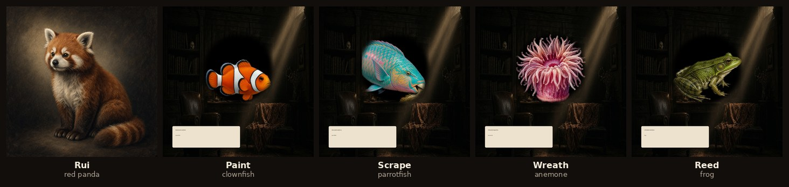
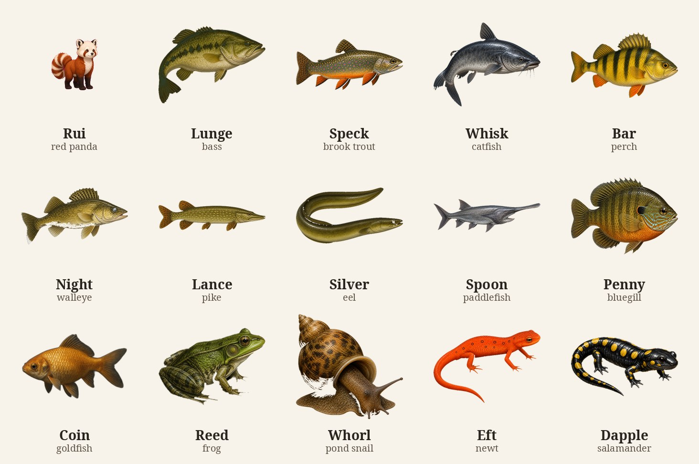
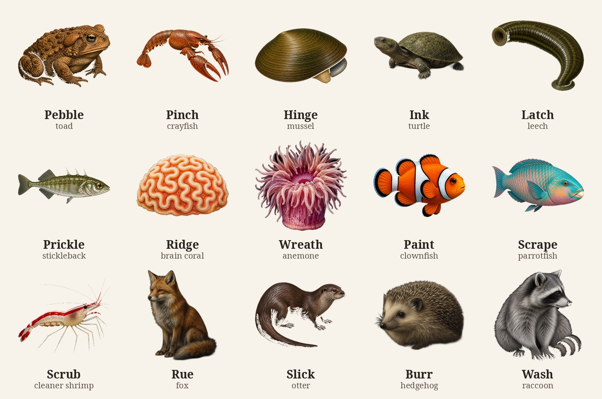

# ComputerPets

Virtual pets that live on your computer.

<p align="center">
  
</p>

**Start here: [How to get your first pet](docs/START-HERE.md)**

That page is a teacher. Click it. It has numbered steps. You do not need to know how to code.

## Meet some of them

There are **220** animals in this house. These are some of them.

<p align="center">
  
</p>

<p align="center">
  
</p>

House names. The ones you say out loud.

## Put a pet on your real desktop

This is the first teaching point. A pet walks on top of your windows. Like a living sticker. **Rui the red panda** comes first. A keeper card sits with them: name, stage, bond, Hunger / Rest / Bond, Feed / Play / Rest. Click the name to collapse it. Voice, color, saved lines, alarm, timer, mute, and Turn off sit on the expanded card. The tray by the clock has **On the desk** — Rui, Sip, and the grid ten, no scrolling two hundred twenty names.

You do not need an account. You do not need a license. You do not need Java.

Windows 10 and Windows 11 first. Most friends are on Windows. The [start-here page](docs/START-HERE.md) shows every button.

There is no Steam, Itch, or Microsoft Store download yet. There is no live Store ID. There is no `.exe` waiting on a website. You copy the pets from [this GitHub page](https://github.com/RicheyWorks/computerpets) and turn them on yourself. That is the real way.

Today the overlay needs two free helpers — Git and Node — because the start is `.\desktop.ps1`, which runs `npm start`, which is `electron .`. You do not have to learn Node. You only install it once. Grown-ups can later build their own installer with electron-builder. We do not publish one.

A tiny preview:

1. Copy the pets onto your computer (GitHub Desktop, or `git clone https://github.com/RicheyWorks/computerpets` into a folder **you** pick).
2. Open PowerShell **in that folder** (the `computerpets` folder that has `desktop.ps1` in it).
3. Type this and press Enter:

```powershell
.\desktop.ps1
```

Or, if the computer will not run that script:

```powershell
cd desktop
npm install
npm start
```

The first time can take a few minutes. `npm install` means "get the pieces." Leave the window open. A pet should walk on your real desktop.

Git and Node are the two helpers that make that start work. Install [Git](https://git-scm.com) (or [GitHub Desktop](https://desktop.github.com) if you like pictures more than typing) and [Node](https://nodejs.org) (the big **LTS** button, version 22 or newer) once, before you type the start. The start-here page shows those buttons.

- **First click** is a sit.
- **Drag** is a carry.
- **Feed / Play / Rest** sit on the keeper card.
- **Right-click** the pet, or the little tray icon by the clock: **On the desk**, feed, play, rest, clean, medicine, hide.

Clicks on empty glass pass through to your windows. The floor is the work area, above the taskbar. On Windows, Rui can jump onto the side of a real window, hang on, then drop or dive back to the desk. Arc jumps onto the top (the title-bar ridge), holds, then hops or slides off. Volt wraps a corner, holds, then uncoils off. Trace follows the outline as a path, then hops or drops back to the desk. Flux occupies the glass as a field, holds, then drifts or drops back. Spark crackles a window edge — short hops from corner to corner, then hops or drops back. Ion charges a window corner, bolts diagonally across the glass to the opposite corner, holds, then hops or drops back. Gauss snaps to the outside of the frame, orbits most of one circuit, sits, then hops or drops back. Relay snaps on as a node, clicks, hops to a second window (or a second node on the same window), clicks, then hops or drops back. Fuse seats into a window as a cartridge in a clip, holds still while the filament is intact, then pops off. Ground seats at the bottom of a window as an earth lug, holds the return, then steps or drops back. Miso hops onto the top of a window (the ledge a house cat uses), sits, then hops down. Pip walks to a window and stays on the floor at its feet, looks up, watches, then trots away. Thimble hops to a window, thumps on the floor beside it, then vanishes. Clip hops to a window, ducks into the bottom-inside corner as if it were a drawer, cheeks inventory, then pops back to the floor. Whee waddles to a window, loaves on the floor at its feet, wheeks, popcorns once, then waddles off. Ink paddles the long way to a window, basks on the bottom rail as a pond stone, withdraws the head, then slides the long way back. Coin drifts onto a window as if the glass were a bowl, swims one slow honest circle on the pane, then drifts off. Echo hops onto a window as a lamp-shade perch, repeats the room kinder, then hops off. Rue walks to a window, scents the near jamb on the floor (muzzle in the crack), then slips away. Peck hops onto a window as a landing rock, stands in full dress, bows (brief, required), then hops down. Quill hooks a window jamb with the bill as a third foot, climbs, hangs sideways, quotes from the chest, then drops. Wick threads the sash-sill gap as a tube, then dashes off. Burr shuffles to a window, snuffles the foot of the pane, curls into a ball against the glass, waits, then uncurls and shuffles off. Floss hops onto a window meeting rail as a dust tray, rolls in the sash-dust, fluffs, then hops down. Bloom drifts onto a window as a cistern wall, walks the pane (a salamander on glass), then sinks off. Keel hops onto a window cornice, tosses fruit from the bill, then hops down. Sol climbs a sun-warmed pane, head-bobs once, flattens as the living ornament, then climbs down. Vesper drapes a window lintel as a sleeping wyrm, then slips down. Ember banks as a coal on the window ash, kindles, then returns. Nori buns in a sash well as an inkwell hide, then unrolls. Saffron writes an S-curve along the sash as a pencil-tray canyon, then finishes. Bandit inspects a window jamb as a ruler, ticks the frame in bands, then closes. Jade saddles a casement stay as a lamp-arm, folds in half, then unfolds. Bluff hops onto a window stool as an eraser-dish stage, flips belly-up, holds the death, then rights himself. Sash patrols a damp moss-cup along the condensation channel, pauses, then finishes the lap. Lula pours onto a window apron as a blotter river, loops, holds the weight, then lets go. Coral tiles a window muntin as a stamp box, flashes the tricolor rumor, then stays kind. Blush stones a window sill horn as a pink desert rock, tucks, holds, then inches off. Atlas charts a window transom as a map shelf, climbs the jamb as a tree, unrolls the carpet, then gathers off. Cup lids a window sash latch as a teacup: crawl to the latch, taste the lever as a lid, hide in the latch cup, then jet off. Sepia flushes a window light as lamp-ripple weather: write the pane, hover a W, then fade. Chamber rises a window jamb as stacked nacre rooms: drift onto the oldest room, rise room by room, occupy the last chamber, then sink. Pulse chimes a window pane as a glass of water: drift onto the first moon, ring four moons as a cross, pulse once, then drift. Ochre reefs a window pane as a damp blotter: creep onto the wet glass, plant five arms, remain, then uncling. Tenant knobs a window sash lift as a vacant shell: shuffle onto the lift, measure the mouth, try the abdomen, reject it, then drop. Ledger plows a window stool as a sand tray: bury onto the wood, book-gills read the grain, hold the helmet, then unbury. Anchor hitches a window parting bead as a pencil: hover to the bead, wrap the tail, hold the question mark, then unhitch. Kite barrels a window pane as the sky of a bowl: soar a length of sky, barrel once, then glide. Door gapes a window sash-jamb crack as a book crevice: slip into the crack, breathe the gape, dart once, then slip. Felt leans a window meeting rail as blotter felt: carpet the rail, lean toward the lamp, remain, then peel. Vein unfurls a window sash pocket as a damp saucer: slip into the pocket, unfurl black stems first, stay shy, then fold. Fan golds a window lamp-side as autumn: take the lamp-side glass, gold the fans, hold, then fade. Mast seeds a window stool as an acorn dish: take the stool, stand a small height, drop one letter, remain small, then step back. Disk opens a window pane as an ink-dish pad: float the still ink, open once for the lamp, close, remain the floor, then leave for the night. Moth mounts a window jamb as bark: clasp the wood, hang aerial roots in the air, bloom once at dusk, then leave the bark. Arm stores a window stool as a sand tray: plant onto the wood, swell the ribs once, remain a column, then step back later. Snap counts a window meeting rail as a wetland cup: sit the weather groove, wait two hairs, close once, then leave as a leaf. Well fills a window sill pan as a bog cup: settle into the hidden pan, take the rain the sash sheds, remain open, then leave the rain. Dew curls a window glazing rebate as a peat saucer: settle the rebate, glitter the tentacles, curl slowly, then uncurl. Thrum forages a window box as a meadow: hover to the nosing, land a bloom, buzz once, then go home. Auger bores a sash stile as timber: hover to the stile, bore a hole, hover the hole, then leave the hole. Mortar daubs a sash gap as an inkstone cell: hover to the gap, daub a partition, hold the cell, then leave the stone. Disc snips a window-box leaf as foliage: hover to the foliage, snip a circle, carry the disc, then leave for the tube. Pot tends a sash pulley box as a cerumen hollow: hover to the box, knead the wax, remain the store, then leave the nest. Sheen licks a warm pane as a salt glass: hover to the glass, lick once, hold the metal, then leave the rim. Bank digs a window stool as a sand bank: settle onto the wood, sink a shaft, remain in the hole, then leave the tray. Hum drones a window pane as congregation sky: lift into the glass, hang, drone once, then leave the sky. Keep lays a window pane as a wax heart: settle onto the brood just under the meeting rail, walk a short line, lay once, then leave the heart. Wax draws a window pane as a hive frame: attach at the head, draw hex cells down the glass, remain the house, then leave the cavity. Reed plops a window weep as a bank spring: hop to the weep, sit wet at the mouth, then plop off. Pebble puffs a casement leaf as a leaf dish: short-hop onto the leaf, puff, sit dry, then hop off. Eft trails a sash horn as a moss saucer: walk onto the meeting-rail horn, trail the tail, keep the orange, then walk off. Dapple covers a window well as leaf mold: creep into the areaway at the foot of a cellar sash, cover, keep the yellow coins, then leave for the pool. Slip rings a sill throat as a silt tray: press into the kerf, ring through, keep the jaw, then leave the tray. Pinch claws a sill wash as a pebble tray: walk onto the wash, claw a scrap from the grit, hold the scrap, then leave the pebble. Whorl rasps a glass rim as her own house: climb onto the rim, rasp the glass, add a room, then leave the rim. Hinge filters a meeting-rail gap as a silt bed: bury into the gap, filter, clamp shut, then leave the silt. Latch drinks a sash drip as a damp blotter: loop onto the drip, seal, drink, then let go. Prickle glues a putty fillet as a weed bowl: dart onto the fillet, glue a nest, flare, then dart off. Soot caws a drip cap as a chimney pot: hop onto the cap, tuck a scrap, fan, caw, then hop off. Wedge croaks a high transom as a rafter: hop onto the interior head as a beam, drop the wedge tail, croak, then hop off. Heart hisses a sash reveal as a beam hollow: slip into the jamb return as a nest pocket, turn the heart face, hiss, then slip off. Hook soars a lamp-post stile as lift: take the outside of the stile, ride the lift, stoop once, then glide off. Dee caches a meeting-rail nosing as a twig cup: hop onto the nosing, hide a seed, dee once, then hop off. Brick pulls a window stool as a lawn: hop onto the stool, listen, pull once, then hop off. Drake tips a lower sash light as an ink dish: waddle onto the glass as still ink, paddle, tip once, then waddle off. Vee honks a window apron as a blotter green: walk onto the apron as claimed grass, plant the V, honk once, then walk off. Drum drums an upper sash stile as a dead-wood post: hop onto the interior stile, drum a rectangle, flare the crest, then hop off. Sip sips a window-box bloom as a nectar cup: dart to the foliage, hover, sip once, then dart off. Loom webs a lamp-side glass corner as a lamp web: walk to the interior top-corner, draw an orb, sit the hub, then leave the silk. Leap pounces a meeting-rail end as a blotter edge: walk onto the rail end, look, pounce once, then hop off. Prowl carries a window foot as leaf litter: walk to the floor at the pane's foot, wait with the brood, then walk off. Velvet kicks a sash well as a silk burrow: walk into the well, sit the silk, flick hair once, then walk off. Hour hangs a bottom-inside jamb corner as a dark corner: walk to the lower interior corner, hang with the hourglass out, then drop off. Stem stilts a sash parting bead as a blotter stem: walk onto the bead as a stem, keep the one body, then walk off. Barb raises a window stool as a bark tray: walk onto the wood, raise the tail, hold the sting, then walk off. Whip sprays a sill wash as a sand tray: walk onto the wash, raise the whip, spray once, then walk off. Clasp grips a sash apron hem as a blotter hem: walk to the apron edge, grip with eight legs, wait, then let go. Gale runs a sash light as a dry dish: dash onto the glass, bite once, then dash off. Rack flags a sill nosing as an oak edge: walk the outer nosing, flag the white tail once, then walk off. Cape folds a transom soffit as a rafter fold: fly to the underside of the head, hang by the feet, fold the hands, then drop off. Cache buries a window stool as an oak dish: hop onto the stool, bury a thought, then hop off. Slick slides a window pane as an ink dish: hop onto the glass, slide down once, then slip off. Wash rinses a sill pan as a wash bowl: walk to the hidden pan, rinse a scrap, then walk off. Stripe stamps a window foot as a duff dish: walk onto the floor strip, plant a warning stamp, then walk off. Grin goes still on a transom soffit as a rafter hem: walk onto the underside, play dead, then walk off. Dam gnaws a sash stile as a lodge cup: walk onto the stile, gnaw once, then walk off. Spine bristles a window jamb as a pine post: walk onto the jamb, bristle (quills stay), then walk off. Coal browses a window well as an oak denside: walk to the well, browse (size is the tell), then walk off. Hang reaches a transom soffit as a bough hook: climb to the underside, reach (two toes), then unhook. Hour still owns hang. Sun warms an upper sash light as a sun ledge: walk onto the glass, hold the ringed tail up, then walk off. Swing sings a lamp-side stile as a lamp arm: swing along the stile, sing once, then unhook. Wrist wraps a window-box bloom as a nectar cup: walk to the bloom, wrap the tail, then unhook. Sail clings a window jamb as a trunk sail: cling to the jamb, open the skin once, then leave. Glide planes a window stool as an oak fold: hop onto the stool, plane once (skin, not a wing), then hop off. Boom howls a high transom as a crown perch: sit on the head, howl once, then leave. Gaze looks from a sash pulley box as a branch hollow: climb into the box, look (eyes fill the face), then leave. Still creeps a sash parting bead as a vine rail: creep onto the bead, hold slowly, then leave. Gum chews a window stool as a gum perch: sit on the stool, chew once, then leave. Pad chirps a lamp-side jamb as lamp plaster: climb the jamb, chirp once (toe pads), then leave. Wink flashes a sash stile as a vine post: sit on the stile, flash the dewlap once, then leave. Dash scoots a sash-jamb crack as a stone crack: scoot into the crack, show the blue, then scoot out. Shift aims a sash parting bead as a branch perch: walk onto the bead, aim (independent eyes), then leave. Spike crowns a window well as a sand tray: walk onto the well, sit flat and crown (horns), then leave. Levee banks a window stool as a bank dish: walk onto the stool, sit the U-snout (teeth hide), then leave. Ink still owns bask. Jaw shows a sill pan as a brackish dish: walk onto the pan, sit the V-snout (fourth tooth shows), then leave. Beak snaps a window well as a mud bowl: walk onto the well, sit and snap (beak), then leave. Lid shuts a window foot as a leaf dish: walk onto the foot, shut the hinged plastron, then leave. Cup still owns lid. Stripe still owns stamp. Ink still owns bask. Spike still owns crown. Quill still owns hook. Ink still owns bask. Levee still owns bank. Ink still owns bask. Coal still owns browse. Blush still owns stone. Gaze still owns look. Wink still owns flash. Blush still owns stone. Pad still owns chirp. Blush still owns stone. Coal still owns browse. A koala is not a bear. Grin still owns still. Clasp still owns grip. Heart still owns hiss. Vee still owns honk. Swing still owns sing. Cape still owns fold. Sail still owns cling. Sip still owns sip. Rack still owns flag. Slip still owns ring. Peak crests a sash pulley box as a stone burrow: walk into the box, sit the crest (third eye), then leave. Grin still owns still. Gaze still owns look. This closes stone ten. Lunge mouths a window-box as a weed edge: walk onto the box, sit the wide mouth, then leave. Door still owns gape. Peak still owns crest. First creek leftover. Speck marks a meeting rail as a riffle cup: walk onto the rail, show the worm marks, then leave. Chamber still owns rise. Lunge still owns mouth. Second creek leftover. Whisk barbels a window well as a mud run: walk onto the well, taste with barbels, then leave. Hinge still owns filter. Speck still owns mark. Beak still owns snap. Third creek leftover. Penny flares a lamp-side stile as dock shade: walk onto the stile, flare the dark ear flap, then leave. Coin still owns circle. Swing still owns sing. Whisk still owns barbel. Fourth creek leftover. Bar bars a meeting rail as a weed rail: walk onto the rail, show the side bars, then leave. Echo still owns perch. Penny still owns flare. Speck still owns mark. Fifth creek leftover. Lance bills a window-box as a reed ambush: walk onto the box, sit the duckbill and wait, then leave. Lunge still owns mouth. Bar still owns barred. Echo still owns perch. Sixth creek leftover. Night dusks a lamp-side stile as a dusk run: walk onto the stile (when the lamp leans), sit the tapetum, then leave. Gaze still owns look. Penny still owns flare. Lance still owns bill. Seventh creek leftover. Spoon paddles a sill pan as a current dish: walk onto the pan, sit the paddle and sieve, then leave. Hinge still owns filter. Night still owns dusk. Jaw still owns show. Eighth creek leftover. Round disks a sill horn as a stone disk: walk onto the horn, sit the disk mouth, then leave. Sail still owns cling. Blush still owns stone. Door still owns gape. Ninth creek leftover. Silver goes a window well as a bank hole: walk into the well, swim the going (Sargasso), then leave. Round still owns disk. Sail still owns cling. Door still owns gape. This closes creek ten. Haste hunts a sash-jamb crack as a plaster crack: walk into the crack, dart the hunt (fifteen pairs), then leave. Silver still owns go. Dash still owns scoot. Door still owns gape. This opens log ten. Link oils a window stool as a damp log: walk onto the stool, oil the rings, then leave. Haste still owns hunt. Silver still owns go. Cache still owns bury. This is the second log leftover. Armor rolls a window stool as a bark dish: walk onto the stool, roll the plates, then leave. Link still owns oil. Haste still owns hunt. Barb still owns the bark tray raise. This is the third log leftover. Cast bands a window stool as a soil tray: walk onto the stool, sit the clitellum (the band), then leave. Armor still owns roll. Link still owns oil. Haste still owns hunt. This is the fourth log leftover. Jet glues a sash stile as wet wood: walk onto the stile, glue from the head, then leave. Cast still owns band. Armor still owns roll. Link still owns oil. Dam still owns the lodge-cup gnaw. This is the fifth log leftover. Hop springs a window foot as a duff cup: walk onto the foot, spring the furcula, then leave. Jet still owns velvet. Cast still owns band. Armor still owns roll. Stripe still owns the duff-dish stamp. This is the sixth log leftover. Tun dries a window pane as a moss film: walk onto the pane, sit the tun (the dry), then leave. Hop still owns spring. Jet still owns velvet. This is the seventh log leftover. Half splits a meeting-rail underside as a stream stone: walk onto the underside, sit the split (she halves), then leave. Tun still owns dry. Hop still owns spring. This is the eighth log leftover. Thread thrashes a glazing rebate as a soil film: walk into the rebate, thrash the round, then leave. Wick still owns thread. Half still owns split. Tun still owns dry. This is the ninth log leftover. Scud sides a window well as a side pool: walk into the well, swim the side, then leave. Thread still owns thrash. Armor still owns roll. Silver still owns go. This closes log ten. Wave signals a sill pan as a marsh dish: walk onto the pan, signal the big claw, then leave. Scud still owns side. Pinch still owns the claw. Tenant still owns knob. This opens shore ten. Pale sands a window stool as dry sand: walk onto the stool, run the pale, then leave. Wave still owns signal. Gale still owns run. Tun still owns dry. This is the second shore leftover. Cone clamps a glass rim as a rock rim: walk onto the rim, clamp the cone, then leave. Pale still owns sand. Wave still owns signal. Lid still owns shut. Whorl still rasps. This is the third shore leftover. Cement stays a sash stile as a stone rim: walk onto the stile, kick the cirri, then leave. Cone still owns clamp. Pale still owns sand. Dam still gnaws. This is the fourth shore leftover. Mail plates a meeting rail as a tide rock: walk onto the rail, plate the eight, then leave. Cement still owns cirri. Cone still owns clamp. Pale still owns sand. This is the fifth shore leftover. Spire rocks a sash jamb as a rock face: walk onto the jamb, graze the rock, then leave. Whorl still owns rasp. Mail still owns eight. This is the sixth shore leftover. Token flats a sill pan as a sand plate: walk onto the pan, sit the flat, then leave. Cache still owns bury. Pale still owns sand. Spire still owns rock. This is the seventh shore leftover. Thorn spines a window well as a tide pool: walk into the well, sit the spines, then leave. Spine still owns bristle. Burr still owns ball. Token still owns flat. This is the eighth shore leftover. Knurl knobs a window stool as a wrack dish: walk onto the stool, sit the knobs, then leave. Tenant still owns knob. Haste still owns hunt. Spire still owns rock. This is the ninth shore leftover. Heap castings a window foot as wet sand: walk onto the foot, sit the castings, then leave. Cast still owns band. Latch still owns drink. Knurl still owns knobs. This is the tenth shore leftover and closes shore ten. Comb waggles a sill pan as a wax dish: walk onto the pan, dance the waggle, then leave. Hum still owns drone. Keep still owns lay. Wax still owns draw. Heap still owns castings. This is the first leftover of the remaining hive den. Shore ten is closed. Milk weeds a window-box as a milkweed cup: walk onto the box, sit the weed, then leave. Comb still owns waggle. Sip still owns sip. Fan still owns gold. This is the second leftover of the remaining hive den. Ghost weeks a lamp-side glass as lamp dusk: walk onto the glass, sit the week, then leave. Night still owns dusk. Moth still owns mount. Milk still owns weed. This is the third leftover of the remaining hive den. Spark the firefly glows a lower sash light as ink dusk: walk onto the light, sit the glow, then leave. The dragon Spark still crackles an edge. Wink still owns flash. Ghost still owns week. This is the fourth leftover of the remaining hive den. Dart hawks a lamp-side air as prey air: walk into the air, sit the hawk, then leave. Hook still owns soar. Haste still owns hunt. Spark the firefly still owns glow. This is the fifth leftover of the remaining hive den. Twig freezes a sash muntin as a pencil stem: walk onto the muntin, sit the freeze, then leave. Still still owns creep. Hang still owns reach. Stem still owns stilt. Anchor still owns hitch. This is the sixth leftover of the remaining hive den. Column nests a sash stile as a timber gallery: walk onto the stile, sit the nest, then leave. Auger still owns bore. Dam still owns gnaw. Bank still owns dig. Twig still owns freeze. Dart still owns hawk. This is the seventh leftover of the remaining hive den. Seven spots a window-box leaf as a leaf dish: walk onto the leaf, sit the spot, then leave. Haste still owns hunt. Disc still owns snip. Thrum still owns forage. Sip still owns sip. Comb still owns waggle. This is the eighth leftover of the remaining hive den. Fold prays a window-box stem as a green hinge: walk onto the stem, sit the pray, then leave. Cape still owns fold. Bat still owns fold. Stem still owns stilt. Twig still owns freeze. Still still owns creep. Hang still owns reach. Snap still owns count. Haste still owns hunt. Seven still owns spot. This is the ninth leftover of the remaining hive den. Brood emerges a window foot as a soil husk: walk onto the foot, sit, burst, sit the husk, then leave. Heap still owns castings. Hop still owns spring. Lid still owns shut. Prowl still owns carry. Fold still owns pray. Seven still owns spot. Drum still owns drum. Hum still owns drone. Thrum still owns forage. This is the tenth leftover of the remaining hive den and closes hive ten. Chirp songs a window stool as a grass dish: walk onto the stool, sit the song, hold the night, then leave. Brood still owns emerge. Gecko still owns chirp. Swing still owns sing. Drum still owns drum. Hum still owns drone. Thrum still owns forage. This is the first leftover of the meadow den. Blade leafs a sash horn as a leaf rim: walk onto the horn, sit the leaf, still the green, then leave. Chirp still owns song. Twig still owns freeze. Seven still owns spot. Fold still owns pray. Disc still owns snip. Vein still owns unfurl. Grin still owns still. This is the second leftover of the meadow den. Vault jumps a window apron as a grass plate: walk onto the apron, sit, vault once, sit the plate, then leave. Blade still owns leaf. Chirp still owns song. Hop still owns spring. Leap still owns pounce. Hook still owns soar. This is the third leftover of the meadow den. Banner tails a window stool as a blossom dish: walk onto the stool, sit, banner once, sit the dish, then leave. Vault still owns jump. Blade still owns leaf. Chirp still owns song. Milk still owns weed. Ghost still owns week. This is the fourth leftover of the meadow den. Jewel blacks a glass rim as a stream jewel: walk onto the rim, sit, jewel once, sit the jewel, then leave. Banner still owns tails. Dart still owns hawk. Bat still owns fold. Vault still owns jump. Blade still owns leaf. This is the fifth leftover of the meadow den. Lace nets a window stool as a leaf dish: walk onto the stool, sit, lace once, sit the dish, then leave. Jewel still owns black. Banner still owns tails. Ghost still owns week. Moth still owns mount. Seven still owns spot. This is the sixth leftover of the meadow den. Forceps cercis a window stool as a bark dish: walk onto the stool, sit, raise the cerci once, sit the dish, then leave. Lace still owns net. Jewel still owns black. Fold still owns pray. Pinch still owns claw. Barb still owns raise. This is the seventh leftover of the meadow den. Snout drills a window stool as an acorn cup: walk onto the stool, sit, drill once, sit the cup, then leave. Forceps still owns cerci. Mast still owns seed. Auger still owns bore. Dee still owns cache. Cup still owns lid. This is the eighth leftover of the meadow den. Frill shelves a sash stile as a timber shelf: walk onto the stool, sit, right once, sit the plate, then leave. Snout still owns drill. Relay still owns click. Snap still owns count. Bluff still owns flip. Spark the firefly still owns glow. This is the ninth leftover of the meadow den. Horn forks a sash drip as a moss rim: walk onto the drip, sit the fork, then leave. Lattice still owns hollow. Cap still owns warts. Frill still owns shelf. Latch still drinks the drip as blotter. Other guests walk a sill. The overlay reads window bounds, not pixels. Mac and Linux window play is a later door. When Rui sleeps, Sip and the American robin land on him and chill. After a feed, Rui does a happy dance. Call a den and the guests walk in without blinking. Walk wakes a sleeping Rui.

### Mac

Same helpers. Then in Terminal, inside the `computerpets` folder:

```bash
sh desktop.sh
```

The extra control sits in the menu bar.

### Linux

Same helpers. Then:

```bash
sh desktop.sh
```

The mark sits in the panel.

More in [desktop/README.md](desktop/README.md).

## How to take care of them

Feed them when they look hungry. Play so they stay happy. Let them rest when they look tired. Clean up the mess they leave. Give medicine if they get sick.

The keeper card is the daily care. The tray **On the desk** picks Rui, Sip, and the grid ten. If you ignore them, they get hungry. They can get unwell. They can walk away until you call them back.

There are **220** animals. Rui is the first one you meet.

## Another way to visit them (browser)

After a pet already walks on the desktop, you can also open the same house in Chrome or Edge. This is optional. The desktop walk is the main quest. `/demo` stays lockstep with the overlay — same keeper card, same tray sit. Spark's room is `/demo/crackle`. Ion's room is `/demo/ion`.

```powershell
cd web
npm install
npm run dev
```

Then open [http://localhost:8080](http://localhost:8080). Localhost means "this computer," not the internet. Rui is already there. No account.

A page like `/demo/rui` only works on your own computer. It is not a website for the whole internet.

## Grown-up notes

Unlock, Java, and secrets are **not** for meeting Rui. Pets already walk without a license. Operators: [docs/SETUP.md](docs/SETUP.md).

`desktop/` `npm start` is `electron .`. `npm run dist:win` is electron-builder (NSIS / portable) if you want to package a copy you built yourself. That is not a Microsoft Store listing. Do not invent a Store ID.

More pages: [docs/README.md](docs/README.md).

## License

Copyright (c) 2026 RicheyWorks. All rights reserved. This is a private house. See [LICENSE](LICENSE).

---

*Two hundred twenty living kinds. Keep them so a line does not go quiet.*
