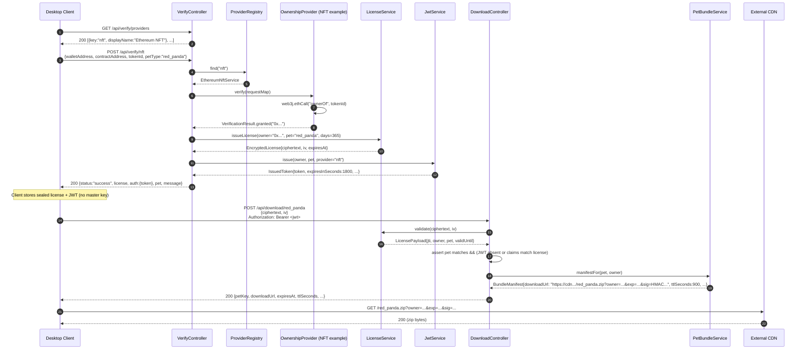

# EnterprisePet Backend — System Architecture Document

← [Back to Documentation Index](README.md)

> **Living Document**  
> This document reflects the *current* architecture of the EnterprisePet Backend.  
> It is intended to evolve together with the codebase. Please keep it up to date when the architecture changes.

| Field            | Value                                      |
|------------------|--------------------------------------------|
| **Last Updated** | 2026-05-24                                 |
| **Version**      | 1.1                                        |
| **Status**       | Active — Maintained                        |
| **Related**      | [docs/README.md](README.md) (documentation index) |

---

## Document Maintenance

Contributors making significant architectural changes (new major components, changes to the provider SPI, deployment model, security boundaries, data flows, technology stack, or cross-cutting concerns) are responsible for updating this document.

### How to Update This Document

1. **Identify impact** — Determine which sections are affected (High-Level Architecture, Deployment Architecture, Component Breakdown, Data Flow diagrams, Technology Stack, etc.).
2. **Update content & diagrams** — Revise text and Mermaid diagrams so they accurately describe the new state.
3. **Refresh the "Last Updated" date** at the top of this file.
4. **Update the Table of Contents** below if new top-level sections or important subsections are added.
5. **Cross-link** — Consider whether `README.md`, `docs/SETUP.md`, `AUDIT.md`, or code comments also need updates.
6. **Review** — Include documentation changes in your pull request and request a review of the architecture docs alongside the code.

Keeping this document accurate reduces onboarding friction and prevents architectural drift.

---

## Table of Contents

- [1. Executive Summary](#1-executive-summary)
- [2. High-Level Architecture](#2-high-level-architecture)
- [3. Deployment Architecture](#3-deployment-architecture)
- [4. Component Breakdown](#4-component-breakdown)
- [5. Data Flow & Interactions](#5-data-flow--interactions)
- [6. Technology Stack & Rationale](#6-technology-stack--rationale)
- [7. Project Structure](#7-project-structure)
- [8. Key Design Decisions & Tradeoffs](#8-key-design-decisions--tradeoffs)
- [9. Scalability, Security & Extensibility Considerations](#9-scalability-security--extensibility-considerations)
- [10. Recommendations & Next Steps](#10-recommendations--next-steps)
- [Appendix: Glossary of Key Artifacts](#appendix-glossary-of-key-artifacts)

---

## 1. Executive Summary

EnterprisePet Backend is a secure, stateless Spring Boot 3.3 Java 21 REST service that serves as the trust anchor for a premium "desktop pets" digital collectibles platform. It enables users to prove ownership of entitlements across heterogeneous platforms (Steam game ownership, Ethereum ERC-721 NFTs, and Microsoft Store products) and, in return, receive cryptographically sealed time-limited licenses plus short-lived JWTs that authorize the download of platform-specific pet asset bundles from an external CDN.

The architecture deliberately keeps the master AES-256-GCM encryption key and signing material server-side only. The desktop client (out of scope for this repository; referenced as a future PyQt6/Python application) never holds long-term secrets and cannot forge valid licenses. A clean plugin SPI (`OwnershipProvider`) allows new storefronts or wallet types to be added with a single `@Service` class and no changes to controllers or security configuration. Rate limiting, defense-in-depth validation on download, and startup-time secret validation are first-class concerns.

The system is currently a modular monolith with scaffolding for persistence (JPA + Postgres) but no entities or repositories yet; all core flows are stateless and crypto-backed.

---

## 2. High-Level Architecture

### Overall Architecture Style
- **Modular monolith** with a strong **plugin / SPI layer** for extensibility.
- **Layered architecture**: 
  - Presentation (thin `@RestController`s)
  - Application / orchestration (controllers + services)
  - Domain / core services (`LicenseService`, `PetBundleService`, `JwtService`)
  - Infrastructure / pluggable providers (Steam, NFT, Microsoft)
  - Cross-cutting concerns (security filter chain, rate limiting, exception mapping)
- **Stateless** by design: no HTTP sessions, no server-side conversation state. Entitlement is proven via sealed artifacts (encrypted license + JWT claims).
- **Client-server** with an untrusted or semi-trusted client (desktop app) that holds opaque tokens only.

### Key Components and Interactions
- **Client** (external desktop application) initiates all flows.
- **ProviderRegistry** discovers `OwnershipProvider` beans at startup and routes `/api/verify/{key}` calls.
- **LicenseService** is the cryptographic source of truth for entitlements (AES-GCM).
- **JwtService + JwtAuthenticationFilter** protect the download phase only.
- **PetBundleService** authorizes access to external storage without serving bytes itself.
- External dependencies are called synchronously during verification (Web3 RPC, Microsoft Collections API, and Steam Web API).

```mermaid
graph TD
    subgraph "External Clients"
        DC[Desktop Client<br/>PyQt6 / Python]
    end

    subgraph "EnterprisePet Backend (Spring Boot)"
        API[REST API Layer<br/>VerifyController, DownloadController, PetController]
        REG[ProviderRegistry]
        PROV[OwnershipProvider SPI]
        LS[LicenseService<br/>AES-256-GCM]
        JS[JwtService + Filter]
        BS[PetBundleService<br/>HMAC-SHA256]
        CAT[PetCatalog<br/>static enum]
        RL[RateLimitingFilter<br/>Bucket4j in-mem]
        SEC[SecurityConfig<br/>stateless JWT]
        EX[GlobalExceptionHandler<br/>RFC 7807]
    end

    subgraph "Pluggable Providers"
        S[SteamService<br/>(real API)]
        N[EthereumNftService<br/>web3j]
        M[MicrosoftStoreService<br/>RestClient + dev-mode]
    end

    subgraph "External Systems"
        STEAM[Steam Web API<br/>(planned)]
        ETH[Alchemy / Infura<br/>Ethereum RPC]
        MS[Microsoft Collections API]
        CDN[(CDN / S3 / R2<br/>Pet .zip bundles)]
    end

    subgraph "Future / Scaffolding"
        DB[(PostgreSQL<br/>JPA entities<br/>for revocation/audit)]
    end

    DC -->|GET /api/verify/providers<br/>GET /api/pets| API
    DC -->|POST /api/verify/{provider}<br/>{platform creds + petType}| API
    API --> REG
    REG --> PROV
    PROV --> S
    PROV --> N
    PROV --> M
    N -->|ownerOf eth_call| ETH
    M -->|XBL3.0 collections/query| MS
    S -->|future GetOwnedGames| STEAM

    API --> LS
    API --> JS
    LS -->|issue + validate| DB

    DC -->|POST /api/download/{pet}<br/>{cipher,iv} + Bearer JWT| API
    API --> SEC
    API --> RL
    API --> LS
    API --> BS
    BS -->|signed short-lived URL| CDN

    API --> EX
```

The diagram shows the plugin boundary clearly: adding a new platform (Epic, Itch, Gumroad, Solana, etc.) requires only a new class implementing `OwnershipProvider` annotated `@Service`.

---

## 3. Deployment Architecture

### Current Deployment Model (Development / Single Instance)
The service is currently designed and run as a single Spring Boot executable JAR:

- One JVM process listening on port 8080 (configurable via `server.port`).
- In-memory H2 database (`jdbc:h2:mem:enterprisepet`, `ddl-auto=create-drop`).
- In-process `ConcurrentHashMap`-backed Bucket4j rate limiter (per-JVM only).
- All three critical secrets (`LICENSE_SECRET_KEY`, `JWT_SECRET_KEY`, `BUNDLE_SIGNING_KEY`) loaded from environment variables with strict `@PostConstruct` startup validation that refuses to run on missing or placeholder values.
- No `Dockerfile`, no Kubernetes manifests, and no CI image-building pipeline exist in the repository today.
- External dependencies (Alchemy, Microsoft Collections, Steam Web API, future CDN) are called directly over the public internet with no circuit breakers or retries configured.
- The desktop client (PyQt6 or similar) talks directly to this single backend instance.

This model is excellent for local development, fast feedback loops, and early integration testing with the desktop client. It is **not** suitable for production or any multi-user deployment.

### Recommended Production Topology
For any non-trivial user base or multi-region deployment, the following production architecture is strongly recommended:

- **Stateless horizontally scaled backend replicas** (Kubernetes `Deployment` or equivalent container orchestration) sitting behind a load balancer / ingress controller that terminates TLS. The Java application is already fully stateless with respect to HTTP sessions.
- **PostgreSQL** (managed service or self-hosted with HA) as the durable store for issued licenses (`jti`, owner, pet, timestamps, revocation status) once the JPA layer is implemented. This enables revocation, audit, and "licenses per owner" policies.
- **Redis** (or Redis-compatible store) for:
  - Distributed token-bucket rate limits (`bucket4j-redis` or equivalent).
  - Short-lived revocation lists / jti blacklists (so a revoked license is rejected within seconds across all replicas).
  - Optional short-TTL caching of expensive external provider responses (e.g., recent NFT ownership checks).
- **External secret management** (HashiCorp Vault, AWS Secrets Manager, Azure Key Vault, or Kubernetes `ExternalSecrets` operator) instead of plain environment variables for the three long-lived cryptographic keys. Secrets should be rotated on a schedule and never appear in logs or container specs.
- **CDN / Object Storage** (Amazon CloudFront + S3, Cloudflare R2, Google Cloud CDN, etc.) as the authoritative source for the actual pet `.zip` bundles. The backend only generates short-lived HMAC-signed URLs; it never serves the binary assets itself.
- **Health/readiness/liveness probes** exposed via Spring Boot Actuator (`/actuator/health`, `/actuator/health/readiness`) so the orchestrator can safely perform rolling updates and drain traffic.
- Optional but recommended: WAF / API Gateway / cloud load balancer rules in front for L7 bot mitigation, additional rate limiting, and IP reputation filtering.

The backend service itself remains a relatively low-QPS control plane. The heavy lifting (storage + bandwidth for pet assets) is entirely offloaded to the CDN tier.

### Deployment Diagram

```mermaid
flowchart TB
    subgraph "Client Tier"
        DC[Desktop Clients<br/>PyQt6 / Python<br/>or future Web UI]
    end

    subgraph "Edge &amp; Delivery Layer"
        CDN[(Pet Bundle CDN<br/>S3 / R2 / CloudFront<br/>+ HMAC signature verification)]
        WAF[WAF / API Gateway<br/>(Cloudflare, AWS WAF, etc.)]
    end

    subgraph "Kubernetes / Container Platform"
        LB[Load Balancer / Ingress<br/>nginx, Traefik, ALB, etc.<br/>TLS termination + routing]

        subgraph "Backend Deployment (3+ replicas, HPA enabled)"
            App1[EnterprisePet Pod<br/>Spring Boot 3.3 + Java 21<br/>Stateless]
            App2[EnterprisePet Pod<br/>Spring Boot 3.3 + Java 21<br/>Stateless]
            AppN[EnterprisePet Pod<br/>Spring Boot 3.3 + Java 21<br/>Stateless]
        end

        Redis[(Redis<br/>Distributed rate limits<br/>+ jti revocation cache)]
        Postgres[(PostgreSQL<br/>IssuedLicense table<br/>Revocation list<br/>Audit log)]
    end

    subgraph "External Trust Sources"
        ETH[Alchemy / Infura<br/>Ethereum RPC]
        MS[Microsoft Collections API<br/>collections.mp.microsoft.com]
        STEAM[Steam Web API<br/>api.steampowered.com]
    end

    subgraph "Secret Management &amp; Observability"
        Secrets[Vault / AWS Secrets Manager<br/>/ K8s ExternalSecrets]
        MON[Prometheus + Grafana<br/>or cloud equivalent]
        LOGS[Centralized Logging<br/>Loki / ELK / CloudWatch Logs]
    end

    DC -->|HTTPS + JWT / license| WAF
    WAF --> LB
    LB --> App1 & App2 & AppN

    App1 & App2 & AppN -->|JPA / JDBC| Postgres
    App1 & App2 & AppN -->|Bucket4j + Redisson| Redis
    App1 & App2 & AppN -->|ownerOf, collections/query, GetOwnedGames| ETH & MS & STEAM
    App1 & App2 & AppN -. "init + periodic rotation" .-> Secrets

    App1 & App2 & AppN -->|generate signed 15-min URLs| CDN
    DC -->|direct high-bandwidth download| CDN

    App1 & App2 & AppN --> MON & LOGS
    Postgres & Redis --> MON
```

### Key Deployment Characteristics & Gaps
- **Scalability** — Backend replicas scale independently of storage. The CDN tier absorbs virtually all download traffic. Adding replicas is safe once rate limiting and (future) license state are moved to Redis/Postgres.
- **Resilience & Zero-Downtime** — Multiple replicas + readiness probes + external durable stores allow rolling updates and node failures without losing the ability to validate existing licenses (they are cryptographically self-contained).
- **Security Boundaries** — Only the backend pods ever receive the master AES key and signing keys. The CDN, load balancers, and clients never see them.
- **Current Gaps** (must be closed before production):
  - No `Dockerfile` or multi-stage build.
  - No Kubernetes manifests, Helm chart, or Kustomize overlays.
  - No CI pipeline that produces and signs a container image.
  - Actuator is not enabled in `pom.xml` (the security config already allows `/actuator/health`, but the dependency and endpoints are missing).
  - No liveness/readiness probe implementations beyond the default.
  - No Terraform/Pulumi/Crossplane definitions for the surrounding infrastructure (Postgres, Redis, secrets, CDN, WAF).
  - Secrets are still accepted via plain environment variables (acceptable only behind a proper secrets operator).

This deployment view directly addresses the multi-instance and rate-limiting concerns already called out in the README and `AUDIT.md`.

---

## 4. Component Breakdown

### 4.1 Presentation Layer – Controllers
| Component              | Responsibility                                                                 | Technology          | Key Files                                      | Dependencies                          |
|------------------------|--------------------------------------------------------------------------------|---------------------|------------------------------------------------|---------------------------------------|
| `VerifyController`     | Provider discovery (`/providers`), ownership verification dispatch, license + JWT issuance | Spring Web          | `controller/VerifyController.java`             | `ProviderRegistry`, `LicenseService`, `JwtService`, `PetCatalog` |
| `DownloadController`   | License + JWT cross-validation, delegation to bundle manifest generation       | Spring Web + Security | `controller/DownloadController.java`           | `LicenseService`, `PetBundleService`, `PetCatalog`, `SecurityContextHolder` |
| `PetController`        | Public read-only catalog browsing (list, filter by rarity, detail)             | Spring Web          | `controller/PetController.java`                | `PetCatalog`                          |

All controllers return `ResponseEntity<?>` and rely on `GlobalExceptionHandler` for consistent error shapes. No DTOs; `Map<String, String>` used for the generic verify body to keep the SPI flexible.

### 4.2 Provider SPI (Extension Point)
| Component                  | Responsibility                                      | Technology | Key Files                                      | Dependencies                     |
|----------------------------|-----------------------------------------------------|------------|------------------------------------------------|----------------------------------|
| `OwnershipProvider`        | Contract for any ownership source                   | Java interface | `provider/OwnershipProvider.java`              | —                                |
| `VerificationResult`       | Success/failure + stable owner identifier           | Java record | `provider/VerificationResult.java`             | —                                |
| `ProviderRegistry`         | Spring-driven collection + key-based lookup         | Spring @Service | `provider/ProviderRegistry.java`               | `List<OwnershipProvider>` (DI)   |

**Current implementations:**
- `steam/SteamService` – real Steam Web API integration + conditional registration.
- `nft/EthereumNftService` – Web3j `eth_call` to `ownerOf(uint256)`; crude substring parsing of response.
- `microsoft/MicrosoftStoreService` – RestClient to Microsoft Collections API with XBL3.0 auth; dev-mode bypass flag.

### 4.3 Core Domain Services
| Component             | Responsibility                                                                 | Technology                  | Key Files                              | Dependencies                     |
|-----------------------|--------------------------------------------------------------------------------|-----------------------------|----------------------------------------|----------------------------------|
| `LicenseService`      | Issue & validate AES-256-GCM encrypted JSON license payloads (jti, owner, pet, timestamps) | BouncyCastle GCMBlockCipher + Jackson | `license/LicenseService.java`          | Spring @Value, ObjectMapper, SecureRandom |
| `JwtService`          | Issue short-lived (default 30 min) HS256 JWTs carrying owner/pet/provider claims; parse & validate | JJWT 0.12 + Spring @Value   | `security/JwtService.java`             | SecretKey from config            |
| `PetBundleService`    | Generate 15-minute HMAC-SHA256 signed CDN download URLs bound to (petKey, owner, expiry) | javax.crypto.Mac + Spring   | `bundle/PetBundleService.java`         | Signing key from config          |
| `PetCatalog` / `PetType` | Static catalog of 20 pets across 4 rarity tiers; lookup + grouping utilities   | Java enum + Spring @Service | `pet/PetType.java`, `pet/PetCatalog.java` | —                                |

### 4.4 Cross-Cutting & Infrastructure
- **`SecurityConfig`** + **`JwtAuthenticationFilter`**: Stateless JWT auth (permitAll on verify/pets, authenticated on download). Filter populates `SecurityContext` with a `Map` principal for claim access.
- **`RateLimitingFilter`**: Token-bucket per-IP (10/min verify, 30/min download) using Bucket4j in-memory `ConcurrentHashMap`. Respects `X-Forwarded-For`.
- **`GlobalExceptionHandler`** (`@RestControllerAdvice`): Maps common Spring exceptions + catch-all to RFC 7807 `ProblemDetail`.
- **`EnterprisePetBackendApplication`**: Standard `@SpringBootApplication`.
- **Config**: `application.yml` with heavy use of env-var overrides and `@PostConstruct` guard clauses that refuse to start on missing/weak/placeholder secrets.

### 4.5 Data & Persistence (Scaffolded, Not Yet Used)
- Spring Data JPA + Hibernate configured for H2 (dev) / PostgreSQL (prod).
- Zero `@Entity`, `@Repository`, or `JpaRepository` implementations exist today.
- Intended future use: persistent `IssuedLicense` records, revocation lists, audit logs (see section 10).

---

## 5. Data Flow & Interactions

### Primary Workflows

#### 4.1 Ownership Verification & License Issuance
1. Client discovers available platforms: `GET /api/verify/providers`.
2. Client optionally explores catalog: `GET /api/pets?rarity=RARE` or `/api/pets/by-rarity`.
3. Client calls `POST /api/verify/{provider}` with provider-specific fields + optional `petType`.
4. `VerifyController` resolves the provider, calls `OwnershipProvider.verify(Map)`, and on success:
   - Invokes `LicenseService.issueLicense(...)` → produces `EncryptedLicense` (base64 ciphertext + IV + expiry).
   - Invokes `JwtService.issue(...)` → produces short-lived bearer token scoped to `(owner, pet, provider)`.
5. Client receives sealed license + JWT + pet metadata. The ciphertext is opaque; the client stores it verbatim.

Rate limiting and basic validation occur before provider dispatch. Provider exceptions surface as 502.

#### 4.2 Bundle Download Authorization (Defense-in-Depth)
1. Client `POST /api/download/{petKey}` with the exact `{ciphertext, iv}` from the prior license response + `Authorization: Bearer <jwt>`.
2. `JwtAuthenticationFilter` (if present) populates the security context.
3. `DownloadController`:
   - Validates pet exists.
   - Calls `LicenseService.validate(ciphertext, iv)` → decrypts, checks expiry and authenticity via GCM tag.
   - Compares `license.pet` against path variable.
   - If JWT present in context, performs claim cross-check: `jwt.sub == license.owner && jwt.pet == license.pet`.
4. On success, `PetBundleService.manifestFor(...)` signs `petKey|owner|exp` with HMAC-SHA256 and returns a CDN URL containing the signature as a query parameter.
5. Client downloads the actual `.zip` from the CDN (edge verification of signature is assumed to be implemented at the CDN or via a future proxy).

This two-phase (verify → download) + dual-artifact (license + JWT) design prevents:
- Use of a stolen license without a matching fresh JWT.
- Use of a JWT issued for pet A to obtain pet B.

### Sequence Diagram – Happy Path End-to-End



### Secondary Flows
- Error paths: unknown provider/pet → 404/400; failed verification → 403; tampered/expired license or JWT mismatch → 401/403; rate limit → 429 with `Retry-After`.
- Discovery flows are public and unauthenticated.

---

## 6. Technology Stack & Rationale

| Layer / Concern          | Technology                              | Version     | Rationale / Why Chosen |
|--------------------------|-----------------------------------------|-------------|------------------------|
| Language & Runtime       | Java 21                                 | 21          | Records, pattern matching, modern crypto APIs, long-term LTS support. |
| Framework                | Spring Boot                             | 3.3.5       | Mature security model, excellent DI for plugin registry, battle-tested web stack, auto-configuration of filters/JPA. |
| Web / REST               | Spring Web (starter-web)                | —           | Declarative controllers, flexible error handling via `ProblemDetail`. |
| Security                 | Spring Security + JJWT                  | 6.x / 0.12.6| Stateless JWT best practices; JJWT is the de-facto modern Java library with strong typing and algorithm whitelisting. |
| Cryptography (Licenses)  | BouncyCastle (bcprov-jdk18on)           | 1.78.1      | Portable, explicit AES-GCM with AEAD; avoids JDK provider differences. |
| Blockchain               | web3j core                              | 4.12.0      | Standard Java Ethereum client; supports `eth_call` for read-only ownership proofs without a full node. |
| External HTTP            | Spring RestClient (new in 3.x) + Jackson| —           | Modern, fluent, no RestTemplate boilerplate. |
| Rate Limiting            | Bucket4j                                | 8.10.1      | Pure Java token bucket with zero external deps for the core; trivial to swap `bucket4j-redis` later. |
| Persistence (scaffolded) | Spring Data JPA + Hibernate + H2 / Postgres | —        | Standard; H2 for fast local dev, Postgres for production durability/audit. Currently unused. |
| Steam Integration        | steam-condenser                         | 1.3.1       | Declared but unused; lightweight Steam Web API client (real usage planned). |
| Build                    | Maven + Spring Boot Maven Plugin        | —           | Universal, works in restricted environments; explicit Java 21 compiler config. |
| Config & Secrets         | Spring @Value + env overrides + @PostConstruct guards | — | Fail-fast on missing/placeholder keys; supports 12-factor deployment. |

**Notable absences (intentional or future):** No Spring Cloud / service mesh yet (single service), no reactive stack (blocking I/O is acceptable for low-volume verification calls), no ORM entities yet.

---

## 7. Project Structure

```
ComputerPets/
├── pom.xml
├── README.md
├── AUDIT.md
├── BUILD-REVIEW.md
├── ARCHITECTURE.md          # this document
├── build.ps1
├── src/
│   ├── main/
│   │   ├── java/com/enterprisepet/
│   │   │   ├── EnterprisePetBackendApplication.java
│   │   │   ├── bundle/
│   │   │   │   └── PetBundleService.java
│   │   │   ├── config/
│   │   │   │   ├── GlobalExceptionHandler.java
│   │   │   │   ├── RateLimitingFilter.java
│   │   │   │   └── SecurityConfig.java
│   │   │   ├── controller/
│   │   │   │   ├── DownloadController.java
│   │   │   │   ├── PetController.java
│   │   │   │   └── VerifyController.java
│   │   │   ├── license/
│   │   │   │   └── LicenseService.java
│   │   │   ├── microsoft/
│   │   │   │   └── MicrosoftStoreService.java
│   │   │   ├── nft/
│   │   │   │   └── EthereumNftService.java
│   │   │   ├── pet/
│   │   │   │   ├── PetCatalog.java
│   │   │   │   ├── PetController.java   # duplicated? no, separate from controller/
│   │   │   │   └── PetType.java
│   │   │   ├── provider/
│   │   │   │   ├── OwnershipProvider.java
│   │   │   │   ├── ProviderRegistry.java
│   │   │   │   └── VerificationResult.java
│   │   │   ├── security/
│   │   │   │   ├── JwtAuthenticationFilter.java
│   │   │   │   └── JwtService.java
│   │   │   ├── steam/
│   │   │   │   └── SteamService.java
│   │   │   └── service/                 # intentionally empty – future home for higher-level facades
│   │   └── resources/
│   │       └── application.yml          # all env-driven config + strong startup validation
│   └── test/java/                       # currently empty – high priority gap
└── (target/ ignored)
```

**Key Directory Rationale**
- `provider/` – the explicit extension point; everything else is concrete.
- `license/` and `bundle/` – single-responsibility cryptographic modules kept separate from controllers.
- `pet/` – catalog is a first-class domain concept because pet type is embedded in every license and claim.
- `config/` – cross-cutting filters and handlers live together.
- Package naming (`com.enterprisepet`) is stable even if marketing name is "ComputerPets".

No resources other than `application.yml`; static assets and actual pet bundles live outside this service.

---

## 8. Key Design Decisions & Tradeoffs

| Decision                              | Rationale                                                                 | Tradeoff / Risk |
|---------------------------------------|---------------------------------------------------------------------------|-----------------|
| **Plugin SPI with Spring auto-discovery** (`ProviderRegistry` ctor takes `List<OwnershipProvider>`) | Zero boilerplate for new platforms; clients discover via `/providers` endpoint. | Duplicate-key detection at startup is good, but runtime registration or ordering is not dynamic. |
| **Stateless crypto licenses instead of server-side sessions or DB rows** | Simple horizontal scaling; client carries the proof; server only needs the master key. | Revocation, usage analytics, and "one active license per owner" policies require future persistence layer. |
| **Two-phase download (encrypted license + short JWT)** with explicit claim cross-check in `DownloadController` | Strong defense-in-depth against token replay and cross-pet attacks. | Extra round-trip and client complexity; JWT is only useful for the download handshake. |
| **HMAC-signed URLs rather than direct S3 presigned URLs or serving bytes** | Decouples storage backend; allows custom edge logic (IP binding, one-time use, logging) without changing the Java service. | Requires a verifier at the CDN/edge or a lightweight proxy; signature is replayable for 15 min from any IP today. |
| **In-memory Bucket4j + `ConcurrentHashMap`** | Zero external dependencies for MVP; trivial to reason about. | Not shared across replicas; unbounded growth of map keys over time (no automatic eviction policy beyond Bucket4j's internal). |
| **No DTOs / OpenAPI for the verify body** (`Map<String,String>`) | Maximum flexibility for wildly different provider payloads; fast to iterate. | Poor discoverability, no compile-time safety, harder to generate client SDKs. |
| **Synchronous external calls during verify** | Simple code, easy to understand and debug. | Latency and partial failure modes (one provider slow → whole request slow). No circuit breaker today. |
| **H2 + create-drop + show-sql in default profile** | Excellent local developer experience. | Easy to accidentally run against real data; production config must be explicit. |
| **Startup-time secret validation + placeholder rejection** | Prevents the classic "I deployed with the example key" disaster. | Slightly more complex `@PostConstruct` logic in three places. |
| **Encrypted license payload is JSON (via Jackson)** | Future-proof; easy to add fields (`hwid`, `features`, `revokedAt`) without breaking wire format. | Slightly larger ciphertext than a compact binary format. |

Many of these decisions are explicitly called out as intentional in the code comments and `AUDIT.md`.

---

## 9. Scalability, Security & Extensibility Considerations

### Current Strengths
- Clean separation of concerns and a true plugin model.
- Cryptography is used correctly (random IV per license, GCM auth tag, adequate key sizes, constant-time considerations via library).
- Multiple independent proofs of entitlement (license + JWT) on the critical download path.
- Fail-fast configuration and loud warnings for dangerous dev-mode settings.
- Rate limiting and RFC 7807 error responses improve operational resilience.
- External storage (CDN) keeps the Java process from becoming a bandwidth bottleneck.

### Current Weaknesses & Gaps (from code + AUDIT.md)
- ~~**P0**: Steam and Microsoft providers are no-op stubs**~~ → Partially addressed. Steam now uses the real Web API. Microsoft still supports a `dev-mode` flag (useful for local development). Provider toggles via `ownership.providers.*.enabled` were added for fine-grained control.
- ~~**P0**: NFT ownership check uses fragile `String.contains(substring(2))` parsing**~~ → **Completed**. Now uses proper `FunctionReturnDecoder` + exact address comparison.
- No persistence → impossible to revoke a license or detect replays beyond the 365-day expiry.
- Rate-limit buckets and provider state are in-memory only.
- `X-Forwarded-For` is trusted unconditionally (spoofing risk if not behind a trusted proxy).
- No authentication or rate limiting on some discovery endpoints in practice (all routes under `/api/verify` and `/api/pets` are public).
- ~~**No tests, no contract tests against the external providers**~~ → **Basic unit tests added** for all three providers (`SteamServiceTest`, `MicrosoftStoreServiceTest`, `EthereumNftServiceTest`). Integration-style HTTP mocking is in place for Steam and Microsoft.
- ~~Default license key present in `application.yml`**~~ → **Completed**. The application now fails fast at startup if the committed default key is used (except under the 'test' profile). The fallback default was removed from `application.yml`.

### Scalability Outlook
- **Horizontal**: Excellent for the verification tier (stateless). Add more replicas behind a load balancer; the main blocker is rate-limit state.
- **Download tier**: Handled by CDN; the backend only does lightweight signature generation.
- **Future scaling knobs**: Replace Bucket4j store with Redis, persist licenses to Postgres (or a dedicated license service), add caching for repeated ownership checks (with short TTLs).
- **Throughput**: Verification calls are low-volume by nature (human + desktop app cadence); the service is not designed for high-frequency trading-style traffic.

### Security Considerations
- **Good foundations**: AEAD encryption, short-lived tokens, claim binding, startup secret hygiene, no secrets in JWT bodies.
- **Attack surface**: Public verify endpoints are the primary target. A compromised master key is catastrophic (full license forgery). CDN signature key compromise allows bundle theft for 15 min windows.
- **Missing controls**: Real ownership verifiers, hardware binding, replay/revocation store, WAF in front of rate limiter, secret rotation/HSM story, input length/charset validation on all provider fields, signed requests for machine clients.
- **Client trust model**: The desktop app must be considered semi-trusted for license decryption (the Python client is expected to hold the same `LICENSE_SECRET_KEY`). The architecture comment "never trust the desktop client" refers to not letting the client *generate* licenses.

### Extensibility & Future Refactoring Areas
- **Easy wins**: New providers, richer `PetType` metadata, additional claims in licenses.
- **Medium**: Dynamic pet catalog backed by DB, subscription/entitlement types, admin revocation UI or API.
- **Structural**: Extract a true "License Domain Service" if more rules (concurrent use, transfer, gifting) appear. Introduce typed request DTOs per provider (sealed interfaces) while keeping the registry generic.
- **Observability**: Add Micrometer + tracing; structured logging of (redacted) verification events.
- **Deployment**: Dockerfile, Kubernetes manifests, proper Spring profiles (`dev`, `prod`), Flyway migrations once entities exist.

---

## 10. Recommendations & Next Steps

### P0 Status Summary (Completed – May 2026)

All four **Immediate (P0)** items required before any public or production exposure have been completed:

- Steam provider now calls the real Web API + provider toggles (`ownership.providers.*.enabled`).
- NFT ownership verification uses proper ABI decoding + unit tests.
- Default `LICENSE_SECRET_KEY` now fails hard outside of test environments.
- Basic unit + integration tests exist for all three providers.

The backend is now in a much safer state for internal development and limited testing. 

**Phase 1 completed (May 2026)**: All foundations delivered — observability (Actuator + custom health + MDC + RFC7807 errors), persistence (JPA + Flyway + revocation), containerization + GHCR CI, and rich OpenAPI with 25+ centralized examples. The service is now ready for Phase 2 hardening.

---

### Phased Implementation Roadmap

A detailed and actively maintained roadmap is available in a dedicated document:

> **[📖 Full Implementation Roadmap](ROADMAP.md)**

The roadmap is organized into five clear phases with concrete, prioritized work items:

- **Phase 1:** Production Readiness Foundations *(completed May 2026)*
- **Phase 2:** Security & Reliability Hardening *(current focus)*
- **Phase 3:** Scalability & Operational Maturity
- **Phase 4:** Client & Ecosystem Integration
- **Phase 5:** Long-term Architecture Evolution

**Status:** Phase 1 complete. All listed items (observability, persistence, CI/CD/containers, API contracts) delivered. Starting Phase 2. See [ROADMAP.md](ROADMAP.md) for the authoritative checklist.

- **1.1 Observability Baseline**
  - Add Spring Boot Actuator + Prometheus metrics
  - Expose proper `/actuator/health`, `/actuator/health/readiness`, and `/actuator/health/liveness`
  - Add structured logging (MDC for request IDs, correlation IDs)
  - Implement basic error tracking / alerting hooks

- **1.2 Basic Persistence Layer**
  - Introduce JPA entities for `IssuedLicense` (jti, owner, pet, provider, issuedAt, expiresAt, revokedAt)
  - Add `LicenseRepository` and wire revocation checks into `LicenseService.validate()`
  - Add Flyway / Liquibase for schema management

- **1.3 CI/CD & Containerization**
  - Add GitHub Actions (or equivalent) pipeline: build → test → package
  - Create `Dockerfile` (multi-stage) and `.dockerignore`
  - Add `docker-compose.yml` for local development (app + Postgres + optional WireMock)

- **1.4 API Contract & Documentation**
  - Add minimal OpenAPI / Springdoc support
  - Define and publish the expected request/response contract for the PyQt6 client

#### Phase 2: Security & Reliability Hardening (Parallel / Following Phase 1)
Goal: Significantly reduce blast radius and improve defense-in-depth.

- **2.1 Download Authorization Hardening**
  - Make signed download URLs one-time-use or IP-bound (store nonce / jti in Redis or DB)
  - Consider embedding the license `jti` into the HMAC signature

- **2.2 Hardware Binding (hwid)**
  - Add `hwid` field to license payload
  - Require and validate hardware fingerprint on both verify and download paths

- **2.3 Resilience Patterns**
  - Add circuit breakers + retries (Resilience4j) around external provider calls (Steam, Microsoft, Web3)
  - Implement proper timeouts and fallback behavior

- **2.4 Secret Management**
  - Move away from raw environment variables for production
  - Integrate with AWS Secrets Manager / HashiCorp Vault / Kubernetes External Secrets

#### Phase 3: Scalability & Operational Maturity
Goal: Prepare for horizontal scaling and real production traffic.

- **3.1 Distributed Rate Limiting & State**
  - Replace in-memory Bucket4j with Redis-backed rate limiting
  - Move short-lived revocation / jti blacklists to Redis

- **3.2 Database & Persistence Maturity**
  - Add read replicas strategy and connection pooling tuning
  - Implement soft deletion + audit logging for licenses

- **3.3 Advanced Observability**
  - Distributed tracing (Micrometer + Zipkin / Jaeger / Tempo)
  - Custom metrics for verification success rate, latency per provider, license issuance rate

- **3.4 Environment & Deployment Strategy**
  - Proper Spring profiles (`dev`, `staging`, `prod`)
  - Kubernetes manifests or Helm charts (or equivalent)
  - Blue/green or canary deployment strategy

#### Phase 4: Client & Ecosystem Integration
Goal: Deliver a complete, usable platform.

- **4.1 Desktop Client Contract**
  - Finalize and publish the exact license format, decryption expectations, and hwid requirements for the PyQt6 client
  - Define bundle format and update process

- **4.2 Additional Ownership Providers**
  - Epic Games, Itch.io, Solana, etc. (following the established `OwnershipProvider` pattern)

- **4.3 Admin & Operations Tools**
  - Internal admin API or UI for revocation, license inspection, and audit queries (protected by strong auth)

#### Phase 5: Long-term Architecture Evolution
Goal: Prepare for growth and complexity.

- Evaluate splitting into bounded contexts (License Service, Provider Gateway, etc.)
- Consider event-driven architecture for revocation and audit events
- Dynamic / admin-managed Pet Catalog with pricing and features
- Multi-tenant support if multiple product lines emerge

---

### Documentation & Process (Ongoing)

- Keep `README.md` and this `ARCHITECTURE.md` in sync after every significant change
- Introduce Architecture Decision Records (ADRs) under `docs/adr/`
- Perform lightweight threat modeling for every new provider
- Establish a regular security & architecture review cadence (quarterly)

### Short Term (1–2 sprints)
5. Introduce JPA entities for `IssuedLicense` (jti PK, owner, pet, provider, issuedAt, expiresAt, revokedAt) and a `LicenseRepository`. Persist on issuance; check revocation + existence in `LicenseService.validate`.
6. Add hardware-fingerprint (`hwid`) binding to the license payload and download validation (client computes stable HWID and sends it at verify time).
7. Make download URLs or the underlying authorization one-time-use or IP-bound (store nonce in Redis or embed `jti` in the HMAC input).
8. Add Spring Boot Actuator + Prometheus metrics; expose `/actuator/health` properly (already permitted).
9. Write a minimal OpenAPI / Springdoc spec so clients can generate bindings.

### Medium Term (Architecture Evolution)
10. Evaluate extracting the license issuance/validation into its own bounded context or even a separate microservice if the number of client platforms grows.
11. Replace the static `PetType` enum + `PetCatalog` with a database-backed catalog that supports admin CRUD and per-rarity pricing/features.
12. Add a small admin or internal API (protected by stronger auth) for manual revocation, audit queries, and license inspection.
13. Adopt proper secret management (AWS Secrets Manager, HashiCorp Vault, or Kubernetes secrets + Sealed Secrets) and rotate the three critical keys on a schedule.
14. Implement circuit breakers / resilience4j around the external provider calls.
15. Containerize and add a `docker-compose.yml` that brings up Postgres + the app for realistic local development.
16. Define and publish the exact wire contract and decryption expectations for the PyQt6 desktop client.

### Documentation & Process
- Keep `README.md` and this `ARCHITECTURE.md` synchronized after every significant change.
- Add architecture decision records (ADRs) under `docs/adr/` for future non-obvious choices.
- Establish a lightweight threat-modeling practice for each new provider.

---

## Appendix: Glossary of Key Artifacts
- **License**: AES-256-GCM encrypted JSON `{jti, owner, pet, validUntil, issuedAt}` – the durable proof of entitlement.
- **JWT / Auth token**: Short-lived HS256 bearer issued at verification time; required only for the `/download` call.
- **Signed download URL**: HMAC-SHA256 over `petKey|owner|exp` appended to a CDN base URL; valid 15 minutes.
- **Owner ID**: Stable identifier from the chosen provider (SteamID, wallet address, Microsoft user hash, etc.).

This document is intended to be a living artifact. Update it whenever the plugin model, trust boundaries, or persistence strategy change.

---

*Generated from direct analysis of the source tree, `pom.xml`, `application.yml`, `README.md`, and `AUDIT.md`.*