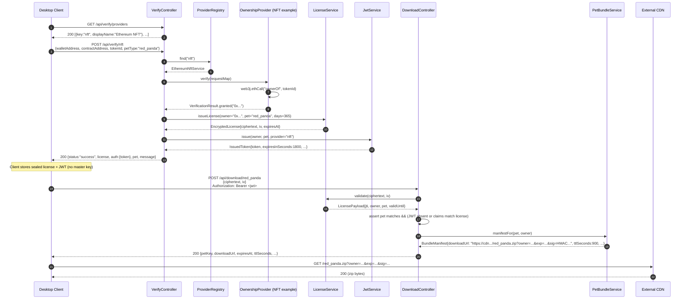
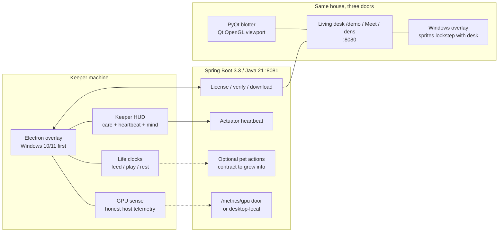

# EnterprisePet Backend — System Architecture Document

← [Back to Documentation Index](README.md)

> **Living Document**  
> This document reflects the *current* architecture of the EnterprisePet Backend.  
> It is intended to evolve together with the codebase. Please keep it up to date when the architecture changes.

| Field            | Value                                      |
|------------------|--------------------------------------------|
| **Last Updated** | 2026-09-02 (Scrape leftover rasps a sill pan as a rock plate; fourth leftover of remaining reef/sea after well ten closed; Paint leftover still bars a sash pocket as a wreath cup; third leftover of remaining reef/sea after well ten closed; Wreath leftover still tentacles a sash stile as a column dish; second leftover of remaining reef/sea after well ten closed; Ridge leftover still valleys a window stool as a boulder dish; first leftover of remaining reef/sea after well ten closed; Rose leftover still blushes a sash well as a salt pan; tenth leftover of the well den done; well ten closed; Rod leftover still tumbles a sill pan as a broth cup; ninth leftover of the well den done; Bell leftover still trumpets a sash horn as a trumpet rim; eighth leftover of the well den done; Spin leftover still twos a sill wash as a wet plate; seventh leftover of the well den done; Hold leftover still holdfasts a meeting rail as a cold hold; sixth leftover of the well den done; Pane leftover still houses a glass rim as a silica dish; fifth leftover of the well den done; Orb leftover still spheres a sill pan as a green bowl; fourth leftover of the well den done; Spot leftover still reds a lower sash light as a lamp drop; third leftover of the well den done; Reach leftover still foots a glazing rebate as a silt film; second leftover of the well den done; Boot leftover still slippers a window pane as a drop glass; first leftover of the well den done; Arca leftover still waits a sash drip as a damp blotter; tenth leftover of the far den done and closes far ten; Hush leftover still cools a lamp-side pane as a lamp shadow; ninth leftover of the far den done; Beacon leftover still aligns a sash parting bead as a ruler line; eighth leftover of the far den done; Brine leftover still frosts a window stool as a salt dish; seventh leftover of the far den done; Knot leftover still manys a window stool as a paperweight; sixth leftover of the far den done; Dusk leftover still rims a lamp-side stile as a lamp-edge; fifth leftover of the far den done; Shard leftover still facets a sash gap as an inkstone; fourth leftover of the far den done; Nimbus leftover still floats a mid pane as a methane bowl; third leftover of the far den done; Choir leftover still chords a mid pane as blotter air; second leftover of the far den done; Gleam leftover still thirsts a bright pane as lamp glass; first leftover of the far den done; Pact leftover still plaques a cool stile as bark stone; tenth leftover of the fungi den done and fungi ten closed; meadow ten closed; hive ten closed; shore ten is closed; next leftover is Scrub; far den closed; catalog stays 220; tumble is the tell; Beacon still owns align; Brine still owns frost; Flux still owns field; Bandit still owns inspect; Anchor still owns hitch; Stem still owns stilt; Ghost still owns week; Dusk still owns rim; Fan still owns gold; Loom still owns web; Gleam still owns thirst; Knot still owns many; Tun still owns dry; Sheen still owns lick; Snap still owns count; Night still owns dusk; Shard still owns facet; Nimbus still owns float; Choir still owns chord; Pact still owns plaque; Starter still owns bloom; Flame still owns drip; Puff still owns cloud; Mane still owns teeth; Ring still owns zones; Horn still owns fork; Lattice still owns hollow; Cap still owns warts; Frill still owns shelf; Pebble still owns puff; Floss still owns dust) |
| **Version**      | 1.3                                        |
| **Status**       | Active — Maintained                        |
| **Related**      | [docs/README.md](README.md) (documentation index), [docs/adr/](adr/README.md) (decisions already true on `main`) |

---

## Document Maintenance

Contributors making significant architectural changes (new major components, changes to the provider SPI, deployment model, security boundaries, data flows, technology stack, or cross-cutting concerns) are responsible for updating this document.

### How to Update This Document

1. **Identify impact** — Determine which sections are affected (High-Level Architecture, Deployment Architecture, Component Breakdown, Data Flow diagrams, Technology Stack, etc.).
2. **Update content & diagrams** — Revise text and Mermaid diagrams so they accurately describe the new state.
3. **Refresh the "Last Updated" date** at the top of this file.
4. **Update the Table of Contents** below if new top-level sections or important subsections are added.
5. **Cross-link** — Consider whether `README.md`, `docs/SETUP.md`, `AUDIT.md`, or code comments also need updates.
6. **Review** — Include documentation changes in your pull request and request a review of the architecture docs alongside the code.

Keeping this document accurate reduces onboarding friction and prevents architectural drift.

---

## Table of Contents

- [1. Executive Summary](#1-executive-summary)
- [2. High-Level Architecture](#2-high-level-architecture)
- [3. Deployment Architecture](#3-deployment-architecture)
- [4. Component Breakdown](#4-component-breakdown)
- [5. Data Flow & Interactions](#5-data-flow--interactions)
- [6. Technology Stack & Rationale](#6-technology-stack--rationale)
- [7. Project Structure](#7-project-structure)
- [8. Key Design Decisions & Tradeoffs](#8-key-design-decisions--tradeoffs)
- [9. Scalability, Security & Extensibility Considerations](#9-scalability-security--extensibility-considerations)
- [10. Recommendations & Next Steps](#10-recommendations--next-steps)
- [11. House polish north-star (the X ads)](#11-house-polish-north-star-the-x-ads)
- [Appendix: Glossary of Key Artifacts](#appendix-glossary-of-key-artifacts)

---

## 1. Executive Summary

EnterprisePet Backend is a secure, stateless Spring Boot 3.3 Java 21 REST service that serves as the trust anchor for a premium "desktop pets" digital collectibles platform. It enables users to prove ownership of entitlements across heterogeneous platforms (Steam game ownership, Ethereum ERC-721 NFTs, Microsoft Store products, itch.io download-key receipts, and Epic Games Store catalog items) and, in return, receive cryptographically sealed time-limited licenses plus short-lived JWTs that authorize the download of platform-specific pet asset bundles from an external CDN.

The architecture deliberately keeps the master AES-256-GCM encryption key and signing material server-side only. The desktop client (out of scope for this repository; referenced as a future PyQt6/Python application) never holds long-term secrets and cannot forge valid licenses. A clean plugin SPI (`OwnershipProvider`) allows new storefronts or wallet types to be added with a single `@Service` class and no changes to controllers or security configuration. Rate limiting, defense-in-depth validation on download, and startup-time secret validation are first-class concerns.

The system is currently a modular monolith with scaffolding for persistence (JPA + Postgres) but no entities or repositories yet; all core flows are stateless and crypto-backed.

---

## 2. High-Level Architecture

### Overall Architecture Style
- **Modular monolith** with a strong **plugin / SPI layer** for extensibility.
- **Layered architecture**: 
  - Presentation (thin `@RestController`s)
  - Application / orchestration (controllers + services)
  - Domain / core services (`LicenseService`, `PetBundleService`, `JwtService`)
  - Infrastructure / pluggable providers (Steam, NFT, Microsoft, Itch, Epic)
  - Cross-cutting concerns (security filter chain, rate limiting, exception mapping)
- **Stateless** by design: no HTTP sessions, no server-side conversation state. Entitlement is proven via sealed artifacts (encrypted license + JWT claims).
- **Client-server** with an untrusted or semi-trusted client (desktop app) that holds opaque tokens only.

### Key Components and Interactions
- **Client** (external desktop application) initiates all flows.
- **ProviderRegistry** discovers `OwnershipProvider` beans at startup and routes `/api/verify/{key}` calls.
- **LicenseService** is the cryptographic source of truth for entitlements (AES-GCM).
- **JwtService + JwtAuthenticationFilter** protect the download phase only.
- **PetBundleService** authorizes access to external storage without serving bytes itself. A config-driven `bundle.catalog` may attach version, platform, and sha256 to the signed manifest; empty catalog keeps today's URL-only contract.
- External dependencies are called synchronously during verification (Web3 RPC, Microsoft Collections API, Steam Web API, itch.io API, and EOS Auth + Ecom).

```mermaid
graph TD
    subgraph "External Clients"
        DC[Desktop Client<br/>PyQt6 / Python]
    end

    subgraph "EnterprisePet Backend (Spring Boot)"
        API[REST API Layer<br/>VerifyController, DownloadController, PetController]
        REG[ProviderRegistry]
        PROV[OwnershipProvider SPI]
        LS[LicenseService<br/>AES-256-GCM]
        JS[JwtService + Filter]
        BS[PetBundleService<br/>HMAC-SHA256]
        CAT[PetCatalog<br/>static enum]
        RL[RateLimitingFilter<br/>Bucket4j + Redis]
        SEC[SecurityConfig<br/>stateless JWT]
        EX[GlobalExceptionHandler<br/>RFC 7807]
    end

    subgraph "Pluggable Providers"
        S[SteamService<br/>(real API)]
        N[EthereumNftService<br/>web3j]
        M[MicrosoftStoreService<br/>RestClient + dev-mode]
        I[ItchService<br/>download-key receipt]
        E[EpicService<br/>OAuth + Ecom v3]
    end

    subgraph "External Systems"
        STEAM[Steam Web API]
        ETH[Alchemy / Infura<br/>Ethereum RPC]
        MS[Microsoft Collections API]
        ITCH[itch.io API<br/>api.itch.io]
        EPIC[EOS Auth + Ecom<br/>api.epicgames.dev]
        CDN[(CDN / S3 / R2<br/>Pet .zip bundles)]
    end

    subgraph "Future / Scaffolding"
        DB[(PostgreSQL<br/>JPA entities<br/>for revocation/audit)]
    end

    DC -->|GET /api/verify/providers<br/>GET /api/pets| API
    DC -->|POST /api/verify/{provider}<br/>{platform creds + petType}| API
    API --> REG
    REG --> PROV
    PROV --> S
    PROV --> N
    PROV --> M
    PROV --> I
    PROV --> E
    N -->|ownerOf eth_call| ETH
    M -->|XBL3.0 / Bearer publisherQuery v9| MS
    S -->|GetOwnedGames| STEAM
    I -->|download_keys| ITCH
    E -->|client_credentials + ownership| EPIC

    API --> LS
    API --> JS
    LS -->|issue + validate| DB

    DC -->|POST /api/download/{pet}<br/>{cipher,iv} + Bearer JWT| API
    API --> SEC
    API --> RL
    API --> LS
    API --> BS
    BS -->|signed short-lived URL| CDN

    API --> EX
```

The diagram shows the plugin boundary clearly: adding a new platform (Gumroad, Solana, etc.) requires only a new class implementing `OwnershipProvider` annotated `@Service`.

---

## 3. Deployment Architecture

### Current Deployment Model
The service runs as a Spring Boot executable JAR or the multi-stage `Dockerfile` image:

- One JVM process listening on port 8081 (configurable via `server.port`). The living desk keeps 8080.
- Spring profiles (`dev` / `staging` / `prod`) overlay the same `application.yml` keys. Default and `dev` keep H2 unless `SPRING_DATASOURCE_*` is set (`docker-compose.yml` already points `dev` at Postgres). `staging` and `prod` require Postgres and have no H2 fallback.
- Redis-backed Bucket4j rate limiter (Lettuce / `bucket4j-redis`) shared across replicas. If Redis is down, verify/download fail closed with HTTP 503. `prod` refuses `RATE_LIMIT_BACKEND=memory`.
- Redis-backed jti deny-list (`RevocationIndex`) shared across replicas. Postgres `IssuedLicense.revokedAt` remains the ledger; Redis is a fast deny so a replica that has not seen the row still rejects. If Redis is down, `LicenseService.validate` falls back to the ledger (it does not accept a revoked license). HTTP download may still 503 from the rate-limit filter.
- Critical secrets (`LICENSE_SECRET_KEY`, `JWT_SECRET_KEY`, `BUNDLE_SIGNING_KEY`, `ADMIN_API_KEY`) loaded from environment variables with strict `@PostConstruct` startup validation that refuses to run on missing or placeholder values.
- `ProductionProfileGuard` (`@Profile("prod")`) refuses Microsoft Store `dev-mode`, an in-memory rate-limit store, and an H2 JDBC URL even when environment variables try to override `application-prod.yml`.
- `Dockerfile` + GitHub Actions GHCR publish + `deploy/k8s/` (Deployment/Service, in-cluster Postgres/Redis scaffolding, optional Ingress). Blue/green is two Deployments and a Service `color` selector — not a service mesh.
- External dependencies (Alchemy, Microsoft Collections, Steam Web API, itch.io, Epic, future CDN) are called directly; Resilience4j circuit breakers wrap the providers.
- The living desk (`web/`) and Electron overlay (`desktop/`) talk to this backend.

### Recommended Production Topology
For any non-trivial user base or multi-region deployment, the following production architecture is strongly recommended:

- **Stateless horizontally scaled backend replicas** (Kubernetes `Deployment` or equivalent container orchestration) sitting behind a load balancer / ingress controller that terminates TLS. The Java application is already fully stateless with respect to HTTP sessions.
- **PostgreSQL** (managed service or self-hosted with HA) as the durable store for issued licenses (`jti`, owner, pet, timestamps, revocation status) once the JPA layer is implemented. This enables revocation, audit, and "licenses per owner" policies.
- **Redis** (or Redis-compatible store) for:
  - Distributed token-bucket rate limits (`bucket4j-redis` or equivalent).
  - Shared jti deny-list (`revoked:jti:{jti}`, TTL ≥ remaining license life + 1h skew) so a revoked license is rejected immediately across all replicas. Postgres remains the ledger.
  - Optional short-TTL caching of expensive external provider responses (e.g., recent NFT ownership checks).
- **External secret management** (HashiCorp Vault, AWS Secrets Manager, Azure Key Vault, or Kubernetes `ExternalSecrets` operator) instead of plain environment variables for the three long-lived cryptographic keys. Secrets should be rotated on a schedule and never appear in logs or container specs.
- **CDN / Object Storage** (Amazon CloudFront + S3, Cloudflare R2, Google Cloud CDN, etc.) as the authoritative source for the actual pet `.zip` bundles. The backend only generates short-lived HMAC-signed URLs; it never serves the binary assets itself.
- **Health/readiness/liveness probes** exposed via Spring Boot Actuator (`/actuator/health`, `/actuator/health/readiness`) so the orchestrator can safely perform rolling updates and drain traffic.
- Optional but recommended: WAF / API Gateway / cloud load balancer rules in front for L7 bot mitigation, additional rate limiting, and IP reputation filtering.

The backend service itself remains a relatively low-QPS control plane. The heavy lifting (storage + bandwidth for pet assets) is entirely offloaded to the CDN tier.

### Deployment Diagram

```mermaid
flowchart TB
    subgraph "Client Tier"
        DC[Desktop Clients<br/>PyQt6 / Python<br/>or future Web UI]
    end

    subgraph "Edge &amp; Delivery Layer"
        CDN[(Pet Bundle CDN<br/>S3 / R2 / CloudFront<br/>+ HMAC signature verification)]
        WAF[WAF / API Gateway<br/>(Cloudflare, AWS WAF, etc.)]
    end

    subgraph "Kubernetes / Container Platform"
        LB[Load Balancer / Ingress<br/>nginx, Traefik, ALB, etc.<br/>TLS termination + routing]

        subgraph "Backend Deployment (3+ replicas, HPA enabled)"
            App1[EnterprisePet Pod<br/>Spring Boot 3.3 + Java 21<br/>Stateless]
            App2[EnterprisePet Pod<br/>Spring Boot 3.3 + Java 21<br/>Stateless]
            AppN[EnterprisePet Pod<br/>Spring Boot 3.3 + Java 21<br/>Stateless]
        end

        Redis[(Redis<br/>Distributed rate limits<br/>+ jti revocation cache)]
        Postgres[(PostgreSQL<br/>IssuedLicense table<br/>Revocation list<br/>Audit log)]
    end

    subgraph "External Trust Sources"
        ETH[Alchemy / Infura<br/>Ethereum RPC]
        MS[Microsoft Collections API<br/>collections.mp.microsoft.com]
        STEAM[Steam Web API<br/>api.steampowered.com]
    end

    subgraph "Secret Management &amp; Observability"
        Secrets[Vault / AWS Secrets Manager<br/>/ K8s ExternalSecrets]
        MON[Prometheus + Grafana<br/>or cloud equivalent]
        TRACE[OTLP collector<br/>Tempo / Jaeger / Grafana]
        LOGS[Centralized Logging<br/>Loki / ELK / CloudWatch Logs]
    end

    DC -->|HTTPS + JWT / license| WAF
    WAF --> LB
    LB --> App1 & App2 & AppN

    App1 & App2 & AppN -->|JPA / JDBC| Postgres
    App1 & App2 & AppN -->|Bucket4j + Lettuce + jti deny-list| Redis
    App1 & App2 & AppN -->|ownerOf, publisherQuery v9, GetOwnedGames| ETH & MS & STEAM
    App1 & App2 & AppN -. "init + periodic rotation" .-> Secrets

    App1 & App2 & AppN -->|generate signed 15-min URLs| CDN
    DC -->|direct high-bandwidth download| CDN

    App1 & App2 & AppN --> MON & TRACE & LOGS
    Postgres & Redis --> MON
```

### Key Deployment Characteristics & Gaps
- **Scalability** — Backend replicas scale independently of storage. The CDN tier absorbs virtually all download traffic. Rate-limit buckets are shared in Redis; issued licenses live in Postgres.
- **Resilience & Zero-Downtime** — Multiple replicas + readiness probes + external durable stores allow rolling updates and node failures without losing the ability to validate existing licenses (they are cryptographically self-contained).
- **Security Boundaries** — Only the backend pods ever receive the master AES key and signing keys. The CDN, load balancers, and clients never see them.
- **Current Gaps** (must be closed before production):
  - ~~No `Dockerfile` or multi-stage build.~~
  - ~~No Kubernetes manifests, Helm chart, or Kustomize overlays.~~ Manifests in `deploy/k8s/` (not Helm). In-cluster Postgres/Redis are compose-equivalent scaffolding, not a managed HA pair.
  - CI publishes the image to GHCR; image signing is still open.
  - ~~Actuator is not enabled.~~ Probes are `/actuator/health/liveness` and `/readiness` (permitted without a JWT).
  - No Terraform/Pulumi/Crossplane definitions for the surrounding infrastructure (managed Postgres, Redis, secrets, CDN, WAF).
  - Secrets are still accepted via plain environment variables / a Kubernetes `Secret` (acceptable only behind a proper secrets operator).

This deployment view directly addresses the multi-instance and rate-limiting concerns already called out in the README and `AUDIT.md`.

---

## 4. Component Breakdown

### 4.1 Presentation Layer – Controllers
| Component              | Responsibility                                                                 | Technology          | Key Files                                      | Dependencies                          |
|------------------------|--------------------------------------------------------------------------------|---------------------|------------------------------------------------|---------------------------------------|
| `VerifyController`     | Provider discovery (`/providers`), ownership verification dispatch, license + JWT issuance | Spring Web          | `controller/VerifyController.java`             | `ProviderRegistry`, `LicenseService`, `JwtService`, `PetCatalog` |
| `DownloadController`   | License + JWT cross-validation, delegation to bundle manifest generation       | Spring Web + Security | `controller/DownloadController.java`           | `LicenseService`, `PetBundleService`, `PetCatalog`, `SecurityContextHolder` |
| `PetController`        | Public read-only catalog browsing (list, filter by rarity, detail)             | Spring Web          | `controller/PetController.java`                | `PetCatalog`                          |
| `BundleController`     | Public artifact catalog for a pet (`GET /api/bundles/{petKey}`)                | Spring Web          | `bundle/BundleController.java`                 | `BundleCatalog`, `PetCatalog`         |

All controllers return `ResponseEntity<?>` and rely on `GlobalExceptionHandler` for consistent error shapes. The verify wire body and `OwnershipProvider.verify` SPI stay a flat `Map<String, String>`; each provider parses that map into an immutable `*VerifyRequest` record (Steam, Itch, Epic, NFT, Microsoft).

### 4.2 Provider SPI (Extension Point)
| Component                  | Responsibility                                      | Technology | Key Files                                      | Dependencies                     |
|----------------------------|-----------------------------------------------------|------------|------------------------------------------------|----------------------------------|
| `OwnershipProvider`        | Contract for any ownership source                   | Java interface | `provider/OwnershipProvider.java`              | —                                |
| `VerificationResult`       | Success/failure + owner id + optional `petKey` hint | Java record | `provider/VerificationResult.java`             | —                                |
| `ProviderRegistry`         | Spring-driven collection + key-based lookup         | Spring @Service | `provider/ProviderRegistry.java`               | `List<OwnershipProvider>` (DI)   |

**Current implementations:**
- `steam/SteamService` – real Steam Web API integration + `SteamVerifyRequest.from(map)` + conditional registration.
- `nft/EthereumNftService` – Web3j `eth_call` to ERC-721 `ownerOf` / ERC-1155 `balanceOf` with address validation, official collection allowlist, token→pet binding, required `personal_sign` (`ethereum.require-signature` defaults true; naming a wallet does not sit you here), and timed-out RPC. Empty `ethereum.collections` still denies (ADR 0004). Do not invent a live collection address.
- `microsoft/MicrosoftStoreService` – RestClient to Microsoft Collections v9 `publisherQuery` (XBL3.0 or Bearer; optional `Signature`). The house only opens when `storeProductId` is on `microsoft.product-id` / `MICROSOFT_PRODUCT_ID` (empty fails closed). Prod still refuses `microsoft.dev-mode`. Do not invent a live Store ID.
- `itch/ItchService` – itch.io download-key receipt verify (`GET /games/{id}/download_keys`) with developer API key, optional `itch.game-id` allowlist, circuit breaker.
- `epic/EpicService` – EOS Auth `client_credentials` token exchange + Ecom v3 ownership (`GET /epic/ecom/v3/platforms/{platform}/identities/{accountId}/ownership`) with fail-closed Developer Portal secrets, optional sandbox/catalog-item allowlist, circuit breaker.

### 4.3 Core Domain Services
| Component             | Responsibility                                                                 | Technology                  | Key Files                              | Dependencies                     |
|-----------------------|--------------------------------------------------------------------------------|-----------------------------|----------------------------------------|----------------------------------|
| `LicenseService`      | Issue & validate AES-256-GCM encrypted JSON license payloads (jti, owner, pet, timestamps); revoke writes Postgres then the shared deny-list | BouncyCastle GCMBlockCipher + Jackson | `license/LicenseService.java`          | `LicenseRepository`, `RevocationIndex`, Spring @Value, ObjectMapper, SecureRandom |
| `JwtService`          | Issue short-lived (default 30 min) HS256 JWTs carrying owner/pet/provider claims; parse & validate | JJWT 0.12 + Spring @Value   | `security/JwtService.java`             | SecretKey from config            |
| `PetBundleService`    | Generate 15-minute HMAC-SHA256 signed CDN download URLs bound to (petKey, owner, jti, expiry); optional catalog metadata | javax.crypto.Mac + Spring   | `bundle/PetBundleService.java`, `bundle/BundleCatalog.java` | Signing key + `bundle.catalog` |
| `PetCatalog` / `PetType` | Static catalog of 210 living kinds across 4 rarity tiers; lookup + grouping utilities   | Java enum + Spring @Service | `pet/PetType.java`, `pet/PetCatalog.java` | —                                |

### 4.4 Cross-Cutting & Infrastructure
- **`SecurityConfig`** + **`JwtAuthenticationFilter`**: Stateless JWT auth (permitAll on verify/pets/bundles, authenticated on download). Filter populates `SecurityContext` with a `Map` principal for claim access.
- **`RateLimitingFilter`**: Token-bucket per-IP (10/min verify, 30/min download) using Bucket4j on Redis (`LettuceBasedProxyManager`). Respects `X-Forwarded-For`. Redis-down → 503 fail-closed.
- **`RevocationIndex`**: Shared jti deny-list on the same Redis (`RedisRevocationIndex`, keys `revoked:jti:{jti}`). `InMemoryRevocationIndex` when `rate-limit.backend=memory`. Not a second ledger.
- **`GlobalExceptionHandler`** (`@RestControllerAdvice`): Maps common Spring exceptions + catch-all to RFC 7807 `ProblemDetail`.
- **`EnterprisePetBackendApplication`**: Standard `@SpringBootApplication`.
- **Observability (Phase 3.2)**: Micrometer Observation + `micrometer-tracing-bridge-otel`. HTTP server spans on `/api/verify/**` and `/api/download/**`; RestClient client spans for Steam/Itch/Epic/Microsoft; `eth_call` spans for NFT. Business timers `enterprisepet.verify` (provider + outcome) and `enterprisepet.download`. OTLP/HTTP export only when `OTEL_EXPORTER_OTLP_ENDPOINT` is set. Prometheus remains `/actuator/prometheus`.
- **Config**: `application.yml` plus `application-dev.yml` / `application-staging.yml` / `application-prod.yml` (same YAML + env-var style). `@PostConstruct` guards refuse missing/weak/placeholder secrets. `ProductionProfileGuard` fail-hards the prod profile.

### 4.5 Data & Persistence (Scaffolded, Not Yet Used)
- Spring Data JPA + Hibernate configured for H2 (dev) / PostgreSQL (prod).
- Zero `@Entity`, `@Repository`, or `JpaRepository` implementations exist today.
- Intended future use: persistent `IssuedLicense` records, revocation lists, audit logs (see section 10).

---

## 5. Data Flow & Interactions

### Primary Workflows

#### 4.1 Ownership Verification & License Issuance
1. Client discovers available platforms: `GET /api/verify/providers`.
2. Client optionally explores catalog: `GET /api/pets?rarity=RARE` or `/api/pets/by-rarity`.
3. Client calls `POST /api/verify/{provider}` with provider-specific fields + optional `petType`.
4. `VerifyController` resolves the provider, calls `OwnershipProvider.verify(Map)`, and on success:
   - Invokes `LicenseService.issueLicense(...)` → produces `EncryptedLicense` (base64 ciphertext + IV + expiry).
   - Invokes `JwtService.issue(...)` → produces short-lived bearer token scoped to `(owner, pet, provider)`.
5. Client receives sealed license + JWT + pet metadata. The ciphertext is opaque; the client stores it verbatim.

Rate limiting and basic validation occur before provider dispatch. Provider exceptions surface as 502.

#### 4.2 Bundle Download Authorization (Defense-in-Depth)
1. Client `POST /api/download/{petKey}` with the exact `{ciphertext, iv}` from the prior license response + `Authorization: Bearer <jwt>`.
2. `JwtAuthenticationFilter` (if present) populates the security context.
3. `DownloadController`:
   - Validates pet exists.
   - Calls `LicenseService.validate(ciphertext, iv)` → decrypts, checks expiry and authenticity via GCM tag, then the Redis deny-list, then the Postgres ledger.
   - Compares `license.pet` against path variable.
   - If JWT present in context, performs claim cross-check: `jwt.sub == license.owner && jwt.pet == license.pet`.
4. On success, `PetBundleService.manifestFor(...)` signs `petKey|owner|exp` with HMAC-SHA256 and returns a CDN URL containing the signature as a query parameter.
5. Client downloads the actual `.zip` from the CDN (edge verification of signature is assumed to be implemented at the CDN or via a future proxy).

This two-phase (verify → download) + dual-artifact (license + JWT) design prevents:
- Use of a stolen license without a matching fresh JWT.
- Use of a JWT issued for pet A to obtain pet B.

#### 4.3 Admin lookup, audit, and revoke
1. Operator opens the house `/admin` ledger (not in the public nav) and supplies `ADMIN_API_KEY` plus the license-service base URL. The key is sent as `X-Admin-Key` and kept in `sessionStorage` for the tab only.
2. `GET /api/admin/licenses` (optional `owner`) and `GET /api/admin/licenses/{jti}` return persisted audit fields: owner, pet, provider, issued, last used, revoked.
3. `POST /api/admin/revoke` `{ "jti" }` sets `revokedAt` in Postgres, then writes the jti to the shared Redis deny-list (TTL ≥ remaining license life + 1h). Subsequent `LicenseService.validate()` and `/api/download` fail closed (same 401). A replica that has not seen the row still denies via Redis.

All three routes are `permitAll` at the Spring Security layer; the controller rejects a missing or wrong key with 401. CORS is enabled only for `/api/admin/**` so the living desk can call a separate origin.

### Sequence Diagram – Happy Path End-to-End


```mermaid
sequenceDiagram
    autonumber
    participant C as Desktop Client
    participant V as VerifyController
    participant R as ProviderRegistry
    participant P as OwnershipProvider (NFT example)
    participant L as LicenseService
    participant J as JwtService
    participant D as DownloadController
    participant B as PetBundleService
    participant CDN as External CDN

    C->>V: GET /api/verify/providers
    V-->>C: 200 [{key:"nft", displayName:"Ethereum NFT"}, ...]

    C->>V: POST /api/verify/nft<br/>{walletAddress, contractAddress, tokenId, petType:"red_panda"}
    V->>R: find("nft")
    R-->>V: EthereumNftService
    V->>P: verify(requestMap)
    P->>P: web3j.ethCall("ownerOf", tokenId)
    P-->>V: VerificationResult.granted("0x...")

    V->>L: issueLicense(owner="0x...", pet="red_panda", days=365)
    L-->>V: EncryptedLicense{ciphertext, iv, expiresAt}

    V->>J: issue(owner, pet, provider="nft")
    J-->>V: IssuedToken{token, expiresInSeconds:1800, ...}

    V-->>C: 200 {status:"success", license, auth:{token}, pet, message}

    Note over C: Client stores sealed license + JWT (no master key)

    C->>D: POST /api/download/red_panda<br/>{ciphertext, iv}<br/>Authorization: Bearer <jwt>
    D->>L: validate(ciphertext, iv)
    L-->>D: LicensePayload{jti, owner, pet, validUntil}
    D->>D: assert pet matches && (JWT absent or claims match license)
    D->>B: manifestFor(pet, owner)
    B-->>D: BundleManifest{downloadUrl: "https://cdn.../red_panda.zip?owner=...&exp=...&sig=HMAC...", ttlSeconds:900, ...}
    D-->>C: 200 {petKey, downloadUrl, expiresAt, ttlSeconds, ...}

    C->>CDN: GET /red_panda.zip?owner=...&exp=...&sig=...
    CDN-->>C: 200 (zip bytes)
```

### Secondary Flows
- Error paths: unknown provider/pet → 404/400; failed verification → 403; tampered/expired license or JWT mismatch → 401/403; rate limit → 429 with `Retry-After`.
- Discovery flows are public and unauthenticated.

---

## 6. Technology Stack & Rationale

| Layer / Concern          | Technology                              | Version     | Rationale / Why Chosen |
|--------------------------|-----------------------------------------|-------------|------------------------|
| Language & Runtime       | Java 21                                 | 21          | Records, pattern matching, modern crypto APIs, long-term LTS support. |
| Framework                | Spring Boot                             | 3.3.5       | Mature security model, excellent DI for plugin registry, battle-tested web stack, auto-configuration of filters/JPA. |
| Web / REST               | Spring Web (starter-web)                | —           | Declarative controllers, flexible error handling via `ProblemDetail`. |
| Security                 | Spring Security + JJWT                  | 6.x / 0.12.6| Stateless JWT best practices; JJWT is the de-facto modern Java library with strong typing and algorithm whitelisting. |
| Cryptography (Licenses)  | BouncyCastle (bcprov-jdk18on)           | 1.78.1      | Portable, explicit AES-GCM with AEAD; avoids JDK provider differences. |
| Blockchain               | web3j core                              | 4.12.0      | Standard Java Ethereum client; supports `eth_call` for read-only ownership proofs without a full node. |
| External HTTP            | Spring RestClient (new in 3.x) + Jackson| —           | Modern, fluent, no RestTemplate boilerplate. |
| Rate Limiting            | Bucket4j + Lettuce Redis                | 8.10.1      | Same token-bucket math as the in-memory store; `bucket4j-redis` CAS so replicas share 10/min verify and 30/min download. Fail-closes with 503 if Redis is down. |
| Persistence (scaffolded) | Spring Data JPA + Hibernate + H2 / Postgres | —        | Standard; H2 for fast local dev, Postgres for production durability/audit. Currently unused. |
| Steam Integration        | Spring RestClient + Steam Web API       | —           | `SteamService` calls `IPlayerService/GetOwnedGames` via RestClient. steam-condenser was unused and has been removed. |
| Build                    | Maven + Spring Boot Maven Plugin        | —           | Universal, works in restricted environments; explicit Java 21 compiler config. |
| Config & Secrets         | Spring @Value + env overrides + @PostConstruct guards | — | Fail-fast on missing/placeholder keys; supports 12-factor deployment. |
| Metrics                  | Micrometer + Prometheus registry                      | BOM | `/actuator/prometheus` scrape. `enterprisepet.verify` timer tagged `provider`/`outcome` for success rate and latency. |
| Tracing                  | Micrometer Tracing + OpenTelemetry + OTLP/HTTP        | BOM | `micrometer-tracing-bridge-otel` + `opentelemetry-exporter-otlp`. Export off unless `OTEL_EXPORTER_OTLP_ENDPOINT` is set. |

**Notable absences (intentional or future):** No Spring Cloud / service mesh yet (single service), no reactive stack (blocking I/O is acceptable for low-volume verification calls), no ORM entities yet.

---

## 7. Project Structure

```
ComputerPets/
├── pom.xml
├── README.md
├── AUDIT.md
├── BUILD-REVIEW.md
├── ARCHITECTURE.md          # this document
├── build.ps1
├── deploy/k8s/              # Kubernetes manifests (prod profile, blue/green)
├── src/
│   ├── main/
│   │   ├── java/com/enterprisepet/
│   │   │   ├── EnterprisePetBackendApplication.java
│   │   │   ├── bundle/
│   │   │   │   ├── BundleCatalog.java
│   │   │   │   └── PetBundleService.java
│   │   │   ├── config/
│   │   │   │   ├── GlobalExceptionHandler.java
│   │   │   │   ├── ProductionProfileGuard.java
│   │   │   │   ├── RateLimitingFilter.java
│   │   │   │   └── SecurityConfig.java
│   │   │   ├── controller/
│   │   │   │   ├── DownloadController.java
│   │   │   │   ├── PetController.java
│   │   │   │   ├── VerifyController.java
│   │   │   │   └── VerifyEnvelope.java
│   │   │   ├── license/
│   │   │   │   ├── LicenseService.java
│   │   │   │   ├── RevocationIndex.java
│   │   │   │   ├── RedisRevocationIndex.java
│   │   │   │   └── InMemoryRevocationIndex.java
│   │   │   ├── microsoft/
│   │   │   │   ├── MicrosoftStoreService.java
│   │   │   │   └── MicrosoftVerifyRequest.java
│   │   │   ├── itch/
│   │   │   │   ├── ItchService.java
│   │   │   │   └── ItchVerifyRequest.java
│   │   │   ├── epic/
│   │   │   │   ├── EpicService.java
│   │   │   │   └── EpicVerifyRequest.java
│   │   │   ├── nft/
│   │   │   │   ├── EthereumNftService.java
│   │   │   │   └── NftVerifyRequest.java
│   │   │   ├── pet/
│   │   │   │   ├── PetCatalog.java
│   │   │   │   ├── PetController.java   # duplicated? no, separate from controller/
│   │   │   │   └── PetType.java
│   │   │   ├── provider/
│   │   │   │   ├── OwnershipProvider.java
│   │   │   │   ├── ProviderRegistry.java
│   │   │   │   └── VerificationResult.java
│   │   │   ├── security/
│   │   │   │   ├── JwtAuthenticationFilter.java
│   │   │   │   └── JwtService.java
│   │   │   ├── steam/
│   │   │   │   ├── SteamService.java
│   │   │   │   └── SteamVerifyRequest.java
│   │   │   └── service/                 # intentionally empty – future home for higher-level facades
│   │   └── resources/
│   │       ├── application.yml          # shared env-driven config + startup validation
│   │       ├── application-dev.yml
│   │       ├── application-staging.yml
│   │       └── application-prod.yml     # Postgres + Redis; ProductionProfileGuard
│   └── test/java/                       # currently empty – high priority gap
└── (target/ ignored)
```

**Key Directory Rationale**
- `provider/` – the explicit extension point; everything else is concrete.
- `license/` and `bundle/` – single-responsibility cryptographic modules kept separate from controllers.
- `pet/` – catalog is a first-class domain concept because pet type is embedded in every license and claim.
- `config/` – cross-cutting filters and handlers live together.
- Package naming (`com.enterprisepet`) is stable even if marketing name is "ComputerPets".

Profile overlays live next to `application.yml`. Static assets and pet bundles live outside this service. Kubernetes manifests are in `deploy/k8s/`.

---

Numbered records of the decisions that are already true on `main` live in [`docs/adr/`](adr/README.md). This table is the short form; the ADRs are the why.

## 8. Key Design Decisions & Tradeoffs

| Decision                              | Rationale                                                                 | Tradeoff / Risk |
|---------------------------------------|---------------------------------------------------------------------------|-----------------|
| **Plugin SPI with Spring auto-discovery** (`ProviderRegistry` ctor takes `List<OwnershipProvider>`) | Zero boilerplate for new platforms; clients discover via `/providers` endpoint. | Duplicate-key detection at startup is good, but runtime registration or ordering is not dynamic. |
| **Stateless crypto licenses instead of server-side sessions or DB rows** | Simple horizontal scaling; client carries the proof; server only needs the master key. | Revocation, usage analytics, and "one active license per owner" policies require future persistence layer. |
| **Two-phase download (encrypted license + short JWT)** with explicit claim cross-check in `DownloadController` | Strong defense-in-depth against token replay and cross-pet attacks. | Extra round-trip and client complexity; JWT is only useful for the download handshake. |
| **HMAC-signed URLs rather than direct S3 presigned URLs or serving bytes** | Decouples storage backend; allows custom edge logic (IP binding, one-time use, logging) without changing the Java service. | Requires a verifier at the CDN/edge or a lightweight proxy; signature is replayable for 15 min from any IP today. |
| **Redis Bucket4j + Lettuce (`rate-limit.backend=redis`)** | Shared per-IP verify/download buckets across replicas; idle keys expire after the refill window. | Redis is now a runtime dependency. Unreachable Redis fail-closes (503) instead of lifting the limit. `memory` is tests / single-process only. |
| **Flat Map verify body + provider-owned records** (`OwnershipProvider.verify(Map)` then `XxxVerifyRequest.from(map)`) | One `POST /{provider}` and a drop-in SPI; each service reads typed fields instead of scattered `request.get`. | Wire/OpenAPI still describe a generic string map; records are an internal parse, not a new JSON shape. |
| **Synchronous external calls during verify** | Simple code, easy to understand and debug. | Latency and partial failure modes (one provider slow → whole request slow). No circuit breaker today. |
| **H2 + show-sql in default/`dev`; Postgres + Redis + no Microsoft dev-mode in `staging`/`prod`** | Local `mvn` and tests stay fast; `prod` is an explicit fail-hard shape. | Forgetting `SPRING_PROFILES_ACTIVE=prod` on a cluster would still boot the H2 default — the k8s ConfigMap sets `prod`. |
| **Startup-time secret validation + placeholder rejection** | Prevents the classic "I deployed with the example key" disaster. | Slightly more complex `@PostConstruct` logic in three places. |
| **Encrypted license payload is JSON (via Jackson)** | Future-proof; easy to add fields (`hwid`, `features`, `revokedAt`) without breaking wire format. | Slightly larger ciphertext than a compact binary format. |

Many of these decisions are explicitly called out as intentional in the code comments and `AUDIT.md`.

---

## 9. Scalability, Security & Extensibility Considerations

### Current Strengths
- Clean separation of concerns and a true plugin model.
- Cryptography is used correctly (random IV per license, GCM auth tag, adequate key sizes, constant-time considerations via library).
- Multiple independent proofs of entitlement (license + JWT) on the critical download path.
- Fail-fast configuration and loud warnings for dangerous dev-mode settings.
- Rate limiting and RFC 7807 error responses improve operational resilience.
- External storage (CDN) keeps the Java process from becoming a bandwidth bottleneck.

### Current Weaknesses & Gaps (from code + AUDIT.md)
- ~~**P0**: Steam and Microsoft providers are no-op stubs**~~ → Steam uses the Web API and hangs `steam.app-id`. Microsoft Store verify uses Collections v9 `publisherQuery` and hangs `microsoft.product-id` (empty fails closed). Prod still refuses dev-mode. Do not invent a live Store ID. Provider toggles via `ownership.providers.*.enabled` were added for fine-grained control.
- ~~**P0**: NFT ownership check uses fragile `String.contains(substring(2))` parsing**~~ → **Completed**, then hardened (Aug 2026): `FunctionReturnDecoder`, checksum-insensitive address compare, official collection allowlist, token→pet binding, ERC-1155, required `personal_sign` (fail closed).
- No persistence → impossible to revoke a license or detect replays beyond the 365-day expiry.
- ~~Rate-limit buckets are in-memory only~~ → Redis-backed Bucket4j (Lettuce).
- ~~Distributed jti blacklist~~ → Redis `RevocationIndex` (deny-list after Postgres revoke). Redis-down validate falls back to the ledger.
- `X-Forwarded-For` is trusted unconditionally (spoofing risk if not behind a trusted proxy).
- No authentication or rate limiting on some discovery endpoints in practice (all routes under `/api/verify` and `/api/pets` are public).
- ~~**No tests, no contract tests against the external providers**~~ → **Basic unit tests added** for Steam, Microsoft, NFT, Itch, and Epic. Integration-style HTTP mocking is in place for Steam, Microsoft, Itch, and Epic.
- ~~Default license key present in `application.yml`**~~ → **Completed**. The application now fails fast at startup if the committed default key is used (except under the 'test' profile). The fallback default was removed from `application.yml`.

### Scalability Outlook
- **Horizontal**: Excellent for the verification tier (stateless). Replicas share rate-limit buckets and the jti deny-list via Redis; the license ledger is Postgres.
- **Download tier**: Handled by CDN; the backend only does lightweight signature generation.
- **Future scaling knobs**: Caching for repeated ownership checks (with short TTLs).
- **Throughput**: Verification calls are low-volume by nature (human + desktop app cadence); the service is not designed for high-frequency trading-style traffic.

### Security Considerations
- **Good foundations**: AEAD encryption, short-lived tokens, claim binding, startup secret hygiene, no secrets in JWT bodies.
- **Attack surface**: Public verify endpoints are the primary target. A compromised master key is catastrophic (full license forgery). CDN signature key compromise allows bundle theft for 15 min windows.
- **Missing controls**: Real ownership verifiers, hardware binding, replay/revocation store, WAF in front of rate limiter, secret rotation/HSM story, input length/charset validation on all provider fields, signed requests for machine clients.
- **Client trust model**: The desktop app must be considered semi-trusted for license decryption (the Python client is expected to hold the same `LICENSE_SECRET_KEY`). The architecture comment "never trust the desktop client" refers to not letting the client *generate* licenses.

### Extensibility & Future Refactoring Areas
- **Easy wins**: New providers, richer `PetType` metadata, additional claims in licenses.
- **Medium**: Dynamic pet catalog backed by DB, subscription/entitlement types. Admin revocation UI and API now ship (`/admin` + `/api/admin/*`).
- **Structural**: Extract a true "License Domain Service" if more rules (concurrent use, transfer, gifting) appear. Providers already parse typed `*VerifyRequest` records from the Map SPI; a generic `OwnershipProvider<R>` is still optional later.
- **Observability**: Micrometer tracing (OpenTelemetry / OTLP) and `enterprisepet.verify` / `enterprisepet.download` business meters are in place. Structured logging includes `traceId` / `spanId` / `correlationId`.
- **Deployment**: Dockerfile, `deploy/k8s/` manifests, Spring profiles (`dev` / `staging` / `prod`). Flyway migrations already ship with the license ledger.

---

## 10. Recommendations & Next Steps

### P0 Status Summary (Completed – May 2026)

All four **Immediate (P0)** items required before any public or production exposure have been completed:

- Steam provider now calls the real Web API + provider toggles (`ownership.providers.*.enabled`).
- NFT ownership verification uses proper ABI decoding, an official collection allowlist, token→pet binding, ERC-721/1155, and unit tests.
- Default `LICENSE_SECRET_KEY` now fails hard outside of test environments.
- Basic unit + integration tests exist for all three providers.

The backend is now in a much safer state for internal development and limited testing. 

**Phase 1 completed (May 2026)**: All foundations delivered — observability (Actuator + custom health + MDC + RFC7807 errors), persistence (JPA + Flyway + revocation), containerization + GHCR CI, and rich OpenAPI with 25+ centralized examples. The service is now ready for Phase 2 hardening.

---

### Phased Implementation Roadmap

A detailed and actively maintained roadmap is available in a dedicated document:

> **[📖 Full Implementation Roadmap](ROADMAP.md)**

The roadmap is organized into six phases with concrete, prioritized work items:

- **Phase 1:** Production Readiness Foundations *(completed May 2026)*
- **Phase 2:** Security & Reliability Hardening *(current focus)*
- **Phase 3:** Scalability & Operational Maturity
- **Phase 4:** Client & Ecosystem Integration
- **Phase 5:** Long-term Architecture Evolution
- **Phase 6:** House polish — the X ads *(north-star; see [§11](#11-house-polish-north-star-the-x-ads))*

**Status:** Phase 1 complete. All listed items (observability, persistence, CI/CD/containers, API contracts) delivered. Starting Phase 2. See [ROADMAP.md](ROADMAP.md) for the authoritative checklist.

- **1.1 Observability Baseline**
  - Add Spring Boot Actuator + Prometheus metrics
  - Expose proper `/actuator/health`, `/actuator/health/readiness`, and `/actuator/health/liveness`
  - Add structured logging (MDC for request IDs, correlation IDs)
  - Implement basic error tracking / alerting hooks

- **1.2 Basic Persistence Layer**
  - Introduce JPA entities for `IssuedLicense` (jti, owner, pet, provider, issuedAt, expiresAt, revokedAt)
  - Add `LicenseRepository` and wire revocation checks into `LicenseService.validate()`
  - Add Flyway / Liquibase for schema management

- **1.3 CI/CD & Containerization**
  - Add GitHub Actions (or equivalent) pipeline: build → test → package
  - Create `Dockerfile` (multi-stage) and `.dockerignore`
  - Add `docker-compose.yml` for local development (app + Postgres + optional WireMock)

- **1.4 API Contract & Documentation**
  - Add minimal OpenAPI / Springdoc support
  - Define and publish the expected request/response contract for the PyQt6 client

#### Phase 2: Security & Reliability Hardening (Parallel / Following Phase 1)
Goal: Significantly reduce blast radius and improve defense-in-depth.

- **2.1 Download Authorization Hardening**
  - Make signed download URLs one-time-use or IP-bound (store nonce / jti in Redis or DB)
  - Consider embedding the license `jti` into the HMAC signature

- **2.2 Hardware Binding (hwid)**
  - Add `hwid` field to license payload
  - Require and validate hardware fingerprint on both verify and download paths

- **2.3 Resilience Patterns**
  - Add circuit breakers + retries (Resilience4j) around external provider calls (Steam, Microsoft, Web3)
  - Implement proper timeouts and fallback behavior

- **2.4 Secret Management**
  - Move away from raw environment variables for production
  - Integrate with AWS Secrets Manager / HashiCorp Vault / Kubernetes External Secrets

#### Phase 3: Scalability & Operational Maturity
Goal: Prepare for horizontal scaling and real production traffic.

- **3.1 Distributed Rate Limiting & State**
  - [x] Replace in-memory Bucket4j with Redis-backed rate limiting
  - [x] Move short-lived revocation / jti blacklists to Redis

- **3.2 Database & Persistence Maturity**
  - Add read replicas strategy and connection pooling tuning
  - Implement soft deletion + audit logging for licenses

- **3.3 Advanced Observability**
  - [x] Distributed tracing (Micrometer + OpenTelemetry / OTLP — Tempo, Jaeger, or any collector)
  - [x] Custom metrics for verification success rate and latency per provider (`enterprisepet.verify`)
  - License issuance rate (still open)

- **3.4 Environment & Deployment Strategy**
  - [x] Proper Spring profiles (`dev`, `staging`, `prod`)
  - [x] Kubernetes manifests (`deploy/k8s/`, Kustomize — not Helm)
  - [x] Blue/green: `computerpets-blue` / `computerpets-green` + Service `color` selector

#### Phase 4: Client & Ecosystem Integration
Goal: Deliver a complete, usable platform.

- **4.1 Desktop Client Contract**
  - [x] Publish the license format, decrypt, hwid, and download rules (`docs/CLIENT-CONTRACT.md`)
  - [x] Electron overlay (`desktop/license/`) and PyQt blotter (`client/`) implement that handshake
  - [x] Bundle artifact catalog (`version` / `platform` / `sha256`) on the signed download manifest
  - Define bundle zip contents and update process

- **4.2 Additional Ownership Providers**
  - [x] Itch.io download-key receipt verify (`ItchService`)
  - [x] Epic Games Store ownership (`EpicService` — Auth client_credentials + Ecom v3)
  - Solana, etc. (blocked until a live collection address exists)

- **4.3 Admin & Operations Tools**
  - [x] `POST /api/admin/revoke`, `GET /api/admin/licenses`, `GET /api/admin/licenses/{jti}` — same `X-Admin-Key` / `ADMIN_API_KEY` gate
  - [x] House `/admin` ledger in `web/` for jti/owner lookup, audit stamps, and revoke (not in the public nav)

#### Phase 5: Long-term Architecture Evolution
Goal: Prepare for growth and complexity.

- Evaluate splitting into bounded contexts (License Service, Provider Gateway, etc.)
- Consider event-driven architecture for revocation and audit events
- Dynamic / admin-managed Pet Catalog with pricing and features
- Multi-tenant support if multiple product lines emerge

---

### Documentation & Process (Ongoing)

- Keep `README.md` and this `ARCHITECTURE.md` in sync after every significant change
- Keep [Architecture Decision Records](adr/README.md) current when a decision on `main` changes (`docs/adr/`)
- Perform lightweight threat modeling for every new provider
- Establish a regular security & architecture review cadence (quarterly)

### Short Term (1–2 sprints)
5. Introduce JPA entities for `IssuedLicense` (jti PK, owner, pet, provider, issuedAt, expiresAt, revokedAt) and a `LicenseRepository`. Persist on issuance; check revocation + existence in `LicenseService.validate`.
6. Add hardware-fingerprint (`hwid`) binding to the license payload and download validation (client computes stable HWID and sends it at verify time).
7. Make download URLs or the underlying authorization one-time-use or IP-bound (store nonce in Redis or embed `jti` in the HMAC input).
8. Add Spring Boot Actuator + Prometheus metrics; expose `/actuator/health` properly (already permitted).
9. Write a minimal OpenAPI / Springdoc spec so clients can generate bindings.

### Medium Term (Architecture Evolution)
10. Evaluate extracting the license issuance/validation into its own bounded context or even a separate microservice if the number of client platforms grows.
11. Replace the static `PetType` enum + `PetCatalog` with a database-backed catalog that supports admin CRUD and per-rarity pricing/features.
12. Add a small admin or internal API (protected by stronger auth) for manual revocation, audit queries, and license inspection.
13. Adopt proper secret management (AWS Secrets Manager, HashiCorp Vault, or Kubernetes secrets + Sealed Secrets) and rotate the three critical keys on a schedule.
14. Implement circuit breakers / resilience4j around the external provider calls.
15. Containerize and add a `docker-compose.yml` that brings up Postgres + the app for realistic local development.
16. Define and publish the exact wire contract and decryption expectations for the PyQt6 desktop client.

### Documentation & Process
- Keep `README.md` and this `ARCHITECTURE.md` synchronized after every significant change.
- When a non-obvious choice lands on `main`, add or supersede an ADR under [`docs/adr/`](adr/README.md). Do not invent APIs, collection addresses, or storefronts.
- Establish a lightweight threat-modeling practice for each new provider.

---

## 11. House polish north-star (the X ads)

This section is the bar later work grows into. It does **not** implement a HUD or a GPU engine. It translates two ComputerPets X posters into house architecture. The ads are pirate / cyber marketing. The house is ecology, natural history, art, and Tamagotchi. We take the **capability**, not the slogan. Pirate is Rui’s character, not a new sit. Rui (`red_panda`) stays the art bar.

The leftover art campaign on the existing two hundred ten is finished (Peak, PR #303). The keeper asked to start cyber dragons. **Arc** (`cyber_dragon`, slug `arc`) is the first real X-ad guest — a Grid Dragon of the `grid` den. **Volt** (`volt_dragon`, slug `volt`) is the second — a Coil Dragon of the same den. **Trace** (`trace_dragon`, slug `trace`) is the third — a Path Dragon of the same den. **Flux** (`flux_dragon`, slug `flux`) is the fourth — a Field Dragon of the same den. **Spark** (`spark_dragon`, slug `crackle`) is the fifth — a Crack Dragon of the same den; the firefly already owns slug `spark`. **Ion** (`ion_dragon`, slug `ion`) is the sixth — a Haze Dragon of the same den. **Gauss** (`gauss_dragon`, slug `gauss`) is the seventh — a Filing Dragon of the same den, house-hand from day one. **Relay** (`relay_dragon`, slug `relay`) is the eighth — a Click Dragon of the same den, house-hand from day one. **Fuse** (`fuse_dragon`, slug `fuse`) is the ninth — a Cartridge Dragon of the same den, house-hand from day one. **Ground** (`ground_dragon`, slug `ground`) is the tenth — an Earth Dragon of the same den, house-hand from day one. Catalog is **two hundred twenty**. The typical grid ten is closed. A cyber-scorpion is still not a catalog row. Do not invent an eleventh guest in this sit.

### 11.1 Promise

Virtual pets that live on the keeper’s real desktop. Two hundred twenty living kinds. Rui-level art. GPU-honest. Backend-honest. Not a browser toy that happens to have a tray icon. Every guest should feel as present, instrumented, and house-hand as Rui in those posters — walking among real windows and icons, lit by a real GPU path, with a keeper HUD that tells the truth about feed / play / rest and about the machine they live on.

### 11.2 What the ads demand, mapped to house systems

| Ad capability | House system | Honest gap |
|---|---|---|
| Live on the desktop / rule the screen | Electron overlay (`desktop/`, `main.cjs`) sits the Windows 10/11 work area under the cursor. Empty glass click-throughs; hits stay on the pet, keeper card, treats, gifts, plates, Sip, the ribbon, and the choice sheet. Visible top-level window **rects** (work-area space) are enumerated on a calm tick — skip the overlay itself, minimized windows, and the taskbar. Rui (`red_panda`) jumps onto a window side, clings, then drops or dives. Arc (`cyber_dragon`) jumps onto the title-bar ridge, holds, then hops or slides off. Volt (`volt_dragon`) wraps a window corner, holds, then uncoils off. Trace (`trace_dragon`) follows the window outline as a path, then hops or drops off. Flux (`flux_dragon`) occupies the window glass as a field, holds, then drifts or drops off. Spark (`spark_dragon`) crackles a window edge — short hops from corner to corner, then hops or drops off. Ion (`ion_dragon`) charges a window corner, bolts diagonally across the glass, holds, then hops or drops off. Gauss (`gauss_dragon`) snaps to the outside of the frame, orbits most of one circuit, sits, then hops or drops off. Relay (`relay_dragon`) snaps on as a node, clicks, hops to a second window (or a second node on the same window), clicks, then hops or drops off. Fuse (`fuse_dragon`) seats into a window as a cartridge in a clip, holds still, then pops off. Ground (`ground_dragon`) seats at the bottom of a window as an earth lug, holds the return, then steps or drops back. Miso (`cat`) hops onto the top of a window (the ledge a house cat uses), sits, then hops down. Pip (`dog`) walks to a window and stays on the floor at its feet, looks up, watches, then trots away. Thimble (`rabbit`) hops to a window, thumps on the floor beside it, then vanishes. Clip (`hamster`) hops to a window, ducks into the bottom-inside corner as a drawer, cheeks inventory, then pops back to the floor. Whee (`guinea_pig`) waddles to a window, loaves on the floor at its feet, wheeks, popcorns once, then waddles off. Ink (`turtle`) paddles the long way to a window, basks on the bottom rail as a pond stone, withdraws the head, then slides the long way back. Coin (`goldfish`) drifts onto a window as if the glass were a bowl, swims one slow honest circle on the pane, then drifts off. Echo (`budgie`) hops onto a window as a lamp-shade perch, repeats the room kinder, then hops off. Rue (`fox`) walks to a window, scents the near jamb on the floor (muzzle in the crack), then slips away. Peck (`penguin`) hops onto a window as a landing rock, stands in full dress, bows (brief, required), then hops down. Quill (`parrot`) hooks a window jamb with the bill as a third foot, climbs, hangs sideways, quotes from the chest, then drops. Wick (`ferret`) threads the sash-sill gap as a tube, then dashes off. Burr (`hedgehog`) shuffles to a window, snuffles the foot of the pane, curls into a ball against the glass, waits, then uncurls and shuffles off. Floss (`chinchilla`) hops onto a window meeting rail as a dust tray, rolls in the sash-dust, fluffs, then hops down. Bloom (`axolotl`) drifts onto a window as a cistern wall, walks the pane (a salamander on glass), then sinks off. Keel (`toucan`) hops onto a window cornice, tosses fruit from the bill, then hops down. Sol (`iguana`) climbs a sun-warmed pane, head-bobs once, flattens as the living ornament, then climbs down. Vesper (`dragon`) drapes a window lintel as a sleeping wyrm, then slips down. Ember (`phoenix`) banks as a coal on the window ash, kindles, then returns. Nori (`ball_python`) buns in a sash well as an inkwell hide, then unrolls. Saffron (`corn_snake`) writes an S-curve along the sash as a pencil-tray canyon, then finishes. Bandit (`kingsnake`) inspects a window jamb as a ruler, ticks the frame in bands, then closes. Jade (`green_tree_python`) saddles a casement stay as a lamp-arm, folds in half, then unfolds. Bluff (`hognose`) hops onto a window stool as an eraser-dish stage, flips belly-up, holds the death, then rights himself. Sash (`garter`) patrols a damp moss-cup along the condensation channel, pauses, then finishes the lap. Lula (`boa`) pours onto a window apron as a blotter river, loops, holds the weight, then lets go. Coral (`milk_snake`) tiles a window muntin as a stamp box, flashes the tricolor rumor, then stays kind. Blush (`rosy_boa`) stones a window sill horn as a pink desert rock, tucks, holds, then inches off. Atlas (`carpet_python`) charts a window transom as a map shelf, climbs the jamb as a tree, unrolls the carpet, then gathers off. Cup (`octopus`) lids a window sash latch as a teacup: crawl to the latch, taste the lever as a lid, hide in the latch cup, then jet off. Sepia (`cuttlefish`) flushes a window light as lamp-ripple weather: write the pane, hover a W, then fade. Chamber (`nautilus`) rises a window jamb as stacked nacre rooms: drift onto the oldest room, rise room by room, occupy the last chamber, then sink. Pulse (`moon_jelly`) chimes a window pane as a glass of water: drift onto the first moon, ring four moons as a cross, pulse once, then drift. Ochre (`sea_star`) reefs a window pane as a damp blotter: creep onto the wet glass, plant five arms, remain, then uncling. Tenant (`hermit_crab`) knobs a window sash lift as a vacant shell: shuffle onto the lift, measure the mouth, try the abdomen, reject it, then drop. Ledger (`horseshoe_crab`) plows a window stool as a sand tray: bury onto the wood, book-gills read the grain, hold the helmet, then unbury. Anchor (`seahorse`) hitches a window parting bead as a pencil: hover to the bead, wrap the tail, hold the question mark, then unhitch. Kite (`manta`) barrels a window pane as the sky of a bowl: soar a length of sky, barrel once, then glide. Door (`moray`) gapes a window sash-jamb crack as a book crevice: slip into the crack, breathe the gape, dart once, then slip. Felt (`moss`) leans a window meeting rail as blotter felt: carpet the rail, lean toward the lamp, remain, then peel. Vein (`maidenhair`) unfurls a window sash pocket as a damp saucer: slip into the pocket, unfurl black stems first, stay shy, then fold. Fan (`ginkgo`) golds a window lamp-side as autumn: take the lamp-side glass, gold the fans, hold, then fade. Mast (`oak`) seeds a window stool as an acorn dish: take the stool, stand a small height, drop one letter, remain small, then step back. Disk (`water_lily`) opens a window pane as an ink-dish pad: float the still ink, open once for the lamp, close, remain the floor, then leave for the night. Moth (`orchid`) mounts a window jamb as bark: clasp the wood, hang aerial roots in the air, bloom once at dusk, then leave the bark. Arm (`saguaro`) stores a window stool as a sand tray: plant onto the wood, swell the ribs once, remain a column, then step back later. Snap (`venus_flytrap`) counts a window meeting rail as a wetland cup: sit the weather groove, wait two hairs, close once, then leave as a leaf. Well (`pitcher`) fills a window sill pan as a bog cup: settle into the hidden pan, take the rain the sash sheds, remain open, then leave the rain. Dew (`sundew`) curls a window glazing rebate as a peat saucer: settle the rebate, glitter the tentacles, curl slowly, then uncurl. Thrum (`bumblebee`) forages a window box as a meadow: hover to the nosing, land a bloom, buzz once, then go home. Auger (`carpenter_bee`) bores a sash stile as timber: hover to the stile, bore a hole, hover the hole, then leave the hole. Mortar (`mason_bee`) daubs a sash gap as an inkstone cell: hover to the gap, daub a partition, hold the cell, then leave the stone. Disc (`leafcutter`) snips a window-box leaf as foliage: hover to the foliage, snip a circle, carry the disc, then leave for the tube. Pot (`stingless`) tends a sash pulley box as a cerumen hollow: hover to the box, knead the wax, remain the store, then leave the nest. Sheen (`sweat_bee`) licks a warm pane as a salt glass: hover to the glass, lick once, hold the metal, then leave the rim. Bank (`mining_bee`) digs a window stool as a sand bank: settle onto the wood, sink a shaft, remain in the hole, then leave the tray. Hum (`honey_drone`) drones a window pane as congregation sky: lift into the glass, hang, drone once, then leave the sky. Keep (`honey_queen`) lays a window pane as a wax heart: settle onto the brood just under the meeting rail, walk a short line, lay once, then leave the heart. Wax (`honeycomb`) draws a window pane as a hive frame: attach at the head, draw hex cells down the glass, remain the house, then leave the cavity. Reed (`frog`) plops a window weep as a bank spring: hop to the weep, sit wet at the mouth, then plop off. Pebble (`toad`) puffs a casement leaf as a leaf dish: short-hop onto the leaf, puff, sit dry, then hop off. Eft (`newt`) trails a sash horn as a moss saucer: walk onto the meeting-rail horn, trail the tail, keep the orange, then walk off. Dapple (`salamander`) covers a window well as leaf mold: creep into the areaway at the foot of a cellar sash, cover, keep the yellow coins, then leave for the pool. Slip (`caecilian`) rings a sill throat as a silt tray: press into the kerf, ring through, keep the jaw, then leave the tray. Pinch (`crayfish`) claws a sill wash as a pebble tray: walk onto the wash, claw a scrap from the grit, hold the scrap, then leave the pebble. Whorl (`pond_snail`) rasps a glass rim as her own house: climb onto the rim, rasp the glass, add a room, then leave the rim. Hinge (`mussel`) filters a meeting-rail gap as a silt bed: bury into the gap, filter, clamp shut, then leave the silt. Latch (`leech`) drinks a sash drip as a damp blotter: loop onto the drip, seal, drink, then let go. Prickle (`stickleback`) glues a putty fillet as a weed bowl: dart onto the fillet, glue a nest, flare, then dart off. Soot (`crow`) caws a drip cap as a chimney pot: hop onto the cap, tuck a scrap, fan, caw, then hop off. Wedge (`raven`) croaks a high transom as a rafter: hop onto the interior head as a beam, drop the wedge tail, croak, then hop off. Heart (`barn_owl`) hisses a sash reveal as a beam hollow: slip into the jamb return as a nest pocket, turn the heart face, hiss, then slip off. Hook (`red_tail`) soars a lamp-post stile as lift: take the outside of the stile, ride the lift, stoop once, then glide off. Dee (`chickadee`) caches a meeting-rail nosing as a twig cup: hop onto the nosing, hide a seed, dee once, then hop off. Brick (`robin`) pulls a window stool as a lawn: hop onto the stool, listen, pull once, then hop off. Drake (`mallard`) tips a lower sash light as an ink dish: waddle onto the glass as still ink, paddle, tip once, then waddle off. Vee (`canada_goose`) honks a window apron as a blotter green: walk onto the apron as claimed grass, plant the V, honk once, then walk off. Drum (`pileated`) drums an upper sash stile as a dead-wood post: hop onto the interior stile, drum a rectangle, flare the crest, then hop off. Sip (`hummingbird`) sips a window-box bloom as a nectar cup: dart to the foliage, hover, sip once, then dart off. Loom (`orb_weaver`) webs a lamp-side glass corner as a lamp web: walk to the interior top-corner, draw an orb, sit the hub, then leave the silk. Leap (`jumping_spider`) pounces a meeting-rail end as a blotter edge: walk onto the rail end, look, pounce once, then hop off. Prowl (`wolf_spider`) carries a window foot as leaf litter: walk to the floor at the pane's foot, wait with the brood, then walk off. Velvet (`tarantula`) kicks a sash well as a silk burrow: walk into the well, sit the silk, flick hair once, then walk off. Hour (`widow`) hangs a bottom-inside jamb corner as a dark corner: walk to the lower interior corner, hang with the hourglass out, then drop off. Stem (`harvestman`) stilts a sash parting bead as a blotter stem: walk onto the bead as a stem, keep the one body, then walk off. Barb (`scorpion`) raises a window stool as a bark tray: walk onto the wood, raise the tail, hold the sting, then walk off. Whip (`vinegaroon`) sprays a sill wash as a sand tray: walk onto the wash, raise the whip, spray once, then walk off. Clasp (`tick`) grips a sash apron hem as a blotter hem: walk to the apron edge, grip with eight legs, wait, then let go. Gale (`solifuge`) runs a sash light as a dry dish: dash onto the glass, bite once, then dash off. Rack (`deer`) flags a sill nosing as an oak edge: walk the outer nosing, flag the white tail once, then walk off. Cape (`bat`) folds a transom soffit as a rafter fold: fly to the underside of the head, hang by the feet, fold the hands, then drop off. Cache (`squirrel`) buries a window stool as an oak dish: hop onto the stool, bury a thought, then hop off. Hang (`sloth`) reaches a transom soffit as a bough hook: climb to the underside, reach (two toes), then unhook. Hour still owns hang. Sun (`lemur`) warms an upper sash light as a sun ledge: walk onto the glass, hold the ringed tail up, then walk off. Swing (`gibbon`) sings a lamp-side stile as a lamp arm: swing along the stile, sing once, then unhook. Wrist (`kinkajou`) wraps a window-box bloom as a nectar cup: walk to the bloom, wrap the tail, then unhook. Sail (`colugo`) clings a window jamb as a trunk sail: cling to the jamb, open the skin once, then leave. Glide (`flying_squirrel`) planes a window stool as an oak fold: hop onto the stool, plane once (skin, not a wing), then hop off. Boom (`howler`) howls a high transom as a crown perch: sit on the head, howl once, then leave. Gaze (`tarsier`) looks from a sash pulley box as a branch hollow: climb into the box, look (eyes fill the face), then leave. Still (`potto`) creeps a sash parting bead as a vine rail: creep onto the bead, hold slowly, then leave. Gum (`koala`) chews a window stool as a gum perch: sit on the stool, chew once, then leave. Pad (`gecko`) chirps a lamp-side jamb as lamp plaster: climb the jamb, chirp once (toe pads), then leave. Wink (`anole`) flashes a sash stile as a vine post: sit on the stile, flash the dewlap once, then leave. Dash scoots a sash-jamb crack as a stone crack: scoot into the crack, show the blue, then scoot out. Shift aims a sash parting bead as a branch perch: walk onto the bead, aim (independent eyes), then leave. Spike crowns a window well as a sand tray: walk onto the well, sit flat and crown (horns), then leave. Levee banks a window stool as a bank dish: walk onto the stool, sit the U-snout (teeth hide), then leave. Ink still owns bask. Jaw shows a sill pan as a brackish dish: walk onto the pan, sit the V-snout (fourth tooth shows), then leave. Beak snaps a window well as a mud bowl: walk onto the well, sit and snap (beak), then leave. Lid shuts a window foot as a leaf dish: walk onto the foot, shut the hinged plastron, then leave. Peak crests a sash pulley box as a stone burrow: walk into the box, sit the crest (third eye), then leave. Grin still owns still. Gaze still owns look. This closes stone ten. Lunge mouths a window-box as a weed edge: walk onto the box, sit the wide mouth, then leave. Door still owns gape. Peak still owns crest. First creek leftover. Speck marks a meeting rail as a riffle cup: walk onto the rail, show the worm marks, then leave. Chamber still owns rise. Lunge still owns mouth. Second creek leftover. Whisk barbels a window well as a mud run: walk onto the well, taste with barbels, then leave. Hinge still owns filter. Speck still owns mark. Beak still owns snap. Third creek leftover. Penny flares a lamp-side stile as dock shade: walk onto the stile, flare the dark ear flap, then leave. Coin still owns circle. Swing still owns sing. Whisk still owns barbel. Fourth creek leftover. Bar bars a meeting rail as a weed rail: walk onto the rail, show the side bars, then leave. Echo still owns perch. Penny still owns flare. Speck still owns mark. Fifth creek leftover. Lance bills a window-box as a reed ambush: walk onto the box, sit the duckbill and wait, then leave. Lunge still owns mouth. Bar still owns barred. Echo still owns perch. Sixth creek leftover. Night dusks a lamp-side stile as a dusk run: walk onto the stile (when the lamp leans), sit the tapetum, then leave. Gaze still owns look. Penny still owns flare. Lance still owns bill. Seventh creek leftover. Spoon paddles a sill pan as a current dish: walk onto the pan, sit the paddle and sieve, then leave. Hinge still owns filter. Night still owns dusk. Jaw still owns show. Eighth creek leftover. Round disks a sill horn as a stone disk: walk onto the horn, sit the disk mouth, then leave. Sail still owns cling. Blush still owns stone. Door still owns gape. Ninth creek leftover. Cup still owns lid. Stripe still owns stamp. Ink still owns bask. Spike still owns crown. Quill still owns hook. Ink still owns bask. Levee still owns bank. Ink still owns bask. Coal still owns browse. Blush still owns stone. Gaze still owns look. Wink still owns flash. Blush still owns stone. Pad still owns chirp. Blush still owns stone. Coal still owns browse. A koala is not a bear. Grin still owns still. Clasp still owns grip. Heart still owns hiss. Vee still owns honk. Swing still owns sing. Cape still owns fold. Sail still owns cling. Sip still owns sip. Rack still owns flag. Slip still owns ring. Link oils a window stool as a damp log: walk onto the stool, oil the rings, then leave. Haste still owns hunt. Silver still owns go. Cache still owns bury. This is the second log leftover. Armor rolls a window stool as a bark dish: walk onto the stool, roll the plates, then leave. Link still owns oil. Haste still owns hunt. Barb still owns the bark tray raise. This is the third log leftover. Cast bands a window stool as a soil tray: walk onto the stool, sit the clitellum (the band), then leave. Armor still owns roll. Link still owns oil. Haste still owns hunt. This is the fourth log leftover. Jet glues a sash stile as wet wood: walk onto the stile, glue from the head, then leave. Cast still owns band. Armor still owns roll. Link still owns oil. Dam still owns the lodge-cup gnaw. This is the fifth log leftover. Other guests walk a sill. When Rui sleeps, Sip and the American robin land on him and chill. After a feed, Rui does a happy dance. Call a den keeps the same img nodes. Walk wakes a sleeping Rui. `/demo` draws two window plates and walks the same climb. The tray pins Rui, Sip, and the grid ten. Weather and news plates sit the desk. Sip flies and stays. Mac extra and Linux mark already exist as later doors. Desktop-first. **Windows 10/11 first.** | Overlay is Chromium compositing today, not a native compositor that owns the screen. Not DirectX 12. Not Vulkan. Bounds only — never window pixels. Mac / Linux window play is a named later door (`mac-linux-window-play`). Windows virtual desktops stay a later door. Do not invent a fake wallpaper. |
| 220 animals | `PetType` / living desk / overlay roster / blotter — two hundred twenty living kinds. The 210 leftover sit is done. Arc is the first cyber-dragon guest. Volt is the second. Trace is the third. Flux is the fourth. Spark is the fifth. Ion is the sixth. Gauss is the seventh. Relay is the eighth. Fuse is the ninth. Ground is the tenth. | Catalog is 220. Do not invent store IDs. Do not retouch landed guests. Do not add an eleventh new guest (no cyber-scorpion) in this sit. |
| Rui-level render | Leftover art campaign. Desk and overlay lockstep. Blotter follows idle. Rui is the quality bar. | No stamps. No parchment islands. Never retouch a landed guest while sitting a leftover. Most guests are not yet Rui-sharp. |
| FULL GPU / DirectX 12 / Vulkan | A real GPU path is the bar. Today the overlay is Electron/Chromium. The PyQt blotter has a Qt OpenGL viewport (`QOpenGLWidget`), not a custom shader engine. | Do not invent a finished DX12/Vulkan engine. Later: DX12/Vulkan, or an honest Chromium GPU path that still *feels* like the ad. Name the gap; do not paper it. |
| GPU LOAD HUD (temp, util, memory, power, sparkline) | Host telemetry is a first-class **sense**. The pet may notice heat, util, and memory the way it already notices hunger, weather, and the lamp. New `/metrics/gpu` (or desktop-local metrics) is a future door. | Do not fake numbers. No HUD today. Sense must read the real machine or stay dark. |
| FEED / PLAY / REST + level / bond card | Life sim already keeps hunger, mess, illness, age, feed / play / rest, weather, gifts, click-to-treat, hide, and bond titles (New→Soul). A poster-sharp keeper HUD now sits overlay, `/demo`, desk, Live, and Meet: guest name, stage, bond title, hunger / rest / bond, Feed / Play / Rest, honest heartbeat, plus desk controls (click the animal to open; collapse hides the card completely so speech is readable; volume, color, house-voice style, saved lines, alarm, timer, mutes including steps / music, footsteps, Sleep aid (Off or Rain and thunder), Rui's free music + Radio station type-in, Call any of the 220 or a den, quit). Weather area and news plates sit the blotter. Same house. Care is local. Talk is still the system speech voices. Five house-synthesized voices sit beside that door. | GPU LOAD HUD is still later. Do not paint furniture into the art. Do not invent `/pet/feed` as a live door. Do not invent a paid cloud TTS. |
| Spring Boot UP + `/pet/feed` `/pet/play` `/pet/rest` | Backend is the trust anchor. Java listens on **8081**; the living desk keeps **8080**. The card reads a **true** heartbeat from `GET /api/public/heartbeat` (up/down, profile, uptime). Unreachable Java is DOWN / unread — never a painted UP. | Shipped doors today: `/api/verify/**`, `/api/download/**`, `/api/pets`, `/api/bundles/**`, `/api/admin/**`, `/api/public/heartbeat`, `/actuator/health` (and liveness / readiness). Advertised `/pet/feed`, `/pet/play`, `/pet/rest` are the **contract to grow into**, not routes we pretend already return 200. Care stays local. Do not invent NFT addresses. Do not claim Store IDs we do not have. |
| File explorer / pets among files | Pets occupy the **real** desktop, not a painted wallpaper. They sit on homework, browsers, and icons. | Desktop presence is not filesystem theft. Guests do not silently read, write, or exfiltrate keeper files. No keyloggers. No secret capture. No clipboard harvest. |
| Mind / talk | Plugin bus (`docs/MIND.md`). House lines are the fallback. Keys stay with the keeper. | HUD may show **who is listening**. It must not invent a mind, leak a key, or ship a server-side secret. |

### 11.3 Target architecture sketch

One house, three doors. Lockstep sprites. The keeper machine holds life clocks and GPU sense. Spring Boot remains the trust anchor. The web desk and `/demo` are the same house in a browser, not a second catalog.


```mermaid
flowchart LR
    subgraph Keeper["Keeper machine"]
        OV[Electron overlay<br/>Windows 10/11 first]
        GPU[GPU sense<br/>honest host telemetry]
        LIFE[Life clocks<br/>feed / play / rest]
        HUD[Keeper HUD<br/>care + heartbeat + mind]
    end

    subgraph House["Spring Boot 3.3 / Java 21 :8081"]
        LIC[License / verify / download]
        ACT[Actuator heartbeat]
        CARE[Optional pet actions<br/>contract to grow into]
        MET["/metrics/gpu door<br/>or desktop-local"]
    end

    subgraph Doors["Same house, three doors"]
        DESK[Living desk /demo / Meet / dens<br/>:8080]
        BLOT[PyQt blotter<br/>Qt OpenGL viewport]
        OV2[Windows overlay<br/>sprites lockstep with desk]
    end

    OV --- GPU
    OV --- LIFE
    OV --- HUD
    OV <--> LIC
    HUD --> ACT
    LIFE -.-> CARE
    GPU -.-> MET
    DESK --- OV2
    BLOT --- DESK
    LIC --- DESK
```

Sprites stay lockstep between `web/public/sprites/` and `desktop/renderer/sprites/`. The blotter follows idle. A guest who sits house-hand on the desk sits house-hand on the overlay. No third catalog.

### 11.4 Honest now vs later

**Now (already in the house)**

- Two hundred twenty living guests. Rui is the bar. Arc (`cyber_dragon`) sits the first grid den. Volt (`volt_dragon`) sits the second. Trace (`trace_dragon`) sits the third. Flux (`flux_dragon`) sits the fourth. Spark (`spark_dragon`) sits the fifth. Ion (`ion_dragon`) sits the sixth. Gauss (`gauss_dragon`) sits the seventh. Relay (`relay_dragon`) sits the eighth. Fuse (`fuse_dragon`) sits the ninth. Ground (`ground_dragon`) sits the tenth. The leftover campaign on the original 210 is done. The typical grid ten is closed.
- Living desk (`web/`), `/demo`, Meet house, dens.
- Electron overlay on Windows (`desktop/`): work-area floor under the cursor, DWM glass click-through via hit-forward, tray pins Rui, Sip, and the grid ten. Visible top-level window rects are pushed on a calm tick (`desk.onWindows`). Rui clings a window side and dives. Arc (`cyber_dragon`) rides the title-bar ridge, then hops or slides off. Volt (`volt_dragon`) coils a window corner, then uncoils off. Trace (`trace_dragon`) traces a window path, then hops or drops off. Flux (`flux_dragon`) fields the window glass, then drifts or drops off. Spark (`spark_dragon`) crackles a window edge, then hops or drops off. Ion (`ion_dragon`) charges a window corner, then bolts the glass and hops or drops off. Gauss (`gauss_dragon`) orbits the outside of a window, then hops or drops off. Relay (`relay_dragon`) clicks two nodes — one window then the next, or two nodes on the same window — then hops or drops off. Fuse (`fuse_dragon`) seats into a window as a cartridge in a clip, holds still, then pops off. Ground (`ground_dragon`) seats at the bottom of a window as an earth lug, holds the return, then steps or drops back. Miso (`cat`) hops onto the top of a window (the ledge a house cat uses), sits, then hops down. Pip (`dog`) walks to a window and stays on the floor at its feet, looks up, watches, then trots away. Thimble (`rabbit`) hops to a window, thumps on the floor beside it, then vanishes. Clip (`hamster`) hops to a window, ducks into the bottom-inside corner as a drawer, cheeks inventory, then pops back to the floor. Whee (`guinea_pig`) waddles to a window, loaves on the floor at its feet, wheeks, popcorns once, then waddles off. Ink (`turtle`) paddles the long way to a window, basks on the bottom rail as a pond stone, withdraws the head, then slides the long way back. Coin (`goldfish`) drifts onto a window as if the glass were a bowl, swims one slow honest circle on the pane, then drifts off. Echo (`budgie`) hops onto a window as a lamp-shade perch, repeats the room kinder, then hops off. Rue (`fox`) walks to a window, scents the near jamb on the floor (muzzle in the crack), then slips away. Peck (`penguin`) hops onto a window as a landing rock, stands in full dress, bows (brief, required), then hops down. Quill (`parrot`) hooks a window jamb with the bill as a third foot, climbs, hangs sideways, quotes from the chest, then drops. Wick (`ferret`) threads the sash-sill gap as a tube, then dashes off. Burr (`hedgehog`) shuffles to a window, snuffles the foot of the pane, curls into a ball against the glass, waits, then uncurls and shuffles off. Floss (`chinchilla`) hops onto a window meeting rail as a dust tray, rolls in the sash-dust, fluffs, then hops down. Bloom (`axolotl`) drifts onto a window as a cistern wall, walks the pane (a salamander on glass), then sinks off. Keel (`toucan`) hops onto a window cornice, tosses fruit from the bill, then hops down. Sol (`iguana`) climbs a sun-warmed pane, head-bobs once, flattens as the living ornament, then climbs down. Vesper (`dragon`) drapes a window lintel as a sleeping wyrm, then slips down. Ember (`phoenix`) banks as a coal on the window ash, kindles, then returns. Nori (`ball_python`) buns in a sash well as an inkwell hide, then unrolls. Saffron (`corn_snake`) writes an S-curve along the sash as a pencil-tray canyon, then finishes. Bandit (`kingsnake`) inspects a window jamb as a ruler, ticks the frame in bands, then closes. Jade (`green_tree_python`) saddles a casement stay as a lamp-arm, folds in half, then unfolds. Bluff (`hognose`) hops onto a window stool as an eraser-dish stage, flips belly-up, holds the death, then rights himself. Sash (`garter`) patrols a damp moss-cup along the condensation channel, pauses, then finishes the lap. Lula (`boa`) pours onto a window apron as a blotter river, loops, holds the weight, then lets go. Coral (`milk_snake`) tiles a window muntin as a stamp box, flashes the tricolor rumor, then stays kind. Blush (`rosy_boa`) stones a window sill horn as a pink desert rock, tucks, holds, then inches off. Atlas (`carpet_python`) charts a window transom as a map shelf, climbs the jamb as a tree, unrolls the carpet, then gathers off. Cup (`octopus`) lids a window sash latch as a teacup: crawl to the latch, taste the lever as a lid, hide in the latch cup, then jet off. Sepia (`cuttlefish`) flushes a window light as lamp-ripple weather: write the pane, hover a W, then fade. Chamber (`nautilus`) rises a window jamb as stacked nacre rooms: drift onto the oldest room, rise room by room, occupy the last chamber, then sink. Pulse (`moon_jelly`) chimes a window pane as a glass of water: drift onto the first moon, ring four moons as a cross, pulse once, then drift. Ochre (`sea_star`) reefs a window pane as a damp blotter: creep onto the wet glass, plant five arms, remain, then uncling. Tenant (`hermit_crab`) knobs a window sash lift as a vacant shell: shuffle onto the lift, measure the mouth, try the abdomen, reject it, then drop. Ledger (`horseshoe_crab`) plows a window stool as a sand tray: bury onto the wood, book-gills read the grain, hold the helmet, then unbury. Anchor (`seahorse`) hitches a window parting bead as a pencil: hover to the bead, wrap the tail, hold the question mark, then unhitch. Kite (`manta`) barrels a window pane as the sky of a bowl: soar a length of sky, barrel once, then glide. Door (`moray`) gapes a window sash-jamb crack as a book crevice: slip into the crack, breathe the gape, dart once, then slip. Felt (`moss`) leans a window meeting rail as blotter felt: carpet the rail, lean toward the lamp, remain, then peel. Vein (`maidenhair`) unfurls a window sash pocket as a damp saucer: slip into the pocket, unfurl black stems first, stay shy, then fold. Fan (`ginkgo`) golds a window lamp-side as autumn: take the lamp-side glass, gold the fans, hold, then fade. Mast (`oak`) seeds a window stool as an acorn dish: take the stool, stand a small height, drop one letter, remain small, then step back. Disk (`water_lily`) opens a window pane as an ink-dish pad: float the still ink, open once for the lamp, close, remain the floor, then leave for the night. Moth (`orchid`) mounts a window jamb as bark: clasp the wood, hang aerial roots in the air, bloom once at dusk, then leave the bark. Arm (`saguaro`) stores a window stool as a sand tray: plant onto the wood, swell the ribs once, remain a column, then step back later. Snap (`venus_flytrap`) counts a window meeting rail as a wetland cup: sit the weather groove, wait two hairs, close once, then leave as a leaf. Well (`pitcher`) fills a window sill pan as a bog cup: settle into the hidden pan, take the rain the sash sheds, remain open, then leave the rain. Dew (`sundew`) curls a window glazing rebate as a peat saucer: settle the rebate, glitter the tentacles, curl slowly, then uncurl. Thrum (`bumblebee`) forages a window box as a meadow: hover to the nosing, land a bloom, buzz once, then go home. Auger (`carpenter_bee`) bores a sash stile as timber: hover to the stile, bore a hole, hover the hole, then leave the hole. Mortar (`mason_bee`) daubs a sash gap as an inkstone cell: hover to the gap, daub a partition, hold the cell, then leave the stone. Disc (`leafcutter`) snips a window-box leaf as foliage: hover to the foliage, snip a circle, carry the disc, then leave for the tube. Pot (`stingless`) tends a sash pulley box as a cerumen hollow: hover to the box, knead the wax, remain the store, then leave the nest. Sheen (`sweat_bee`) licks a warm pane as a salt glass: hover to the glass, lick once, hold the metal, then leave the rim. Bank (`mining_bee`) digs a window stool as a sand bank: settle onto the wood, sink a shaft, remain in the hole, then leave the tray. Hum (`honey_drone`) drones a window pane as congregation sky: lift into the glass, hang, drone once, then leave the sky. Keep (`honey_queen`) lays a window pane as a wax heart: settle onto the brood just under the meeting rail, walk a short line, lay once, then leave the heart. Wax (`honeycomb`) draws a window pane as a hive frame: attach at the head, draw hex cells down the glass, remain the house, then leave the cavity. Reed (`frog`) plops a window weep as a bank spring: hop to the weep, sit wet at the mouth, then plop off. Pebble (`toad`) puffs a casement leaf as a leaf dish: short-hop onto the leaf, puff, sit dry, then hop off. Eft (`newt`) trails a sash horn as a moss saucer: walk onto the meeting-rail horn, trail the tail, keep the orange, then walk off. Dapple (`salamander`) covers a window well as leaf mold: creep into the areaway at the foot of a cellar sash, cover, keep the yellow coins, then leave for the pool. Slip (`caecilian`) rings a sill throat as a silt tray: press into the kerf, ring through, keep the jaw, then leave the tray. Pinch (`crayfish`) claws a sill wash as a pebble tray: walk onto the wash, claw a scrap from the grit, hold the scrap, then leave the pebble. Whorl (`pond_snail`) rasps a glass rim as her own house: climb onto the rim, rasp the glass, add a room, then leave the rim. Hinge (`mussel`) filters a meeting-rail gap as a silt bed: bury into the gap, filter, clamp shut, then leave the silt. Latch (`leech`) drinks a sash drip as a damp blotter: loop onto the drip, seal, drink, then let go. Prickle (`stickleback`) glues a putty fillet as a weed bowl: dart onto the fillet, glue a nest, flare, then dart off. Soot (`crow`) caws a drip cap as a chimney pot: hop onto the cap, tuck a scrap, fan, caw, then hop off. Wedge (`raven`) croaks a high transom as a rafter: hop onto the interior head as a beam, drop the wedge tail, croak, then hop off. Heart (`barn_owl`) hisses a sash reveal as a beam hollow: slip into the jamb return as a nest pocket, turn the heart face, hiss, then slip off. Hook (`red_tail`) soars a lamp-post stile as lift: take the outside of the stile, ride the lift, stoop once, then glide off. Dee (`chickadee`) caches a meeting-rail nosing as a twig cup: hop onto the nosing, hide a seed, dee once, then hop off. Brick (`robin`) pulls a window stool as a lawn: hop onto the stool, listen, pull once, then hop off. Drake (`mallard`) tips a lower sash light as an ink dish: waddle onto the glass as still ink, paddle, tip once, then waddle off. Vee (`canada_goose`) honks a window apron as a blotter green: walk onto the apron as claimed grass, plant the V, honk once, then walk off. Drum (`pileated`) drums an upper sash stile as a dead-wood post: hop onto the interior stile, drum a rectangle, flare the crest, then hop off. Sip (`hummingbird`) sips a window-box bloom as a nectar cup: dart to the foliage, hover, sip once, then dart off. Loom (`orb_weaver`) webs a lamp-side glass corner as a lamp web: walk to the interior top-corner, draw an orb, sit the hub, then leave the silk. Leap (`jumping_spider`) pounces a meeting-rail end as a blotter edge: walk onto the rail end, look, pounce once, then hop off. Prowl (`wolf_spider`) carries a window foot as leaf litter: walk to the floor at the pane's foot, wait with the brood, then walk off. Velvet (`tarantula`) kicks a sash well as a silk burrow: walk into the well, sit the silk, flick hair once, then walk off. Hour (`widow`) hangs a bottom-inside jamb corner as a dark corner: walk to the lower interior corner, hang with the hourglass out, then drop off. Stem (`harvestman`) stilts a sash parting bead as a blotter stem: walk onto the bead as a stem, keep the one body, then walk off. Barb (`scorpion`) raises a window stool as a bark tray: walk onto the wood, raise the tail, hold the sting, then walk off. Whip (`vinegaroon`) sprays a sill wash as a sand tray: walk onto the wash, raise the whip, spray once, then walk off. Clasp (`tick`) grips a sash apron hem as a blotter hem: walk to the apron edge, grip with eight legs, wait, then let go. Hang (`sloth`) reaches a transom soffit as a bough hook: climb to the underside, reach (two toes), then unhook. Hour still owns hang. Sun (`lemur`) warms an upper sash light as a sun ledge: walk onto the glass, hold the ringed tail up, then walk off. Swing (`gibbon`) sings a lamp-side stile as a lamp arm: swing along the stile, sing once, then unhook. Wrist (`kinkajou`) wraps a window-box bloom as a nectar cup: walk to the bloom, wrap the tail, then unhook. Sail (`colugo`) clings a window jamb as a trunk sail: cling to the jamb, open the skin once, then leave. Glide (`flying_squirrel`) planes a window stool as an oak fold: hop onto the stool, plane once (skin, not a wing), then hop off. Boom (`howler`) howls a high transom as a crown perch: sit on the head, howl once, then leave. Gaze (`tarsier`) looks from a sash pulley box as a branch hollow: climb into the box, look (eyes fill the face), then leave. Still (`potto`) creeps a sash parting bead as a vine rail: creep onto the bead, hold slowly, then leave. Gum (`koala`) chews a window stool as a gum perch: sit on the stool, chew once, then leave. Pad (`gecko`) chirps a lamp-side jamb as lamp plaster: climb the jamb, chirp once (toe pads), then leave. Wink (`anole`) flashes a sash stile as a vine post: sit on the stile, flash the dewlap once, then leave. Dash scoots a sash-jamb crack as a stone crack: scoot into the crack, show the blue, then scoot out. Shift aims a sash parting bead as a branch perch: walk onto the bead, aim (independent eyes), then leave. Spike crowns a window well as a sand tray: walk onto the well, sit flat and crown (horns), then leave. Levee banks a window stool as a bank dish: walk onto the stool, sit the U-snout (teeth hide), then leave. Ink still owns bask. Jaw shows a sill pan as a brackish dish: walk onto the pan, sit the V-snout (fourth tooth shows), then leave. Beak snaps a window well as a mud bowl: walk onto the well, sit and snap (beak), then leave. Lid shuts a window foot as a leaf dish: walk onto the foot, shut the hinged plastron, then leave. Peak crests a sash pulley box as a stone burrow: walk into the box, sit the crest (third eye), then leave. Grin still owns still. Gaze still owns look. This closes stone ten. Lunge mouths a window-box as a weed edge: walk onto the box, sit the wide mouth, then leave. Door still owns gape. Peak still owns crest. First creek leftover. Speck marks a meeting rail as a riffle cup: walk onto the rail, show the worm marks, then leave. Chamber still owns rise. Lunge still owns mouth. Second creek leftover. Whisk barbels a window well as a mud run: walk onto the well, taste with barbels, then leave. Hinge still owns filter. Speck still owns mark. Beak still owns snap. Third creek leftover. Penny flares a lamp-side stile as dock shade: walk onto the stile, flare the dark ear flap, then leave. Coin still owns circle. Swing still owns sing. Whisk still owns barbel. Fourth creek leftover. Bar bars a meeting rail as a weed rail: walk onto the rail, show the side bars, then leave. Echo still owns perch. Penny still owns flare. Speck still owns mark. Fifth creek leftover. Lance bills a window-box as a reed ambush: walk onto the box, sit the duckbill and wait, then leave. Lunge still owns mouth. Bar still owns barred. Echo still owns perch. Sixth creek leftover. Night dusks a lamp-side stile as a dusk run: walk onto the stile (when the lamp leans), sit the tapetum, then leave. Gaze still owns look. Penny still owns flare. Lance still owns bill. Seventh creek leftover. Spoon paddles a sill pan as a current dish: walk onto the pan, sit the paddle and sieve, then leave. Hinge still owns filter. Night still owns dusk. Jaw still owns show. Eighth creek leftover. Round disks a sill horn as a stone disk: walk onto the horn, sit the disk mouth, then leave. Sail still owns cling. Blush still owns stone. Door still owns gape. Ninth creek leftover. Cup still owns lid. Stripe still owns stamp. Ink still owns bask. Spike still owns crown. Quill still owns hook. Ink still owns bask. Levee still owns bank. Ink still owns bask. Coal still owns browse. Blush still owns stone. Gaze still owns look. Wink still owns flash. Blush still owns stone. Pad still owns chirp. Blush still owns stone. Coal still owns browse. A koala is not a bear. Grin still owns still. Clasp still owns grip. Heart still owns hiss. Vee still owns honk. Swing still owns sing. Cape still owns fold. Sail still owns cling. Sip still owns sip. Rack still owns flag. Slip still owns ring. Link oils a window stool as a damp log: walk onto the stool, oil the rings, then leave. Haste still owns hunt. Silver still owns go. Cache still owns bury. This is the second log leftover. Armor rolls a window stool as a bark dish: walk onto the stool, roll the plates, then leave. Link still owns oil. Haste still owns hunt. Barb still owns the bark tray raise. This is the third log leftover. Cast bands a window stool as a soil tray: walk onto the stool, sit the clitellum (the band), then leave. Armor still owns roll. Link still owns oil. Haste still owns hunt. This is the fourth log leftover. Jet glues a sash stile as wet wood: walk onto the stile, glue from the head, then leave. Cast still owns band. Armor still owns roll. Link still owns oil. Dam still owns the lodge-cup gnaw. This is the fifth log leftover. Other guests walk a sill. When Rui sleeps, Sip and the American robin land on him and chill. After a feed, Rui does a happy dance. Call a den keeps the same img nodes. Walk wakes a sleeping Rui. Sleep, hide, leave, rest, the keeper card, and the ribbon still win. The renderer asks main for the roster it already read (`desk.roster` → `roster-get`). A sandboxed `file://` fetch is not a door. Overlay stays `sandbox` + `contextIsolation`, no `nodeIntegration`. Renderer sprites lockstep with the desk. Still Chromium compositing — not a finished DX12/Vulkan engine. Mac extra and Linux mark exist as later doors, not the first polish target. Mac / Linux window play is named `mac-linux-window-play` and is not faked.
- PyQt6 blotter (`client/`) — care verbs, plaques, Qt OpenGL viewport.
- Life sim: hunger, mess, illness, age, feed / play / rest, weather, gifts, click-to-treat, hide, bond titles.
- Poster-sharp keeper HUD on overlay, `/demo`, desk, Live, and Meet: guest name, stage, bond title, hunger / rest / bond, Feed / Play / Rest, honest Java heartbeat, plus desk controls. Click the animal to open. The card and the left choice ribbon scroll so Feed and the top verbs stay hittable. Collapse hides the card completely so spoken words stay readable. While the card is open the host stands still. Card prefs persist in `card.json` (overlay) / `computerpets.card.v1` (desk). Talk is still `speechSynthesis` with house-voice styles. Five house-synthesized voices sit beside that door. Footsteps, Sleep aid (Off or Rain and thunder — house-made, CC0, about three minutes then it loops; music mute cools it), and Rui's free music + Radio station type-in sit on the card. Overlay radio search goes through main with a User-Agent. Call sits the rest of the 220 (dropdown, name, group string, den picker). Care is local. `/pet/feed` is not a door. Overlay verbs and type-in stay data-hit; empty glass still click-throughs. A focused input temporarily takes keyboard focus so typing works on the glass. Rui sleep is a closed-eye lie hold, then stretch and a backflip. Night rest and the keeper Rest hold still win. Turn off quits the overlay; start again with `.\desktop.ps1`.
- Weather area plate (Open-Meteo, keeper multi-area, first-run `no area set`, labeled apart from radio) and Wikipedia news plate on overlay + `/demo`. Sip the hummingbird is pinned on **On the desk**, flies, stays, and calls. When Rui is in a real sleep bout she lands on him and chills. After a feed, Rui does a happy dance (twirl, bounce, or shuffle — not the same one twice in a row). The rest of the catalog can be Called onto the desk the same way. Rui's ribbon sits the blotter: chase, steal, carry. House speech only — no Windows ribbon toast. Rui ground tricks while idle. Catalog stays 220.
- Honest Windows 10/11 desk download teaching: [START-HERE](START-HERE.md) and the public README lead with the real overlay path (`desktop.ps1` → `npm start` → `electron .`). Node is taught after the pets-on-the-desk picture. There is no Microsoft Store listing and no live Store ID. `/demo` stays the same house (keeper card, tray **On the desk**, Spark at `/demo/crackle`, Ion at `/demo/ion`, Gauss at `/demo/gauss`, Relay at `/demo/relay`, Fuse at `/demo/fuse`, Ground at `/demo/ground`, Miso at `/demo/miso`, Pip at `/demo/pip`, Thimble at `/demo/thimble`, Clip at `/demo/clip`, Whee at `/demo/whee`, Ink at `/demo/ink`, Coin at `/demo/coin`, Echo at `/demo/echo`, Rue at `/demo/rue`, Peck at `/demo/peck`, Quill at `/demo/quill`, Wick at `/demo/wick`, Burr at `/demo/burr`, Floss at `/demo/floss`, Bloom at `/demo/bloom`, Keel at `/demo/keel`, Sol at `/demo/sol`, Vesper at `/demo/vesper`, Ember at `/demo/ember`, Nori at `/demo/nori`, Saffron at `/demo/saffron`, Bandit at `/demo/bandit`, Jade at `/demo/jade`, Bluff at `/demo/bluff`, Sash at `/demo/sash`, Lula at `/demo/lula`, Coral at `/demo/coral`, Blush at `/demo/blush`, Atlas at `/demo/atlas`, Cup at `/demo/cup`, Sepia at `/demo/sepia`, Chamber at `/demo/chamber`, Pulse at `/demo/pulse`, Ochre at `/demo/ochre`, Tenant at `/demo/tenant`, Ledger at `/demo/ledger`, Anchor at `/demo/anchor`, Kite at `/demo/kite`).
- Spring Boot trust anchor on 8081: ownership verify, licenses, download, admin revoke, actuator, cool `/api/public/heartbeat`.
- Mind plugin bus. Keys stay with the keeper.

**Later (grow into the ads; do not mark done)**

- Honest GPU sense: heat, util, memory, power. `/metrics/gpu` or desktop-local metrics. Dark if unread.
- A real GPU path: DirectX 12 / Vulkan, or an honest Chromium GPU path that still feels like the poster. Overlay is Electron/Chromium today. Not a finished engine claimed today.
- Advertised care routes aligned with what we ship, or grown as the contract.
- Mac / Linux / phone after Windows 10/11 feels like the ad.
- Later cyber-dragon guests, if asked, sit one at a time. Do not invent nine empty rooms.

### 11.5 Hard locks

- Catalog is **two hundred twenty**. Arc (`cyber_dragon`, slug `arc`) is the first cyber-dragon guest. Volt (`volt_dragon`, slug `volt`) is the second. Trace (`trace_dragon`, slug `trace`) is the third. Flux (`flux_dragon`, slug `flux`) is the fourth. Spark (`spark_dragon`, slug `crackle`) is the fifth. Ion (`ion_dragon`, slug `ion`) is the sixth. Gauss (`gauss_dragon`, slug `gauss`) is the seventh. Relay (`relay_dragon`, slug `relay`) is the eighth. Fuse (`fuse_dragon`, slug `fuse`) is the ninth. Ground (`ground_dragon`, slug `ground`) is the tenth. Do not add an eleventh new guest in this sit.
- No invented NFT collection addresses. No invented live Microsoft Store IDs.
- Never retouch a landed guest (the original 210, including Rui, Vesper, Peak) while sitting a new one.
- Never retouch `docs/START-HERE.md` or the root `README.md` to paper over `house-count.test.mjs`.
- Rui (`red_panda`) is the art bar. Pirate is Rui’s character, not a new guest. Vesper (`dragon`) stays the mantel dragon; Arc is a grid dragon; Volt is a coil dragon; Trace is a path dragon; Flux is a field dragon; Spark is a crack dragon; Ion is a haze dragon; Gauss is a filing dragon; Relay is a click dragon; Fuse is a cartridge dragon; Ground is an earth dragon.
- A cyber-scorpion is still not a catalog row. “Zero mercy” is still not product identity.
- Desktop presence is not filesystem theft. No keyloggers. No secret capture.
- Mind keys stay with the keeper. HUD may name the listener; it may not invent one.
- The poster-sharp keeper HUD may sit. Do not invent a finished DX12/Vulkan engine. Name the GPU gap.

Roadmap checklist: [ROADMAP.md](ROADMAP.md) Phase 6.

---

## Appendix: Glossary of Key Artifacts
- **License**: AES-256-GCM encrypted JSON `{jti, owner, pet, validUntil, issuedAt}` – the durable proof of entitlement.
- **JWT / Auth token**: Short-lived HS256 bearer issued at verification time; required only for the `/download` call.
- **Signed download URL**: HMAC-SHA256 over `petKey|owner|exp` appended to a CDN base URL; valid 15 minutes.
- **Owner ID**: Stable identifier from the chosen provider (SteamID, wallet address, Microsoft user hash, etc.).

This document is intended to be a living artifact. Update it whenever the plugin model, trust boundaries, or persistence strategy change.

---

*Generated from direct analysis of the source tree, `pom.xml`, `application.yml`, `README.md`, and `AUDIT.md`.*