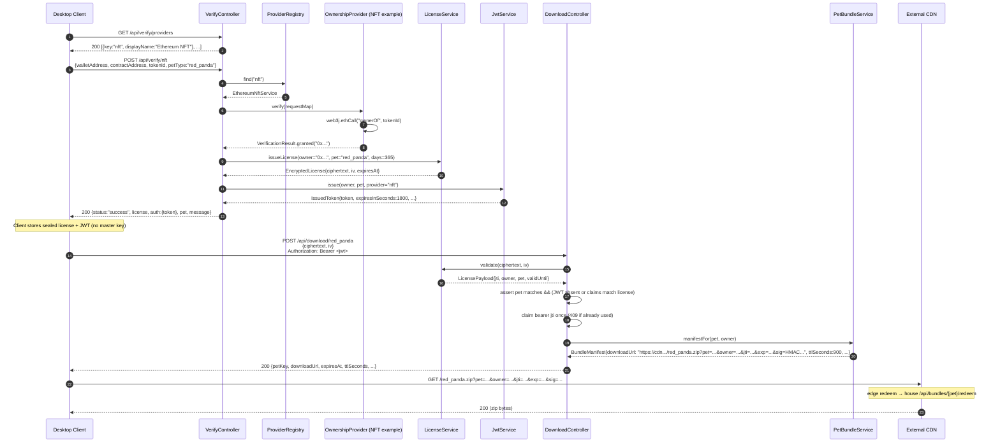
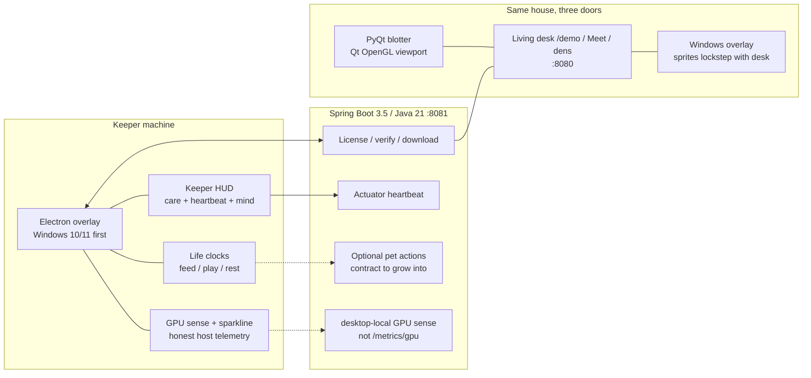

# EnterprisePet Backend — System Architecture Document

← [Back to Documentation Index](README.md)

> **Living Document**  
> This document reflects the *current* architecture of the EnterprisePet Backend.  
> It is intended to evolve together with the codebase. Please keep it up to date when the architecture changes.

| Field            | Value                                      |
|------------------|--------------------------------------------|
| **Last Updated** | 2026-09-26 (The Windows overlay follows you across virtual desktops. A helper asks about the overlay's own HWND only; the main process re-shows its own window. Tray checkbox, `vdesk.json`. ADR 0131. Not DX12/Vulkan. Catalog 221.) |
| **Version**      | 1.3                                        |
| **Status**       | Active — Maintained                        |
| **Related**      | [docs/README.md](README.md) (documentation index), [docs/adr/](adr/README.md) (decisions already true on `main`) |

---

## Document Maintenance

Contributors making significant architectural changes (new major components, changes to the provider SPI, deployment model, security boundaries, data flows, technology stack, or cross-cutting concerns) are responsible for updating this document.

### How to Update This Document

1. **Identify impact** — Determine which sections are affected (High-Level Architecture, Deployment Architecture, Component Breakdown, Data Flow diagrams, Technology Stack, etc.).
2. **Update content & diagrams** — Revise text and Mermaid diagrams so they accurately describe the new state.
3. **Refresh the "Last Updated" date** at the top of this file.
4. **Update the Table of Contents** below if new top-level sections or important subsections are added.
5. **Cross-link** — Consider whether `README.md`, `docs/SETUP.md`, `AUDIT.md`, or code comments also need updates.
6. **Review** — Include documentation changes in your pull request and request a review of the architecture docs alongside the code.

Keeping this document accurate reduces onboarding friction and prevents architectural drift.

---

## Table of Contents

- [1. Executive Summary](#1-executive-summary)
- [2. High-Level Architecture](#2-high-level-architecture)
- [3. Deployment Architecture](#3-deployment-architecture)
- [4. Component Breakdown](#4-component-breakdown)
- [5. Data Flow & Interactions](#5-data-flow--interactions)
- [6. Technology Stack & Rationale](#6-technology-stack--rationale)
- [7. Project Structure](#7-project-structure)
- [8. Key Design Decisions & Tradeoffs](#8-key-design-decisions--tradeoffs)
- [9. Scalability, Security & Extensibility Considerations](#9-scalability-security--extensibility-considerations)
- [10. Recommendations & Next Steps](#10-recommendations--next-steps)
- [11. House polish north-star (the X ads)](#11-house-polish-north-star-the-x-ads)
- [Appendix: Glossary of Key Artifacts](#appendix-glossary-of-key-artifacts)

---

## 1. Executive Summary

EnterprisePet Backend is a secure, stateless Spring Boot 3.5 Java 21 REST service that serves as the trust anchor for a premium "desktop pets" digital collectibles platform. It enables users to prove ownership of entitlements across heterogeneous platforms (Steam game ownership, Ethereum ERC-721 NFTs, Microsoft Store products, itch.io download-key receipts, and Epic Games Store catalog items) and, in return, receive cryptographically sealed time-limited licenses plus short-lived JWTs that authorize the download of platform-specific pet asset bundles from an external CDN.

The architecture deliberately keeps the master AES-256-GCM encryption key and signing material server-side only. The desktop client (out of scope for this repository; referenced as a future PyQt6/Python application) never holds long-term secrets and cannot forge valid licenses. A clean plugin SPI (`OwnershipProvider`) allows new storefronts or wallet types to be added with a single `@Service` class and no changes to controllers or security configuration. Rate limiting, defense-in-depth validation on download, and startup-time secret validation are first-class concerns.

The system is currently a modular monolith with scaffolding for persistence (JPA + Postgres) but no entities or repositories yet; all core flows are stateless and crypto-backed.

---

## 2. High-Level Architecture

### Overall Architecture Style
- **Modular monolith** with a strong **plugin / SPI layer** for extensibility.
- **Layered architecture**: 
  - Presentation (thin `@RestController`s)
  - Application / orchestration (controllers + services)
  - Domain / core services (`LicenseService`, `PetBundleService`, `JwtService`)
  - Infrastructure / pluggable providers (Steam, NFT, Microsoft, Itch, Epic)
  - Cross-cutting concerns (security filter chain, rate limiting, exception mapping)
- **Stateless** by design: no HTTP sessions, no server-side conversation state. Entitlement is proven via sealed artifacts (encrypted license + JWT claims).
- **Client-server** with an untrusted or semi-trusted client (desktop app) that holds opaque tokens only.

### Key Components and Interactions
- **Client** (external desktop application) initiates all flows.
- **ProviderRegistry** discovers `OwnershipProvider` beans at startup and routes `/api/verify/{key}` calls.
- **LicenseService** is the cryptographic source of truth for entitlements (AES-GCM).
- **JwtService + JwtAuthenticationFilter** protect the download phase only.
- **MachineRequestSignatureFilter** requires HMAC-SHA256 on writes to `/api/verify` (300s skew, `LICENSE_SECRET_KEY`; [0070](adr/0070-machine-request-signature.md)). The nonce is single-use for that window ([0072](adr/0072-signed-request-nonce.md)). Download stays the license JWT. Redeem stays the URL HMAC.
- **PetBundleService** authorizes access to external storage without serving bytes itself. A config-driven `bundle.catalog` may attach version, platform, and sha256 to the signed manifest; empty catalog keeps today's URL-only contract. Published zips follow `computerpets.bundle/v1` (`BundleZipContract`); clients fail closed on bad/missing catalog digest (ADR 0060).
- External dependencies are called synchronously during verification (Web3 RPC, Microsoft Collections API, Steam Web API, itch.io API, and EOS Auth + Ecom).

```mermaid
graph TD
    subgraph "External Clients"
        DC[Desktop Client<br/>PyQt6 / Python]
    end

    subgraph "EnterprisePet Backend (Spring Boot)"
        API[REST API Layer<br/>VerifyController, DownloadController, PetController]
        REG[ProviderRegistry]
        PROV[OwnershipProvider SPI]
        LS[LicenseService<br/>AES-256-GCM]
        JS[JwtService + Filter]
        BS[PetBundleService<br/>HMAC-SHA256]
        CAT[PetCatalog<br/>static enum]
        RL[RateLimitingFilter<br/>Bucket4j + Redis]
        SEC[SecurityConfig<br/>stateless JWT]
        EX[GlobalExceptionHandler<br/>RFC 7807]
    end

    subgraph "Pluggable Providers"
        S[SteamService<br/>(real API)]
        N[EthereumNftService<br/>web3j]
        M[MicrosoftStoreService<br/>RestClient + dev-mode]
        I[ItchService<br/>download-key receipt]
        E[EpicService<br/>OAuth + Ecom v3]
    end

    subgraph "External Systems"
        STEAM[Steam Web API]
        ETH[Alchemy / Infura<br/>Ethereum RPC]
        MS[Microsoft Collections API]
        ITCH[itch.io API<br/>api.itch.io]
        EPIC[EOS Auth + Ecom<br/>api.epicgames.dev]
        CDN[(CDN / S3 / R2<br/>Pet .zip bundles)]
    end

    subgraph "Future / Scaffolding"
        DB[(PostgreSQL<br/>JPA entities<br/>for revocation/audit)]
    end

    DC -->|GET /api/verify/providers<br/>GET /api/pets| API
    DC -->|POST /api/verify/{provider}<br/>{platform creds + petType}| API
    API --> REG
    REG --> PROV
    PROV --> S
    PROV --> N
    PROV --> M
    PROV --> I
    PROV --> E
    N -->|ownerOf eth_call| ETH
    M -->|XBL3.0 / Bearer publisherQuery v9| MS
    S -->|GetOwnedGames| STEAM
    I -->|download_keys| ITCH
    E -->|client_credentials + ownership| EPIC

    API --> LS
    API --> JS
    LS -->|issue + validate| DB

    DC -->|POST /api/download/{pet}<br/>{cipher,iv} + Bearer JWT| API
    API --> SEC
    API --> RL
    API --> LS
    API --> BS
    BS -->|signed short-lived URL| CDN

    API --> EX
```

The diagram shows the plugin boundary clearly: adding a new platform (Gumroad, Solana, etc.) requires only a new class implementing `OwnershipProvider` annotated `@Service`.

---

## 3. Deployment Architecture

### Current Deployment Model
The service runs as a Spring Boot executable JAR or the multi-stage `Dockerfile` image:

- One JVM process listening on port 8081 (configurable via `server.port`). The living desk keeps 8080. `server.ssl` stays off. Public TLS terminates at `deploy/k8s/ingress-tls.yaml` or the ALB HTTPS listener. Local and the in-cluster Service stay HTTP. `prod` refuses a JVM keystore, and refuses a cleartext public origin when `API_LISTENER_TLS_REQUIRED` is set ([0077](adr/0077-api-listener-tls.md)).
- Spring profiles (`dev` / `staging` / `prod`) overlay the same `application.yml` keys. Default and `dev` keep H2 unless `SPRING_DATASOURCE_*` is set (`docker-compose.yml` already points `dev` at Postgres). `staging` and `prod` require Postgres and have no H2 fallback. HikariCP defaults are explicit (pool 10 / idle 2 / 3s connect / leak detection off locally, 60s in staging/prod). Optional `SPRING_DATASOURCE_REPLICA_URL` enables read-only routing for Spring Data reads; blank keeps a single primary pool ([0059](adr/0059-hikari-pool-and-read-replica.md)). Managed RDS JDBC URLs use `sslmode=require` (or `verify-full` when a CA path is set) and the parameter group sets `rds.force_ssl=1`. `prod` refuses a half-set TLS pair. Local and in-cluster Postgres stay cleartext ([0076](adr/0076-postgres-transit-tls.md)).
- Redis-backed Bucket4j rate limiter (Lettuce / `bucket4j-redis`) shared across replicas. If Redis is down, verify, download, discovery, and bundle-catalog reads fail closed with HTTP 503. `prod` refuses `RATE_LIMIT_BACKEND=memory`. Redis uses a single Lettuce connection keyed by `REDIS_TIMEOUT` (not a second Hikari-style pool). Optional `REDIS_PASSWORD` / `REDIS_PASSWORD_FILE` and `REDIS_SSL` (default off). `prod` refuses a half-set AUTH trio ([0075](adr/0075-redis-auth-and-transit-tls.md)). Signed `GET /api/bundles/{pet}/redeem` is not on the catalog bucket ([0069](adr/0069-bundle-catalog-rate-limit.md)).
- Redis-backed jti deny-list (`RevocationIndex`) shared across replicas. Postgres `IssuedLicense.revokedAt` / `deletedAt` remains the ledger (soft-delete on revoke; [0058](adr/0058-license-soft-delete-and-audit.md)); Redis is a fast deny so a replica that has not seen the row still rejects. If Redis is down, `LicenseService.validate` falls back to the ledger (it does not accept a revoked or soft-deleted license). HTTP download may still 503 from the rate-limit filter.
- Redis-backed single-use nonces for signed admin and machine requests (`replay:nonce:{admin|machine}:{nonce}`, TTL 300s, `SET NX`). Redis down fails closed with HTTP 503. Not the jti deny-list and not a download grant ([0072](adr/0072-signed-request-nonce.md)).
- Redis-backed single-use download JWTs (`download:jwt:{jti}`, TTL `jwt.ttl-minutes` + 60s, `SET NX`). A second mint is HTTP 409. Redis down fails closed with HTTP 503. Not the nonce store and not `download:grant:*` ([0073](adr/0073-download-jwt-single-use.md)).
- Critical secrets (`LICENSE_SECRET_KEY`, `JWT_SECRET_KEY`, `BUNDLE_SIGNING_KEY`, `ADMIN_API_KEY`) load from environment variables or `NAME_FILE` mounts (`SecretFileEnvironmentPostProcessor`) with strict `@PostConstruct` startup validation that refuses to run on missing or placeholder values. Production operators use Docker secrets, Kubernetes External Secrets, or Vault agent templates — [ADR 0056](adr/0056-house-secrets-from-file-mounts.md). Optional `*_PREVIOUS` dual-key material keeps verify/decrypt alive during a scheduled rotation ([ADR 0065](adr/0065-secret-rotation-cadence-and-hsm.md)). Secret values are never logged.
- `ProductionProfileGuard` (`@Profile("prod")`) refuses Microsoft Store `dev-mode`, an in-memory rate-limit store, an H2 JDBC URL, a misconfigured read-replica URL (same as primary / non-Postgres), a half-configured Postgres TLS pair ([0076](adr/0076-postgres-transit-tls.md)), a JVM keystore, a cleartext public API origin when `API_LISTENER_TLS_REQUIRED` is set ([0077](adr/0077-api-listener-tls.md)), and **plain env / hand-filled Opaque Secret** unless `COMPUTERPETS_SECRETS_SOURCE` is `external-secrets`, `file`, or `vault-agent` ([ADR 0064](adr/0064-secret-operator-prod-refuses-plain-env.md)). Optional `COMPUTERPETS_KEYS_ROTATED_AT` stamps older than 400 days refuse when set ([ADR 0065](adr/0065-secret-rotation-cadence-and-hsm.md)). Local scaffolding may set `COMPUTERPETS_ALLOW_PLAIN_SECRET=1` (never on the real prod path).
- `Dockerfile` + GitHub Actions GHCR publish with keyless cosign (Sigstore) + `deploy/k8s/` (Deployment/Service, in-cluster Postgres/Redis scaffolding, optional Ingress). Prod deploy verifies the image digest or refuses ([0061](adr/0061-ghcr-image-signing.md)). Blue/green is two Deployments and a Service `color` selector — not a service mesh. Prod API replica count is `hpa.yaml` (min 3, max 3, not in the kustomization) ([0108](adr/0108-api-single-zone-hostname-ceiling.md)). Local apply stays blue 2 / green 0. Resource metrics for that autoscaler are `deploy/k8s/metrics-server.yaml` (upstream high-availability-1.21+.yaml v0.9.0, replicas 2, required hostname anti-affinity, hard zone spread on `topology.kubernetes.io/zone` (`DoNotSchedule`, `maxSkew` 1; one labeled zone still schedules), `nodeSelector` `computerpets/node-pool=api` with `nodeAffinityPolicy: Honor`, kubelet CA mount of `metrics-server-kubelet-ca` written only after each supplied kubelet leaf chains to that CA and the leaf SAN covers the dial address (`InternalIP`, then `ExternalIP`, then `Hostname`) and the non-zero `kubeletEndpoint.port` is the kubelet listen port metrics-server dials (otherwise 10250), serving cert that chains to `caBundle` with DNS SAN `metrics-server.kube-system.svc`, not in the kustomization) ([0084](adr/0084-metrics-server.md), [0085](adr/0085-metrics-server-ha.md), [0086](adr/0086-metrics-server-kubelet-ca.md), [0087](adr/0087-metrics-server-serving-cert.md), [0088](adr/0088-metrics-server-zone-spread.md), [0089](adr/0089-metrics-server-node-pool.md), [0098](adr/0098-metrics-server-zone-hard-spread.md), [0111](adr/0111-metrics-server-serving-cert-chain.md), [0112](adr/0112-metrics-server-kubelet-ca-chain.md), [0113](adr/0113-metrics-server-kubelet-san.md), [0114](adr/0114-metrics-server-kubelet-port.md)). Voluntary disruption of that live color keeps 2 pods (`pdb.yaml`, also not in the kustomization) ([0079](adr/0079-pod-disruption-budget.md)). Each API color hard-spreads hostnames (`topologySpreadConstraints`, `DoNotSchedule` on `kubernetes.io/hostname`, `maxSkew` 1; one hostname still schedules; the second local replica is not left Pending) ([0080](adr/0080-api-pod-topology-spread.md), [0100](adr/0100-api-hostname-hard-spread.md)) and hard-spreads zones (`DoNotSchedule` on `topology.kubernetes.io/zone`; one labeled zone still schedules) ([0081](adr/0081-api-pod-zone-spread.md), [0095](adr/0095-api-zone-hard-spread.md)). Both colors `nodeSelector` `kubernetes.io/os: linux` and `computerpets/node-pool: api`, and both spread items set `nodeAffinityPolicy: Honor`. Kind and minikube apply that pin; API pods stay Pending until a node carries the pool label ([0093](adr/0093-api-node-pool.md)). Private API workers are one EKS managed node group per availability zone, at least two, with no public IP and no SSH. The cluster and subnets stay keeper-owned. EKS sets `topology.kubernetes.io/zone` from the instance AZ ([0082](adr/0082-multi-az-node-pool.md)). Cluster Autoscaler grows those groups when pods are Pending. Each group's max is 20 ([0104](adr/0104-per-zone-node-max.md)). The HPA ceiling is 6, so six healthy hostnames hold it at one pod each ([0107](adr/0107-api-hostname-ceiling.md)). Terraform ignores `desired_size` after create. The Deployment is two replicas with required hostname anti-affinity, hard zone spread (`DoNotSchedule` on `topology.kubernetes.io/zone`, `maxSkew` 1; one labeled zone still schedules), and leader election on the leases lock. `nodeSelector` requires `kubernetes.io/os: linux` and `computerpets/node-pool: api`. Voluntary disruption keeps one of those pods (`minAvailable: 1`). The manifest is not in the kustomization, and `enable_node_pool=false` keeps it off for kind/minikube. The running leader scales the underfilled zone; the standby is not the scaler ([0083](adr/0083-cluster-autoscaler.md), [0090](adr/0090-cluster-autoscaler-ha.md), [0091](adr/0091-cluster-autoscaler-node-pool.md), [0092](adr/0092-cluster-autoscaler-pdb.md), [0099](adr/0099-cluster-autoscaler-zone-hard-spread.md), [0101](adr/0101-cluster-autoscaler-leader-scale.md)).
- External dependencies (Alchemy, Microsoft Collections, Steam Web API, itch.io, Epic, future CDN) are called directly; Resilience4j circuit breakers, retries, and a shared ownership time limiter wrap the store providers.
- The living desk (`web/`) and Electron overlay (`desktop/`) talk to this backend.

### Recommended Production Topology
For any non-trivial user base or multi-region deployment, the following production architecture is strongly recommended:

- **Stateless horizontally scaled backend replicas** (Kubernetes `Deployment` or equivalent container orchestration) sitting behind a load balancer / ingress controller that terminates TLS. The Java application is already fully stateless with respect to HTTP sessions.
- **PostgreSQL** (managed service or self-hosted with HA) as the durable store for issued licenses (`jti`, owner, pet, timestamps, revocation status) once the JPA layer is implemented. This enables revocation, audit, and "licenses per owner" policies.
- **Redis** (or Redis-compatible store) for:
  - Distributed token-bucket rate limits (`bucket4j-redis` or equivalent).
  - Shared jti deny-list (`revoked:jti:{jti}`, TTL ≥ remaining license life + 1h skew) so a revoked license is rejected immediately across all replicas. Postgres remains the ledger.
  - Optional AUTH and transit TLS on that same Lettuce client when the node requires them (`REDIS_PASSWORD`, `REDIS_SSL`, `REDIS_AUTH_REQUIRED`). Local and in-cluster Redis stay AUTH-less ([0075](adr/0075-redis-auth-and-transit-tls.md)).
  - Optional short-TTL caching of expensive external provider responses (e.g., recent NFT ownership checks).
  - **External secret management** (HashiCorp Vault, AWS Secrets Manager, Azure Key Vault, or Kubernetes `ExternalSecrets` operator) instead of plain environment variables for the long-lived cryptographic keys. The house contract is `NAME_FILE` mounts or External Secrets / Vault sync into Opaque Secret `computerpets-secrets` ([ADR 0056](adr/0056-house-secrets-from-file-mounts.md)); prod refuses plain env without operator attestation ([ADR 0064](adr/0064-secret-operator-prod-refuses-plain-env.md)). Rotate on the documented cadence with dual-key `*_PREVIOUS` windows ([ADR 0065](adr/0065-secret-rotation-cadence-and-hsm.md)). Secrets never appear in logs or committed specs. Local-dev may still use env / `.env`.
- **CDN / Object Storage** (Amazon CloudFront + S3, Cloudflare R2, Google Cloud CDN, etc.) as the authoritative source for the actual pet `.zip` bundles. The backend only generates short-lived HMAC-signed URLs; it never serves the binary assets itself.
- **Health/readiness/liveness probes** exposed via Spring Boot Actuator (`/actuator/health`, `/actuator/health/readiness`) so the orchestrator can safely perform rolling updates and drain traffic.
- Regional AWS WAF on the API application load balancer, in front of the JVM rate limiter. Default action is block. The four rate rules match `RateLimitingFilter` (verify 10/min, download 30/min, discovery 60/min, bundles 60/min; signed redeem excluded). Plan refuses an empty ALB ARN ([0074](adr/0074-waf-in-front-of-rate-limiter.md)). The bundle CloudFront distribution is not that gate.

The backend service itself remains a relatively low-QPS control plane. The heavy lifting (storage + bandwidth for pet assets) is entirely offloaded to the CDN tier.

### Deployment Diagram

```mermaid
flowchart TB
    subgraph "Client Tier"
        DC[Desktop Clients<br/>PyQt6 / Python<br/>or future Web UI]
    end

    subgraph "Edge &amp; Delivery Layer"
        CDN[(Pet Bundle CDN<br/>S3 / R2 / CloudFront<br/>+ HMAC signature verification)]
        WAF[WAF / API Gateway<br/>(Cloudflare, AWS WAF, etc.)]
    end

    subgraph "Kubernetes / Container Platform"
        LB[Load Balancer / Ingress<br/>nginx, Traefik, ALB, etc.<br/>TLS termination + routing]

        subgraph "Backend Deployment (3+ replicas, HPA, PDB minAvailable 2, soft hostname and zone spread)"
            App1[EnterprisePet Pod<br/>Spring Boot 3.5 + Java 21<br/>Stateless]
            App2[EnterprisePet Pod<br/>Spring Boot 3.5 + Java 21<br/>Stateless]
            AppN[EnterprisePet Pod<br/>Spring Boot 3.5 + Java 21<br/>Stateless]
        end

        Redis[(Redis<br/>Distributed rate limits<br/>+ jti revocation cache)]
        Postgres[(PostgreSQL<br/>IssuedLicense table<br/>Revocation list<br/>Audit log)]
    end

    subgraph "External Trust Sources"
        ETH[Alchemy / Infura<br/>Ethereum RPC]
        MS[Microsoft Collections API<br/>collections.mp.microsoft.com]
        STEAM[Steam Web API<br/>api.steampowered.com]
    end

    subgraph "Secret Management &amp; Observability"
        Secrets[Vault / AWS Secrets Manager<br/>/ K8s ExternalSecrets]
        MON[Prometheus + Grafana<br/>or cloud equivalent]
        TRACE[OTLP collector<br/>Tempo / Jaeger / Grafana]
        LOGS[Centralized Logging<br/>Loki / ELK / CloudWatch Logs]
    end

    DC -->|HTTPS + JWT / license| WAF
    WAF --> LB
    LB --> App1 & App2 & AppN

    App1 & App2 & AppN -->|JPA / JDBC| Postgres
    App1 & App2 & AppN -->|Bucket4j + Lettuce + jti deny-list| Redis
    App1 & App2 & AppN -->|ownerOf, publisherQuery v9, GetOwnedGames| ETH & MS & STEAM
    App1 & App2 & AppN -. "init + periodic rotation" .-> Secrets

    App1 & App2 & AppN -->|generate signed 15-min URLs| CDN
    DC -->|direct high-bandwidth download| CDN

    App1 & App2 & AppN --> MON & TRACE & LOGS
    Postgres & Redis --> MON
```

### Key Deployment Characteristics & Gaps
- **Scalability** — Backend replicas scale independently of storage. The CDN tier absorbs virtually all download traffic. Rate-limit buckets are shared in Redis; issued licenses live in Postgres.
- **Resilience & Zero-Downtime** — Multiple replicas + readiness probes + external durable stores allow rolling updates without losing the ability to validate existing licenses (they are cryptographically self-contained). Voluntary disruption of the live API color keeps at least 2 pods (`pdb.yaml`, not in the kustomization) ([0079](adr/0079-pod-disruption-budget.md)). Pods of each API color hard-spread hostnames (`DoNotSchedule` on `kubernetes.io/hostname`, `maxSkew` 1; one hostname still schedules) ([0080](adr/0080-api-pod-topology-spread.md), [0100](adr/0100-api-hostname-hard-spread.md)) and hard-spread zones (`DoNotSchedule` on `topology.kubernetes.io/zone`; one labeled zone still schedules) ([0081](adr/0081-api-pod-zone-spread.md), [0095](adr/0095-api-zone-hard-spread.md)). One Ready zone at min_size 3 is three API hostnames, so the HPA floor of 3 is 1 and 1 and 1 ([0106](adr/0106-api-single-zone-hostname-floor.md)). The HPA ceiling is 3, so one Ready zone holds it at one pod per hostname ([0108](adr/0108-api-single-zone-hostname-ceiling.md)). A node crash or a zone failure is not a voluntary disruption. Private workers in at least two zones are the node pool ([0082](adr/0082-multi-az-node-pool.md)). Create-time desired size is 3 per zone and Terraform ignores it afterwards, so the leader still grows a zone above that floor. metrics-server keeps required hostname anti-affinity and hard-spreads zones (`DoNotSchedule` on `topology.kubernetes.io/zone`, `maxSkew` 1) ([0098](adr/0098-metrics-server-zone-hard-spread.md)), and schedules only onto nodes labeled `computerpets/node-pool=api` ([0089](adr/0089-metrics-server-node-pool.md)). On two labeled zones the two replicas cannot share one zone. One labeled zone still schedules both pods when two hostnames exist. Cluster Autoscaler runs two replicas with required hostname anti-affinity and hard zone spread (`DoNotSchedule` on `topology.kubernetes.io/zone`, `maxSkew` 1; one labeled zone still schedules), and schedules only onto nodes labeled `computerpets/node-pool=api`. Only the leader changes desired capacity. The Pending standby is not the scaler. `--balance-similar-node-groups=true` and `--expander=least-waste` keep that scale-up on the underfilled zone's group ([0101](adr/0101-cluster-autoscaler-leader-scale.md)). `--salvo-scale-up=true` with `--salvo-scale-up-budget=1m` runs another choice in that same loop for pods the first option did not place, and `--frequent-loops-enabled=true` stays ([0102](adr/0102-cluster-autoscaler-scale-up-salvo.md)). The `1m` budget stays. Node-provision time and node-group backoff stay at the v1.36.1 defaults. A budget that is already gone, a failed snapshot update, or a scale-up that is not successful still ends that salvo, and the next main loop is the retry ([0103](adr/0103-cluster-autoscaler-salvo-early-stop.md)). Voluntary disruption keeps one pod (`minAvailable: 1`) ([0090](adr/0090-cluster-autoscaler-ha.md), [0091](adr/0091-cluster-autoscaler-node-pool.md), [0092](adr/0092-cluster-autoscaler-pdb.md), [0099](adr/0099-cluster-autoscaler-zone-hard-spread.md), [0101](adr/0101-cluster-autoscaler-leader-scale.md)).
- **Security Boundaries** — Only the backend pods ever receive the master AES key and signing keys. The CDN, load balancers, and clients never see them.
- **Current Gaps** (must be closed before production):
  - ~~No `Dockerfile` or multi-stage build.~~
  - ~~No Kubernetes manifests, Helm chart, or Kustomize overlays.~~ Manifests in `deploy/k8s/` (not Helm). In-cluster Postgres/Redis are compose-equivalent scaffolding, not a managed HA pair.
  - ~~CI publishes the image to GHCR; image signing is still open.~~ Keyless cosign on every `main` GHCR publish; `deploy/k8s/verify-image-signature.sh` fail-closed verify for prod digests ([0061](adr/0061-ghcr-image-signing.md)).
  - ~~Actuator is not enabled.~~ Probes are `/actuator/health/liveness` and `/readiness` (permitted without a JWT).
  - ~~No Terraform/Pulumi/Crossplane definitions for the surrounding infrastructure (managed Postgres, Redis, secrets, CDN, WAF).~~ Terraform root in `deploy/terraform/` for managed Postgres, Redis, Secrets Manager shells (External Secrets contract), CDN, and WAF ([0062](adr/0062-terraform-managed-stores.md)). Pulumi / Crossplane remain non-goals. A live cloud apply is still the keeper's account.
  - ~~WAF ACL was an unassociated stub (default allow, one 2000/5-minute rule).~~ Regional ACL on the API ALB, default block, buckets match the JVM filter, plan refuses an empty ALB ARN ([0074](adr/0074-waf-in-front-of-rate-limiter.md)).
  - ~~Redis AUTH and transit TLS were off because the app only read host, port, and timeout.~~ Optional `REDIS_PASSWORD` / `REDIS_PASSWORD_FILE` and `REDIS_SSL`. Prod fails closed when AUTH is required and the password or TLS flag is missing. ElastiCache enables AUTH and transit encryption only when `redis_auth_token` is set ([0075](adr/0075-redis-auth-and-transit-tls.md)).
  - ~~Postgres JDBC had no `sslmode`, and the RDS module did not set `rds.force_ssl`.~~ Managed `jdbc_url` uses `sslmode=require`, or `verify-full` when `postgres_ssl_root_cert` is set. The parameter group sets `rds.force_ssl=1`. Prod refuses a half-configured pair. In-cluster Postgres stays cleartext ([0076](adr/0076-postgres-transit-tls.md)).
  - ~~The optional API Ingress (`deploy/k8s/ingress.yaml`) has no `tls` block. The JVM listens on 8081 without `server.ssl`. This root does not create an ACM certificate or an HTTPS listener.~~ Public TLS terminates at `ingress-tls.yaml` (cert-manager annotation, HTTP redirect, pod stays HTTP) or at an ALB HTTPS listener on the same keeper-owned ALB as the WAF. Port 80 redirects. Plan refuses an empty ACM ARN. This root does not call ACM. `server.ssl` stays off. Local and in-cluster stay HTTP ([0077](adr/0077-api-listener-tls.md)).
  - ~~The deployment diagram says 3+ replicas with HPA. `deploy/k8s/deployment-blue.yaml` is a fixed `replicas: 2`. There is no `HorizontalPodAutoscaler`.~~ Prod API autoscaler is `deploy/k8s/hpa.yaml` (min 3, max 3, CPU 70% of the `250m` request, memory at an absolute `800Mi`). It targets `computerpets-blue` and is not in the kustomization, so local apply stays at 2. Green stays at 0. The ceiling of 6 is [0108](adr/0108-api-single-zone-hostname-ceiling.md) ([0078](adr/0078-horizontal-pod-autoscaling.md)).
  - ~~A node drain can still evict every API pod. `minReplicas: 3` is not a disruption budget. There is no `PodDisruptionBudget`.~~ Prod budget is `deploy/k8s/pdb.yaml` (`policy/v1`, `minAvailable: 2`, selector `app=computerpets,color=blue`). It is not in the kustomization. Apply it only after the HPA floor is actually running. Cutover patches the selector onto the live color with the HPA ([0079](adr/0079-pod-disruption-budget.md)).
  - ~~Pods are not spread across nodes. There is no topology spread and no pod anti-affinity. If every live API pod sits on one node, the budget blocks a drain of that node, and a crash of that node is involuntary.~~ Both API Deployments set `topologySpreadConstraints` on `kubernetes.io/hostname` (`maxSkew: 1`, `whenUnsatisfiable: ScheduleAnyway`, `nodeTaintsPolicy: Honor`, selector scoped to that color). `DoNotSchedule` is not used, so a pod still binds when the skew cannot be met and the HPA floor is not left Pending. Required hostname anti-affinity is not used. Local replica counts stay blue 2 / green 0 ([0080](adr/0080-api-pod-topology-spread.md)).
  - ~~Soft hostname spread does not place pods in different availability zones. There is no `topology.kubernetes.io/zone` constraint. A node pool that meets `maxSkew: 1` can still sit in one zone, and a zone outage is involuntary.~~ Both API Deployments add a second `topologySpreadConstraints` item on `topology.kubernetes.io/zone` (`maxSkew: 1`, `ScheduleAnyway`, `nodeTaintsPolicy: Honor`, selector scoped to that color). `DoNotSchedule` is not used, so a single-zone cluster and nodes that omit the zone label still schedule. Prod is expected to run workers in at least two availability zones. This repo does not provision that pool ([0081](adr/0081-api-pod-zone-spread.md)).
  - ~~Soft zone spread does not create a second zone. This repo ships no cluster and no node pool, so every node can still carry one `topology.kubernetes.io/zone` value, or none.~~ Private API workers are one EKS managed node group per availability zone (`node_pool_subnets`, at least two). `min_size` is 3 per zone ([0106](adr/0106-api-single-zone-hostname-floor.md)). No public IP. No SSH. Plan refuses a single zone or an empty cluster name. This root does not create the EKS cluster or the subnets. EKS sets `topology.kubernetes.io/zone` from the instance AZ. Local apply is unchanged (`enable_node_pool=false` for kind/minikube) ([0082](adr/0082-multi-az-node-pool.md)).
  - ~~Node groups stay at one on-demand worker per zone. Nothing in this repo scales them when `hpa.yaml` asks for more pods, so the ceiling of 10 can sit Pending.~~ Cluster Autoscaler scales the per-zone managed node groups. `max_size` is 20 per zone ([0104](adr/0104-per-zone-node-max.md)). The HPA ceiling is 3 ([0108](adr/0108-api-single-zone-hostname-ceiling.md)). Create-time `desired_size` is 3, the per-zone floor ([0106](adr/0106-api-single-zone-hostname-floor.md)), and Terraform ignores it afterwards. The IRSA role trusts only `kube-system/cluster-autoscaler`. The manifest is not in the kustomization. `enable_node_pool=false` keeps the role off for kind/minikube ([0083](adr/0083-cluster-autoscaler.md)).
  - ~~`hpa.yaml` still does not raise replicas until `metrics.k8s.io` answers, and this repo does not install metrics-server.~~ The install path is `deploy/k8s/metrics-server.yaml` (upstream v0.9.0, APIService `v1beta1.metrics.k8s.io`). It is not in the kustomization. Apply it before `hpa.yaml`. Kubelet scrapes stay verified (`--kubelet-insecure-tls` is not set). The Deployment is the high-availability asset: replicas 2 and required hostname anti-affinity ([0084](adr/0084-metrics-server.md), [0085](adr/0085-metrics-server-ha.md)). Local apply stays blue 2 / green 0.
  - ~~That addon is one pod. Upstream `high-availability-1.21+.yaml` (replicas 2, pod anti-affinity) is not vendored. If the one pod is not Ready, `metrics.k8s.io` stops answering and the HPA does not raise replicas.~~ The vendored file is upstream `high-availability-1.21+.yaml` v0.9.0: `replicas: 2`, required pod anti-affinity on `kubernetes.io/hostname`, rolling update `maxUnavailable: 1`, and an addon `PodDisruptionBudget` with `minAvailable: 1` in `kube-system`. It is not in the kustomization. Kind and minikube do not apply it. The API budget in `pdb.yaml` is unchanged ([0085](adr/0085-metrics-server-ha.md)).
  - ~~A kubelet certificate this addon does not trust still leaves `kubectl top` empty, because the file does not mount a kubelet CA.~~ The Deployment sets `--kubelet-certificate-authority=/etc/metrics-server/kubelet-ca/ca.crt` on a read-only mount of operator ConfigMap or Secret `metrics-server-kubelet-ca` (key `ca.crt`, `optional: false`). `--kubelet-insecure-tls` stays unset. This repo does not vendor the CA. Apply writes that ConfigMap only after every supplied kubelet leaf chains to it ([0112](adr/0112-metrics-server-kubelet-ca-chain.md)) ([0086](adr/0086-metrics-server-kubelet-ca.md)).
  - ~~The APIService still uses upstream `insecureSkipTLSVerify: true` for the addon's own serving cert minted in `/tmp`.~~ The Deployment sets `--tls-cert-file` and `--tls-private-key-file` on a read-only mount of Secret `metrics-server-serving` (keys `tls.crt` and `tls.key`, `optional: false`). `insecureSkipTLSVerify` is unset. This repo does not vendor the certificate or the key. The apiserver verifies the serving cert. A private CA is keeper-set `caBundle`, not a committed PEM ([0087](adr/0087-metrics-server-serving-cert.md)).
  - ~~Required anti-affinity is hostname-only, so both metrics-server pods can still land in one zone.~~ The same Deployment adds `topologySpreadConstraints` on `topology.kubernetes.io/zone` (`maxSkew: 1`, `ScheduleAnyway`, `nodeTaintsPolicy: Honor`, selector `k8s-app=metrics-server`). Required hostname anti-affinity stays. `DoNotSchedule` is not used, so a single-zone cluster and nodes that omit the zone label still schedule. The file stays out of the kustomization ([0088](adr/0088-metrics-server-zone-spread.md)).
  - ~~`nodeSelector` was only `kubernetes.io/os: linux`, so both metrics-server pods could schedule onto linux nodes outside the multi-AZ API groups, and soft zone spread counted those nodes.~~ The Deployment `nodeSelector` also requires `computerpets/node-pool: api`, the label the node pool already sets. `nodeAffinityPolicy: Honor` keeps the zone count on those nodes. Required hostname anti-affinity and `ScheduleAnyway` on the zone key stay. Kind and minikube do not apply the file. A single-zone set of labeled nodes still schedules both pods when two hostnames exist. The API pin is [0093](adr/0093-api-node-pool.md) ([0089](adr/0089-metrics-server-node-pool.md)).
  - ~~Cluster Autoscaler is one replica with no anti-affinity. A dead replica stops Pending pods from getting nodes until that pod is back.~~ The Deployment sets `replicas: 2`, required pod anti-affinity on `kubernetes.io/hostname`, and preferred pod anti-affinity on `topology.kubernetes.io/zone` (weight 100). Leader election stays on (`--leader-elect=true`, lock `leases`, name `cluster-autoscaler`). Rolling update is `maxUnavailable: 1` and `maxSurge: 0`. Both pods share the one IRSA service account. The manifest stays out of the kustomization ([0090](adr/0090-cluster-autoscaler-ha.md)).
  - ~~Those pods were not pinned to `computerpets/node-pool=api`, so required hostname anti-affinity could be met by nodes outside the groups this scaler manages.~~ The Deployment `nodeSelector` requires `kubernetes.io/os: linux` and `computerpets/node-pool: api`. Required hostname anti-affinity and leader election stay. Zone spread is [0099](adr/0099-cluster-autoscaler-zone-hard-spread.md). Kind and minikube do not apply the file. A single-zone set of labeled nodes still schedules both pods when two hostnames exist. The API pin is [0093](adr/0093-api-node-pool.md) ([0091](adr/0091-cluster-autoscaler-node-pool.md)).
  - ~~There is no PodDisruptionBudget on this Deployment. A drain of the leader's node drops that pod. The standby takes the lease only when it is already scheduled on another labeled hostname.~~ The same file adds `policy/v1` `PodDisruptionBudget` `cluster-autoscaler` in `kube-system` with `minAvailable: 1` and selector `app=cluster-autoscaler`, the Deployment selector. `minAvailable: 2` is not used: with `replicas: 2` it would allow zero voluntary evictions. One pod can drain while the other holds or takes the lease. Kind and minikube do not apply the file, so they do not install the budget. The API budget in `pdb.yaml` stays `minAvailable: 2`. The manifest stays out of the kustomization ([0092](adr/0092-cluster-autoscaler-pdb.md), [0099](adr/0099-cluster-autoscaler-zone-hard-spread.md)).
  - ~~The API Deployments are not pinned to `computerpets/node-pool=api`, so blue and green can schedule onto nodes outside the multi-AZ groups.~~ Both API pod templates set `nodeSelector` to `kubernetes.io/os: linux` and `computerpets/node-pool: api`. Both spread items set `nodeAffinityPolicy: Honor`. Hostname and zone spread stay `ScheduleAnyway`. HPA and PDB are unchanged. Kind and minikube apply these Deployments; nodes that omit the pool label leave the API pods Pending. Do not delete the pool key to make a laptop apply schedule. One labeled node still schedules both blue pods ([0093](adr/0093-api-node-pool.md)).
  - ~~The API node pool has no taint, so pods that do not select `computerpets/node-pool=api` can still schedule onto those workers.~~ Each API node group taints `computerpets/node-pool=api:NoSchedule`. Blue, green, metrics-server, and Cluster Autoscaler tolerate that taint and keep their pool `nodeSelector`. Postgres and Redis do not. Kind and minikube are not tainted. Do not taint a kind or minikube node. A toleration does not require the taint. `aws-node` and `kube-proxy` are not vendored here; the live-apply record is [0096](adr/0096-system-daemon-api-pool-toleration.md) ([0094](adr/0094-api-pool-taint.md)).
  - ~~`ScheduleAnyway` on `topology.kubernetes.io/zone` can still place every live API pod in one labeled zone.~~ Both API colors set that zone item to `DoNotSchedule`, `maxSkew` 1, `nodeAffinityPolicy: Honor`, `nodeTaintsPolicy: Honor`. `minDomains` is unset. On two or more pool zones that can take a pod, the live color cannot place every pod in one zone. One labeled zone still schedules. A node that omits the zone label does not. Hostname stays `ScheduleAnyway` ([0095](adr/0095-api-zone-hard-spread.md)).
  - ~~`aws-node` and `kube-proxy` had no in-repo toleration for `computerpets/node-pool=api:NoSchedule`, so a live apply of that taint could leave a new node NotReady.~~ `vpc-cni` `configuration_values` records the chart default `operator: Exists` and the exact `Equal` entry for `aws-node`. `kube-proxy` records that `Equal` entry in a strategic-merge patch. The patch is not in the kustomization. Kind and minikube do not plan the addon and do not run the patch ([0096](adr/0096-system-daemon-api-pool-toleration.md)).
  - ~~That kube-proxy patch was a one-shot strategic merge, so an addon reconcile could drop it.~~ Coverage is a keyless `operator: Exists` (effect empty or `NoSchedule`) or the exact `Equal` entry. `reassert_kube_proxy_toleration=true` probes on plan and reasserts on apply, and fails closed when the second read is still uncovered. The flag defaults false, so CI and kind/minikube do not call kubectl. vpc-cni `configuration_values` stays [0096](adr/0096-system-daemon-api-pool-toleration.md) ([0097](adr/0097-kube-proxy-toleration-hook.md)).
  - ~~`ScheduleAnyway` on the metrics-server zone item can still place both replicas in one labeled zone.~~ The Deployment sets that zone item to `DoNotSchedule`, `maxSkew` 1, `nodeAffinityPolicy: Honor`, `nodeTaintsPolicy: Honor`. `minDomains` is unset. On two or more labeled zones that can take a pod, the two replicas cannot share one zone. One labeled zone still schedules both pods when two hostnames exist. A node that omits the zone label does not. Kind and minikube do not apply the file. Required hostname anti-affinity, replicas 2, the pool pin, and the taint toleration stay ([0098](adr/0098-metrics-server-zone-hard-spread.md)).
  - ~~Preferred zone anti-affinity can still place both Cluster Autoscaler pods in one zone.~~ The Deployment replaces that preference with one `topologySpreadConstraints` item on `topology.kubernetes.io/zone` (`DoNotSchedule`, `maxSkew` 1, `nodeAffinityPolicy: Honor`, `nodeTaintsPolicy: Honor`). `minDomains` is unset. On two or more labeled zones that can take a pod, the two replicas cannot share one zone. One labeled zone still schedules both pods when two hostnames exist. A node that omits the zone label does not. Kind and minikube do not apply the file. Required hostname anti-affinity, replicas 2, leader election, the pool pin, the taint toleration, and `minAvailable: 1` stay. Required zone anti-affinity is not set ([0099](adr/0099-cluster-autoscaler-zone-hard-spread.md)).
  - ~~`ScheduleAnyway` on `kubernetes.io/hostname` can still place every live API pod of one color on one node when another eligible hostname exists.~~ Both API colors set that hostname item to `DoNotSchedule`, `maxSkew` 1, `nodeAffinityPolicy: Honor`, `nodeTaintsPolicy: Honor`. `minDomains` is unset. On two or more pool hostnames that can take a pod, the live color cannot place every pod on one node. One hostname still schedules. The second local replica is not left Pending by this item. Kind and minikube with one eligible hostname still run both blue replicas on that node. Required hostname anti-affinity is not set. The zone item stays `DoNotSchedule` ([0100](adr/0100-api-hostname-hard-spread.md)).
  - ~~When the lighter zone cannot fit the second Cluster Autoscaler pod, that Pending standby does not hold the lease, so nothing raises desired capacity for the group that would fit it.~~ The scheduled leader is the scaler. The command pins `--balance-similar-node-groups=true`, `--expander=least-waste`, and `--skip-nodes-with-system-pods=false`. `--namespace=kube-system` is the lease namespace, not a pod filter. One similar Auto Scaling group per zone, at least two, shares instance types, the pool label, and the taint. Discovery tags are on every group. Hard spread makes the underfilled zone the group that can take the Pending pod. The standby is not the scaler. Kind and minikube do not apply the file ([0101](adr/0101-cluster-autoscaler-leader-scale.md)).
  - ~~The leader chooses one node group per scale loop, so other Pending pods can win least-waste and the Cluster Autoscaler standby waits for a later loop.~~ `--salvo-scale-up=true` and `--salvo-scale-up-budget=1m` run another least-waste choice in that same loop for the pods the first option did not place. Upcoming nodes from the first choice are injected before the next choice. `--frequent-loops-enabled=true` stays. `--balance-similar-node-groups=true`, `--expander=least-waste`, and `--skip-nodes-with-system-pods=false` stay. There is no priority expander ConfigMap. The image stays v1.36.1. Kind and minikube do not apply the file ([0102](adr/0102-cluster-autoscaler-scale-up-salvo.md)).
  - ~~A salvo iteration still picks one expander option. If that call uses the whole 1m budget, the snapshot update fails, or the scale-up is not successful, the underfilled group waits for the next main loop.~~ v1.36.1 has no flag that continues the salvo past those stops. The budget stays `1m`. Node-provision time stays the unset `15m` default. Node-group backoff stays the unset `5m` / `30m` / `3h` defaults. `--frequent-loops-enabled=true` starts the next main loop immediately after a successful scale-up. Kind and minikube do not apply the file ([0103](adr/0103-cluster-autoscaler-salvo-early-stop.md)).
  - ~~A zone already at max 10 cannot grow. Hard zone spread will not place the Pending pod on the other zone, and Cluster Autoscaler skips a group whose desired size is already MaxSize.~~ Each API zone's `max_size` is 20. The HPA ceiling is now 3 ([0108](adr/0108-api-single-zone-hostname-ceiling.md)); this max stays 20 and is not twice that ceiling. The one-zone floor under the cap is 8 ([0109](adr/0109-per-zone-node-max-floor.md)). The leader reads that as the Auto Scaling group's `MaxSize` (`DescribeAutoScalingGroups`) and cannot lift it (`eks:UpdateNodegroupConfig` stays denied). The old max of 10 is refused. The per-zone min is [0106](adr/0106-api-single-zone-hostname-floor.md). Kind and minikube do not apply the file. No live AWS apply ([0104](adr/0104-per-zone-node-max.md)).
  - ~~On two hostnames the HPA floor is 2 and 1, so two pods of one color can still share a node. Hostname hard spread allows that placement, so nothing stays Pending and Cluster Autoscaler does not add a third node.~~ Each API zone's `min_size` is 2 and the create-time `desired_size` is 2. Two healthy zones are four hostnames, which is at least the HPA floor of 3. Zone hard spread puts two of those pods in one zone; that zone's two hostnames keep them 1 and 1. HPA min stays 3 because the PDB `minAvailable` is 2. The old per-zone floor of 1 is refused. Kind and minikube do not plan the pool. Do not set `minDomains`. Required hostname anti-affinity is not set. No live AWS apply ([0105](adr/0105-api-hostname-floor.md)).
  - ~~One unhealthy zone still places the HPA floor as 2 and 1 on that zone's two hostnames.~~ Each API zone's `min_size` is 3 and the create-time `desired_size` is 3. One Ready zone is three hostnames, so hostname `maxSkew` 1 places the HPA floor as 1 and 1 and 1. The zone gate stays two. A third AZ with the floor of 2 would still stack on the one Ready zone. HPA min stays 3 because the PDB `minAvailable` is 2. The floor of 2 is refused. Kind and minikube do not plan the pool. Do not set `minDomains`. Required hostname anti-affinity is not set. No live AWS apply. A group whose desired size is still 2, or still 1, needs a keeper bump before `min_size` 3 will apply ([0106](adr/0106-api-single-zone-hostname-floor.md)).
  - ~~Above the floor, ten pods on six healthy hostnames still share nodes (2, 2, 2, 2, 1, and 1). On one Ready zone that ceiling is 4, 3, and 3. Nothing stays Pending, so the leader does not add hostnames.~~ `maxReplicas` is 6, which is two zones times `min_size` 3. A healthy pool holds that ceiling at one pod per hostname under hostname `maxSkew` 1. The old ceiling of 10 is refused. Raising `min_size` to 5 or to 10 to keep that ceiling is refused. `minReplicas` stays 3. `min_size` stays 3. `max_size` stays 20. Kind and minikube do not apply `hpa.yaml`. Do not set `minDomains`. Required hostname anti-affinity is not set. No live AWS apply ([0107](adr/0107-api-hostname-ceiling.md)).
  - ~~On one Ready zone the ceiling of 6 is 2, 2, and 2. Skew is 0, so it binds, and the leader does not add hostnames.~~ `maxReplicas` is 3, equal to `minReplicas` and to `min_size` 3. One Ready zone holds that ceiling at one pod per hostname. The HPA cannot scale above the floor. The ceiling of 6 is refused. Raising `min_size` to 4, 5, 6, or 10 (eight, ten, twelve, or twenty nodes) is refused: each extra pod costs two always-on nodes. `min_size` stays 3. `max_size` stays 20. Kind and minikube do not apply `hpa.yaml`. Do not set `minDomains`. Required hostname anti-affinity is not set. No live AWS apply ([0108](adr/0108-api-single-zone-hostname-ceiling.md)).
  - ~~A zone already at max 20 cannot grow.~~ `max_size` stays 20. The one-zone floor is 8: `maxReplicas` 3, plus Cluster Autoscaler 2, plus metrics-server 2, plus one drain node. Twice the new ceiling is 6 and is under that floor. The live set binds on `min_size` 3, under half a `t3.medium` per busiest node, so desired stays at 3 and `MaxLimitReached` at 20 is unreachable. The cap is not the bill. Kind and minikube do not apply the autoscaler file. No live AWS apply ([0109](adr/0109-per-zone-node-max-floor.md)).
  - ~~A Pending Cluster Autoscaler pod does not hold `leases/cluster-autoscaler`, so when no replica is Running nothing raises desired capacity for the group that would fit it.~~ v1.36.1 acquires the lease inside the container (`leaderelection.RunOrDie` in `main`, identity `os.Hostname()`, `OnStartedLeading` starts the scale loop). A Pending pod has not started that process. No flag hands it the lease. `priorityClassName` stays `system-cluster-critical`, so a lower-priority pod can be preempted and the replica can become Running and then take the lease. It cannot preempt a missing hostname. The Running leader remains the scaler. When zero replicas are Running, nothing in this binary raises desired capacity. Kind and minikube do not apply the file ([0110](adr/0110-cluster-autoscaler-pending-lease.md)).
  - ~~A serving certificate that does not chain to `caBundle` (and is not a system root), or whose SAN is not `metrics-server.kube-system.svc`, still leaves `kubectl top` empty.~~ `deploy/k8s/metrics-server-serving-cert.sh` mints a private CA and a leaf whose DNS SAN is `metrics-server.kube-system.svc`. `apply` verifies the chain and the SAN, then writes Secret `metrics-server-serving` and patches APIService `caBundle` from that same `ca.crt`. A bad chain or a bad SAN refuses apply before kubectl. Kind and minikube are refused. The certificates stay out of git. `--kubelet-insecure-tls` and `insecureSkipTLSVerify` stay unset ([0111](adr/0111-metrics-server-serving-cert-chain.md)).
  - ~~A kubelet certificate that does not chain to `metrics-server-kubelet-ca` still leaves `kubectl top` empty.~~ `deploy/k8s/metrics-server-kubelet-ca.sh` checks each supplied leaf against `ca.crt` and refuses apply when the CA is missing, the leaf does not chain, or `--kubelet-insecure-tls` is set. `apply` writes ConfigMap `metrics-server-kubelet-ca` from that `ca.crt` and does not apply the serving Secret. Kind and minikube are refused. The certificates stay out of git. No live AWS apply ([0112](adr/0112-metrics-server-kubelet-ca-chain.md)).
  - ~~A kubelet leaf that chains and whose SAN does not include the address metrics-server dials still leaves `kubectl top` empty.~~ metrics-server v0.9.0 picks the first node address of type `InternalIP`, then `ExternalIP`, then `Hostname`. It does not try the next type when TLS fails. `deploy/k8s/metrics-server-kubelet-san.sh` refuses apply when a supplied node file set's leaf does not cover that dial address. An IP dial needs an IP SAN. A hostname dial needs a DNS SAN. The script does not connect to a node. Kind and minikube are refused. No live AWS apply ([0113](adr/0113-metrics-server-kubelet-san.md)).
  - ~~The SAN can cover the dial address and `kubectl top` can still be empty because the port is wrong.~~ metrics-server v0.9.0 uses `status.daemonEndpoints.kubeletEndpoint.port` when that value is non-zero, otherwise port 10250. `deploy/k8s/metrics-server-kubelet-port.sh` refuses apply when a supplied node file set's `kubeletEndpoint.port` is missing, zero, or not the kubelet listen port. It calls the SAN verify and does not connect to a node. Kind and minikube are refused. `--kubelet-insecure-tls` stays unset. `--kubelet-port` stays unset. No live AWS apply ([0114](adr/0114-metrics-server-kubelet-port.md)).
  - The kube-proxy managed addon schema still rejects `tolerations`. A keeper who leaves the reassert flag false does not probe. Between applies, a reconcile can drop coverage until the next plan that has the flag on. If the patch does not stick and Exists is also gone, apply fails closed and the node can stay NotReady. The Pending standby never holds the lease ([0110](adr/0110-cluster-autoscaler-pending-lease.md)). The per-zone max of 20 stays above the one-zone floor ([0109](adr/0109-per-zone-node-max-floor.md)). One labeled zone still schedules both Cluster Autoscaler pods when two hostnames exist. A node that omits `topology.kubernetes.io/zone` leaves those pods Pending. Required zone anti-affinity is not the follow-up. One labeled zone still schedules both metrics-server pods when two hostnames exist. If the lighter zone cannot fit the second metrics-server pod, it stays Pending. One hostname still schedules every API pod of the live color. The second pod is not left Pending by the hostname item. One Ready zone at min_size 3 is three API hostnames, so the HPA floor of 3 is 1 and 1 and 1 ([0106](adr/0106-api-single-zone-hostname-floor.md)). One Ready zone holds the HPA ceiling of 3 as 1 and 1 and 1 ([0108](adr/0108-api-single-zone-hostname-ceiling.md)). Required hostname anti-affinity is not the follow-up. Do not set `minDomains`. Cluster Autoscaler still only adds a node for pods that are already Pending. The EKS control plane, the OIDC provider, and the private subnets remain the keeper's. The serving certificate chains to APIService `caBundle` and its DNS SAN is `metrics-server.kube-system.svc` ([0111](adr/0111-metrics-server-serving-cert-chain.md)). A kubelet leaf is written to `metrics-server-kubelet-ca` only when it chains to that CA ([0112](adr/0112-metrics-server-kubelet-ca-chain.md)). The leaf SAN covers that dial address (`InternalIP`, then `ExternalIP`, then `Hostname`) before the SAN apply writes the ConfigMap ([0113](adr/0113-metrics-server-kubelet-san.md)). The port apply refuses a missing, zero, or wrong `kubeletEndpoint.port` before it writes that ConfigMap ([0114](adr/0114-metrics-server-kubelet-port.md)). The chain-only writer and the SAN writer still do not read the port, and this script does not connect to a node. That residual stays locked. The next product gap is Intel GPU sysfs, still unread. Linux amdgpu is [0119](adr/0119-linux-amdgpu-sysfs-gpu-sense.md). Mac IOAccelerator is [0118](adr/0118-mac-ioaccelerator-gpu-sense.md). Linux `nvidia-smi` is [0117](adr/0117-linux-nvidia-gpu-sense.md). Mac Accessibility already lists rectangles ([0116](adr/0116-mac-accessibility-window-play.md)). Not DirectX 12. Not Vulkan.
  - ~~CDN edge assumed to verify HMAC / redeem without a shipped worker.~~ Fail-closed edge redeem in `deploy/cdn/edge-redeem.js` calls house `GET /api/bundles/{pet}/redeem` before bytes ([0063](adr/0063-cdn-edge-redeem-verification.md)). Keeper associates the function on apply.
  - ~~Secrets are still accepted via plain environment variables / a Kubernetes `Secret`.~~ Prod refuses plain env / hand-filled Opaque Secret without `COMPUTERPETS_SECRETS_SOURCE` ∈ {`external-secrets`, `file`, `vault-agent`}; `verify-secret-operator.sh` is the deploy gate ([0064](adr/0064-secret-operator-prod-refuses-plain-env.md)). Local-dev keeps env / scaffolding `secret.yaml`.
  - ~~Secret rotation / HSM story is open.~~ Dual-key `*_PREVIOUS` verify/decrypt, documented 90d/180d cadence, optional `COMPUTERPETS_KEYS_ROTATED_AT`, KMS/HSM pointer without a live appliance (`verify-secret-rotation.sh`; [0065](adr/0065-secret-rotation-cadence-and-hsm.md)).
  - ~~Input length/charset validation on provider verify fields is open.~~ Fail-closed bounds before RestClient / RPC; malformed → HTTP 400 (`VerifyFieldBounds`, [0066](adr/0066-provider-verify-field-bounds.md)).
  - ~~`X-Forwarded-For` trusted unconditionally.~~ Fail-closed trusted-proxy CIDRs; XFF / `Forwarded` only when `remoteAddr` matches (`ClientAddress`, [0067](adr/0067-trusted-proxy-client-address.md)).

This deployment view directly addresses the multi-instance and rate-limiting concerns already called out in the README and `AUDIT.md`.

---

## 4. Component Breakdown

### 4.1 Presentation Layer – Controllers
| Component              | Responsibility                                                                 | Technology          | Key Files                                      | Dependencies                          |
|------------------------|--------------------------------------------------------------------------------|---------------------|------------------------------------------------|---------------------------------------|
| `VerifyController`     | Provider discovery (`/providers`), ownership verification dispatch, license + JWT issuance; provider field shape → 400 before outbound calls ([0066](adr/0066-provider-verify-field-bounds.md)) | Spring Web          | `controller/VerifyController.java`             | `ProviderRegistry`, `LicenseService`, `JwtService`, `PetCatalog` |
| `DownloadController`   | License + JWT cross-validation, delegation to bundle manifest generation       | Spring Web + Security | `controller/DownloadController.java`           | `LicenseService`, `PetBundleService`, `PetCatalog`, `SecurityContextHolder` |
| `PetController`        | Public read-only catalog browsing (list, filter by rarity, detail)             | Spring Web          | `controller/PetController.java`                | `PetCatalog`                          |
| `BundleController`     | Public artifact catalog (`GET /api/bundles/{petKey}`) and one-time grant redeem (`GET /api/bundles/{petKey}/redeem`) | Spring Web          | `bundle/BundleController.java`                 | `BundleCatalog`, `PetCatalog`, `DownloadGrantService` |

All controllers return `ResponseEntity<?>` and rely on `GlobalExceptionHandler` for consistent error shapes. The verify wire body and `OwnershipProvider.verify` SPI stay a flat `Map<String, String>`; each provider parses that map into an immutable `*VerifyRequest` record (Steam, Itch, Epic, NFT, Microsoft).

### 4.2 Provider SPI (Extension Point)
| Component                  | Responsibility                                      | Technology | Key Files                                      | Dependencies                     |
|----------------------------|-----------------------------------------------------|------------|------------------------------------------------|----------------------------------|
| `OwnershipProvider`        | Contract for any ownership source                   | Java interface | `provider/OwnershipProvider.java`              | —                                |
| `VerificationResult`       | Success / ownership deny / client-shape invalid (`clientError` → HTTP 400) + owner id + optional `petKey` | Java record | `provider/VerificationResult.java`             | —                                |
| `VerifyFieldBounds`        | Fail-closed max length + charset for provider verify fields | Java utility | `provider/VerifyFieldBounds.java`              | —                                |
| `ProviderRegistry`         | Spring-driven collection + key-based lookup         | Spring @Service | `provider/ProviderRegistry.java`               | `List<OwnershipProvider>` (DI)   |

**Current implementations:**
- `steam/SteamService` – real Steam Web API integration + `SteamVerifyRequest.from(map)` + conditional registration.
- `nft/EthereumNftService` – Web3j `eth_call` to ERC-721 `ownerOf` / ERC-1155 `balanceOf` with address validation, official collection allowlist, token→pet binding, required `personal_sign` (`ethereum.require-signature` defaults true; naming a wallet does not sit you here), and timed-out RPC. Empty `ethereum.collections` still denies (ADR 0004). Do not invent a live collection address.
- `microsoft/MicrosoftStoreService` – RestClient to Microsoft Collections v9 `publisherQuery` (XBL3.0 or Bearer; optional `Signature`). The house only opens when `storeProductId` is on `microsoft.product-id` / `MICROSOFT_PRODUCT_ID` (empty fails closed). Prod still refuses `microsoft.dev-mode`. Do not invent a live Store ID.
- `itch/ItchService` – itch.io download-key receipt verify (`GET /games/{id}/download_keys`) with developer API key, optional `itch.game-id` allowlist, circuit breaker.
- `epic/EpicService` – EOS Auth `client_credentials` token exchange + Ecom v3 ownership (`GET /epic/ecom/v3/platforms/{platform}/identities/{accountId}/ownership`) with fail-closed Developer Portal secrets, optional sandbox/catalog-item allowlist, circuit breaker.

### 4.3 Core Domain Services
| Component             | Responsibility                                                                 | Technology                  | Key Files                              | Dependencies                     |
|-----------------------|--------------------------------------------------------------------------------|-----------------------------|----------------------------------------|----------------------------------|
| `LicenseService`      | Issue & validate AES-256-GCM encrypted JSON license payloads (jti, owner, pet, timestamps); revoke writes Postgres then the shared deny-list | BouncyCastle GCMBlockCipher + Jackson | `license/LicenseService.java`          | `LicenseRepository`, `RevocationIndex`, Spring @Value, ObjectMapper, SecureRandom |
| `JwtService`          | Issue short-lived (default 30 min) HS256 JWTs carrying owner/pet/provider plus a `jti`; parse & validate | JJWT 0.12 + Spring @Value   | `security/JwtService.java`             | SecretKey from config            |
| `PetBundleService`    | Generate 15-minute HMAC-SHA256 signed CDN download URLs bound to (petKey, owner, jti, expiry); optional catalog metadata; verify MAC on redeem | javax.crypto.Mac + Spring   | `bundle/PetBundleService.java`, `bundle/BundleCatalog.java`, `bundle/BundleZipContract.java` | Signing key + `bundle.catalog` |
| `DownloadGrantService` / `DownloadGrantIndex` | Issue one-time IP-bound grants on `jti`+`exp`; atomic redeem for edge/`GET /api/bundles/{pet}/redeem` | Redis SETEX + Lua (or in-memory) | `bundle/DownloadGrantService.java`, `bundle/RedisDownloadGrantIndex.java` | Same Redis as rate limits |
| `PetCatalog` / `PetType` | Static catalog of 221 living kinds across 4 rarity tiers; lookup + grouping utilities   | Java enum + Spring @Service | `pet/PetType.java`, `pet/PetCatalog.java` | —                                |

### 4.4 Cross-Cutting & Infrastructure
- **`SecurityConfig`** + **`JwtAuthenticationFilter`**: Stateless JWT auth (permitAll on verify/pets/bundles, authenticated on download). Filter populates `SecurityContext` with a `Map` principal for claim access.
- **`RateLimitingFilter`**: Token-bucket per-IP (10/min verify, 30/min download, 60/min discovery on `/api/pets`, 60/min bundle catalog on `GET /api/bundles/{petKey}`) using Bucket4j on Redis (`LettuceBasedProxyManager`). Client IP via `ClientAddress` — XFF / `Forwarded` only from configured trusted-proxy CIDRs ([0067](adr/0067-trusted-proxy-client-address.md)). Redis-down → 503 fail-closed. Discovery → [0068](adr/0068-discovery-rate-limit.md). Bundle catalog → [0069](adr/0069-bundle-catalog-rate-limit.md). Signed redeem is excluded from the catalog bucket.
- **`ClientAddress`**: Shared resolver for rate limits and download-grant IP binding. Empty `trusted-proxies.cidrs` = always `remoteAddr` (fail-closed).
- **`RevocationIndex`**: Shared jti deny-list on the same Redis (`RedisRevocationIndex`, keys `revoked:jti:{jti}`). `InMemoryRevocationIndex` when `rate-limit.backend=memory`. Not a second ledger.
- **`RequestReplayStore`**: Single-use nonce for signed admin and machine requests on that same Redis (`replay:nonce:{surface}:{nonce}`, TTL 300s). In-memory when `rate-limit.backend=memory`. Store down → 503 ([0072](adr/0072-signed-request-nonce.md)).
- **`DownloadJwtStore`**: Single-use claim for the download bearer `jti` on that same Redis (`download:jwt:{jti}`, TTL `jwt.ttl-minutes` + 60s). In-memory when `rate-limit.backend=memory`. Second mint → 409. Store down → 503 ([0073](adr/0073-download-jwt-single-use.md)).
- **`GlobalExceptionHandler`** (`@RestControllerAdvice`): Maps common Spring exceptions + catch-all to RFC 7807 `ProblemDetail`.
- **`EnterprisePetBackendApplication`**: Standard `@SpringBootApplication`.
- **Observability (Phase 3.2)**: Micrometer Observation + `micrometer-tracing-bridge-otel`. HTTP server spans on `/api/verify/**` and `/api/download/**`; RestClient client spans for Steam/Itch/Epic/Microsoft; `eth_call` spans for NFT. Business timers `enterprisepet.verify` (provider + outcome), `enterprisepet.license.issue` (provider + pet + outcome; issuance rate after a verified grant), and `enterprisepet.download`. OTLP/HTTP export only when `OTEL_EXPORTER_OTLP_ENDPOINT` is set. Prometheus remains `/actuator/prometheus`, behind its own scrape bearer `METRICS_SCRAPE_TOKEN` (a customer download JWT is 403; unset = closed; [0133](adr/0133-actuator-metrics-scrape-token.md)). [0057](adr/0057-license-issuance-observation.md).
- **Config**: `application.yml` plus `application-dev.yml` / `application-staging.yml` / `application-prod.yml` (same YAML + env-var style). `@PostConstruct` guards refuse missing/weak/placeholder secrets. `ProductionProfileGuard` fail-hards the prod profile.

### 4.5 Data & Persistence
- Spring Data JPA + Hibernate + Flyway for H2 (default/tests) / PostgreSQL (`staging` / `prod`).
- `IssuedLicense` (`issued_licenses`): jti PK, owner, pet, provider, issued/expires, `revokedAt`, `deletedAt` (soft-delete on revoke — never hard-wiped), `lastUsedAt`, optional `hwid`. [0058](adr/0058-license-soft-delete-and-audit.md).
- `LicenseAuditEvent` (`license_audit_events`): append-only ISSUED / REVOKED / DOWNLOAD stamps (who/what/when; no secret values).
- Default operational queries exclude soft-deleted rows; admin lookup/list still return revoked tombstones with honest copy.
- Redis `RevocationIndex` remains the fast deny; Postgres is the ledger.

---

## 5. Data Flow & Interactions

### Primary Workflows

#### 4.1 Ownership Verification & License Issuance
1. Client discovers available platforms: `GET /api/verify/providers`.
2. Client optionally explores catalog: `GET /api/pets?rarity=RARE` or `/api/pets/by-rarity`.
3. Client calls `POST /api/verify/{provider}` with provider-specific fields + optional `petType`, plus `X-ComputerPets-Timestamp`, `X-ComputerPets-Nonce`, and `X-ComputerPets-Signature` (HMAC over method, path, query, time, nonce, and body; [0070](adr/0070-machine-request-signature.md), [0072](adr/0072-signed-request-nonce.md)). GET provider discovery stays unsigned.
4. `VerifyController` resolves the provider, calls `OwnershipProvider.verify(Map)`, and on success:
   - Invokes `LicenseService.issueLicense(...)` → produces `EncryptedLicense` (base64 ciphertext + IV + expiry).
   - Invokes `JwtService.issue(...)` → produces a short-lived bearer token scoped to `(owner, pet, provider)` with a fresh `jti`.
5. Client receives sealed license + JWT + pet metadata. The ciphertext is opaque; the client stores it verbatim.

Rate limiting and basic validation occur before provider dispatch. Provider exceptions surface as 502.

#### 4.2 Bundle Download Authorization (Defense-in-Depth)
1. Client `POST /api/download/{petKey}` with the exact `{ciphertext, iv}` from the prior license response + `Authorization: Bearer <jwt>`.
2. `JwtAuthenticationFilter` (if present) populates the security context.
3. `DownloadController`:
   - Validates pet exists.
   - Calls `LicenseService.validate(ciphertext, iv)` → decrypts, checks expiry and authenticity via GCM tag, then the Redis deny-list, then the Postgres ledger.
   - Compares `license.pet` against path variable.
   - If JWT present in context, performs claim cross-check: `jwt.sub == license.owner && jwt.pet == license.pet`.
   - Claims the bearer `jti` once (`download:jwt:{jti}`). A second mint is 409. A bearer with no `jti` is 401 ([0073](adr/0073-download-jwt-single-use.md)).
4. On success, `PetBundleService.manifestFor(...)` signs `petKey|owner|jti|exp` with HMAC-SHA256 and returns a CDN URL containing `pet`, `owner`, `jti`, `exp`, and `sig` query parameters. The URL `jti` is the license id, not the bearer `jti`.
5. Client downloads the actual `.zip` from the CDN. The edge worker (`deploy/cdn/edge-redeem.js`) calls house redeem first; bytes are served only when `{ "allowed": true }` ([0063](adr/0063-cdn-edge-redeem-verification.md)).

This two-phase (verify → download) + dual-artifact (license + JWT) design prevents:
- Use of a stolen license without a matching fresh JWT.
- Use of a JWT issued for pet A to obtain pet B.

#### 4.3 Admin lookup, audit, and revoke
1. Operator opens the house `/admin` ledger (not in the public nav) and supplies `ADMIN_API_KEY` plus the license-service base URL. The key stays in `sessionStorage` for the tab and signs each request. It is not sent as a header.
2. `GET /api/admin/licenses` (optional `owner`) and `GET /api/admin/licenses/{jti}` return persisted audit fields: owner, pet, provider, issued, last used, revoked, soft-deleted (`deletedAt`). Soft-deleted rows stay visible here with honest revoked copy.
3. `POST /api/admin/revoke` `{ "jti" }` sets `revokedAt` + `deletedAt` in Postgres (soft-delete; no hard wipe), appends a `REVOKED` audit event, then writes the jti to the shared Redis deny-list (TTL ≥ remaining license life + 1h). Subsequent `LicenseService.validate()` and `/api/download` fail closed (same 401). A replica that has not seen the row still denies via Redis.

All three routes are `permitAll` at the Spring Security layer. `AdminRequestSignatureFilter` requires `X-ComputerPets-Timestamp`, `X-ComputerPets-Nonce`, and `X-ComputerPets-Signature` (HMAC-SHA256, `computerpets-admin-v1`, 300s skew, `ADMIN_API_KEY` or previous during rotation). A missing, skewed, bad, or replayed MAC is **401** `application/problem+json` before the controller runs. The nonce store down is **503** ([ADR 0071](adr/0071-admin-request-signature.md), [ADR 0072](adr/0072-signed-request-nonce.md)). A static `X-Admin-Key` is not enough. CORS is enabled only for `/api/admin/**` so the living desk can call a separate origin.

### Sequence Diagram – Happy Path End-to-End


```mermaid
sequenceDiagram
    autonumber
    participant C as Desktop Client
    participant V as VerifyController
    participant R as ProviderRegistry
    participant P as OwnershipProvider (NFT example)
    participant L as LicenseService
    participant J as JwtService
    participant D as DownloadController
    participant B as PetBundleService
    participant CDN as External CDN

    C->>V: GET /api/verify/providers
    V-->>C: 200 [{key:"nft", displayName:"Ethereum NFT"}, ...]

    C->>V: POST /api/verify/nft<br/>{walletAddress, contractAddress, tokenId, petType:"red_panda"}
    V->>R: find("nft")
    R-->>V: EthereumNftService
    V->>P: verify(requestMap)
    P->>P: web3j.ethCall("ownerOf", tokenId)
    P-->>V: VerificationResult.granted("0x...")

    V->>L: issueLicense(owner="0x...", pet="red_panda", days=365)
    L-->>V: EncryptedLicense{ciphertext, iv, expiresAt}

    V->>J: issue(owner, pet, provider="nft")
    J-->>V: IssuedToken{token, expiresInSeconds:1800, ...}

    V-->>C: 200 {status:"success", license, auth:{token}, pet, message}

    Note over C: Client stores sealed license + JWT (no master key)

    C->>D: POST /api/download/red_panda<br/>{ciphertext, iv}<br/>Authorization: Bearer <jwt>
    D->>L: validate(ciphertext, iv)
    L-->>D: LicensePayload{jti, owner, pet, validUntil}
    D->>D: assert pet matches && (JWT absent or claims match license)
    D->>D: claim bearer jti once (409 if already used)
    D->>B: manifestFor(pet, owner)
    B-->>D: BundleManifest{downloadUrl: "https://cdn.../red_panda.zip?pet=...&owner=...&jti=...&exp=...&sig=HMAC...", ttlSeconds:900, ...}
    D-->>C: 200 {petKey, downloadUrl, expiresAt, ttlSeconds, ...}

    C->>CDN: GET /red_panda.zip?pet=...&owner=...&jti=...&exp=...&sig=...
    Note over CDN: edge redeem → house /api/bundles/{pet}/redeem
    CDN-->>C: 200 (zip bytes)
```

### Secondary Flows
- Error paths: unknown provider/pet → 404/400; failed verification → 403; tampered/expired license or JWT mismatch → 401/403; rate limit → 429 with `Retry-After`.
- Discovery flows are public and unauthenticated.

---

## 6. Technology Stack & Rationale

| Layer / Concern          | Technology                              | Version     | Rationale / Why Chosen |
|--------------------------|-----------------------------------------|-------------|------------------------|
| Language & Runtime       | Java 21                                 | 21          | Records, pattern matching, modern crypto APIs, long-term LTS support. |
| Framework                | Spring Boot                             | 3.5.16      | Mature security model, excellent DI for plugin registry, battle-tested web stack, auto-configuration of filters/JPA. |
| Web / REST               | Spring Web (starter-web)                | —           | Declarative controllers, flexible error handling via `ProblemDetail`. |
| Security                 | Spring Security + JJWT                  | 6.x / 0.12.6| Stateless JWT best practices; JJWT is the de-facto modern Java library with strong typing and algorithm whitelisting. |
| Cryptography (Licenses)  | BouncyCastle (bcprov-jdk18on)           | 1.86        | Portable, explicit AES-GCM with AEAD; avoids JDK provider differences. |
| Blockchain               | web3j core                              | 4.12.0      | Standard Java Ethereum client; supports `eth_call` for read-only ownership proofs without a full node. |
| External HTTP            | Spring RestClient (new in 3.x) + Jackson| —           | Modern, fluent, no RestTemplate boilerplate. |
| Rate Limiting            | Bucket4j + Lettuce Redis                | 8.10.1      | Same token-bucket math as the in-memory store; `bucket4j-redis` CAS so replicas share 10/min verify, 30/min download, 60/min discovery, and 60/min bundle catalog. Fail-closes with 503 if Redis is down. Redeem stays off the catalog bucket. |
| Persistence (scaffolded) | Spring Data JPA + Hibernate + H2 / Postgres | —        | Standard; H2 for fast local dev, Postgres for production durability/audit. Currently unused. |
| Steam Integration        | Spring RestClient + Steam Web API       | —           | `SteamService` calls `IPlayerService/GetOwnedGames` via RestClient. steam-condenser was unused and has been removed. |
| Build                    | Maven + Spring Boot Maven Plugin        | —           | Universal, works in restricted environments; explicit Java 21 compiler config. |
| Config & Secrets         | Spring @Value + env / `NAME_FILE` mounts + @PostConstruct guards | — | Fail-fast on missing/placeholder keys; Docker secrets + External Secrets (ADR 0056); prod refuses plain env Secret without attestation (ADR 0064). |
| Metrics                  | Micrometer + Prometheus registry                      | BOM | `/actuator/prometheus` scrape with the `METRICS_SCRAPE_TOKEN` bearer (ADR 0133). `enterprisepet.verify` timer tagged `provider`/`outcome` for success rate and latency. `enterprisepet.license.issue` tagged `provider`/`pet`/`outcome` for issuance rate. |
| Tracing                  | Micrometer Tracing + OpenTelemetry + OTLP/HTTP        | BOM | `micrometer-tracing-bridge-otel` + `opentelemetry-exporter-otlp`. Export off unless `OTEL_EXPORTER_OTLP_ENDPOINT` is set. |

**Notable absences (intentional or future):** No Spring Cloud / service mesh yet (single service), no reactive stack (blocking I/O is acceptable for low-volume verification calls), no ORM entities yet.

---

## 7. Project Structure

```
ComputerPets/
├── pom.xml
├── README.md
├── AUDIT.md
├── BUILD-REVIEW.md
├── ARCHITECTURE.md          # this document
├── build.ps1
├── deploy/k8s/              # Kubernetes manifests (prod profile, blue/green)
├── src/
│   ├── main/
│   │   ├── java/com/enterprisepet/
│   │   │   ├── EnterprisePetBackendApplication.java
│   │   │   ├── bundle/
│   │   │   │   ├── BundleCatalog.java
│   │   │   │   └── PetBundleService.java
│   │   │   ├── config/
│   │   │   │   ├── ClientAddress.java
│   │   │   │   ├── GlobalExceptionHandler.java
│   │   │   │   ├── ProductionProfileGuard.java
│   │   │   │   ├── SecretFileEnvironmentPostProcessor.java
│   │   │   │   ├── RateLimitingFilter.java
│   │   │   │   ├── TrustedProxyProperties.java
│   │   │   │   └── SecurityConfig.java
│   │   │   ├── controller/
│   │   │   │   ├── DownloadController.java
│   │   │   │   ├── PetController.java
│   │   │   │   ├── VerifyController.java
│   │   │   │   └── VerifyEnvelope.java
│   │   │   ├── license/
│   │   │   │   ├── LicenseService.java
│   │   │   │   ├── RevocationIndex.java
│   │   │   │   ├── RedisRevocationIndex.java
│   │   │   │   └── InMemoryRevocationIndex.java
│   │   │   ├── microsoft/
│   │   │   │   ├── MicrosoftStoreService.java
│   │   │   │   └── MicrosoftVerifyRequest.java
│   │   │   ├── itch/
│   │   │   │   ├── ItchService.java
│   │   │   │   └── ItchVerifyRequest.java
│   │   │   ├── epic/
│   │   │   │   ├── EpicService.java
│   │   │   │   └── EpicVerifyRequest.java
│   │   │   ├── nft/
│   │   │   │   ├── EthereumNftService.java
│   │   │   │   └── NftVerifyRequest.java
│   │   │   ├── pet/
│   │   │   │   ├── PetCatalog.java
│   │   │   │   ├── PetController.java   # duplicated? no, separate from controller/
│   │   │   │   └── PetType.java
│   │   │   ├── provider/
│   │   │   │   ├── OwnershipProvider.java
│   │   │   │   ├── ProviderRegistry.java
│   │   │   │   └── VerificationResult.java
│   │   │   ├── security/
│   │   │   │   ├── JwtAuthenticationFilter.java
│   │   │   │   └── JwtService.java
│   │   │   ├── steam/
│   │   │   │   ├── SteamService.java
│   │   │   │   └── SteamVerifyRequest.java
│   │   │   └── service/                 # intentionally empty – future home for higher-level facades
│   │   └── resources/
│   │       ├── application.yml          # shared env-driven config + startup validation
│   │       ├── application-dev.yml
│   │       ├── application-staging.yml
│   │       └── application-prod.yml     # Postgres + Redis; ProductionProfileGuard
│   └── test/java/                       # currently empty – high priority gap
└── (target/ ignored)
```

**Key Directory Rationale**
- `provider/` – the explicit extension point; everything else is concrete.
- `license/` and `bundle/` – single-responsibility cryptographic modules kept separate from controllers.
- `pet/` – catalog is a first-class domain concept because pet type is embedded in every license and claim.
- `config/` – cross-cutting filters and handlers live together.
- Package naming (`com.enterprisepet`) is stable even if marketing name is "ComputerPets".

Profile overlays live next to `application.yml`. Static assets and pet bundles live outside this service. Kubernetes manifests are in `deploy/k8s/`.

---

Numbered records of the decisions that are already true on `main` live in [`docs/adr/`](adr/README.md). This table is the short form; the ADRs are the why.

## 8. Key Design Decisions & Tradeoffs

| Decision                              | Rationale                                                                 | Tradeoff / Risk |
|---------------------------------------|---------------------------------------------------------------------------|-----------------|
| **Plugin SPI with Spring auto-discovery** (`ProviderRegistry` ctor takes `List<OwnershipProvider>`) | Zero boilerplate for new platforms; clients discover via `/providers` endpoint. | Duplicate-key detection at startup is good, but runtime registration or ordering is not dynamic. |
| **Stateless crypto licenses instead of server-side sessions or DB rows** | Simple horizontal scaling; client carries the proof; server only needs the master key. | Revocation, usage analytics, and "one active license per owner" policies require future persistence layer. |
| **Two-phase download (encrypted license + short JWT)** with explicit claim cross-check in `DownloadController` | Strong defense-in-depth against token replay and cross-pet attacks. | Extra round-trip and client complexity; JWT is only useful for the download handshake. |
| **HMAC-signed URLs rather than direct S3 presigned URLs or serving bytes** | Decouples storage backend; edge calls `GET /api/bundles/{pet}/redeem` for one-time + IP-bound grants on the jti foundation (`deploy/cdn/edge-redeem.js`; ADR 0063). | Requires associating the edge worker (or this backend as proxy) that forwards the keeper address; grant store down → fail closed. |
| **Redis Bucket4j + Lettuce (`rate-limit.backend=redis`)** | Shared per-IP verify/download/discovery/bundle-catalog buckets across replicas; idle keys expire after the refill window. | Redis is now a runtime dependency. Unreachable Redis fail-closes (503) instead of lifting the limit. `memory` is tests / single-process only. |
| **Flat Map verify body + provider-owned records** (`OwnershipProvider.verify(Map)` then `XxxVerifyRequest.from(map)`) | One `POST /{provider}` and a drop-in SPI; each service reads typed fields instead of scattered `request.get`. | Wire/OpenAPI still describe a generic string map; records are an internal parse, not a new JSON shape. |
| **Synchronous external calls during verify** | Simple code, easy to understand and debug. | Latency and partial failure modes (one provider slow → whole request slow). No circuit breaker today. |
| **H2 + show-sql in default/`dev`; Postgres + Redis + no Microsoft dev-mode in `staging`/`prod`** | Local `mvn` and tests stay fast; `prod` is an explicit fail-hard shape. | Forgetting `SPRING_PROFILES_ACTIVE=prod` on a cluster would still boot the H2 default — the k8s ConfigMap sets `prod`. |
| **Startup-time secret validation + placeholder rejection** | Prevents the classic "I deployed with the example key" disaster. | Slightly more complex `@PostConstruct` logic in three places. |
| **Encrypted license payload is JSON (via Jackson)** | Future-proof; easy to add fields (`hwid`, `features`, `revokedAt`) without breaking wire format. | Slightly larger ciphertext than a compact binary format. |

Many of these decisions are explicitly called out as intentional in the code comments and `AUDIT.md`.

---

## 9. Scalability, Security & Extensibility Considerations

### Current Strengths
- Clean separation of concerns and a true plugin model.
- Cryptography is used correctly (random IV per license, GCM auth tag, adequate key sizes, constant-time considerations via library).
- Multiple independent proofs of entitlement (license + JWT) on the critical download path.
- Fail-fast configuration and loud warnings for dangerous dev-mode settings.
- Rate limiting and RFC 7807 error responses improve operational resilience.
- External storage (CDN) keeps the Java process from becoming a bandwidth bottleneck.

### Current Weaknesses & Gaps (from code + AUDIT.md)
- ~~**P0**: Steam and Microsoft providers are no-op stubs**~~ → Steam uses the Web API and hangs `steam.app-id`. Microsoft Store verify uses Collections v9 `publisherQuery` and hangs `microsoft.product-id` (empty fails closed). Prod still refuses dev-mode. Do not invent a live Store ID. Provider toggles via `ownership.providers.*.enabled` were added for fine-grained control.
- ~~**P0**: NFT ownership check uses fragile `String.contains(substring(2))` parsing**~~ → **Completed**, then hardened (Aug 2026): `FunctionReturnDecoder`, checksum-insensitive address compare, official collection allowlist, token→pet binding, ERC-1155, required `personal_sign` (fail closed).
- No persistence → impossible to revoke a license or detect replays beyond the 365-day expiry.
- ~~Rate-limit buckets are in-memory only~~ → Redis-backed Bucket4j (Lettuce).
- ~~Distributed jti blacklist~~ → Redis `RevocationIndex` (deny-list after Postgres revoke). Redis-down validate falls back to the ledger.
- ~~`X-Forwarded-For` is trusted unconditionally (spoofing risk if not behind a trusted proxy).~~ → Fail-closed `trusted-proxies.cidrs` ([ADR 0067](adr/0067-trusted-proxy-client-address.md)).
- ~~No authentication or rate limiting on some discovery endpoints in practice (all routes under `/api/verify` and `/api/pets` are public).~~ → `/api/pets` discovery is rate-limited (60/min, fail-closed; [ADR 0068](adr/0068-discovery-rate-limit.md)). `GET /api/bundles/{petKey}` catalog reads are rate-limited (60/min, fail-closed; [ADR 0069](adr/0069-bundle-catalog-rate-limit.md)). Routes remain unauthenticated. Signed redeem is not on the catalog bucket.
- ~~**No tests, no contract tests against the external providers**~~ → **Basic unit tests added** for Steam, Microsoft, NFT, Itch, and Epic. Integration-style HTTP mocking is in place for Steam, Microsoft, Itch, and Epic.
- ~~Default license key present in `application.yml`**~~ → **Completed**. The application now fails fast at startup if the committed default key is used (except under the 'test' profile). The fallback default was removed from `application.yml`.

### Scalability Outlook
- **Horizontal**: Excellent for the verification tier (stateless). Replicas share rate-limit buckets and the jti deny-list via Redis; the license ledger is Postgres.
- **Download tier**: Handled by CDN; the backend only does lightweight signature generation.
- **Future scaling knobs**: Caching for repeated ownership checks (with short TTLs).
- **Throughput**: Verification calls are low-volume by nature (human + desktop app cadence); the service is not designed for high-frequency trading-style traffic.

### Security Considerations
- **Good foundations**: AEAD encryption, short-lived tokens, claim binding, startup secret hygiene, no secrets in JWT bodies.
- **Attack surface**: Public verify endpoints are the primary target. A compromised master key is catastrophic (full license forgery). CDN signature key compromise allows bundle theft for 15 min windows.
- **Missing controls**: Real ownership verifiers, hardware binding, replay/revocation store. (Secret rotation / HSM story → [ADR 0065](adr/0065-secret-rotation-cadence-and-hsm.md). Input length/charset on provider verify fields → [ADR 0066](adr/0066-provider-verify-field-bounds.md). Trusted-proxy XFF → [ADR 0067](adr/0067-trusted-proxy-client-address.md). `/api/pets` discovery rate limit → [ADR 0068](adr/0068-discovery-rate-limit.md). Bundle catalog rate limit → [ADR 0069](adr/0069-bundle-catalog-rate-limit.md). Signed machine verify → [ADR 0070](adr/0070-machine-request-signature.md). Signed admin requests → [ADR 0071](adr/0071-admin-request-signature.md). Signed admin and machine requests are single-use for 300 seconds → [ADR 0072](adr/0072-signed-request-nonce.md). A download JWT `jti` is claimed once → [ADR 0073](adr/0073-download-jwt-single-use.md). The regional WAF on the API ALB matches those four buckets and refuses to apply without the ALB ARN → [ADR 0074](adr/0074-waf-in-front-of-rate-limiter.md). Redis AUTH and transit TLS are optional on the same Lettuce client; prod fails closed when the password is required and missing → [ADR 0075](adr/0075-redis-auth-and-transit-tls.md). Postgres transit TLS is `sslmode=require` or `verify-full`, and RDS sets `rds.force_ssl=1`; prod fails closed when the pair is half-set → [ADR 0076](adr/0076-postgres-transit-tls.md). API listener TLS terminates at the Ingress or the ALB; the JVM stays HTTP on 8081; prod refuses a cleartext public origin when the flag is set → [ADR 0077](adr/0077-api-listener-tls.md). Prod API replicas are the HPA in `hpa.yaml` (min 3; local apply stays unscaled) → [ADR 0078](adr/0078-horizontal-pod-autoscaling.md). Resource metrics are upstream metrics-server v0.9.0 high availability (`metrics-server.yaml`, replicas 2, required hostname anti-affinity, kubelet CA mount, not in the kustomization; kubelet TLS stays verified) → [ADR 0084](adr/0084-metrics-server.md), [ADR 0085](adr/0085-metrics-server-ha.md), [ADR 0086](adr/0086-metrics-server-kubelet-ca.md). Voluntary disruption of the live API color keeps at least 2 pods (`pdb.yaml`, not in the kustomization) → [ADR 0079](adr/0079-pod-disruption-budget.md). Each API color hard-spreads hostnames and zones (`DoNotSchedule`); one hostname still schedules every pod of a color, and one labeled zone still can → [ADR 0080](adr/0080-api-pod-topology-spread.md), [ADR 0100](adr/0100-api-hostname-hard-spread.md), [ADR 0095](adr/0095-api-zone-hard-spread.md). Private workers are one node group per zone, and Cluster Autoscaler grows those groups up to the HPA ceiling; Terraform does not reset desired size; the scaler is two replicas with leader election, pinned to `computerpets/node-pool=api`, with a disruption budget of `minAvailable: 1` → [ADR 0082](adr/0082-multi-az-node-pool.md), [ADR 0083](adr/0083-cluster-autoscaler.md), [ADR 0090](adr/0090-cluster-autoscaler-ha.md), [ADR 0091](adr/0091-cluster-autoscaler-node-pool.md), [ADR 0092](adr/0092-cluster-autoscaler-pdb.md).
- **Client trust model**: The desktop app must be considered semi-trusted for license decryption (the Python client is expected to hold the same `LICENSE_SECRET_KEY`). The architecture comment "never trust the desktop client" refers to not letting the client *generate* licenses.

### Extensibility & Future Refactoring Areas
- **Easy wins**: New providers, richer `PetType` metadata, additional claims in licenses.
- **Medium**: Dynamic pet catalog backed by DB, subscription/entitlement types. Admin revocation UI and API now ship (`/admin` + `/api/admin/*`).
- **Structural**: Extract a true "License Domain Service" if more rules (concurrent use, transfer, gifting) appear. Providers already parse typed `*VerifyRequest` records from the Map SPI; a generic `OwnershipProvider<R>` is still optional later.
- **Observability**: Micrometer tracing (OpenTelemetry / OTLP) and `enterprisepet.verify` / `enterprisepet.license.issue` / `enterprisepet.download` business meters are in place. Structured logging includes `traceId` / `spanId` / `correlationId`.
- **Deployment**: Dockerfile, `deploy/k8s/` manifests, Spring profiles (`dev` / `staging` / `prod`). Flyway migrations already ship with the license ledger.

---

## 10. Recommendations & Next Steps

### P0 Status Summary (Completed – May 2026)

All four **Immediate (P0)** items required before any public or production exposure have been completed:

- Steam provider now calls the real Web API + provider toggles (`ownership.providers.*.enabled`).
- NFT ownership verification uses proper ABI decoding, an official collection allowlist, token→pet binding, ERC-721/1155, and unit tests.
- Default `LICENSE_SECRET_KEY` now fails hard outside of test environments.
- Basic unit + integration tests exist for all three providers.

The backend is now in a much safer state for internal development and limited testing. 

**Phase 1 completed (May 2026)**: All foundations delivered — observability (Actuator + custom health + MDC + RFC7807 errors), persistence (JPA + Flyway + revocation), containerization + GHCR CI, and rich OpenAPI with 25+ centralized examples. The service is now ready for Phase 2 hardening.

---

### Phased Implementation Roadmap

A detailed and actively maintained roadmap is available in a dedicated document:

> **[📖 Full Implementation Roadmap](ROADMAP.md)**

The roadmap is organized into six phases with concrete, prioritized work items:

- **Phase 1:** Production Readiness Foundations *(completed May 2026)*
- **Phase 2:** Security & Reliability Hardening *(complete — September 2026)*
- **Phase 3:** Scalability & Operational Maturity
- **Phase 4:** Client & Ecosystem Integration
- **Phase 5:** Long-term Architecture Evolution
- **Phase 6:** House polish — the X ads *(north-star; see [§11](#11-house-polish-north-star-the-x-ads))*

**Status:** Phase 1 and Phase 2 complete. Phase 3 observability now includes license issuance rate (`enterprisepet.license.issue`). See [ROADMAP.md](ROADMAP.md) for the authoritative checklist.

- **1.1 Observability Baseline**
  - Add Spring Boot Actuator + Prometheus metrics
  - Expose proper `/actuator/health`, `/actuator/health/readiness`, and `/actuator/health/liveness`
  - Add structured logging (MDC for request IDs, correlation IDs)
  - Implement basic error tracking / alerting hooks

- **1.2 Basic Persistence Layer**
  - Introduce JPA entities for `IssuedLicense` (jti, owner, pet, provider, issuedAt, expiresAt, revokedAt)
  - Add `LicenseRepository` and wire revocation checks into `LicenseService.validate()`
  - Add Flyway / Liquibase for schema management

- **1.3 CI/CD & Containerization**
  - Add GitHub Actions (or equivalent) pipeline: build → test → package
  - Create `Dockerfile` (multi-stage) and `.dockerignore`
  - Add `docker-compose.yml` for local development (app + Postgres + optional WireMock)

- **1.4 API Contract & Documentation**
  - Add minimal OpenAPI / Springdoc support
  - Define and publish the expected request/response contract for the PyQt6 client

#### Phase 2: Security & Reliability Hardening (Parallel / Following Phase 1)
Goal: Significantly reduce blast radius and improve defense-in-depth.

- **2.1 Download Authorization Hardening**
  - [x] Make signed download URLs one-time-use and IP-bound (`DownloadGrantIndex` on `jti`+`exp`; redeem API; ADR 0055)
  - [x] Embed the license `jti` into the HMAC signature

- **2.2 Hardware Binding (hwid)**
  - Add `hwid` field to license payload
  - Require and validate hardware fingerprint on both verify and download paths

- **2.3 Resilience Patterns**
  - [x] Circuit breakers + retries (Resilience4j) around external provider calls (Steam, Microsoft, Web3)
  - [x] Timeouts and graceful degradation (fallbacks deny). Overlay / desk plate and weather wrappers, cloud talk and voice, Steam / Itch / Epic RestClients, and the shared ownership time limiter. [0049](adr/0049-plate-ipc-times-out-and-denies.md). [0050](adr/0050-weather-page-times-out-and-denies.md). [0051](adr/0051-news-quote-radio-page-times-out-and-denies.md). [0052](adr/0052-cloud-talk-and-voice-page-times-out-and-denies.md). [0053](adr/0053-itch-and-epic-restclient-times-out-and-denies.md). [0054](adr/0054-ownership-time-limiter-denies-on-wall.md).

- **2.4 Secret Management**
  - [x] File-mounted Docker secrets via `NAME_FILE` (`SecretFileEnvironmentPostProcessor`); External Secrets / Vault agent templates into existing Opaque Secret `computerpets-secrets`; local-dev keeps env / `.env.example`. Deny-safe. [0056](adr/0056-house-secrets-from-file-mounts.md). Not a hosted Vault deploy.
  - [x] Prod refuse plain env / hand-filled Opaque Secret — `COMPUTERPETS_SECRETS_SOURCE` + `verify-secret-operator.sh` ([0064](adr/0064-secret-operator-prod-refuses-plain-env.md)).
  - [x] Secret rotation cadence + dual-key `*_PREVIOUS` + optional `COMPUTERPETS_KEYS_ROTATED_AT` + HSM/KMS pointer ([0065](adr/0065-secret-rotation-cadence-and-hsm.md)).

#### Phase 3: Scalability & Operational Maturity
Goal: Prepare for horizontal scaling and real production traffic.

- **3.1 Distributed Rate Limiting & State**
  - [x] Replace in-memory Bucket4j with Redis-backed rate limiting
  - [x] Move short-lived revocation / jti blacklists to Redis

- **3.2 Database & Persistence Maturity**
  - [x] Hikari pool defaults + optional deny-safe read replica (`SPRING_DATASOURCE_REPLICA_URL`; writes never route to replica; [0059](adr/0059-hikari-pool-and-read-replica.md))
  - [x] Postgres transit TLS — managed JDBC `sslmode=require` or `verify-full`; RDS `rds.force_ssl=1`; prod refuses a half-set pair; in-cluster stays cleartext ([0076](adr/0076-postgres-transit-tls.md))
  - [x] Soft deletion + audit logging for licenses (`deletedAt` on revoke; `license_audit_events` for ISSUED / REVOKED / DOWNLOAD; [0058](adr/0058-license-soft-delete-and-audit.md))

- **3.3 Advanced Observability**
  - [x] Distributed tracing (Micrometer + OpenTelemetry / OTLP — Tempo, Jaeger, or any collector)
  - [x] Custom metrics for verification success rate and latency per provider (`enterprisepet.verify`)
  - [x] License issuance rate (`enterprisepet.license.issue` — provider + pet + outcome; [0057](adr/0057-license-issuance-observation.md))

- **3.4 Environment & Deployment Strategy**
  - [x] Proper Spring profiles (`dev`, `staging`, `prod`)
  - [x] Kubernetes manifests (`deploy/k8s/`, Kustomize — not Helm)
  - [x] Blue/green: `computerpets-blue` / `computerpets-green` + Service `color` selector
  - [x] GHCR image signing: keyless cosign on `main` publish + fail-closed digest verify ([0061](adr/0061-ghcr-image-signing.md))
  - [x] Terraform for managed Postgres / Redis / secrets / CDN / WAF (`deploy/terraform/`; [0062](adr/0062-terraform-managed-stores.md))
  - [x] Regional WAF in front of the rate limiter — default block, four buckets match `RateLimitingFilter`, plan refuses an empty API ALB ARN ([0074](adr/0074-waf-in-front-of-rate-limiter.md))
  - [x] API listener TLS — Ingress `tls` + cert-manager, or an ALB HTTPS listener with HTTP 301; JVM stays on 8081 without `server.ssl`; prod refuses a cleartext public origin when the flag is set; this root does not call ACM ([0077](adr/0077-api-listener-tls.md))
  - [x] API horizontal pod autoscaling — `deploy/k8s/hpa.yaml` min 3 / max 3 on `computerpets-blue`; not in the kustomization; local apply stays blue 2 / green 0; resource metrics come from metrics-server ([0078](adr/0078-horizontal-pod-autoscaling.md), [0084](adr/0084-metrics-server.md), [0108](adr/0108-api-single-zone-hostname-ceiling.md))
  - [x] API pod disruption budget — `deploy/k8s/pdb.yaml` `minAvailable: 2` on the live color (`color=blue`); not in the kustomization; apply only after the HPA floor is running; cutover patches the selector with the HPA ([0079](adr/0079-pod-disruption-budget.md))
  - [x] API hostname spread — both Deployments spread nodes (`topologySpreadConstraints` on `kubernetes.io/hostname`); local replica counts stay blue 2 / green 0 ([0080](adr/0080-api-pod-topology-spread.md)); the action is `DoNotSchedule` in [0100](adr/0100-api-hostname-hard-spread.md)
  - [x] API zone spread — both Deployments add `ScheduleAnyway` on `topology.kubernetes.io/zone` (`maxSkew: 1`, `nodeTaintsPolicy: Honor`); not `DoNotSchedule`; prod expects at least two availability zones; local replica counts stay blue 2 / green 0 ([0081](adr/0081-api-pod-zone-spread.md))
  - [x] Multi-AZ API node pool — one private EKS managed node group per availability zone, at least two, on a keeper-owned cluster; no public IP; no SSH; EKS sets `topology.kubernetes.io/zone` from the instance AZ; this root does not create the cluster or the subnets ([0082](adr/0082-multi-az-node-pool.md))
  - [x] Cluster Autoscaler — scales those node groups when pods are Pending; per-zone max is at least the HPA ceiling; Terraform ignores `desired_size` after create; IRSA for `kube-system/cluster-autoscaler` only; manifest not in the kustomization; kind/minikube stay off with `enable_node_pool=false` ([0083](adr/0083-cluster-autoscaler.md), [0107](adr/0107-api-hostname-ceiling.md))
  - [x] metrics-server — `deploy/k8s/metrics-server.yaml` is upstream v0.9.0 (`v1beta1.metrics.k8s.io`); not in the kustomization; kubelet TLS stays verified; apply before `hpa.yaml` ([0084](adr/0084-metrics-server.md))
  - [x] metrics-server high availability — same file is upstream `high-availability-1.21+.yaml` v0.9.0 (`replicas: 2`, required hostname anti-affinity, addon PDB `minAvailable: 1`); not in the kustomization; no `--kubelet-insecure-tls` ([0085](adr/0085-metrics-server-ha.md))
  - [x] metrics-server kubelet CA — `--kubelet-certificate-authority` mounts operator ConfigMap or Secret `metrics-server-kubelet-ca` (key `ca.crt`, `optional: false`); no `--kubelet-insecure-tls`; the CA bytes are not vendored; still not in the kustomization ([0086](adr/0086-metrics-server-kubelet-ca.md))
  - [x] metrics-server serving certificate — `--tls-cert-file` and `--tls-private-key-file` mount Secret `metrics-server-serving` (keys `tls.crt` and `tls.key`, `optional: false`); `insecureSkipTLSVerify` is unset; the cert bytes are not vendored; a private CA is keeper-set `caBundle`; still not in the kustomization ([0087](adr/0087-metrics-server-serving-cert.md))
  - [x] metrics-server serving chain — the leaf DNS SAN is `metrics-server.kube-system.svc` and it chains to the private CA written into APIService `caBundle`; apply refuses a bad chain or a bad SAN before kubectl; kind and minikube stay off the file ([0111](adr/0111-metrics-server-serving-cert-chain.md))
  - [x] metrics-server kubelet CA chain — ConfigMap `metrics-server-kubelet-ca` is written only after every supplied kubelet leaf chains to `ca.crt`; apply refuses a missing CA, a swapped CA, or `--kubelet-insecure-tls`; kind and minikube stay off the file ([0112](adr/0112-metrics-server-kubelet-ca-chain.md))
  - [x] metrics-server kubelet dial SAN — the leaf SAN must cover the address metrics-server dials (`InternalIP`, then `ExternalIP`, then `Hostname`); apply refuses a miss and does not connect to a node; kind and minikube stay off the file ([0113](adr/0113-metrics-server-kubelet-san.md))
  - [x] metrics-server kubelet dial port — `kubeletEndpoint.port` must be the port metrics-server dials (non-zero status port, otherwise 10250) and that port must be the kubelet listen port; apply refuses a miss and does not connect to a node; kind and minikube stay off the file ([0114](adr/0114-metrics-server-kubelet-port.md))
  - [x] metrics-server zone spread — soft `topologySpreadConstraints` on `topology.kubernetes.io/zone` (`maxSkew: 1`, `ScheduleAnyway`, `nodeTaintsPolicy: Honor`) beside required hostname anti-affinity; not `DoNotSchedule`; a single-zone cluster still schedules; still not in the kustomization ([0088](adr/0088-metrics-server-zone-spread.md))
  - [x] metrics-server node pool pin — `nodeSelector` requires `computerpets/node-pool: api` and `nodeAffinityPolicy: Honor` so the zone count ignores linux nodes outside the multi-AZ groups; kind and minikube do not apply the file; a labeled single-zone cluster still schedules; still not in the kustomization ([0089](adr/0089-metrics-server-node-pool.md))
  - [x] Cluster Autoscaler high availability — `replicas: 2`, required hostname anti-affinity, preferred zone anti-affinity, leader election on the `leases` lock named `cluster-autoscaler`; rolling update `maxUnavailable: 1` / `maxSurge: 0`; same IRSA service account; still not in the kustomization ([0090](adr/0090-cluster-autoscaler-ha.md))
  - [x] Cluster Autoscaler node-pool pin — `nodeSelector` requires `kubernetes.io/os: linux` and `computerpets/node-pool: api`, so required hostname anti-affinity cannot be met outside the groups; kind and minikube do not apply the file; a labeled single-zone cluster still schedules; the API pin is [0093](adr/0093-api-node-pool.md); still not in the kustomization ([0091](adr/0091-cluster-autoscaler-node-pool.md))
  - [x] Cluster Autoscaler disruption budget — `policy/v1` `PodDisruptionBudget` `minAvailable: 1` on `app=cluster-autoscaler` in the same manifest; one pod can drain while the other holds or takes the lease; kind and minikube do not apply the file; the API budget stays `minAvailable: 2`; still not in the kustomization ([0092](adr/0092-cluster-autoscaler-pdb.md))
  - [x] API node-pool pin — both colors `nodeSelector` `kubernetes.io/os: linux` and `computerpets/node-pool: api`, with `nodeAffinityPolicy: Honor` on the soft hostname and zone items; kind and minikube leave the API pods Pending until a node carries the label; HPA and PDB stay; still blue 2 / green 0 ([0093](adr/0093-api-node-pool.md))
  - [x] API pool taint — each API node group taints `computerpets/node-pool=api:NoSchedule`; blue, green, metrics-server, and Cluster Autoscaler tolerate it and keep their selector; Postgres and Redis do not; kind and minikube are not tainted ([0094](adr/0094-api-pool-taint.md))
  - [x] API zone hard spread — both colors set `topology.kubernetes.io/zone` to `DoNotSchedule` (`maxSkew` 1, `nodeAffinityPolicy: Honor`, no `minDomains`); one labeled zone still schedules; a node that omits the zone label does not; hostname stays `ScheduleAnyway`; HPA and PDB stay ([0095](adr/0095-api-zone-hard-spread.md))
  - [x] API pool system DaemonSet toleration — `vpc-cni` `configuration_values` is `operator: Exists` plus `computerpets/node-pool=api:NoSchedule` (`Equal`) for `aws-node`; `kube-proxy` is a strategic-merge patch because the addon schema rejects `tolerations`; kind and minikube stay untainted ([0096](adr/0096-system-daemon-api-pool-toleration.md))
  - [x] kube-proxy toleration hook — plan probes coverage when `reassert_kube_proxy_toleration` is true and apply reasserts the patch or fails closed; the flag defaults false; kind and minikube are refused before any patch ([0097](adr/0097-kube-proxy-toleration-hook.md))
  - [x] metrics-server zone hard spread — `DoNotSchedule` on `topology.kubernetes.io/zone` (`maxSkew` 1, `nodeAffinityPolicy: Honor`, no `minDomains`); one labeled zone still schedules; a node that omits the zone label does not; replicas stay 2; required hostname anti-affinity stays; kind and minikube do not apply the file ([0098](adr/0098-metrics-server-zone-hard-spread.md))
  - [x] Cluster Autoscaler zone hard spread — `DoNotSchedule` on `topology.kubernetes.io/zone` (`maxSkew` 1, Honor policies, no `minDomains`); the preferred zone term is removed; one labeled zone still schedules; a node that omits the zone label does not; replicas stay 2; required hostname anti-affinity, leader election, and `minAvailable: 1` stay; kind and minikube do not apply the file ([0099](adr/0099-cluster-autoscaler-zone-hard-spread.md))
  - [x] API hostname hard spread — both colors set `kubernetes.io/hostname` to `DoNotSchedule` (`maxSkew` 1, Honor policies, no `minDomains`); one hostname still schedules; the second local replica is not left Pending; kind and minikube with one eligible hostname still run both blue replicas; required hostname anti-affinity is not set; the zone item stays `DoNotSchedule`; HPA and PDB stay ([0100](adr/0100-api-hostname-hard-spread.md))
  - [x] Cluster Autoscaler leader scale path — the standby is not the scaler; the scheduled leader keeps `--balance-similar-node-groups=true`, `--expander=least-waste`, and `--skip-nodes-with-system-pods=false`; `--namespace=kube-system` is the lease namespace, not a pod filter; one similar group per zone, at least two; kind and minikube do not apply the file ([0101](adr/0101-cluster-autoscaler-leader-scale.md))
  - [x] Cluster Autoscaler scale-up salvo — `--salvo-scale-up=true` and `--salvo-scale-up-budget=1m` run another least-waste choice in the same loop; `--frequent-loops-enabled=true` stays; no priority expander ConfigMap; kind and minikube do not apply the file ([0102](adr/0102-cluster-autoscaler-scale-up-salvo.md))
  - [x] Cluster Autoscaler salvo early stop — the `1m` budget stays; node-provision time and node-group backoff stay at the v1.36.1 defaults; a budget that is already gone, a failed snapshot update, or a scale-up that is not successful still ends the salvo; the next main loop is the retry; kind and minikube do not apply the file ([0103](adr/0103-cluster-autoscaler-salvo-early-stop.md))
  - [x] Per-zone API node-group max — `max_size` is 20. Cluster Autoscaler reads the Auto Scaling group `MaxSize` and cannot lift it. The old max of 10 is refused. The HPA ceiling is now 3 ([0108](adr/0108-api-single-zone-hostname-ceiling.md)). The one-zone floor under that cap is 8 ([0109](adr/0109-per-zone-node-max-floor.md)). The per-zone min is [0106](adr/0106-api-single-zone-hostname-floor.md). Kind and minikube do not apply the file ([0104](adr/0104-per-zone-node-max.md))
  - [x] API hostname floor — each zone's `min_size` is 2 and the create-time `desired_size` is 2. Two healthy zones are four hostnames, so the HPA floor of 3 does not land 2 and 1. HPA min stays 3 because the PDB keeps 2. The old floor of 1 is refused. Kind and minikube do not plan the pool. Do not set `minDomains` ([0105](adr/0105-api-hostname-floor.md))
  - [x] Single-zone API hostname floor — each zone's `min_size` is 3 and the create-time `desired_size` is 3. One Ready zone is three hostnames, so the HPA floor of 3 is 1 and 1 and 1. The zone gate stays two. The floor of 2 is refused. Kind and minikube do not plan the pool. Do not set `minDomains` ([0106](adr/0106-api-single-zone-hostname-floor.md))
  - [x] API hostname ceiling — `maxReplicas` is 6, two zones times `min_size` 3. A healthy pool holds that ceiling at one pod per hostname. The old ceiling of 10 is refused. `min_size` stays 3. `max_size` stays 20. Kind and minikube do not apply the HPA. Do not set `minDomains` ([0107](adr/0107-api-hostname-ceiling.md))
  - [x] Single-zone API hostname ceiling — `maxReplicas` is 3, equal to `minReplicas` and to `min_size` 3. One Ready zone holds that ceiling at one pod per hostname. The ceiling of 6 is refused. Eight, ten, twelve, and twenty node bills are refused. Kind and minikube do not apply the HPA. Do not set `minDomains` ([0108](adr/0108-api-single-zone-hostname-ceiling.md))
  - [x] Per-zone max floor — `max_size` stays 20, above a one-zone floor of 8 (`maxReplicas` 3 + Cluster Autoscaler 2 + metrics-server 2 + one drain node). Twice the new ceiling is 6 and is refused. The live set binds on `min_size` 3, so `MaxLimitReached` at 20 is unreachable. Kind and minikube do not apply the file. Do not set `minDomains` ([0109](adr/0109-per-zone-node-max-floor.md))
  - [x] CDN edge redeem verification — fail-closed house redeem before zip bytes (`deploy/cdn/edge-redeem.js`; [0063](adr/0063-cdn-edge-redeem-verification.md))
  - [x] Secret-operator hardening — prod refuses plain env Secret without ESO / `*_FILE` / Vault attestation ([0064](adr/0064-secret-operator-prod-refuses-plain-env.md))

#### Phase 4: Client & Ecosystem Integration
Goal: Deliver a complete, usable platform.

- **4.1 Desktop Client Contract**
  - [x] Publish the license format, decrypt, hwid, and download rules (`docs/CLIENT-CONTRACT.md`)
  - [x] Electron overlay (`desktop/license/`) and PyQt blotter (`client/`) implement that handshake
  - [x] Bundle artifact catalog (`version` / `platform` / `sha256`) on the signed download manifest
  - [x] Bundle zip contents (`computerpets.bundle/v1`) and fail-closed update process (ADR 0060)

- **4.2 Additional Ownership Providers**
  - [x] Itch.io download-key receipt verify (`ItchService`)
  - [x] Epic Games Store ownership (`EpicService` — Auth client_credentials + Ecom v3)
  - Solana, etc. (blocked until a live collection address exists)

- **4.3 Admin & Operations Tools**
  - [x] `POST /api/admin/revoke`, `GET /api/admin/licenses`, `GET /api/admin/licenses/{jti}` — admin request HMAC (`ADMIN_API_KEY`, 300s skew, single-use nonce; ADR 0071, ADR 0072)
  - [x] House `/admin` ledger in `web/` for jti/owner lookup, audit stamps, and revoke (not in the public nav)

#### Phase 5: Long-term Architecture Evolution
Goal: Prepare for growth and complexity.

- Evaluate splitting into bounded contexts (License Service, Provider Gateway, etc.)
- Consider event-driven architecture for revocation and audit events
- Dynamic / admin-managed Pet Catalog with pricing and features
- Multi-tenant support if multiple product lines emerge

---

### Documentation & Process (Ongoing)

- Keep `README.md` and this `ARCHITECTURE.md` in sync after every significant change
- Keep [Architecture Decision Records](adr/README.md) current when a decision on `main` changes (`docs/adr/`)
- Perform lightweight threat modeling for every new provider
- Establish a regular security & architecture review cadence (quarterly)

### Short Term (1–2 sprints)
5. Introduce JPA entities for `IssuedLicense` (jti PK, owner, pet, provider, issuedAt, expiresAt, revokedAt) and a `LicenseRepository`. Persist on issuance; check revocation + existence in `LicenseService.validate`.
6. Add hardware-fingerprint (`hwid`) binding to the license payload and download validation (client computes stable HWID and sends it at verify time).
7. ~~Make download URLs one-time-use or IP-bound~~ → `DownloadGrantIndex` + `GET /api/bundles/{pet}/redeem` (ADR 0055).
8. Add Spring Boot Actuator + Prometheus metrics; expose `/actuator/health` properly (already permitted).
9. Write a minimal OpenAPI / Springdoc spec so clients can generate bindings.

### Medium Term (Architecture Evolution)
10. Evaluate extracting the license issuance/validation into its own bounded context or even a separate microservice if the number of client platforms grows.
11. Replace the static `PetType` enum + `PetCatalog` with a database-backed catalog that supports admin CRUD and per-rarity pricing/features.
12. Add a small admin or internal API (protected by stronger auth) for manual revocation, audit queries, and license inspection.
13. ~~Adopt proper secret management (AWS Secrets Manager, HashiCorp Vault, or Kubernetes secrets + Sealed Secrets) and rotate the three critical keys on a schedule.~~ Injection + fail-closed prod ([0056](adr/0056-house-secrets-from-file-mounts.md), [0064](adr/0064-secret-operator-prod-refuses-plain-env.md)); scheduled rotation + dual-key + HSM/KMS pointer ([0065](adr/0065-secret-rotation-cadence-and-hsm.md)).
14. Implement circuit breakers / resilience4j around the external provider calls.
15. Containerize and add a `docker-compose.yml` that brings up Postgres + the app for realistic local development.
16. Define and publish the exact wire contract and decryption expectations for the PyQt6 desktop client.

### Documentation & Process
- Keep `README.md` and this `ARCHITECTURE.md` synchronized after every significant change.
- When a non-obvious choice lands on `main`, add or supersede an ADR under [`docs/adr/`](adr/README.md). Do not invent APIs, collection addresses, or storefronts.
- Establish a lightweight threat-modeling practice for each new provider.

---

## 11. House polish north-star (the X ads)

This section is the bar later work grows into. It does **not** implement a HUD or a GPU engine. It translates two ComputerPets X posters into house architecture. The ads are pirate / cyber marketing. The house is ecology, natural history, art, and Tamagotchi. We take the **capability**, not the slogan. Pirate is Rui’s character, not a new sit. Rui (`red_panda`) stays the art bar.

The leftover art campaign on the existing two hundred ten is finished (Peak, PR #303). The keeper asked to start cyber dragons. **Arc** (`cyber_dragon`, slug `arc`) is the first real X-ad guest — a Grid Dragon of the `grid` den. **Volt** (`volt_dragon`, slug `volt`) is the second — a Coil Dragon of the same den. **Trace** (`trace_dragon`, slug `trace`) is the third — a Path Dragon of the same den. **Flux** (`flux_dragon`, slug `flux`) is the fourth — a Field Dragon of the same den. **Spark** (`spark_dragon`, slug `crackle`) is the fifth — a Crack Dragon of the same den; the firefly already owns slug `spark`. **Ion** (`ion_dragon`, slug `ion`) is the sixth — a Haze Dragon of the same den. **Gauss** (`gauss_dragon`, slug `gauss`) is the seventh — a Filing Dragon of the same den, house-hand from day one. **Relay** (`relay_dragon`, slug `relay`) is the eighth — a Click Dragon of the same den, house-hand from day one. **Fuse** (`fuse_dragon`, slug `fuse`) is the ninth — a Cartridge Dragon of the same den, house-hand from day one. **Ground** (`ground_dragon`, slug `ground`) is the tenth — an Earth Dragon of the same den, house-hand from day one. Catalog is **two hundred twenty-one**. The typical grid ten is closed. A cyber-scorpion is still not a catalog row. Do not invent an eleventh guest in this sit.

### 11.1 Promise

Virtual pets that live on the keeper’s real desktop. Two hundred twenty-one living kinds. Rui-level art. GPU-honest. Backend-honest. Not a browser toy that happens to have a tray icon. Every guest should feel as present, instrumented, and house-hand as Rui in those posters — walking among real windows and icons, lit by a real GPU path, with a keeper HUD that tells the truth about feed / play / rest and about the machine they live on.

### 11.2 What the ads demand, mapped to house systems

| Ad capability | House system | Honest gap |
|---|---|---|
| Live on the desktop / rule the screen | Electron overlay (`desktop/`, `main.cjs`) sits the Windows 10/11 work area under the cursor. Empty glass click-throughs; hits stay on the pet, keeper card, treats, gifts, plates, Sip, the ribbon, and the choice sheet. Visible top-level window **rects** (work-area space) are enumerated on a calm tick — skip the overlay itself, minimized windows, and the taskbar. Rui (`red_panda`) jumps onto a window side, clings, then drops or dives. Arc (`cyber_dragon`) jumps onto the title-bar ridge, holds, then hops or slides off. Volt (`volt_dragon`) wraps a window corner, holds, then uncoils off. Trace (`trace_dragon`) follows the window outline as a path, then hops or drops off. Flux (`flux_dragon`) occupies the window glass as a field, holds, then drifts or drops off. Spark (`spark_dragon`) crackles a window edge — short hops from corner to corner, then hops or drops off. Ion (`ion_dragon`) charges a window corner, bolts diagonally across the glass, holds, then hops or drops off. Gauss (`gauss_dragon`) snaps to the outside of the frame, orbits most of one circuit, sits, then hops or drops off. Relay (`relay_dragon`) snaps on as a node, clicks, hops to a second window (or a second node on the same window), clicks, then hops or drops off. Fuse (`fuse_dragon`) seats into a window as a cartridge in a clip, holds still, then pops off. Ground (`ground_dragon`) seats at the bottom of a window as an earth lug, holds the return, then steps or drops back. Miso (`cat`) hops onto the top of a window (the ledge a house cat uses), sits, then hops down. Pip (`dog`) walks to a window and stays on the floor at its feet, looks up, watches, then trots away. Thimble (`rabbit`) hops to a window, thumps on the floor beside it, then vanishes. Clip (`hamster`) hops to a window, ducks into the bottom-inside corner as a drawer, cheeks inventory, then pops back to the floor. Whee (`guinea_pig`) waddles to a window, loaves on the floor at its feet, wheeks, popcorns once, then waddles off. Ink (`turtle`) paddles the long way to a window, basks on the bottom rail as a pond stone, withdraws the head, then slides the long way back. Coin (`goldfish`) drifts onto a window as if the glass were a bowl, swims one slow honest circle on the pane, then drifts off. Echo (`budgie`) hops onto a window as a lamp-shade perch, repeats the room kinder, then hops off. Rue (`fox`) walks to a window, scents the near jamb on the floor (muzzle in the crack), then slips away. Peck (`penguin`) hops onto a window as a landing rock, stands in full dress, bows (brief, required), then hops down. Quill (`parrot`) hooks a window jamb with the bill as a third foot, climbs, hangs sideways, quotes from the chest, then drops. Wick (`ferret`) threads the sash-sill gap as a tube, then dashes off. Burr (`hedgehog`) shuffles to a window, snuffles the foot of the pane, curls into a ball against the glass, waits, then uncurls and shuffles off. Floss (`chinchilla`) hops onto a window meeting rail as a dust tray, rolls in the sash-dust, fluffs, then hops down. Bloom (`axolotl`) drifts onto a window as a cistern wall, walks the pane (a salamander on glass), then sinks off. Keel (`toucan`) hops onto a window cornice, tosses fruit from the bill, then hops down. Sol (`iguana`) climbs a sun-warmed pane, head-bobs once, flattens as the living ornament, then climbs down. Vesper (`dragon`) drapes a window lintel as a sleeping wyrm, then slips down. Ember (`phoenix`) banks as a coal on the window ash, kindles, then returns. Nori (`ball_python`) buns in a sash well as an inkwell hide, then unrolls. Saffron (`corn_snake`) writes an S-curve along the sash as a pencil-tray canyon, then finishes. Bandit (`kingsnake`) inspects a window jamb as a ruler, ticks the frame in bands, then closes. Jade (`green_tree_python`) saddles a casement stay as a lamp-arm, folds in half, then unfolds. Bluff (`hognose`) hops onto a window stool as an eraser-dish stage, flips belly-up, holds the death, then rights himself. Sash (`garter`) patrols a damp moss-cup along the condensation channel, pauses, then finishes the lap. Lula (`boa`) pours onto a window apron as a blotter river, loops, holds the weight, then lets go. Coral (`milk_snake`) tiles a window muntin as a stamp box, flashes the tricolor rumor, then stays kind. Blush (`rosy_boa`) stones a window sill horn as a pink desert rock, tucks, holds, then inches off. Atlas (`carpet_python`) charts a window transom as a map shelf, climbs the jamb as a tree, unrolls the carpet, then gathers off. Cup (`octopus`) lids a window sash latch as a teacup: crawl to the latch, taste the lever as a lid, hide in the latch cup, then jet off. Sepia (`cuttlefish`) flushes a window light as lamp-ripple weather: write the pane, hover a W, then fade. Chamber (`nautilus`) rises a window jamb as stacked nacre rooms: drift onto the oldest room, rise room by room, occupy the last chamber, then sink. Pulse (`moon_jelly`) chimes a window pane as a glass of water: drift onto the first moon, ring four moons as a cross, pulse once, then drift. Ochre (`sea_star`) reefs a window pane as a damp blotter: creep onto the wet glass, plant five arms, remain, then uncling. Tenant (`hermit_crab`) knobs a window sash lift as a vacant shell: shuffle onto the lift, measure the mouth, try the abdomen, reject it, then drop. Ledger (`horseshoe_crab`) plows a window stool as a sand tray: bury onto the wood, book-gills read the grain, hold the helmet, then unbury. Anchor (`seahorse`) hitches a window parting bead as a pencil: hover to the bead, wrap the tail, hold the question mark, then unhitch. Kite (`manta`) barrels a window pane as the sky of a bowl: soar a length of sky, barrel once, then glide. Door (`moray`) gapes a window sash-jamb crack as a book crevice: slip into the crack, breathe the gape, dart once, then slip. Felt (`moss`) leans a window meeting rail as blotter felt: carpet the rail, lean toward the lamp, remain, then peel. Vein (`maidenhair`) unfurls a window sash pocket as a damp saucer: slip into the pocket, unfurl black stems first, stay shy, then fold. Fan (`ginkgo`) golds a window lamp-side as autumn: take the lamp-side glass, gold the fans, hold, then fade. Mast (`oak`) seeds a window stool as an acorn dish: take the stool, stand a small height, drop one letter, remain small, then step back. Disk (`water_lily`) opens a window pane as an ink-dish pad: float the still ink, open once for the lamp, close, remain the floor, then leave for the night. Moth (`orchid`) mounts a window jamb as bark: clasp the wood, hang aerial roots in the air, bloom once at dusk, then leave the bark. Arm (`saguaro`) stores a window stool as a sand tray: plant onto the wood, swell the ribs once, remain a column, then step back later. Snap (`venus_flytrap`) counts a window meeting rail as a wetland cup: sit the weather groove, wait two hairs, close once, then leave as a leaf. Well (`pitcher`) fills a window sill pan as a bog cup: settle into the hidden pan, take the rain the sash sheds, remain open, then leave the rain. Dew (`sundew`) curls a window glazing rebate as a peat saucer: settle the rebate, glitter the tentacles, curl slowly, then uncurl. Thrum (`bumblebee`) forages a window box as a meadow: hover to the nosing, land a bloom, buzz once, then go home. Auger (`carpenter_bee`) bores a sash stile as timber: hover to the stile, bore a hole, hover the hole, then leave the hole. Mortar (`mason_bee`) daubs a sash gap as an inkstone cell: hover to the gap, daub a partition, hold the cell, then leave the stone. Disc (`leafcutter`) snips a window-box leaf as foliage: hover to the foliage, snip a circle, carry the disc, then leave for the tube. Pot (`stingless`) tends a sash pulley box as a cerumen hollow: hover to the box, knead the wax, remain the store, then leave the nest. Sheen (`sweat_bee`) licks a warm pane as a salt glass: hover to the glass, lick once, hold the metal, then leave the rim. Bank (`mining_bee`) digs a window stool as a sand bank: settle onto the wood, sink a shaft, remain in the hole, then leave the tray. Hum (`honey_drone`) drones a window pane as congregation sky: lift into the glass, hang, drone once, then leave the sky. Keep (`honey_queen`) lays a window pane as a wax heart: settle onto the brood just under the meeting rail, walk a short line, lay once, then leave the heart. Wax (`honeycomb`) draws a window pane as a hive frame: attach at the head, draw hex cells down the glass, remain the house, then leave the cavity. Reed (`frog`) plops a window weep as a bank spring: hop to the weep, sit wet at the mouth, then plop off. Pebble (`toad`) puffs a casement leaf as a leaf dish: short-hop onto the leaf, puff, sit dry, then hop off. Eft (`newt`) trails a sash horn as a moss saucer: walk onto the meeting-rail horn, trail the tail, keep the orange, then walk off. Dapple (`salamander`) covers a window well as leaf mold: creep into the areaway at the foot of a cellar sash, cover, keep the yellow coins, then leave for the pool. Slip (`caecilian`) rings a sill throat as a silt tray: press into the kerf, ring through, keep the jaw, then leave the tray. Pinch (`crayfish`) claws a sill wash as a pebble tray: walk onto the wash, claw a scrap from the grit, hold the scrap, then leave the pebble. Whorl (`pond_snail`) rasps a glass rim as her own house: climb onto the rim, rasp the glass, add a room, then leave the rim. Hinge (`mussel`) filters a meeting-rail gap as a silt bed: bury into the gap, filter, clamp shut, then leave the silt. Latch (`leech`) drinks a sash drip as a damp blotter: loop onto the drip, seal, drink, then let go. Prickle (`stickleback`) glues a putty fillet as a weed bowl: dart onto the fillet, glue a nest, flare, then dart off. Soot (`crow`) caws a drip cap as a chimney pot: hop onto the cap, tuck a scrap, fan, caw, then hop off. Wedge (`raven`) croaks a high transom as a rafter: hop onto the interior head as a beam, drop the wedge tail, croak, then hop off. Heart (`barn_owl`) hisses a sash reveal as a beam hollow: slip into the jamb return as a nest pocket, turn the heart face, hiss, then slip off. Hook (`red_tail`) soars a lamp-post stile as lift: take the outside of the stile, ride the lift, stoop once, then glide off. Dee (`chickadee`) caches a meeting-rail nosing as a twig cup: hop onto the nosing, hide a seed, dee once, then hop off. Brick (`robin`) pulls a window stool as a lawn: hop onto the stool, listen, pull once, then hop off. Drake (`mallard`) tips a lower sash light as an ink dish: waddle onto the glass as still ink, paddle, tip once, then waddle off. Vee (`canada_goose`) honks a window apron as a blotter green: walk onto the apron as claimed grass, plant the V, honk once, then walk off. Drum (`pileated`) drums an upper sash stile as a dead-wood post: hop onto the interior stile, drum a rectangle, flare the crest, then hop off. Sip (`hummingbird`) sips a window-box bloom as a nectar cup: dart to the foliage, hover, sip once, then dart off. Loom (`orb_weaver`) webs a lamp-side glass corner as a lamp web: walk to the interior top-corner, draw an orb, sit the hub, then leave the silk. Leap (`jumping_spider`) pounces a meeting-rail end as a blotter edge: walk onto the rail end, look, pounce once, then hop off. Prowl (`wolf_spider`) carries a window foot as leaf litter: walk to the floor at the pane's foot, wait with the brood, then walk off. Velvet (`tarantula`) kicks a sash well as a silk burrow: walk into the well, sit the silk, flick hair once, then walk off. Hour (`widow`) hangs a bottom-inside jamb corner as a dark corner: walk to the lower interior corner, hang with the hourglass out, then drop off. Stem (`harvestman`) stilts a sash parting bead as a blotter stem: walk onto the bead as a stem, keep the one body, then walk off. Barb (`scorpion`) raises a window stool as a bark tray: walk onto the wood, raise the tail, hold the sting, then walk off. Whip (`vinegaroon`) sprays a sill wash as a sand tray: walk onto the wash, raise the whip, spray once, then walk off. Clasp (`tick`) grips a sash apron hem as a blotter hem: walk to the apron edge, grip with eight legs, wait, then let go. Gale (`solifuge`) runs a sash light as a dry dish: dash onto the glass, bite once, then dash off. Rack (`deer`) flags a sill nosing as an oak edge: walk the outer nosing, flag the white tail once, then walk off. Cape (`bat`) folds a transom soffit as a rafter fold: fly to the underside of the head, hang by the feet, fold the hands, then drop off. Cache (`squirrel`) buries a window stool as an oak dish: hop onto the stool, bury a thought, then hop off. Hang (`sloth`) reaches a transom soffit as a bough hook: climb to the underside, reach (two toes), then unhook. Hour still owns hang. Sun (`lemur`) warms an upper sash light as a sun ledge: walk onto the glass, hold the ringed tail up, then walk off. Swing (`gibbon`) sings a lamp-side stile as a lamp arm: swing along the stile, sing once, then unhook. Wrist (`kinkajou`) wraps a window-box bloom as a nectar cup: walk to the bloom, wrap the tail, then unhook. Sail (`colugo`) clings a window jamb as a trunk sail: cling to the jamb, open the skin once, then leave. Glide (`flying_squirrel`) planes a window stool as an oak fold: hop onto the stool, plane once (skin, not a wing), then hop off. Boom (`howler`) howls a high transom as a crown perch: sit on the head, howl once, then leave. Gaze (`tarsier`) looks from a sash pulley box as a branch hollow: climb into the box, look (eyes fill the face), then leave. Still (`potto`) creeps a sash parting bead as a vine rail: creep onto the bead, hold slowly, then leave. Gum (`koala`) chews a window stool as a gum perch: sit on the stool, chew once, then leave. Pad (`gecko`) chirps a lamp-side jamb as lamp plaster: climb the jamb, chirp once (toe pads), then leave. Wink (`anole`) flashes a sash stile as a vine post: sit on the stile, flash the dewlap once, then leave. Dash scoots a sash-jamb crack as a stone crack: scoot into the crack, show the blue, then scoot out. Shift aims a sash parting bead as a branch perch: walk onto the bead, aim (independent eyes), then leave. Spike crowns a window well as a sand tray: walk onto the well, sit flat and crown (horns), then leave. Levee banks a window stool as a bank dish: walk onto the stool, sit the U-snout (teeth hide), then leave. Ink still owns bask. Jaw shows a sill pan as a brackish dish: walk onto the pan, sit the V-snout (fourth tooth shows), then leave. Beak snaps a window well as a mud bowl: walk onto the well, sit and snap (beak), then leave. Lid shuts a window foot as a leaf dish: walk onto the foot, shut the hinged plastron, then leave. Peak crests a sash pulley box as a stone burrow: walk into the box, sit the crest (third eye), then leave. Grin still owns still. Gaze still owns look. This closes stone ten. Lunge mouths a window-box as a weed edge: walk onto the box, sit the wide mouth, then leave. Door still owns gape. Peak still owns crest. First creek leftover. Speck marks a meeting rail as a riffle cup: walk onto the rail, show the worm marks, then leave. Chamber still owns rise. Lunge still owns mouth. Second creek leftover. Whisk barbels a window well as a mud run: walk onto the well, taste with barbels, then leave. Hinge still owns filter. Speck still owns mark. Beak still owns snap. Third creek leftover. Penny flares a lamp-side stile as dock shade: walk onto the stile, flare the dark ear flap, then leave. Coin still owns circle. Swing still owns sing. Whisk still owns barbel. Fourth creek leftover. Bar bars a meeting rail as a weed rail: walk onto the rail, show the side bars, then leave. Echo still owns perch. Penny still owns flare. Speck still owns mark. Fifth creek leftover. Lance bills a window-box as a reed ambush: walk onto the box, sit the duckbill and wait, then leave. Lunge still owns mouth. Bar still owns barred. Echo still owns perch. Sixth creek leftover. Night dusks a lamp-side stile as a dusk run: walk onto the stile (when the lamp leans), sit the tapetum, then leave. Gaze still owns look. Penny still owns flare. Lance still owns bill. Seventh creek leftover. Spoon paddles a sill pan as a current dish: walk onto the pan, sit the paddle and sieve, then leave. Hinge still owns filter. Night still owns dusk. Jaw still owns show. Eighth creek leftover. Round disks a sill horn as a stone disk: walk onto the horn, sit the disk mouth, then leave. Sail still owns cling. Blush still owns stone. Door still owns gape. Ninth creek leftover. Cup still owns lid. Stripe still owns stamp. Ink still owns bask. Spike still owns crown. Quill still owns hook. Ink still owns bask. Levee still owns bank. Ink still owns bask. Coal still owns browse. Blush still owns stone. Gaze still owns look. Wink still owns flash. Blush still owns stone. Pad still owns chirp. Blush still owns stone. Coal still owns browse. A koala is not a bear. Grin still owns still. Clasp still owns grip. Heart still owns hiss. Vee still owns honk. Swing still owns sing. Cape still owns fold. Sail still owns cling. Sip still owns sip. Rack still owns flag. Slip still owns ring. Link oils a window stool as a damp log: walk onto the stool, oil the rings, then leave. Haste still owns hunt. Silver still owns go. Cache still owns bury. This is the second log leftover. Armor rolls a window stool as a bark dish: walk onto the stool, roll the plates, then leave. Link still owns oil. Haste still owns hunt. Barb still owns the bark tray raise. This is the third log leftover. Cast bands a window stool as a soil tray: walk onto the stool, sit the clitellum (the band), then leave. Armor still owns roll. Link still owns oil. Haste still owns hunt. This is the fourth log leftover. Jet glues a sash stile as wet wood: walk onto the stile, glue from the head, then leave. Cast still owns band. Armor still owns roll. Link still owns oil. Dam still owns the lodge-cup gnaw. This is the fifth log leftover. Other guests walk a sill. When Rui sleeps, Sip and the American robin land on him and chill. After a feed, Rui does a happy dance. Call a den keeps the same img nodes. Walk wakes a sleeping Rui. `/demo` draws two window plates and walks the same climb. The tray pins Rui, Sip, and the grid ten. Weather and news plates sit the desk. Sip flies and stays. Mac extra and Linux mark already exist as later doors. Desktop-first. **Windows 10/11 first.** | Overlay is Chromium compositing today, not a native compositor that owns the screen. Not DirectX 12. Not Vulkan. Bounds only — never window pixels. Linux X11 lists those rectangles for the same sit. A Wayland session with no X11 display stays empty. Mac Accessibility lists those rectangles for the same sit. The id is the window number. An untrusted helper stays empty. Windows virtual desktops stay a later door. Do not invent a fake wallpaper. |
| 221 animals | `PetType` / living desk / overlay roster / blotter — two hundred twenty-one living kinds. The 210 leftover sit is done. Arc is the first cyber-dragon guest. Volt is the second. Trace is the third. Flux is the fourth. Spark is the fifth. Ion is the sixth. Gauss is the seventh. Relay is the eighth. Fuse is the ninth. Ground is the tenth. | Catalog is 220. Do not invent store IDs. Do not retouch landed guests. Do not add an eleventh new guest (no cyber-scorpion) in this sit. |
| Rui-level render | Leftover art campaign. Desk and overlay lockstep. Blotter follows idle. Rui is the quality bar. | No stamps. No parchment islands. Never retouch a landed guest while sitting a leftover. Most guests are not yet Rui-sharp. |
| FULL GPU / DirectX 12 / Vulkan | A real GPU path is the bar. The overlay host pet is a canvas Chromium composites. Chromium's GPU process composites that transparent window when hardware compositing is on. The PyQt blotter has a Qt OpenGL viewport (`QOpenGLWidget`), not a custom shader engine. | The overlay now opens only when Chromium's GPU compositor is hardware-accelerated ([0125](adr/0125-chromium-overlay-gpu-path.md)). The host pet draws the catalog frame on that canvas ([0126](adr/0126-chromium-sprite-surface.md)). Sip, Brick, called guests, and plants draw on that same canvas ([0127](adr/0127-chromium-overlay-company-sprites.md)). The visit guest and the desk `/demo` pet draw on that same canvas ([0128](adr/0128-chromium-visit-and-demo-sprites.md)). The living desk room pet, and desk Sip, Brick, called guests, and plants, draw on that same canvas ([0129](adr/0129-chromium-living-desk-sprites.md)). The day's visitor, the house floor, the hive, and the den blotters draw on that same canvas ([0130](adr/0130-chromium-visitor-floor-hive-den-sprites.md)). A missing canvas context stays blank. A software fallback keeps the glass closed unless the keeper accepts it. Do not invent a finished DX12/Vulkan engine. DirectX 12 and Vulkan are not started. |
| GPU LOAD HUD (temp, util, memory, power, sparkline) | Host telemetry is a first-class **sense**. The pet may notice heat, util, and memory the way it already notices hunger, weather, and the lamp. Desktop-local on the keeper machine. Windows 10/11 reads nvidia-smi or GPU performance counters. Linux reads the same nvidia-smi fields, and when that binary does not print a row it reads amdgpu `gpu_busy_percent` and VRAM bytes into that same line. Mac reads IOAccelerator PerformanceStatistics into that same line. The keeper card shows temperature, utilization, memory, power, and a sparkline of fresh `read` samples. The strip draws only after two utilization points inside the same 20 second age. | Do not fake numbers. Missing, malformed, or stale data stays dark / unread. Mac utilization and in-use memory come from IOAccelerator. Temperature and power on Mac stay unread. A planted temperature or power key, including a zero, is not copied. powermetrics is not called. IOReport and AppleSMC are not read ([0124](adr/0124-mac-gpu-temp-power.md)). Linux without nvidia-smi and without an accepted amdgpu field stays unread. i915 and xe render utilization comes from two DRM fdinfo reads when the interval is honest. A rewind, a zero interval, or a missing file stays `INTEL_EMPTY`. Temperature, power, and device VRAM on that line stay unread. A planted memory_info file or physical_vram_size_bytes is not a used and total pair. amdgpu temperature is the hwmon channel labeled edge. amdgpu power is the hwmon channel labeled PPT. An unlabeled channel, junction, memory temperature, and a power cap stay unread. The sparkline stays empty in that same unread ink. One sample is not a stroke. Not a Spring `/metrics/gpu` door — that JVM is not the pet's GPU. The overlay compositor check is [0125](adr/0125-chromium-overlay-gpu-path.md). DirectX 12 and Vulkan are not started. |
| FEED / PLAY / REST + level / bond card | Life sim already keeps hunger, mess, illness, age, feed / play / rest, weather, gifts, click-to-treat, hide, and bond titles (New→Soul). A poster-sharp keeper HUD now sits overlay, `/demo`, desk, Live, and Meet: guest name, stage, bond title, hunger / rest / bond, Feed / Play / Rest, honest heartbeat, plus desk controls (click the animal to open; collapse hides the card completely so speech is readable; volume, color, house-voice style, saved lines, alarm, timer, mutes including steps / music, footsteps, Sleep aid (Off or Rain and thunder), Rui's free music + Radio station type-in, Call any of the 221 or a den, quit). Weather area and news plates sit the blotter. Same house. Care is local. Talk is still the system speech voices. Five house-synthesized voices sit beside that door. | Load numbers and the sparkline are desktop-local and stay dark when unread. The browser row has no sensor, so its strip stays empty. Do not paint furniture into the art. Do not invent `/pet/feed` as a live door. Do not invent a paid cloud TTS. |
| Spring Boot UP + `/pet/feed` `/pet/play` `/pet/rest` | Backend is the trust anchor. Java listens on **8081**; the living desk keeps **8080**. The card reads a **true** heartbeat from `GET /api/public/heartbeat` (up/down, profile, uptime). Unreachable Java is DOWN / unread — never a painted UP. | Shipped doors today: `/api/verify/**`, `/api/download/**`, `/api/pets`, `/api/bundles/**`, `/api/admin/**`, `/api/public/heartbeat`, `/actuator/health` (and liveness / readiness). Advertised `/pet/feed`, `/pet/play`, `/pet/rest` answer **409** (`application/problem+json`: door local, performed false). They are not 200s and not a license wall. Care stays on the keeper machine. Do not invent NFT addresses. Do not claim Store IDs we do not have. |
| File explorer / pets among files | Pets occupy the **real** desktop, not a painted wallpaper. They sit on homework, browsers, and icons. | Desktop presence is not filesystem theft. A dropped file is not opened and not read (navigation refused; clipboard, screen capture, and the File System Access API denied). Presence writes stay `card.json` and `mind.json` under overlay userData. Window rows are rects only. The enumerator does not call GetClassName. The taskbar and the desktop host are known shell handles. A keeper window's class is not read. The desk does not list Desktop, Documents, Downloads, or any other host folder. Titles and document names are not read. A path is omitted unless the keeper has already consented; there is no such control. Typing in a card field stays in that field. A key outside it is not logged. Escape may dismiss a menu and the key text is not stored. Geolocation opens only after the in-app yes on a live weather locate, then the grant closes. It is not a standing process grant. Electron 44 cannot revoke a grant Chromium already cached. No keyloggers. No secret capture. An overlay plugin key is not plain text in `mind.json`. The desk `/mind` key is not stored in localStorage or sessionStorage, and desk talk does not post that key to the house. The overlay Gemini call does not put that key on the query string. A pasted `key` or `api_key` query is dropped before that call, and a model value cannot add a query to the Gemini path. A pasted secret in the model field is not stored. A normal model id stays. Desk talk drops that same query from the base URL before the post. The listener read drops that same query from the saved base URL before it posts. Desk mind prefs drop it on save and on read. `mind.json` and the overlay browser copy of mind prefs drop that same query on save and on read. A leftover dirty base URL in `mind.json` is rewritten without a seal rewrite. The same scrub drops userinfo, a token-shaped path segment, and a `key=` assignment in a string that is not a URL. `/v1/` and a model path stay. A license machine id is not a presence read. No clipboard harvest. |
| Mind / talk | Plugin bus (`docs/MIND.md`). House lines are the fallback. Keys stay with the keeper. The keeper card names who is listening (`Listening · House lines`, or the real plugin). Overlay, desk / `/demo` / Live / Meet, and the blotter share that rule. | The line must not invent a mind, leak a key, a URL, or a model, or ship a server-side secret. Guests and the blotter stay House lines. A cloud name requires a real key flag, never the key itself. Until the desk can read the bus, the line stays `Listening · not sure`. Desk talk posts plugin, model, and base URL. It does not post the plugin key. The house drops that field if it arrives and does not spend it. The overlay Gemini call sends the plugin key as `x-goog-api-key` and does not put it on the URL. A pasted secret query is dropped first. The model cannot add a query. A pasted secret in the model field is not stored. A normal model id stays. Desk talk drops that query from the base URL before the post. The listener read drops that same query from the saved base URL before it posts. Desk mind prefs drop it on save and on read. `mind.json` and the overlay browser copy of mind prefs drop that same query on save and on read. A leftover dirty base URL in `mind.json` is rewritten without a seal rewrite. The same scrub drops userinfo, a token-shaped path segment, and a `key=` assignment in a string that is not a URL. `/v1/` and a model path stay. |

### 11.3 Target architecture sketch

One house, three doors. Lockstep sprites. The keeper machine holds life clocks and GPU sense. Spring Boot remains the trust anchor. The web desk and `/demo` are the same house in a browser, not a second catalog.


```mermaid
flowchart LR
    subgraph Keeper["Keeper machine"]
        OV[Electron overlay<br/>Windows 10/11 first]
        GPU[GPU sense + sparkline<br/>honest host telemetry]
        LIFE[Life clocks<br/>feed / play / rest]
        HUD[Keeper HUD<br/>care + heartbeat + mind]
    end

    subgraph House["Spring Boot 3.5 / Java 21 :8081"]
        LIC[License / verify / download]
        ACT[Actuator heartbeat]
        CARE[Optional pet actions<br/>contract to grow into]
        MET["desktop-local GPU sense<br/>not /metrics/gpu"]
    end

    subgraph Doors["Same house, three doors"]
        DESK[Living desk /demo / Meet / dens<br/>:8080]
        BLOT[PyQt blotter<br/>Qt OpenGL viewport]
        OV2[Windows overlay<br/>sprites lockstep with desk]
    end

    OV --- GPU
    OV --- LIFE
    OV --- HUD
    OV <--> LIC
    HUD --> ACT
    LIFE -.-> CARE
    GPU -.-> MET
    DESK --- OV2
    BLOT --- DESK
    LIC --- DESK
```

Sprites stay lockstep between `web/public/sprites/` and `desktop/renderer/sprites/`. The blotter follows idle. A guest who sits house-hand on the desk sits house-hand on the overlay. No third catalog.

### 11.4 Honest now vs later

**In plain words:** the lists below are dense, so here is the short version first. Today the pets live on your real Windows desktop, in a web page, and in a small Python window, and they are the same 221 animals everywhere. Feeding, playing, and resting stay on your computer. Pets talk with their own House lines unless you add an AI. Your key for that AI is sealed in the computer's secret store when it has one, and desk talk never sends it to the house. Dropped files are never opened, folders and window titles are never read, and the keys you press are not recorded. Later work (like DirectX 12 or Vulkan drawing) has not started, and the page says so instead of pretending. The rules at the end ("Hard locks") are things that must never change: the catalog stays 221, nobody makes up store or collection IDs, finished animals are not redrawn, and the desktop pet never reads your files. The technical detail follows for grown-ups and developers.

**Now (already in the house)**

- Two hundred twenty-one living guests. Rui is the bar. Arc (`cyber_dragon`) sits the first grid den. Volt (`volt_dragon`) sits the second. Trace (`trace_dragon`) sits the third. Flux (`flux_dragon`) sits the fourth. Spark (`spark_dragon`) sits the fifth. Ion (`ion_dragon`) sits the sixth. Gauss (`gauss_dragon`) sits the seventh. Relay (`relay_dragon`) sits the eighth. Fuse (`fuse_dragon`) sits the ninth. Ground (`ground_dragon`) sits the tenth. The leftover campaign on the original 210 is done. The typical grid ten is closed.
- Living desk (`web/`), `/demo`, Meet house, dens.
- Electron overlay on Windows (`desktop/`): work-area floor under the cursor, DWM glass click-through via hit-forward, tray pins Rui, Sip, and the grid ten. Visible top-level window rects are pushed on a calm tick (`desk.onWindows`). Rui clings a window side and dives. Arc (`cyber_dragon`) rides the title-bar ridge, then hops or slides off. Volt (`volt_dragon`) coils a window corner, then uncoils off. Trace (`trace_dragon`) traces a window path, then hops or drops off. Flux (`flux_dragon`) fields the window glass, then drifts or drops off. Spark (`spark_dragon`) crackles a window edge, then hops or drops off. Ion (`ion_dragon`) charges a window corner, then bolts the glass and hops or drops off. Gauss (`gauss_dragon`) orbits the outside of a window, then hops or drops off. Relay (`relay_dragon`) clicks two nodes — one window then the next, or two nodes on the same window — then hops or drops off. Fuse (`fuse_dragon`) seats into a window as a cartridge in a clip, holds still, then pops off. Ground (`ground_dragon`) seats at the bottom of a window as an earth lug, holds the return, then steps or drops back. Miso (`cat`) hops onto the top of a window (the ledge a house cat uses), sits, then hops down. Pip (`dog`) walks to a window and stays on the floor at its feet, looks up, watches, then trots away. Thimble (`rabbit`) hops to a window, thumps on the floor beside it, then vanishes. Clip (`hamster`) hops to a window, ducks into the bottom-inside corner as a drawer, cheeks inventory, then pops back to the floor. Whee (`guinea_pig`) waddles to a window, loaves on the floor at its feet, wheeks, popcorns once, then waddles off. Ink (`turtle`) paddles the long way to a window, basks on the bottom rail as a pond stone, withdraws the head, then slides the long way back. Coin (`goldfish`) drifts onto a window as if the glass were a bowl, swims one slow honest circle on the pane, then drifts off. Echo (`budgie`) hops onto a window as a lamp-shade perch, repeats the room kinder, then hops off. Rue (`fox`) walks to a window, scents the near jamb on the floor (muzzle in the crack), then slips away. Peck (`penguin`) hops onto a window as a landing rock, stands in full dress, bows (brief, required), then hops down. Quill (`parrot`) hooks a window jamb with the bill as a third foot, climbs, hangs sideways, quotes from the chest, then drops. Wick (`ferret`) threads the sash-sill gap as a tube, then dashes off. Burr (`hedgehog`) shuffles to a window, snuffles the foot of the pane, curls into a ball against the glass, waits, then uncurls and shuffles off. Floss (`chinchilla`) hops onto a window meeting rail as a dust tray, rolls in the sash-dust, fluffs, then hops down. Bloom (`axolotl`) drifts onto a window as a cistern wall, walks the pane (a salamander on glass), then sinks off. Keel (`toucan`) hops onto a window cornice, tosses fruit from the bill, then hops down. Sol (`iguana`) climbs a sun-warmed pane, head-bobs once, flattens as the living ornament, then climbs down. Vesper (`dragon`) drapes a window lintel as a sleeping wyrm, then slips down. Ember (`phoenix`) banks as a coal on the window ash, kindles, then returns. Nori (`ball_python`) buns in a sash well as an inkwell hide, then unrolls. Saffron (`corn_snake`) writes an S-curve along the sash as a pencil-tray canyon, then finishes. Bandit (`kingsnake`) inspects a window jamb as a ruler, ticks the frame in bands, then closes. Jade (`green_tree_python`) saddles a casement stay as a lamp-arm, folds in half, then unfolds. Bluff (`hognose`) hops onto a window stool as an eraser-dish stage, flips belly-up, holds the death, then rights himself. Sash (`garter`) patrols a damp moss-cup along the condensation channel, pauses, then finishes the lap. Lula (`boa`) pours onto a window apron as a blotter river, loops, holds the weight, then lets go. Coral (`milk_snake`) tiles a window muntin as a stamp box, flashes the tricolor rumor, then stays kind. Blush (`rosy_boa`) stones a window sill horn as a pink desert rock, tucks, holds, then inches off. Atlas (`carpet_python`) charts a window transom as a map shelf, climbs the jamb as a tree, unrolls the carpet, then gathers off. Cup (`octopus`) lids a window sash latch as a teacup: crawl to the latch, taste the lever as a lid, hide in the latch cup, then jet off. Sepia (`cuttlefish`) flushes a window light as lamp-ripple weather: write the pane, hover a W, then fade. Chamber (`nautilus`) rises a window jamb as stacked nacre rooms: drift onto the oldest room, rise room by room, occupy the last chamber, then sink. Pulse (`moon_jelly`) chimes a window pane as a glass of water: drift onto the first moon, ring four moons as a cross, pulse once, then drift. Ochre (`sea_star`) reefs a window pane as a damp blotter: creep onto the wet glass, plant five arms, remain, then uncling. Tenant (`hermit_crab`) knobs a window sash lift as a vacant shell: shuffle onto the lift, measure the mouth, try the abdomen, reject it, then drop. Ledger (`horseshoe_crab`) plows a window stool as a sand tray: bury onto the wood, book-gills read the grain, hold the helmet, then unbury. Anchor (`seahorse`) hitches a window parting bead as a pencil: hover to the bead, wrap the tail, hold the question mark, then unhitch. Kite (`manta`) barrels a window pane as the sky of a bowl: soar a length of sky, barrel once, then glide. Door (`moray`) gapes a window sash-jamb crack as a book crevice: slip into the crack, breathe the gape, dart once, then slip. Felt (`moss`) leans a window meeting rail as blotter felt: carpet the rail, lean toward the lamp, remain, then peel. Vein (`maidenhair`) unfurls a window sash pocket as a damp saucer: slip into the pocket, unfurl black stems first, stay shy, then fold. Fan (`ginkgo`) golds a window lamp-side as autumn: take the lamp-side glass, gold the fans, hold, then fade. Mast (`oak`) seeds a window stool as an acorn dish: take the stool, stand a small height, drop one letter, remain small, then step back. Disk (`water_lily`) opens a window pane as an ink-dish pad: float the still ink, open once for the lamp, close, remain the floor, then leave for the night. Moth (`orchid`) mounts a window jamb as bark: clasp the wood, hang aerial roots in the air, bloom once at dusk, then leave the bark. Arm (`saguaro`) stores a window stool as a sand tray: plant onto the wood, swell the ribs once, remain a column, then step back later. Snap (`venus_flytrap`) counts a window meeting rail as a wetland cup: sit the weather groove, wait two hairs, close once, then leave as a leaf. Well (`pitcher`) fills a window sill pan as a bog cup: settle into the hidden pan, take the rain the sash sheds, remain open, then leave the rain. Dew (`sundew`) curls a window glazing rebate as a peat saucer: settle the rebate, glitter the tentacles, curl slowly, then uncurl. Thrum (`bumblebee`) forages a window box as a meadow: hover to the nosing, land a bloom, buzz once, then go home. Auger (`carpenter_bee`) bores a sash stile as timber: hover to the stile, bore a hole, hover the hole, then leave the hole. Mortar (`mason_bee`) daubs a sash gap as an inkstone cell: hover to the gap, daub a partition, hold the cell, then leave the stone. Disc (`leafcutter`) snips a window-box leaf as foliage: hover to the foliage, snip a circle, carry the disc, then leave for the tube. Pot (`stingless`) tends a sash pulley box as a cerumen hollow: hover to the box, knead the wax, remain the store, then leave the nest. Sheen (`sweat_bee`) licks a warm pane as a salt glass: hover to the glass, lick once, hold the metal, then leave the rim. Bank (`mining_bee`) digs a window stool as a sand bank: settle onto the wood, sink a shaft, remain in the hole, then leave the tray. Hum (`honey_drone`) drones a window pane as congregation sky: lift into the glass, hang, drone once, then leave the sky. Keep (`honey_queen`) lays a window pane as a wax heart: settle onto the brood just under the meeting rail, walk a short line, lay once, then leave the heart. Wax (`honeycomb`) draws a window pane as a hive frame: attach at the head, draw hex cells down the glass, remain the house, then leave the cavity. Reed (`frog`) plops a window weep as a bank spring: hop to the weep, sit wet at the mouth, then plop off. Pebble (`toad`) puffs a casement leaf as a leaf dish: short-hop onto the leaf, puff, sit dry, then hop off. Eft (`newt`) trails a sash horn as a moss saucer: walk onto the meeting-rail horn, trail the tail, keep the orange, then walk off. Dapple (`salamander`) covers a window well as leaf mold: creep into the areaway at the foot of a cellar sash, cover, keep the yellow coins, then leave for the pool. Slip (`caecilian`) rings a sill throat as a silt tray: press into the kerf, ring through, keep the jaw, then leave the tray. Pinch (`crayfish`) claws a sill wash as a pebble tray: walk onto the wash, claw a scrap from the grit, hold the scrap, then leave the pebble. Whorl (`pond_snail`) rasps a glass rim as her own house: climb onto the rim, rasp the glass, add a room, then leave the rim. Hinge (`mussel`) filters a meeting-rail gap as a silt bed: bury into the gap, filter, clamp shut, then leave the silt. Latch (`leech`) drinks a sash drip as a damp blotter: loop onto the drip, seal, drink, then let go. Prickle (`stickleback`) glues a putty fillet as a weed bowl: dart onto the fillet, glue a nest, flare, then dart off. Soot (`crow`) caws a drip cap as a chimney pot: hop onto the cap, tuck a scrap, fan, caw, then hop off. Wedge (`raven`) croaks a high transom as a rafter: hop onto the interior head as a beam, drop the wedge tail, croak, then hop off. Heart (`barn_owl`) hisses a sash reveal as a beam hollow: slip into the jamb return as a nest pocket, turn the heart face, hiss, then slip off. Hook (`red_tail`) soars a lamp-post stile as lift: take the outside of the stile, ride the lift, stoop once, then glide off. Dee (`chickadee`) caches a meeting-rail nosing as a twig cup: hop onto the nosing, hide a seed, dee once, then hop off. Brick (`robin`) pulls a window stool as a lawn: hop onto the stool, listen, pull once, then hop off. Drake (`mallard`) tips a lower sash light as an ink dish: waddle onto the glass as still ink, paddle, tip once, then waddle off. Vee (`canada_goose`) honks a window apron as a blotter green: walk onto the apron as claimed grass, plant the V, honk once, then walk off. Drum (`pileated`) drums an upper sash stile as a dead-wood post: hop onto the interior stile, drum a rectangle, flare the crest, then hop off. Sip (`hummingbird`) sips a window-box bloom as a nectar cup: dart to the foliage, hover, sip once, then dart off. Loom (`orb_weaver`) webs a lamp-side glass corner as a lamp web: walk to the interior top-corner, draw an orb, sit the hub, then leave the silk. Leap (`jumping_spider`) pounces a meeting-rail end as a blotter edge: walk onto the rail end, look, pounce once, then hop off. Prowl (`wolf_spider`) carries a window foot as leaf litter: walk to the floor at the pane's foot, wait with the brood, then walk off. Velvet (`tarantula`) kicks a sash well as a silk burrow: walk into the well, sit the silk, flick hair once, then walk off. Hour (`widow`) hangs a bottom-inside jamb corner as a dark corner: walk to the lower interior corner, hang with the hourglass out, then drop off. Stem (`harvestman`) stilts a sash parting bead as a blotter stem: walk onto the bead as a stem, keep the one body, then walk off. Barb (`scorpion`) raises a window stool as a bark tray: walk onto the wood, raise the tail, hold the sting, then walk off. Whip (`vinegaroon`) sprays a sill wash as a sand tray: walk onto the wash, raise the whip, spray once, then walk off. Clasp (`tick`) grips a sash apron hem as a blotter hem: walk to the apron edge, grip with eight legs, wait, then let go. Hang (`sloth`) reaches a transom soffit as a bough hook: climb to the underside, reach (two toes), then unhook. Hour still owns hang. Sun (`lemur`) warms an upper sash light as a sun ledge: walk onto the glass, hold the ringed tail up, then walk off. Swing (`gibbon`) sings a lamp-side stile as a lamp arm: swing along the stile, sing once, then unhook. Wrist (`kinkajou`) wraps a window-box bloom as a nectar cup: walk to the bloom, wrap the tail, then unhook. Sail (`colugo`) clings a window jamb as a trunk sail: cling to the jamb, open the skin once, then leave. Glide (`flying_squirrel`) planes a window stool as an oak fold: hop onto the stool, plane once (skin, not a wing), then hop off. Boom (`howler`) howls a high transom as a crown perch: sit on the head, howl once, then leave. Gaze (`tarsier`) looks from a sash pulley box as a branch hollow: climb into the box, look (eyes fill the face), then leave. Still (`potto`) creeps a sash parting bead as a vine rail: creep onto the bead, hold slowly, then leave. Gum (`koala`) chews a window stool as a gum perch: sit on the stool, chew once, then leave. Pad (`gecko`) chirps a lamp-side jamb as lamp plaster: climb the jamb, chirp once (toe pads), then leave. Wink (`anole`) flashes a sash stile as a vine post: sit on the stile, flash the dewlap once, then leave. Dash scoots a sash-jamb crack as a stone crack: scoot into the crack, show the blue, then scoot out. Shift aims a sash parting bead as a branch perch: walk onto the bead, aim (independent eyes), then leave. Spike crowns a window well as a sand tray: walk onto the well, sit flat and crown (horns), then leave. Levee banks a window stool as a bank dish: walk onto the stool, sit the U-snout (teeth hide), then leave. Ink still owns bask. Jaw shows a sill pan as a brackish dish: walk onto the pan, sit the V-snout (fourth tooth shows), then leave. Beak snaps a window well as a mud bowl: walk onto the well, sit and snap (beak), then leave. Lid shuts a window foot as a leaf dish: walk onto the foot, shut the hinged plastron, then leave. Peak crests a sash pulley box as a stone burrow: walk into the box, sit the crest (third eye), then leave. Grin still owns still. Gaze still owns look. This closes stone ten. Lunge mouths a window-box as a weed edge: walk onto the box, sit the wide mouth, then leave. Door still owns gape. Peak still owns crest. First creek leftover. Speck marks a meeting rail as a riffle cup: walk onto the rail, show the worm marks, then leave. Chamber still owns rise. Lunge still owns mouth. Second creek leftover. Whisk barbels a window well as a mud run: walk onto the well, taste with barbels, then leave. Hinge still owns filter. Speck still owns mark. Beak still owns snap. Third creek leftover. Penny flares a lamp-side stile as dock shade: walk onto the stile, flare the dark ear flap, then leave. Coin still owns circle. Swing still owns sing. Whisk still owns barbel. Fourth creek leftover. Bar bars a meeting rail as a weed rail: walk onto the rail, show the side bars, then leave. Echo still owns perch. Penny still owns flare. Speck still owns mark. Fifth creek leftover. Lance bills a window-box as a reed ambush: walk onto the box, sit the duckbill and wait, then leave. Lunge still owns mouth. Bar still owns barred. Echo still owns perch. Sixth creek leftover. Night dusks a lamp-side stile as a dusk run: walk onto the stile (when the lamp leans), sit the tapetum, then leave. Gaze still owns look. Penny still owns flare. Lance still owns bill. Seventh creek leftover. Spoon paddles a sill pan as a current dish: walk onto the pan, sit the paddle and sieve, then leave. Hinge still owns filter. Night still owns dusk. Jaw still owns show. Eighth creek leftover. Round disks a sill horn as a stone disk: walk onto the horn, sit the disk mouth, then leave. Sail still owns cling. Blush still owns stone. Door still owns gape. Ninth creek leftover. Cup still owns lid. Stripe still owns stamp. Ink still owns bask. Spike still owns crown. Quill still owns hook. Ink still owns bask. Levee still owns bank. Ink still owns bask. Coal still owns browse. Blush still owns stone. Gaze still owns look. Wink still owns flash. Blush still owns stone. Pad still owns chirp. Blush still owns stone. Coal still owns browse. A koala is not a bear. Grin still owns still. Clasp still owns grip. Heart still owns hiss. Vee still owns honk. Swing still owns sing. Cape still owns fold. Sail still owns cling. Sip still owns sip. Rack still owns flag. Slip still owns ring. Link oils a window stool as a damp log: walk onto the stool, oil the rings, then leave. Haste still owns hunt. Silver still owns go. Cache still owns bury. This is the second log leftover. Armor rolls a window stool as a bark dish: walk onto the stool, roll the plates, then leave. Link still owns oil. Haste still owns hunt. Barb still owns the bark tray raise. This is the third log leftover. Cast bands a window stool as a soil tray: walk onto the stool, sit the clitellum (the band), then leave. Armor still owns roll. Link still owns oil. Haste still owns hunt. This is the fourth log leftover. Jet glues a sash stile as wet wood: walk onto the stile, glue from the head, then leave. Cast still owns band. Armor still owns roll. Link still owns oil. Dam still owns the lodge-cup gnaw. This is the fifth log leftover. Other guests walk a sill. When Rui sleeps, Sip and the American robin land on him and chill. After a feed, Rui does a happy dance. Call a den keeps the same img nodes. Walk wakes a sleeping Rui. Sleep, hide, leave, rest, the keeper card, and the ribbon still win. The renderer asks main for the roster it already read (`desk.roster` → `roster-get`). A sandboxed `file://` fetch is not a door. Overlay stays `sandbox` + `contextIsolation`, no `nodeIntegration`. Renderer sprites lockstep with the desk. Still Chromium compositing. The glass stays closed unless that compositor is hardware-accelerated ([0125](adr/0125-chromium-overlay-gpu-path.md)). The host pet frame is a canvas that compositor already draws ([0126](adr/0126-chromium-sprite-surface.md)). Sip, Brick, called guests, and plants draw on that same canvas ([0127](adr/0127-chromium-overlay-company-sprites.md)). Not a finished DX12/Vulkan engine. Mac extra and Linux mark exist as later doors, not the first polish target. Linux X11 window play lists real rectangles and is not faked. Mac Accessibility window play lists real rectangles and is not faked. Switch Windows virtual desktops and the overlay follows: a helper asks `IsWindowOnCurrentVirtualDesktop` about the overlay's own HWND, and the main process re-shows its own window ([0131](adr/0131-windows-virtual-desktop-follow.md)).
- PyQt6 blotter (`client/`) — care verbs, plaques, Qt OpenGL viewport.
- Life sim: hunger, mess, illness, age, feed / play / rest, weather, gifts, click-to-treat, hide, bond titles.
- Poster-sharp keeper HUD on overlay, `/demo`, desk, Live, and Meet: guest name, stage, bond title, hunger / rest / bond, Feed / Play / Rest, honest Java heartbeat, plus desk controls. Click the animal to open. The card and the left choice ribbon scroll so Feed and the top verbs stay hittable. Collapse hides the card completely so spoken words stay readable. While the card is open the host stands still. Card prefs persist in `card.json` (overlay) / `computerpets.card.v1` (desk). Talk is still `speechSynthesis` with house-voice styles. Five house-synthesized voices sit beside that door. Footsteps, Sleep aid (Off or Rain and thunder — house-made, CC0, about three minutes then it loops; music mute cools it), and Rui's free music + Radio station type-in sit on the card. Overlay radio search goes through main with a User-Agent. Call sits the rest of the 221 (dropdown, name, group string, den picker). Care is local. `/pet/feed` is not a door. Overlay verbs and type-in stay data-hit; empty glass still click-throughs. A focused input temporarily takes keyboard focus so typing works on the glass. Rui sleep is a closed-eye lie hold, then stretch and a backflip. Night rest and the keeper Rest hold still win. Turn off quits the overlay; start again with `.\desktop.ps1`.
- Weather area plate (Open-Meteo, keeper multi-area, first-run `open to add a place` (open: `no place yet`), labeled apart from radio) and Wikipedia news plate on overlay + `/demo`. Sip the hummingbird is pinned on **On the desk**, flies, stays, and calls. When Rui is in a real sleep bout she lands on him and chills. After a feed, Rui does a happy dance (twirl, bounce, or shuffle — not the same one twice in a row). The rest of the catalog can be Called onto the desk the same way. Rui's ribbon sits the blotter: chase, steal, carry. House speech only — no Windows ribbon toast. Rui ground tricks while idle. Catalog stays 221.
- Honest Windows 10/11 desk download teaching: [START-HERE](START-HERE.md) and the public README lead with the real overlay path (`desktop.ps1` → `npm start` → `electron .`). Node is taught after the pets-on-the-desk picture. There is no Microsoft Store listing and no live Store ID. `/demo` stays the same house (keeper card, tray **On the desk**, Spark at `/demo/crackle`, Ion at `/demo/ion`, Gauss at `/demo/gauss`, Relay at `/demo/relay`, Fuse at `/demo/fuse`, Ground at `/demo/ground`, Miso at `/demo/miso`, Pip at `/demo/pip`, Thimble at `/demo/thimble`, Clip at `/demo/clip`, Whee at `/demo/whee`, Ink at `/demo/ink`, Coin at `/demo/coin`, Echo at `/demo/echo`, Rue at `/demo/rue`, Peck at `/demo/peck`, Quill at `/demo/quill`, Wick at `/demo/wick`, Burr at `/demo/burr`, Floss at `/demo/floss`, Bloom at `/demo/bloom`, Keel at `/demo/keel`, Sol at `/demo/sol`, Vesper at `/demo/vesper`, Ember at `/demo/ember`, Nori at `/demo/nori`, Saffron at `/demo/saffron`, Bandit at `/demo/bandit`, Jade at `/demo/jade`, Bluff at `/demo/bluff`, Sash at `/demo/sash`, Lula at `/demo/lula`, Coral at `/demo/coral`, Blush at `/demo/blush`, Atlas at `/demo/atlas`, Cup at `/demo/cup`, Sepia at `/demo/sepia`, Chamber at `/demo/chamber`, Pulse at `/demo/pulse`, Ochre at `/demo/ochre`, Tenant at `/demo/tenant`, Ledger at `/demo/ledger`, Anchor at `/demo/anchor`, Kite at `/demo/kite`).
- Spring Boot trust anchor on 8081: ownership verify, licenses, download, admin revoke, actuator, cool `/api/public/heartbeat`. Advertised `/pet/feed`, `/pet/play`, and `/pet/rest` answer 409 (care is local, nothing performed). They are not 200s.
- Honest GPU sense on the keeper machine: temperature, utilization, memory, and power, plus a sparkline of real `read` samples. Windows reads nvidia-smi or GPU performance counters. Linux reads the same nvidia-smi query ([0117](adr/0117-linux-nvidia-gpu-sense.md)). When that binary does not print a row, Linux reads amdgpu `gpu_busy_percent` and VRAM bytes into that same line ([0119](adr/0119-linux-amdgpu-sysfs-gpu-sense.md)). The same line copies hwmon temperature when the label is `edge` and hwmon power when the label is `PPT` ([0122](adr/0122-linux-amdgpu-hwmon-gpu-sense.md)). An unlabeled channel stays unread. A missing file stays unread. i915 and xe render utilization comes from two DRM client fdinfo reads when that percent is honest ([0121](adr/0121-linux-intel-fdinfo-gpu-sense.md)). A rewind, a zero interval, or a missing counter stays unread. Temperature, power, and device VRAM on that line stay unread. There is no upstream used and total pair ([0123](adr/0123-linux-intel-device-vram-gpu-sense.md)). Sysfs RC6 and frequency stay off the line ([0120](adr/0120-linux-intel-sysfs-gpu-sense.md)). Mac reads IOAccelerator PerformanceStatistics into that same line ([0118](adr/0118-mac-ioaccelerator-gpu-sense.md)). A missing ioreg stays unread. Mac temperature and power stay unread ([0124](adr/0124-mac-gpu-temp-power.md)). A planted temperature or power key, including a zero, is not copied. powermetrics is not called. IOReport and AppleSMC are not read. The overlay, `/demo`, desk, Live, Meet, and the blotter share the line and the history contract. Unread stays dark — never a painted zero — and the strip stays empty in that unread ink. One sample is not a stroke. Points older than ~20s drop. The browser has no sensor, so the desk row stays unread with no fake history. Not `/metrics/gpu`. Not DirectX 12. Not Vulkan. Catalog stays 221.
- Overlay GPU path: the host pet is a canvas Chromium composites. OffscreenCanvas when that context exists, otherwise a 2d canvas. A missing context stays blank. The glass opens when `gpu_compositing` is hardware-accelerated and software rendering is off. A software fallback, an off compositor, or an unread status keeps the glass closed. `gpu-path.json` `expect: software` is the explicit accept. Sip, Brick, called guests, and plants draw on that same canvas ([0127](adr/0127-chromium-overlay-company-sprites.md)). The visit guest and the desk `/demo` pet draw on that same canvas ([0128](adr/0128-chromium-visit-and-demo-sprites.md)). The living desk room pet, and desk Sip, Brick, called guests, and plants, draw on that same canvas ([0129](adr/0129-chromium-living-desk-sprites.md)). The day's visitor, the house floor, the hive, and the den blotters draw on that same canvas ([0130](adr/0130-chromium-visitor-floor-hive-den-sprites.md)). Not a shader engine. Not DirectX 12. Not Vulkan. [0125](adr/0125-chromium-overlay-gpu-path.md). [0126](adr/0126-chromium-sprite-surface.md).
- Mind plugin bus. Keys stay with the keeper. On the overlay, a plugin key is sealed with the OS secret store when that store exists, and `mind.json` does not keep it in plain text. The desk `/mind` key is not stored in localStorage or sessionStorage. Desk talk does not post that key to the house. The overlay calls Gemini directly and sends the plugin key as `x-goog-api-key`, not on the query string. A pasted `key` or `api_key` query is dropped before that call. The model cannot add a query to that path. A pasted secret in the model field is not stored. A normal model id stays. Desk talk drops that same query from the base URL before the post. The listener read drops that same query from the saved base URL before it posts. Desk mind prefs drop it on save and on read. `mind.json` and the overlay browser copy of mind prefs drop that same query on save and on read. A leftover dirty base URL in `mind.json` is rewritten without a seal rewrite. The same scrub drops userinfo, a token-shaped path segment, and a `key=` assignment in a string that is not a URL. `/v1/` and a model path stay. When the desk bridge is up, that key uses the same seal. When the store is missing, the page says so and keeps the key only until the keeper leaves. The keeper card names who is listening: House lines unless that plugin can actually be asked. The overlay names a cloud plugin only when the keeper's key is present and does not show it. Desk guests stay House lines. A signed-in desk names a cloud plugin only when the house env key for it exists, or a safe local plugin. The blotter has no bus, so it says House lines. The desk stays `Listening · not sure` until that read returns. No key, URL, or model on the line.
- Presence does not open a dropped keeper file. Overlay, desk / `/demo`, and the blotter cancel a file drag and do not read the path or the bytes. Electron session permission checks allow geolocation only while the weather control's locate is open, then that grant closes. A renderer-cached grant cannot be revoked mid-session. The weather control says this click sends a place to the forecast host. When no typed area is saved, that click asks in the app before geolocation, reverse lookup, or the forecast from that locate. Send the place is the yes. Don't send does not arm a locate. After that locate, or after Don't send, the next locate in the session asks in the app again before `getCurrentPosition`. A timer or opening the weather panel does not call it. A prior browser allow can still satisfy that next call without a new OS or browser prompt. The house still asks in the app. Electron 44 cannot revoke the cached grant. A live fix is rounded to a tenth of a degree before it leaves. A stored live pin is rounded to that same tenth on load. A saved live pin does not open a forecast until the keeper says to use that place. That yes sticks for the pin until they clear it or pick another area, and it does not locate again. A typed city goes to the forecast host when the current weather panel is open, and the line names Open-Meteo, a weather website, and says this computer's internet address goes there too. It does not leave on load. There is no forecast timer. Look up of a typed name, and the reverse lookup after Send the place, wait until that panel names Open-Meteo, a weather website, and says this computer's internet address goes there too. They do not run on load. A saved typed area is kept and does not start a new locate. The weather control does not ask an IP place service when that fix is missing. The line says the computer did not share a place, or that the saved place was kept, or that a place was sent, or that the place was not sent. Clipboard, display capture, keyboard lock, and the File System Access API stay denied. Card and mind writes stay inside overlay userData. A gift and a place mark are house objects, not host files. The desk does not list Desktop, Documents, Downloads, or any other host folder. Window glass stays rects. The enumerator does not call GetClassName. The taskbar and the desktop host are known shell handles. A keeper window's class is not read. Titles, document names, and paths are not sent. A path is omitted unless a keeper consent control asks to show it. There is no such control. A focused card field keeps its typing. Presence does not read that character. A key outside the field is not stored or sent. Escape, when the target is not a field, dismisses an open menu. The key text is not stored. There is no global keyboard hook. The tray click shows and hides the overlay. A license mark is not presence. Unlock reads a named operating-system machine id only when `hwid.txt` has no hash, stores the hash, and does not send the raw id. Opening the house window does not read it. A stored hash is reused. Unlock and a bound download name the backend host before that hash leaves. A backend on this computer does not send it. A signed bundle GET names the CDN host before it leaves. The license hash is not on that GET. A CDN on this computer, or a local file, does not leave. Opening the house does not fetch it. An unbound download POST names the backend host before it leaves. The line says this download talks to that host, and that this computer's network address goes with the https request, as any client. The license hash is not on that POST. A backend on this computer stays local. Opening the house does not post that download. The unlock hash POST, a bound hash POST, an unbound download POST, and the signed bundle GET leave only inside the refusing wrapper for that host line. A missing or wrong-host line does not post, does not GET, does not read the operating-system id, does not write hwid.txt, and does not say can't reach. A loopback backend or CDN stays on this computer. If that named read fails, Unlock does not mint a computer-name or random mark until the keeper says yes. The hash is still a fingerprint of this computer. News RSS and market quotes wait until their plate is open and the line names the website and says this computer's internet address goes there too. A closed plate and a load do not send. The twenty-minute refresh sends only while the plate stays open. Radio Find waits until the radio form shows that line for the radio host. A coin or collection look-up waits until the open quotes plate shows that line naming CoinGecko. Pressing Play on a station, or picking one, shows that this computer's network address goes with the https request to that stream host, as any client, and then the audio element opens it. A load does not. A house loop stays on this computer. Pressing Talk on a cloud mind names this computer's network address on that talk host before the request leaves. Cloud voice does the same for the voice host. A load does not. House lines, a loopback mind, and on-device speech stay on this computer. News RSS, market quotes, and Radio Find do not leave the main process until the painted line for that host is on the IPC payload. A missing line does not fetch. Find and Local share the radio line. A loopback read stays on this computer. Opening the house does not fetch them. The featured Wikipedia page does not leave until the open news plate names Wikipedia and says this computer's internet address goes there too. A missing line does not fetch. Opening the house and a closed plate do not fetch it. The desk and `/demo` share that plate. The blotter does not call it. Desk, `/demo`, and overlay no-door News RSS, CoinGecko, GeckoTerminal, Yahoo, and Radio Browser fetches do not leave until the painted line for that host is present. A missing line does not fetch and does not say can't reach. The blotter does not call them. A forecast and a geocode look-up, including the reverse lookup, do not leave until the painted line for that host is present inside the fetch. A missing line does not fetch and does not say can't reach. A closed weather panel does not fetch. The desk and `/demo` share those wrappers. The blotter does not call them. A station stream does not open, and a cloud talk or cloud voice request does not leave, until the painted line for that stream host, talk host, or voice host is present inside the open. A missing line does not assign a stream source, does not call the remote host, and does not say can't reach. A house loop and on-device speech stay on this computer. The desk and `/demo` share those wrappers. The blotter does not call them. Opening the desk does not request a font host. Faces already on this computer are enough. The overlay already uses system faces. The Java heartbeat is a hardcoded loopback poll of this house, and no setting points it off this computer. A peer room is not opened with the house. ICE servers default to none. A STUN or TURN host is used only when the painted line names that host. The overlay connect-src names every hardcoded talk, voice, news, quote, radio, weather, and geocode host and keeps one https: scheme, because a painted custom talk host and a redirect from a preset talk host are not a closed list. The minds window does not connect. The desk and `/demo` document has no CSP. Station audio stays on media-src https: and http:. Opening the house does not gain a new outbound host. [0048](adr/0048-overlay-connect-src-names-the-house-hosts.md). [0047](adr/0047-stun-waits-for-the-painted-line.md). [0046](adr/0046-house-fonts-stay-on-this-computer.md). [0045](adr/0045-license-requests-wait-for-the-painted-line.md). [0044](adr/0044-station-stream-and-cloud-talk-wait-for-the-painted-line.md). [0043](adr/0043-forecast-and-geocode-wait-for-the-painted-line.md). [0042](adr/0042-desk-and-overlay-fetches-wait-for-the-painted-line.md). [0041](adr/0041-featured-page-waits-for-the-wikipedia-line.md). An overlay news, quote, or radio IPC read that does not finish in twelve seconds returns unread and an empty plate. The keeper line stays can't reach. A radio timeout does not call the next directory host. It does not invent a headline, a price, or a station. [0049](adr/0049-plate-ipc-times-out-and-denies.md). A forecast or geocode page read that does not finish in twelve seconds rejects unread; a late body is not parsed. [0050](adr/0050-weather-page-times-out-and-denies.md). A news, quote, or radio page read that does not finish in twelve seconds rejects unread the same way; a late body is not parsed; a radio timeout does not call the next directory host. [0051](adr/0051-news-quote-radio-page-times-out-and-denies.md).

**Later (grow into the ads; do not mark done)**

- DirectX 12 and Vulkan are not started. The overlay's Chromium compositor check is [0125](adr/0125-chromium-overlay-gpu-path.md). The host pet frame is a canvas Chromium composites ([0126](adr/0126-chromium-sprite-surface.md)). Sip, Brick, called guests, and plants draw on that same canvas ([0127](adr/0127-chromium-overlay-company-sprites.md)). The visit guest and the desk `/demo` pet draw on that same canvas ([0128](adr/0128-chromium-visit-and-demo-sprites.md)). The living desk room pet, and desk Sip, Brick, called guests, and plants, draw on that same canvas ([0129](adr/0129-chromium-living-desk-sprites.md)). The day's visitor, the house floor, the hive, and the den blotters draw on that same canvas ([0130](adr/0130-chromium-visitor-floor-hive-den-sprites.md)). The blotter stays Qt OpenGL. The sparkline is a history of samples, not that engine.
- Rest of desktop presence: the desk `/mind` key is not stored in the browser. When the desk bridge is up it uses the OS secret store. When that store is missing, the page says so. The overlay plugin key is sealed with the OS secret store when that store exists, and `mind.json` does not keep it in plain text. A license mark is a local hash of a named OS machine id. The raw id is not sent. The hash still leaves on unlock and on a bound download, and that screen names the backend host before it leaves. A backend on this computer does not send it. Opening the house does not post it. A signed bundle GET names the CDN host before it leaves. The license hash is not on that GET. Opening the house does not fetch it. An unbound download POST names the backend host before it leaves. The line says this download talks to that host, and that this computer's network address goes with the https request, as any client. The license hash is not on that POST. A backend on this computer stays local. Opening the house does not post that download. The unlock hash POST, a bound hash POST, an unbound download POST, and the signed bundle GET leave only inside the refusing wrapper for that host line. A missing or wrong-host line does not post, does not GET, does not read the operating-system id, does not write hwid.txt, and does not say can't reach. A loopback backend or CDN stays on this computer. The desk does not post a license hash. That hash is a fingerprint. A missing OS id does not mint a computer-name or random mark until the keeper says yes. Electron cannot revoke a geolocation grant Chromium already cached in the renderer (`ResetPermission` is empty). An in-app yes is not that revoke. After the keeper sends the place, or after Don't send, a later `getCurrentPosition` runs only after a fresh in-app yes. A timer or opening the weather panel does not call it. A prior browser allow can still satisfy that next locate without a new OS or browser prompt. The house still asks in the app. `maximumAge: 0` does not flush that grant. The page does not read a fix on load, on a timer, from a forecast refresh, or from the first click of the location control. A saved typed area is kept instead. A live fix is rounded to a tenth of a degree before it leaves, and a stored live `here` pin is rounded to that tenth when the card loads. That rounding is not anonymity. A typed city forecast and an acknowledged saved place both show this computer's network address to the forecast host, as any HTTPS client. Neither leaves on load or while the weather panel is closed. Each leaves when that panel is open on the current place and the line names the send. A later read does not ask again. There is no forecast timer. Look up of a typed name, and the reverse lookup after Send the place, wait until that panel names Open-Meteo, a weather website, and says this computer's internet address goes there too. They do not run on load. A saved live pin still does not forecast until the keeper says to use that place. The house does not ask the host to turn that address into a city. The weather control does not ask an IP place service when the fix fails. The blotter does not read machine location. News RSS, market quotes, and Radio Find name the network address before they leave. [0034](adr/0034-news-quotes-and-radio-name-the-network-address.md). A station stream names its host when Play is pressed. [0035](adr/0035-station-stream-names-the-network-address.md). Cloud talk and cloud voice name their hosts before they leave. [0036](adr/0036-cloud-talk-and-voice-name-the-network-address.md). News RSS, market quotes, and Radio Find do not leave the main process until the painted line for that host is on the IPC payload. A missing line does not fetch. Find and Local share the radio line. A loopback read stays on this computer. Opening the house does not fetch them. The featured Wikipedia page does not leave until the open news plate names Wikipedia and says this computer's internet address goes there too. A missing line does not fetch. Opening the house and a closed plate do not fetch it. The desk and `/demo` share that plate. The blotter does not call it. Desk, `/demo`, and overlay no-door News RSS, CoinGecko, GeckoTerminal, Yahoo, and Radio Browser fetches do not leave until the painted line for that host is present. A missing line does not fetch and does not say can't reach. The blotter does not call them. A forecast and a geocode look-up, including the reverse lookup, do not leave until the painted line for that host is present inside the fetch. A missing line does not fetch and does not say can't reach. A closed weather panel does not fetch. The desk and `/demo` share those wrappers. The blotter does not call them. A station stream does not open, and a cloud talk or cloud voice request does not leave, until the painted line for that stream host, talk host, or voice host is present inside the open. A missing line does not assign a stream source, does not call the remote host, and does not say can't reach. A house loop and on-device speech stay on this computer. The desk and `/demo` share those wrappers. The blotter does not call them. Opening the desk does not request a font host. Faces already on this computer are enough. The overlay already uses system faces. The Java heartbeat is a hardcoded loopback poll of this house, and no setting points it off this computer. A peer room is not opened with the house. ICE servers default to none. A STUN or TURN host is used only when the painted line names that host. The overlay connect-src names every hardcoded talk, voice, news, quote, radio, weather, and geocode host and keeps one https: scheme, because a painted custom talk host and a redirect from a preset talk host are not a closed list. The minds window does not connect. The desk and `/demo` document has no CSP. Station audio stays on media-src https: and http:. Opening the house does not gain a new outbound host. [0048](adr/0048-overlay-connect-src-names-the-house-hosts.md). [0047](adr/0047-stun-waits-for-the-painted-line.md). [0046](adr/0046-house-fonts-stay-on-this-computer.md). [0045](adr/0045-license-requests-wait-for-the-painted-line.md). [0044](adr/0044-station-stream-and-cloud-talk-wait-for-the-painted-line.md). [0043](adr/0043-forecast-and-geocode-wait-for-the-painted-line.md). [0042](adr/0042-desk-and-overlay-fetches-wait-for-the-painted-line.md). [0041](adr/0041-featured-page-waits-for-the-wikipedia-line.md). An overlay news, quote, or radio IPC read that does not finish in twelve seconds returns unread and an empty plate. The keeper line stays can't reach. A radio timeout does not call the next directory host. It does not invent a headline, a price, or a station. [0049](adr/0049-plate-ipc-times-out-and-denies.md). A forecast or geocode page read that does not finish in twelve seconds rejects unread; a late body is not parsed. [0050](adr/0050-weather-page-times-out-and-denies.md). A news, quote, or radio page read that does not finish in twelve seconds rejects unread the same way; a late body is not parsed; a radio timeout does not call the next directory host. [0051](adr/0051-news-quote-radio-page-times-out-and-denies.md).
- Intel i915 and xe render utilization comes from two DRM fdinfo reads in one probe ([0121](adr/0121-linux-intel-fdinfo-gpu-sense.md)). A rewind, a zero interval, or a missing file stays `INTEL_EMPTY`. Temperature, power, and device memory on that line stay unread. RC6, GT idle, and frequency stay off the line ([0120](adr/0120-linux-intel-sysfs-gpu-sense.md)). amdgpu temperature and power come from the card hwmon when the label is edge or PPT ([0122](adr/0122-linux-amdgpu-hwmon-gpu-sense.md)). An unlabeled channel stays unread. Intel device VRAM used and total stay unread ([0123](adr/0123-linux-intel-device-vram-gpu-sense.md)). Mac temperature and power stay unread ([0124](adr/0124-mac-gpu-temp-power.md)). IOAccelerator does not carry them. powermetrics needs root. An IOReport temperature channel that reads back zero is not a cold die. AppleSMC is not one named degree in the ioreg dump. The overlay compositor check is [0125](adr/0125-chromium-overlay-gpu-path.md). The host pet frame is a canvas Chromium composites ([0126](adr/0126-chromium-sprite-surface.md)). Sip, Brick, called guests, and plants draw on that same canvas ([0127](adr/0127-chromium-overlay-company-sprites.md)). The visit guest and the desk `/demo` pet draw on that same canvas ([0128](adr/0128-chromium-visit-and-demo-sprites.md)). The living desk room pet, and desk Sip, Brick, called guests, and plants, draw on that same canvas ([0129](adr/0129-chromium-living-desk-sprites.md)). The day's visitor, the house floor, the hive, and the den blotters draw on that same canvas ([0130](adr/0130-chromium-visitor-floor-hive-den-sprites.md)). DirectX 12 and Vulkan are not started. A phone live companion already sits. A Wayland session with no X11 display stays empty. Windows virtual desktops stay a later door.
- Later cyber-dragon guests, if asked, sit one at a time. Do not invent nine empty rooms.

### 11.5 Hard locks

In plain words: these are the rules that never bend. Each line below says one of them in full detail.

- Catalog is **two hundred twenty-one**. Arc (`cyber_dragon`, slug `arc`) is the first cyber-dragon guest. Volt (`volt_dragon`, slug `volt`) is the second. Trace (`trace_dragon`, slug `trace`) is the third. Flux (`flux_dragon`, slug `flux`) is the fourth. Spark (`spark_dragon`, slug `crackle`) is the fifth. Ion (`ion_dragon`, slug `ion`) is the sixth. Gauss (`gauss_dragon`, slug `gauss`) is the seventh. Relay (`relay_dragon`, slug `relay`) is the eighth. Fuse (`fuse_dragon`, slug `fuse`) is the ninth. Ground (`ground_dragon`, slug `ground`) is the tenth. Do not add an eleventh new guest in this sit.
- No invented NFT collection addresses. No invented live Microsoft Store IDs.
- Never retouch a landed guest (the original 210, including Rui, Vesper, Peak) while sitting a new one.
- Never retouch `docs/START-HERE.md` or the root `README.md` to paper over `house-count.test.mjs`.
- Rui (`red_panda`) is the art bar. Pirate is Rui’s character, not a new guest. Vesper (`dragon`) stays the mantel dragon; Arc is a grid dragon; Volt is a coil dragon; Trace is a path dragon; Flux is a field dragon; Spark is a crack dragon; Ion is a haze dragon; Gauss is a filing dragon; Relay is a click dragon; Fuse is a cartridge dragon; Ground is an earth dragon.
- A cyber-scorpion is still not a catalog row. “Zero mercy” is still not product identity.
- Desktop presence is not filesystem theft. A dropped file is not opened and not read. Clipboard, screen capture, keyboard lock, and file-system grants stay denied. Presence writes stay in house files. The desk does not list Desktop, Documents, or Downloads. Window titles and document names are not read. A window class is not read. The taskbar and the desktop host are known shell handles. A path is omitted without keeper consent. A key outside a focused field is not logged. Geolocation is not a standing process grant. An IP place lookup is not a fallback. A live weather locate waits for an in-app yes. A later locate in the same session waits for a fresh yes. A timer or reopening the panel does not call `getCurrentPosition`. A live fix is rounded before it leaves, a stored live pin is rounded on load, and a saved typed area is kept. A saved live pin does not forecast until the keeper says to use that place. A later forecast of that pin, and of a typed city, waits until the weather panel is open and the line names Open-Meteo, a weather website, and says this computer's internet address goes there too. Load and a closed panel do not send it. There is no forecast timer. Look up of a typed name, and the reverse lookup after Send the place, wait until that panel names Open-Meteo, a weather website, and says this computer's internet address goes there too. They do not run on load. News RSS and market quotes wait until their plate is open and the line names the website and says this computer's internet address goes there too. A closed plate and a load do not send. The twenty-minute refresh sends only while the plate stays open. Radio Find waits until the radio form shows that line for the radio host. A coin or collection look-up waits until the open quotes plate shows that line naming CoinGecko. Pressing Play on a station, or picking one, shows that this computer's network address goes with the https request to that stream host, as any client, and then the audio element opens it. A load does not. A house loop stays on this computer. Pressing Talk on a cloud mind names this computer's network address on that talk host before the request leaves. Cloud voice does the same for the voice host. A load does not. House lines, a loopback mind, and on-device speech stay on this computer. Electron 44 cannot revoke a cached Chromium grant. No keyloggers. No secret capture. An overlay plugin key is not plain text in `mind.json`. The desk `/mind` key is not stored in localStorage or sessionStorage, and desk talk does not post that key to the house. The overlay Gemini call does not put that key on the query string. A pasted `key` or `api_key` query is dropped before that call, and a model value cannot add a query to the Gemini path. A pasted secret in the model field is not stored. A normal model id stays. Desk talk drops that same query from the base URL before the post. The listener read drops that same query from the saved base URL before it posts. Desk mind prefs drop it on save and on read. `mind.json` and the overlay browser copy of mind prefs drop that same query on save and on read. A leftover dirty base URL in `mind.json` is rewritten without a seal rewrite. The same scrub drops userinfo, a token-shaped path segment, and a `key=` assignment in a string that is not a URL. `/v1/` and a model path stay. A license mark is a local hash of a named OS machine id. The raw id is not sent. Unlock and a bound download name the backend host before that hash leaves. A backend on this computer does not send it. A signed bundle GET names the CDN host before it leaves. The license hash is not on that GET. Opening the house does not fetch it. An unbound download POST names the backend host before it leaves. The line says this download talks to that host, and that this computer's network address goes with the https request, as any client. The license hash is not on that POST. A backend on this computer stays local. Opening the house does not post that download. The unlock hash POST, a bound hash POST, an unbound download POST, and the signed bundle GET leave only inside the refusing wrapper for that host line. A missing or wrong-host line does not post, does not GET, does not read the operating-system id, does not write hwid.txt, and does not say can't reach. A loopback backend or CDN stays on this computer. A stored hash is kept. A missing OS id waits for an in-app yes before a computer-name or random hash. News RSS, market quotes, and Radio Find do not leave the main process until the painted line for that host is on the IPC payload. A missing line does not fetch. Find and Local share the radio line. A loopback read stays on this computer. Opening the house does not fetch them. The featured Wikipedia page does not leave until the open news plate names Wikipedia and says this computer's internet address goes there too. A missing line does not fetch. Opening the house and a closed plate do not fetch it. The desk and `/demo` share that plate. The blotter does not call it. Desk, `/demo`, and overlay no-door News RSS, CoinGecko, GeckoTerminal, Yahoo, and Radio Browser fetches do not leave until the painted line for that host is present. A missing line does not fetch and does not say can't reach. The blotter does not call them. A forecast and a geocode look-up, including the reverse lookup, do not leave until the painted line for that host is present inside the fetch. A missing line does not fetch and does not say can't reach. A closed weather panel does not fetch. The desk and `/demo` share those wrappers. The blotter does not call them. A station stream does not open, and a cloud talk or cloud voice request does not leave, until the painted line for that stream host, talk host, or voice host is present inside the open. A missing line does not assign a stream source, does not call the remote host, and does not say can't reach. A house loop and on-device speech stay on this computer. The desk and `/demo` share those wrappers. The blotter does not call them. Opening the desk does not request a font host. Faces already on this computer are enough. The overlay already uses system faces. The Java heartbeat is a hardcoded loopback poll of this house, and no setting points it off this computer. A peer room is not opened with the house. ICE servers default to none. A STUN or TURN host is used only when the painted line names that host. The overlay connect-src names every hardcoded talk, voice, news, quote, radio, weather, and geocode host and keeps one https: scheme, because a painted custom talk host and a redirect from a preset talk host are not a closed list. The minds window does not connect. The desk and `/demo` document has no CSP. Station audio stays on media-src https: and http:. Opening the house does not gain a new outbound host. [0048](adr/0048-overlay-connect-src-names-the-house-hosts.md). [0047](adr/0047-stun-waits-for-the-painted-line.md). [0046](adr/0046-house-fonts-stay-on-this-computer.md). [0045](adr/0045-license-requests-wait-for-the-painted-line.md). [0044](adr/0044-station-stream-and-cloud-talk-wait-for-the-painted-line.md). [0043](adr/0043-forecast-and-geocode-wait-for-the-painted-line.md). [0042](adr/0042-desk-and-overlay-fetches-wait-for-the-painted-line.md). [0041](adr/0041-featured-page-waits-for-the-wikipedia-line.md). An overlay news, quote, or radio IPC read that does not finish in twelve seconds returns unread and an empty plate. The keeper line stays can't reach. A radio timeout does not call the next directory host. It does not invent a headline, a price, or a station. [0049](adr/0049-plate-ipc-times-out-and-denies.md). A forecast or geocode page read that does not finish in twelve seconds rejects unread; a late body is not parsed. [0050](adr/0050-weather-page-times-out-and-denies.md). A news, quote, or radio page read that does not finish in twelve seconds rejects unread the same way; a late body is not parsed; a radio timeout does not call the next directory host. [0051](adr/0051-news-quote-radio-page-times-out-and-denies.md).
- Mind keys stay with the keeper. Desk talk does not post the plugin key. The house drops that field and does not spend it. The overlay Gemini call does not put the plugin key on the query string. A pasted secret query is dropped before the direct call, and the model cannot add one. A pasted secret in the model field is not stored. A normal model id stays. Desk talk drops that query from the base URL before the post. The listener read drops that same query from the saved base URL before it posts. Desk mind prefs drop it on save and on read. `mind.json` and the overlay browser copy of mind prefs drop that same query on save and on read. A leftover dirty base URL in `mind.json` is rewritten without a seal rewrite. The same scrub drops userinfo, a token-shaped path segment, and a `key=` assignment in a string that is not a URL. `/v1/` and a model path stay. The HUD names the listener it can actually ask. It may not invent one, show a key, or ship a server secret.
- The poster-sharp keeper HUD may sit, including desktop-local GPU load and a sparkline of real samples only. Do not invent a finished DX12/Vulkan engine. Overlay stays Electron/Chromium and stays closed when that compositor is not hardware ([0125](adr/0125-chromium-overlay-gpu-path.md)). The blotter stays Qt OpenGL. Do not paint a sparkline when the reading is unread.

Roadmap checklist: [ROADMAP.md](ROADMAP.md) Phase 6.

---

## Appendix: Glossary of Key Artifacts
- **License**: AES-256-GCM encrypted JSON `{jti, owner, pet, validUntil, issuedAt}` – the durable proof of entitlement.
- **JWT / Auth token**: Short-lived HS256 bearer issued at verification time; required only for the `/download` call.
- **Signed download URL**: HMAC-SHA256 over `petKey|owner|exp` appended to a CDN base URL; valid 15 minutes.
- **Owner ID**: Stable identifier from the chosen provider (SteamID, wallet address, Microsoft user hash, etc.).

This document is intended to be a living artifact. Update it whenever the plugin model, trust boundaries, or persistence strategy change.

---

*Generated from direct analysis of the source tree, `pom.xml`, `application.yml`, `README.md`, and `AUDIT.md`.*