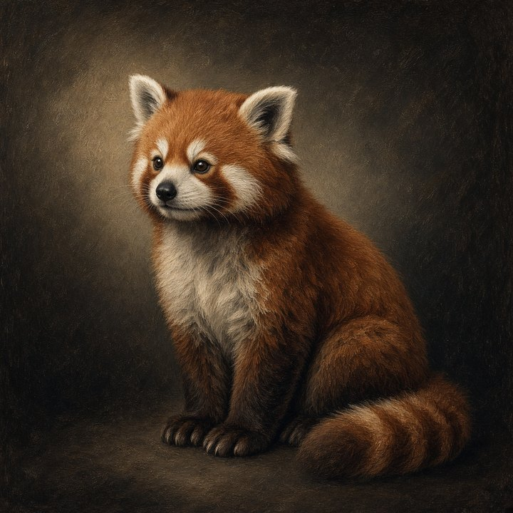

# How to get your first pet

<p align="center">
  
</p>

<p align="center"><em>Rui the red panda, the first pet you meet.</em></p>

Hi. This page is a teacher. You do not need to know how to code.

You are going to put a ComputerPet **on your real Windows desktop**. Not inside a game window. On top of your homework, your browser, everything. Rui the red panda walks there first.

## What that looks like

This is the picture. Hold it in your head. The rest of the page is how you get there.

- A pet walks on your **real desktop**, on top of your homework and your browser.
- **Click the animal** to open its card. Feed it, play with it, or let it rest.
- Clicks on empty space go straight through to your windows.
- Some pets jump onto a real window, hang on, then hop back down.
- There is no store download yet. You copy the pets from a website called GitHub, then start them.
- You install two free helper programs once. A grown-up can help. This page shows you each step.
- The browser comes later. The desktop comes first.

### More detail, for later

You can skip this part for now. Come back after Rui is walking.

**The pet**

- A pet walks on your **real desktop**. Homework stays homework.
- The pet is a living sticker on top.

**The keeper card**

- A **keeper card** pops up when you **click the animal**.
- It says their name.
- It says whether they are a hatchling or grown.
- It shows their bond word and three meters: Hunger, Rest, Bond.
- Three buttons sit under that: **Feed**, **Play**, **Rest**.
- The card scrolls if it is taller than the work area.
- So Feed at the top stays reachable.
- The left choice ribbon scrolls too.
- Collapse hides the card completely so you can read their words.
- While the card is open the host stands still.
- The expanded card has more:
  - Voice, color, saved lines, an alarm, a timer, mute.
  - **Sleep aid**: Off, or Rain and thunder.
    Rain and thunder is a house-made storm bed. It lasts about three minutes, then it loops. Music mute quiets it.
  - **Call** (any of the 221, or a den such as plant).
  - Rui's radio station box.
  - **Turn off**.
- Type `99.9 seattle fm` or `KEXP` and Find actually returns stations. Empty is `no station from that look-up`. Unreachable is `can't reach`. A weather area can prefer Local stations.
- Turn off quits the overlay. Start again with `.\desktop.ps1`.

**The tray**

- Near the clock (bottom-right) a small ComputerPets tray icon sits. Right-click it.
- **On the desk** picks Rui, Sip, and the grid ten. You do not scroll two hundred twenty-one names.
- Those twelve are Rui, Sip, Arc, Volt, Trace, Flux, Spark, Ion, Gauss, Relay, Fuse, Ground.

**Clicks and the floor**

- Clicks on empty glass pass through to your windows.
- Hits stay on the pet, the keeper card buttons, treats, and gifts.
- The floor is the Windows work area — above the taskbar, under the cursor.

**Things on the floor**

- Brown blobs on the floor are **mess**. Click them (or use **Clean**) to tidy up.
- Little ribboned boxes are **gifts**. Click to pick them up.
- The dark chips labeled **Weather**, **News**, and **Quotes** are desk plates.
- Click the header to open a plate. Drag the header to move it.

**Pets on real windows**

- Rui can jump onto the **side** of a real window and hang on. Then he drops or dives back to the desk.
- Arc jumps onto the **top** (title-bar / ridge), holds, then hops or slides off.
- Volt wraps a **corner** (top-left or top-right), holds, then uncoils off.
- Trace follows the **outline** as a path, then hops or drops back to the desk.
- Flux occupies the **glass** as a field, holds, then drifts or drops back.
- Spark **crackles** a window edge: short hops from corner to corner, then hops or drops back.
- Ion **charges** a window corner. It bolts diagonally across the glass to the opposite corner, holds, then hops or drops back.
- Gauss **orbits** the outside of the frame, sits, then hops or drops back.
- Relay **clicks** two nodes: one window then the next, or two nodes on the same window. Then it hops or drops back.
- Fuse **holds** a window as a cartridge in a clip, then pops off.
- Ground **earths** the bottom of a window as a lug, holds the return, then steps or drops back.
- Miso hops onto the **top** of a window (the ledge a house cat uses), sits, then hops down.
- Pip walks to a window and stays on the **floor** at its feet. Pip looks up, watches, then trots away.
- Thimble hops to a window, **thumps** on the floor beside it, then vanishes.
- Clip hops to a window and ducks into the bottom-inside corner as a **drawer**. Clip cheeks inventory, then pops back to the floor.
- Whee waddles to a window, loaves on the floor at its feet, **wheeks**, popcorns once, then waddles off.
- Other guests walk a sill or stay on the floor.
- The overlay reads window bounds, not pixels. Mac and Linux window play is a later door.

**Rui's day**

- When Rui sleeps, Sip and the American robin land on him and chill. The robin sings.
- After a feed, Rui does a happy dance.
- Call a den and the guests walk in without blinking.
- Walk wakes a sleeping Rui.

**The server line (you do not need a server)**

- The card has no server line until you name a house server. Its address goes in **Unlock…** on the tray menu, under **House server address**.
- Then it says `House server running` or `House server stopped answering (optional). Pets still work.`
- Maybe the server you named has not answered once since the pets started.
- Then it says `House server not running (optional)` instead. That is calm, because you do not need one.
- `stopped answering` is only for a server that answered and then stopped.
- You do not need one. Care still works.
- The card says `Your pet's care stays on this computer.`
- Feeding, playing, and resting never go to a server.
- (For grown-ups: if Java is up, `/pet/feed`, `/pet/play`, and `/pet/rest` answer 409. They do not feed, play, or rest anyone.)
- The card also says who is listening.
- That line is `Listening · House lines` until a real mind can be asked.
- It never prints a key.

That walk is the Electron overlay. It is Chromium on your desk, not DirectX 12, not a Microsoft Store app, not a browser tab.

This page is written for **Windows 10 and Windows 11**. That is what most friends have. Mac and Linux friends get a short note near the end. Do not start there.

## The honest download

There is no Steam page. There is no Itch page. There is no Microsoft Store button. There is no live Store ID. There is no magic `.exe` sitting on a website. Anyone who says there is one is guessing.

The honest way is: copy this house from [GitHub](https://github.com/RicheyWorks/computerpets), then turn the desktop overlay on.

Today that needs two free helpers — Git (the copier) and Node (the flashlight the overlay uses). You do not have to learn them. You only install them once. The start you will type is `.\desktop.ps1`. That script runs `npm start`, which is `electron .`. Grown-ups can later build their own installer with electron-builder. We do not publish one. We do not have a Store listing.

## What you need

- A computer with **Windows 10 or Windows 11**
- The internet
- About 8 GB of free space. The copy is big: about 4 GB comes down the internet the first time, and the pet pictures are most of it.
- About 15 minutes of your time the first time, plus that download. On slow internet the copy can take an hour or more. The first start can feel slow too — that is normal.
- A grown-up nearby if a download asks for a password

You do not need an account. You do not need money. You do not need Java. You do not need a license. You do not need to learn Node.

## The main quest

**Put Rui on your real desktop.**

You will do five jobs. The picture above is the point. The helpers are how we get there today.

1. Install Git (or GitHub Desktop)
2. Install Node
3. Copy the pets onto your computer
4. Open PowerShell in the right folder
5. Start the desktop pet

The browser comes later. It is the same house in a window. It is not the main quest.

---

## Step 1 — Install Git (the copier)

Git is a free helper. It copies the pets from the internet onto your computer. You do not have to learn Git. You only install it once.

Pick **one** path. The picture app is easier if you have never typed a command.

### Easier: GitHub Desktop

1. Open [https://desktop.github.com](https://desktop.github.com).
2. Click **Download now** (or **Download for Windows**).
3. Open the file that landed in your Downloads folder.
4. If Windows asks "Do you want to allow this app," that is a grown-up / password moment. Then click through.
5. **Next** is okay. Leave the choices as they are.
6. When it says you are done, you can close the installer.

**What you should see:** an app called GitHub Desktop. It asks you to sign in. Sign in with the GitHub account the owner invited. The pets live in a private GitHub house for now, so the copy needs that account.

### Or: Git itself

1. Open [https://git-scm.com/downloads](https://git-scm.com/downloads).
2. Click **Windows**.
3. Click the **64-bit Git for Windows Setup** installer.
4. Open that file.
5. Click **Next**, **Next**, **Next**. Leave the little checkboxes as they already are. The defaults are fine.
6. Click **Finish**.

**What you should see:** the installer goes away. Git is now on the computer. You will not "open Git" like a game. It waits until you need it.

If the computer already has Git or GitHub Desktop, skip this step.

---

## Step 2 — Install Node (the helper the pets need)

Node is a free helper app the overlay needs today. You do not have to learn it. You only install it once. There is no Store installer that skips this.

1. Open [https://nodejs.org](https://nodejs.org).
2. You will see two big buttons. Click the big **LTS** button. That is the recommended one.
3. **LTS means "the safe version."** The other button is for people who like brand-new experiments. You want the safe one.
4. You want version **22 or newer**. The page may say v22 or v24. Either is fine if it is 22 or bigger.
5. Open the file that downloaded.
6. Click **Next**, **Next**, **Finish**. Leave the defaults.
7. **Close every PowerShell or Terminal window you already had open.** Node only shows up in a *new* window.

### Check that Node is really there

1. Click the Start menu (the Windows button).
2. Type `PowerShell`.
3. Click **Windows PowerShell** (or **Terminal**).
4. A blue or black window opens. That window is a place you type short orders. It is not the pets yet.
5. Type this, then press Enter:

```powershell
node -v
```

**What you should see:** a number like `v22.11.0` or `v24.19.0`. The `v` and the first number matter. **22 or bigger is good.**

Also try:

```powershell
npm -v
```

`npm` is a toolbox that came with Node. You should see a number. You do not have to learn npm either.

**If the computer says it does not know `node`:**

- The install is not finished, or
- You are still in an *old* PowerShell from before the install

Finish the Node installer. Close that PowerShell. Open a **brand new** one. Type `node -v` again.

If you see `v20` or smaller, go back to [https://nodejs.org](https://nodejs.org), click **LTS**, and install again.

---

## Step 3 — Copy the pets onto your computer

Now you copy this house: [https://github.com/RicheyWorks/computerpets](https://github.com/RicheyWorks/computerpets)

The house is private for now. The copy works only for a GitHub account the owner has invited. When Git or GitHub Desktop asks you to sign in, use that account.

Pick **one** path. Do not use someone else's folder. Do not use a path like `C:\Users\730ri\...`. That folder belongs to another person. Use **your** home.

### Easier: GitHub Desktop

1. Open GitHub Desktop.
2. Click **File**.
3. Click **Clone repository**.
4. Click the **URL** tab.
5. Paste this:

```
https://github.com/RicheyWorks/computerpets
```

6. Pick a Local path. **Documents** is a good, boring choice. GitHub Desktop will make a `computerpets` folder there.
7. Click **Clone**.
8. Wait until it finishes. The copy is about 4 GB, so this can take a while. Let it run.

**What you should see:** GitHub Desktop shows the ComputerPets project. Look at the path it prints under the name. That is *your* copy.

To open that folder in File Explorer: click **Repository**, then **Show in Explorer**.

### Or: PowerShell

1. Open a **new** PowerShell.
2. If you do not have a `projects` folder yet, make one:

```powershell
mkdir $HOME\projects
```

3. Then copy the pets:

```powershell
cd $HOME\projects
git clone https://github.com/RicheyWorks/computerpets
cd computerpets
```

`$HOME` means "your user folder." On Windows that is usually `C:\Users\your-name`. The pets will land in `C:\Users\your-name\projects\computerpets`.

**Smaller download (optional):** the plain copy also brings every older version of the project. On slow internet or a small disk, copy only the newest version instead. Type this in place of the `git clone` line above:

```powershell
git clone --depth 1 https://github.com/RicheyWorks/computerpets
```

Measured on a Windows PC in September 2026: the plain copy downloaded about 3.6 GB and used about 6.5 GB of disk. With `--depth 1` it downloaded about 1.6 GB and used about 4.4 GB. The pet pictures are the same either way, the pets start the same, and `git pull` in the `computerpets` folder still gets updates. It only leaves out the old versions; `git fetch --unshallow` brings them later if you ever want them. GitHub Desktop always makes the plain copy.

**What you should see:** a folder named `computerpets`. Inside it you can see `desktop.ps1` and a folder named `desktop`.

You will also see a long pile of files with odd names that start with `_`. Those are the builders' notes. Leave them alone. You only need `desktop.ps1`.

**If clone fails:**

- If it says `Repository not found`, or keeps asking you to sign in, that GitHub account has no invite yet. Ask the owner to invite it, then try again
- Check the internet
- Check Git is installed: type `git --version` and press Enter. You should see a number. If Git is missing, go back to Step 1 and open a new PowerShell after the install

If it says the folder already exists, you already copied the pets. Just `cd` into that `computerpets` folder.

---

## Step 4 — Open PowerShell in the computerpets folder

This is the step people miss. The pets will not start if you are in the wrong room.

You must be in the folder that **has `desktop.ps1` sitting in it**. That folder is named `computerpets`. It is not the `desktop` folder inside it. It is not the `web` folder.

### Easy way (File Explorer)

1. Open the `computerpets` folder in File Explorer.
2. Look around. You should see `desktop.ps1`. You should also see a folder named `desktop`.
3. Click once in the address bar at the top (the place that shows the folder path).
4. Type `powershell` and press Enter.

**What you should see:** a PowerShell window. The line of text before the blinking cursor should end with `computerpets`.

### Other ways

- Windows 11: in that folder, right-click empty space → **Open in Terminal**
- Windows 10: in that folder, hold Shift and right-click empty space → **Open PowerShell window here**
- GitHub Desktop: **Repository** → **Open in Command Prompt** (or **Open in Terminal**)

### Check you are in the right folder

Type this and press Enter:

```powershell
dir desktop.ps1
```

**What you should see:** a file named `desktop.ps1`.

If it says it cannot find the file, you are in the wrong folder. Go back to File Explorer. Open the `computerpets` folder that has `desktop.ps1`. Try again.

---

## Step 5 — Turn the pets on (this is the walk)

The desktop pet lives in the `desktop/` folder. It does **not** need the web app first. You do **not** need Java. You do **not** need a license.

The helper script `desktop.ps1` does three honest jobs:

1. It checks that Node is installed and is version 22 or newer. If not, it says so in plain words and stops.
2. If the pieces are missing, half-finished, or out of date after an update, it runs `npm install` (that means "get the pieces"), then gets Electron itself, the overlay piece (about 100 MB)
3. Then it runs `npm start` (that means "turn the pets on"). `npm start` is `electron .`. That is the overlay.

In the PowerShell that is already inside `computerpets`, type this and press Enter:

```powershell
.\desktop.ps1
```

**Stay in that window.** Do not close it. Do not type more things in it. The pets stay on while that window stays open.

### If Windows says it will not run scripts

Do not panic. Windows often says `running scripts is disabled on this system` the first time. Type this instead and press Enter:

```powershell
powershell -ExecutionPolicy Bypass -File .\desktop.ps1
```

That lets this one start run the script. It changes nothing for good. Use the same line next time too.

Or start without the script. Type these three lines, one at a time, and press Enter after each:

```powershell
cd desktop
npm.cmd install
npm.cmd start
```

Type `npm.cmd`, not `npm`. Plain `npm` is a script too, so Windows stops it the same way. `npm.cmd` is the same npm. It is the same start the grown-up docs use.

### What you should see

**The first time:**

- Lots of words scroll by. Names. Numbers. Progress. That is `npm install` getting the pieces. It can take several minutes. You need the internet. Wait.
- Then it says `Getting Electron, the overlay piece (about 100 MB). Leave this window open.` Wait for that too.
- It should say `found 0 vulnerabilities`. Some day it may say some pieces have `vulnerabilities` and tell you to type `npm audit fix --force`. Do not type that. It swaps in a different Electron and can stop the pets from starting. The grown-ups update Electron on purpose.
- Then more words, and a pet appears **on your real desktop**.
- Look near the clock (the bottom-right corner). A small ComputerPets tray icon should sit there.
- Look for the **keeper card** next to the pet. Name. Stage. Bond word. Hunger, Rest, Bond. Feed, Play, Rest.
- At the top of the card a short hello waits, just this once. It says what the card shows, that you click the pet to open the card and right-click it for more, and where the tray icon is. Press **Got it** and it never comes back. (The browser room has its own one-time hello with a **Got it** button too.)

**Every time after that:**

- Fewer words. The pieces are already there. The pet should walk sooner.

**Who walks first:** Rui. He is a red panda. He sits on the work area, on top of your other windows. He is not inside a browser.

Leave the PowerShell window open. If you close it, the pet usually goes away.

---

## Step 6 — Say hello

The pet is on your desk. Now you can care for it.

- **Click** the pet. They stop, and the keeper card opens with a small row of choices next to them (Walk or Sit, Feed, Talk, Hide…). The first click counts. It does not only wake the window.
- **Drag** the pet. That is a carry. Put them somewhere else on the screen.
- **Talk** plays the pet's own sound when it has one (Rui's is `red_panda.wav`), and its words show in a bubble.
- On the keeper card, **Feed / Play / Rest** are the daily care. Scroll the card if it runs long. Collapse hides the card completely — their spoken words stay readable. **Turn off** quits the overlay.
- **Right-click** the pet for the longer care list.
- Or **right-click the tray icon** by the clock.

<details>
<summary>Which sound each pet makes (for later)</summary>

**Talk** from Rui plays his warm house cry (`red_panda.wav`).
Every other pet here plays its own cry the same way:

**Birds**

- Soot prefers `crow.wav`
- Wedge prefers `raven.wav`
- Heart prefers `barn_owl.wav`
- Hook prefers `red_tail.wav`
- Dee prefers `chickadee.wav`
- Brick prefers `robin.wav`
- Drake prefers `mallard.wav`
- Vee prefers `canada_goose.wav`
- Drum prefers `pileated.wav`
- Sip prefers `hummingbird.wav`

**House pets**

- Echo prefers `budgie.wav`
- Peck prefers `penguin.wav`
- Quill prefers `parrot.wav`
- Keel prefers `toucan.wav`
- Ember prefers `phoenix.wav`
- Miso prefers `cat.wav`
- Pip prefers `dog.wav`
- Thimble prefers `rabbit.wav`
- Clip prefers `hamster.wav`
- Whee prefers `guinea_pig.wav`
- Ink prefers `turtle.wav`
- Coin prefers `goldfish.wav`
- Rue prefers `fox.wav`
- Wick prefers `ferret.wav`
- Burr prefers `hedgehog.wav`
- Floss prefers `chinchilla.wav`
- Bloom prefers `axolotl.wav`
- Vesper prefers `dragon.wav`

**Snakes**

- Nori prefers `ball_python.wav`
- Saffron prefers `corn_snake.wav`
- Bandit prefers `kingsnake.wav`
- Jade prefers `green_tree_python.wav`
- Bluff prefers `hognose.wav`
- Sash prefers `garter.wav`
- Lula prefers `boa.wav`
- Coral prefers `milk_snake.wav`
- Blush prefers `rosy_boa.wav`
- Atlas prefers `carpet_python.wav`

**Sea life**

- Cup prefers `octopus.wav`
- Sepia prefers `cuttlefish.wav`
- Chamber prefers `nautilus.wav`
- Pulse prefers `moon_jelly.wav`
- Ochre prefers `sea_star.wav`
- Tenant prefers `hermit_crab.wav`
- Ledger prefers `horseshoe_crab.wav`
- Anchor prefers `seahorse.wav`
- Kite prefers `manta.wav`
- Door prefers `moray.wav`

**Plants**

- Felt prefers `moss.wav`
- Vein prefers `maidenhair.wav`
- Fan prefers `ginkgo.wav`
- Mast prefers `oak.wav`
- Disk prefers `water_lily.wav`
- Moth prefers `orchid.wav`
- Arm prefers `saguaro.wav`
- Snap prefers `venus_flytrap.wav`
- Well prefers `pitcher.wav`
- Dew prefers `sundew.wav`

**Insects**

- Comb prefers `honeybee.wav`
- Milk prefers `monarch.wav`
- Ghost prefers `luna.wav`
- Spark prefers `firefly.wav`
- Dart prefers `darner.wav`
- Twig prefers `stick.wav`
- Column prefers `carpenter_ant.wav`
- Seven prefers `ladybird.wav`
- Fold prefers `mantis.wav`
- Brood prefers `cicada.wav`
- Wax prefers `honeycomb.wav`

**Mushrooms and other fungi**

- Frill prefers `oyster.wav`
- Cap prefers `fly_agaric.wav`
- Lattice prefers `morel.wav`
- Horn prefers `chanterelle.wav`
- Ring prefers `turkey_tail.wav`
- Mane prefers `lions_mane.wav`
- Puff prefers `puffball.wav`
- Flame prefers `chicken_of_woods.wav`
- Starter prefers `yeast.wav`
- Pact prefers `lichen.wav`

**Far-off made-up life**

- Gleam prefers `photovore.wav`
- Choir prefers `choir.wav`
- Drift prefers `nimbus.wav`
- Shard prefers `silica.wav`
- Dusk prefers `terminator.wav`
- Knot prefers `nexus.wav`
- Brine prefers `halovore.wav`
- Beacon prefers `magneton.wav`
- Hush prefers `umbral.wav`
- Arca prefers `cyst.wav`

**Pond animals**

- Reed prefers `frog.wav`
- Pebble prefers `toad.wav`
- Eft prefers `newt.wav`
- Dapple prefers `salamander.wav`
- Slip prefers `caecilian.wav`
- Pinch prefers `crayfish.wav`
- Whorl prefers `pond_snail.wav`
- Hinge prefers `mussel.wav`
- Latch prefers `leech.wav`
- Prickle prefers `stickleback.wav`

**Tiny life**

- Boot prefers `paramecium.wav`
- Reach prefers `amoeba.wav`
- Spot prefers `euglena.wav`
- Orb prefers `volvox.wav`
- Pane prefers `diatom.wav`
- Hold prefers `kelp.wav`
- Spin prefers `chlamydomonas.wav`
- Bell prefers `stentor.wav`
- Rod prefers `coli.wav`
- Rose prefers `haloarchaea.wav`

Words still show in the bubble.
System speech stays the backup for other guests.

</details>

The tray has a line named **On the desk**.

- It picks Rui, Sip, and the grid ten (Arc, Volt, Trace, Flux, Spark, Ion, Gauss, Relay, Fuse, Ground).
- You do not scroll the whole house.
- **Companions** still has all **221**. They sit by den: House, Snakes, Tide, and so on.
- Spark on the desk is the same Spark whose browser room is `/demo/crackle`.
- The firefly already owns `/demo/spark`.

Clicks on empty glass pass through. If you click "nothing," you click the window underneath. That is on purpose.

The longer care list has kid words for real jobs:

| You click | What it means |
|-----------|----------------|
| **Feed** | Give them food |
| **Play** | Play with them (they can chase a ribbon) |
| **Rest** | Let them sleep |
| **Clean** | Clean up the brown mess on the floor (you can also click the mess) |
| **Medicine** | Help them if they feel sick |
| **Hide** | They walk off the screen. **Call back** brings them in again |

If you ignore them, they get hungry. They can get unwell. They can walk away until you call them back.

You do not need Unlock. Unlock is a grown-up door. Pets already walk without a license. Leave Unlock alone.

---

## What if nothing walks

Work down this list. Do not skip.

### "node is not recognized" or "npm is not recognized"

Node is not ready in this window.

1. Finish the Node install from [https://nodejs.org](https://nodejs.org) (the **LTS** button).
2. Close this PowerShell.
3. Open a **new** PowerShell in the `computerpets` folder (Step 4).
4. Type `node -v`. You need v22 or newer.
5. Try `.\desktop.ps1` again.

### The computer cannot find `desktop.ps1`

You are in the wrong folder.

- You might be in `Documents`, or `projects`, or `desktop`, or `web`.
- Go to the folder that **contains** `desktop.ps1`.
- Check with `dir desktop.ps1`.

### The window printed errors, then stopped

Read the last few lines.

- If it talks about `npm` or `install`, the pieces did not finish downloading. Check the internet. In the `computerpets` folder, run `.\desktop.ps1` again: it sees the pieces are missing and gets them again. If you used the three-line start, stay in the `desktop` folder and run `npm.cmd install` again, then `npm.cmd start`. (`npm install` in the `computerpets` folder itself does not work. The pieces list lives in `desktop`.)
- If you closed the window while words were still scrolling, open a new one and run `.\desktop.ps1` again. It sees the pieces are half-finished and gets the pieces again.
- To see what the start sees without turning anything on, type `.\desktop.ps1 -Check`. It prints your Node version, whether the pieces are `ready`, `missing`, `unfinished`, or `changed`, and whether the pet pictures are all there. Its last line says what to type next. After the three-line start (`cd desktop`, `npm install`, `npm start`) worked once, it says `ready` too.
- If it says some pets are still missing their pictures, Git LFS stopped before it fetched them all. In the `computerpets` folder type `git lfs pull`, then `.\desktop.ps1` again.

### A window flashed and vanished

You started the pets, then closed the PowerShell. Open PowerShell in the `computerpets` folder again. Run `.\desktop.ps1` again. **Leave it open.**

### You see words, but no pet

- Look behind other windows. Rui can sit on a second monitor.
- Look by the clock for the tray icon. Right-click it. Try **On the desk** → **Rui**, or **Call back**.
- Wait ten seconds. The first start is slower.
- If a Windows firewall box pops up, allow it on this computer.

### `git clone` failed

- If it says `Repository not found`, or keeps asking you to sign in, the house is private and that GitHub account has no invite yet. Ask the owner to invite it, then try again.
- Check the internet.
- Check the computer has about 8 GB of free space. A full disk stops the copy partway.
- Type `git --version`. If Git is missing, do Step 1, then open a new PowerShell.
- Or use GitHub Desktop and the URL path instead.

### You went looking for a Store page

There is not one yet. There is no live Microsoft Store ID. Do not download a random "ComputerPets.exe" from a stranger. Come back to this page and do Steps 1–5.

---

## Tomorrow (you do not install again)

Git and Node stay on the computer. You do not download them every day.

To see Rui again:

1. Open the `computerpets` folder.
2. Open PowerShell there (Step 4).
3. Type `.\desktop.ps1` and press Enter. (If you needed the `powershell -ExecutionPolicy Bypass -File .\desktop.ps1` line the first time, type that line again.)
4. Leave the window open.

That is the whole next visit.

---

## Mac

Same idea. Same two helpers. This leftover is Windows first. Keep this short.

1. Install Git from [https://git-scm.com/downloads](https://git-scm.com/downloads), or install [GitHub Desktop](https://desktop.github.com).
2. Install Git LFS from [https://git-lfs.com](https://git-lfs.com) (or `brew install git-lfs`). Then type `git lfs install` once. The pet pictures come through it. GitHub Desktop already has it.
3. Install Node from [https://nodejs.org](https://nodejs.org). Click **LTS**. Version 22 or newer.
4. Close Terminal. Open a **new** Terminal. Type `node -v`.
5. Copy the pets:

```bash
mkdir -p ~/projects
cd ~/projects
git clone https://github.com/RicheyWorks/computerpets
cd computerpets
```

6. Start the desktop pet:

```bash
sh desktop.sh
```

If it says the pet pictures did not download, install Git LFS (step 2). Then type `git lfs pull` in the `computerpets` folder.

If it says some pets are still missing their pictures, Git LFS stopped partway. Type `git lfs pull` in the `computerpets` folder again, then `sh desktop.sh`.

The overlay says the same thing in a small window if you start it the other way below.

Or:

```bash
cd desktop
npm install
npm start
```

The extra control sits in the **menu bar** (the thin strip at the top of the screen). A click opens care. A click on the pet opens its keeper card and a row of choices. Drag is a carry. Control-click tends.

---

## Linux

Same helpers, plus Git LFS for the pet pictures. On Ubuntu or Debian that is `sudo apt install git-lfs`. Then type `git lfs install` once, before you copy the pets.

Node must be version 22 or newer. Type `node -v`. The `nodejs` that `apt` brings is often older. If you see `v20` or smaller, get the **LTS** Node from [https://nodejs.org](https://nodejs.org) instead.

Copy the pets:

```bash
mkdir -p ~/projects
cd ~/projects
git clone https://github.com/RicheyWorks/computerpets
cd computerpets
```

Then, still in that `computerpets` folder:

```bash
sh desktop.sh
```

If it says the pet pictures did not download, type `git lfs pull` in that folder, then `sh desktop.sh` again. If it says some pets are still missing their pictures, Git LFS stopped partway; do the same thing. `sh desktop.sh --check` looks without turning anything on, and its last line says what to type next.

The mark sits in the **panel**. A click opens care. A click on the pet opens its keeper card and a row of choices. Drag is a carry. A right-click tends.

---

## Another way to visit them (browser)

This is **not** the main quest. Do this after a pet already walks on the desktop, or if you just want to peek in a window.

The pets can also live in Chrome or Edge on **this computer**. Same house as the overlay. Same keeper card. Same Feed / Play / Rest. The `/demo` room shows the Windows tray sit the overlay already uses.

1. Open PowerShell (or Terminal) in the `computerpets` folder. Same folder as `desktop.ps1`.
2. Type these lines, one at a time:

```powershell
cd web
npm install
npm run dev
```

3. `npm install` means "get the pieces" for the browser app. It can take a minute. This is a **different** pile of pieces than the desktop pet. If Windows says running scripts is disabled, type `npm.cmd install` and `npm.cmd run dev` instead.
4. `npm run dev` means "turn the browser pets on."
5. Leave that window open.
6. Open Chrome or Edge. Click or type this exactly:

[http://localhost:8080](http://localhost:8080)

**Localhost means "this computer," not the internet.** Your friend at their house cannot open your localhost. They have to do these steps on their own computer.

**What you should see:** Rui the red panda. No account. The keeper card. The tray sit.

Type it as `http` — not `https`. If the browser adds an extra `s` and the page will not load, delete the `s`.

If the page will not load:

- Is the `npm run dev` window still open?
- Did the words in that window mention `8080`?
- Are you on this same computer?

Once that window is running, [http://localhost:8080/demo/rui](http://localhost:8080/demo/rui) is a room where Rui is already walking. Spark's room is [http://localhost:8080/demo/crackle](http://localhost:8080/demo/crackle). **Those pages are local only.** They are not a hosted demo. They are not a public ComputerPets website. They are the same house as the overlay.

---

## Blotter (optional)

This is **not** the main quest. You can skip it. The pets on your desktop do not need it.

The blotter is one more way to visit. It is a small window with a wooden desk inside. Rui walks on it first, and all the animals can visit. It is made with Python, not Node.

You need one more free helper: **Python 3.10 or newer**.

1. Open [https://www.python.org/downloads](https://www.python.org/downloads).
2. Click the big **Download Python** button.
3. Open the file that landed in your Downloads folder.
4. Click **Install Now**. If Windows asks "Do you want to allow this app," that is a grown-up / password moment.
5. Close PowerShell. Open a **new** PowerShell in the `computerpets` folder (Step 4).

Type these lines, one at a time, and press Enter after each:

```powershell
cd client
py -3 -m venv .venv
.\.venv\Scripts\Activate.ps1
python -m pip install --upgrade pip
python -m pip install -e .
python -m computerpets_client
```

- `py -3 -m venv .venv` makes a little box for the blotter's pieces. It lives in `client\.venv`.
- `Activate.ps1` steps into that box. The line before your cursor starts with `(.venv)`.
- `pip install --upgrade pip` gets a newer pip first. The pip that comes with Python 3.10 stops the next line with "editable mode currently requires a setuptools-based build".
- `pip install` means "get the pieces." It can take a few minutes the first time.
- `python -m computerpets_client` turns the blotter on.

**What you should see:** a window named **ComputerPets — blotter**. Rui walks on the wood. Close that window to turn the blotter off.

You do not need a backend. You do not need a license key. The blotter pets walk without them. Unlock is a grown-up door here too. Leave it alone.

### If Windows says it will not run scripts

Open a **new** PowerShell in the `computerpets` folder. Type these lines instead:

```powershell
cd client
.\.venv\Scripts\python.exe -m pip install --upgrade pip
.\.venv\Scripts\python.exe -m pip install -e .
.\.venv\Scripts\python.exe -m computerpets_client
```

### If it says the Python is too old

Type `py -0p`. It lists the Pythons on this computer. You need 3.10 or newer. An older one stops at the start and says so in one line. Install a newer one from [https://www.python.org/downloads](https://www.python.org/downloads), delete the `client\.venv` folder, and start this section again.

### Next time

```powershell
cd client
.\.venv\Scripts\Activate.ps1
python -m computerpets_client
```

Grown-up words for the blotter live in [client/README.md](../client/README.md).

---

## Blotter on Mac or Linux

This is the same optional blotter, for a Mac or Linux Terminal. Python 3.10 or newer. In a Terminal inside the `computerpets` folder, type these lines, one at a time:

```bash
cd client
python3 -m venv .venv
. .venv/bin/activate
python -m pip install --upgrade pip
python -m pip install -e .
python -m computerpets_client
```

On Linux the blotter window needs a few small screen pieces. If they are missing, it says how many and prints the exact `sudo apt install` line to type. Type that line, then `python -m computerpets_client` again.

---
## You did it

If Rui is walking on your desktop, you did the main quest.

There are **221** animals in this house. You did not add any. You met the first one.

When you want the long grown-up pages, they live next door: [SETUP.md](SETUP.md) is Java and secrets. You do not need those to keep a pet. [desktop/README.md](../desktop/README.md) is the overlay in grown-up words.
